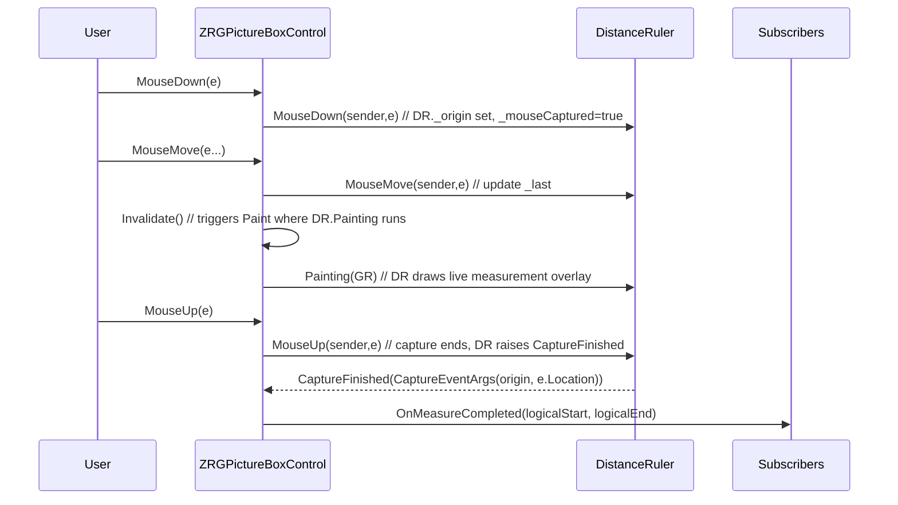

# DistanceRuler — Documentation

This document describes `DistanceRuler` (file: `DistanceRuler.vb`) — a helper class that implements interactive distance capture inside `ZRGPictureBoxControl`.

---

## 1. Purpose

`DistanceRuler` enables the user to draw a line between two points on the control to measure distance and angle. It implements mouse capture, painting of the temporary measurement (including arc showing angle and overlay label with length and angle) and raises a `CaptureFinished` event when the measurement completes.

## 2. Public types

- `CaptureEventArgs` — simple EventArgs-derived type that exposes `StartPoint` and `EndPoint` (physical coordinates passed from mouse events).
- `Public Event CaptureFinished(ByVal sender As Object, ByVal e As CaptureEventArgs)` — raised on mouse up to signal completion.

## 3. Main members

- State
	- `_mouseCaptured` — indicates active capture.
	- `_origin` and `_last` — points (physical coordinates) tracking start and current end.
	- `_angle`, `_length` — computed angle/length values.

- Appearance
  - `_lineWidth`, `_compArray` (compound pen array), `ForeColor` and `BackColor` proxy to `PictureBoxControl` properties.

- `PictureBoxControl` — reference to the containing `ZRGPictureBoxControl` used for unit conversions and invalidation.

## 4. Core methods and behavior

- Constructor `New(pictureBox As ZRGPictureBoxControl)`
  - Requires a non-null `pictureBox` reference.

- Mouse handlers
  - `MouseDown(sender, e)` — starts capture, stores `_origin` = e.Location and sets `_mouseCaptured = True`.
  - `MouseMove(sender, e)` — while `_mouseCaptured`, updates `_last` and may cause invalidation (current code primarily updates internal state).
  - `MouseUp(sender, e)` — ends capture, sets `_mouseCaptured = False`, calls `myPictureBoxControl.Invalidate()` and raises `CaptureFinished` with the captured start/end physical points.

- `Painting(GR As Graphics, Optional ScaleFactor As Double = 1.0)`
  - If `_mouseCaptured` is false, returns immediately.
  - Computes segment direction (via `SEGMENT.SegmentDirection()`), converts to degrees and normalizes angle.
  - Computes scaled length using `LineLength` and unit conversion factors: `Scale = PictureBoxControl.ScaleFactor * UnitOfMeasureFactor` and formats a label `"length (angle°)"`.
  - Draws origin cross, arc, line, and a rotated text label centered on segment midpoint.

- Utility helpers
  - `CvRadToDeg(RadAngle)` — converts radians to degrees.
  - `CutDecimals` / `strCutDecimals` — rounding helpers for label formatting.
  - `NormalizeRect` — utility to make a rectangle from two points.
  - `LineLength` — computes Euclidean length (scaled) between two points.
  - `Angle` — computes angle in degrees from two points.

## 5. Interaction flow

This sequence shows how `DistanceRuler` is driven by `ZRGPictureBoxControl` mouse events and how it paints a live overlay while capturing.

## 6. Units and scaling

- The length displayed is scaled by `ScaleFactor` and `MeasureSystem` unit conversions.
- `UnitOfMeasureFactor` converts the dimensionless internal units to the user unit for the label.

## 7. Integration notes and recommendations

- `DistanceRuler` expects the host control to call its `Painting` method from the control paint loop when the capture is active. In the current design it is attached to the parent control and `ZRGPictureBoxControl` calls `DistanceRuler.Painting`.
- The `CaptureFinished` event passes physical points; the host typically converts them to logical coordinates using `GraphicInfo.ToLogicalPoint` before raising `OnMeasureCompleted`.
- Consider replacing `MsgBox` usage with structured logging or throwing exceptions for library usage.
- The angle computation uses `Math.Atan((p1.Y - p2.Y) / (p1.X - p2.X))` which may produce division-by-zero if p1.X == p2.X; the code currently handles vertical/horizontal corner cases earlier in `SEGMENT.SegmentDirection` for more robust behavior; nevertheless, verify angle computation edge cases when refactoring.

---

