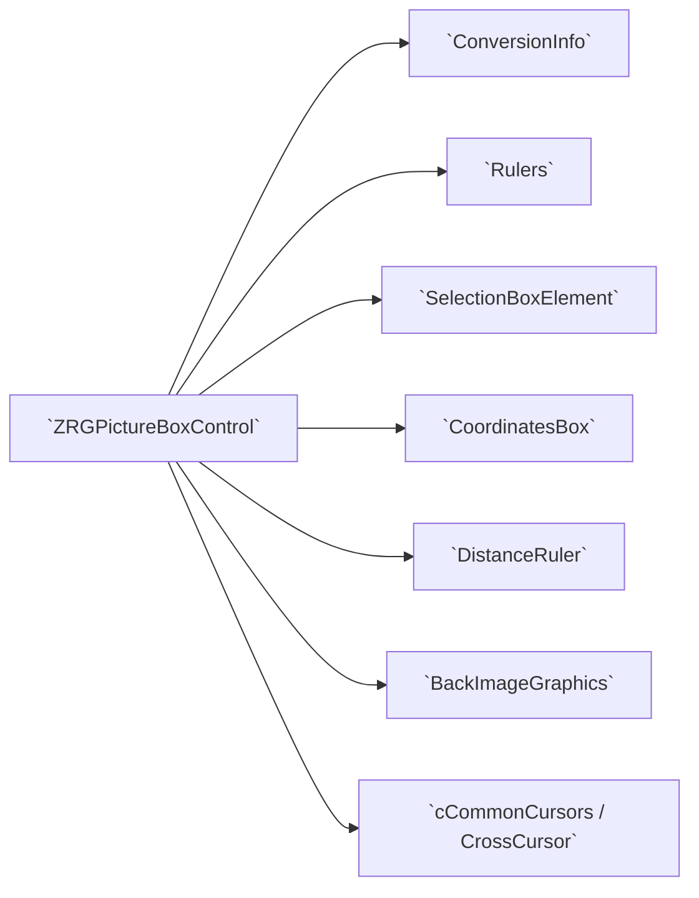
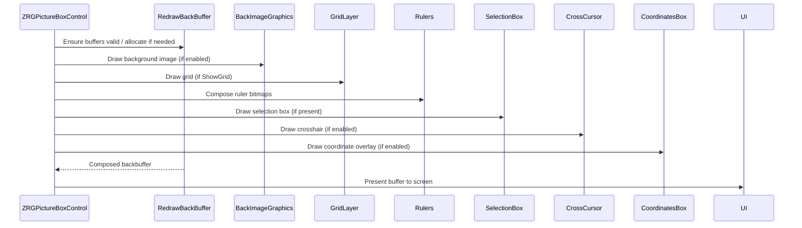

# ZRGPictureBoxControl — Detailed Draft

This document describes the `ZRGPictureBoxControl` class (primary file: `ZRGPictureBoxControl.vb`) in detail: structures, actions, properties, methods, nested helpers, workflows, and relationships with other classes/files in the project.

---

## 1. High level purpose

`ZRGPictureBoxControl` is a custom WinForms `UserControl` designed to present a large logical coordinate space with pan/zoom, measurement tools, rulers, grid/snap, selection/zoom-box, optional background image support, and precision coordinate conversion between logical units (micron/mm/inches/etc.) and physical pixels. It centralizes view state via a `ConversionInfo` instance and exposes events and APIs for interactive workflows (selection, measuring, zooming).

## 1.1 High-level component relationships (diagram)

This graph clarifies that `ZRGPictureBoxControl` is the central coordinator; helpers depend on it and on `ConversionInfo` for coordinate transforms.

## 2. File / class structure (regions and main members)

- Constants and pan/zoom tuning: `ZoomMultiplier`, `PanFactorNoShift`, `PanFactorWithShift`.
- Default logical sizes: `DefaultMinLogicalWindowSize`, `DefaultMaxLogicalWindowSize`.
- Default measurement unit constant: `DefaultUnitOfMeasure` (uses `MeasureSystem.enUniMis`).
- Events: multiple `Shadows` events for mouse interactions and several control-specific events:
  - `MouseClick`, `MouseMove`, `MouseDown`, `MouseUp`, `MouseEnter`, `MouseLeave`, `Paint` (shadowed to provide typed sender and logical coord info).
  - `OnMeasureCompleted`, `OnRedrawCompleted`, `OnPictureBoxDoubleClick`, `OnMinimumZoomLevelReached`, `OnMaximumZoomLevelReached`.
  - `OnMeasureUnitChanged`, `OnClickActionChanged`.
- Private variables: internal state including `ConversionInfo` (`myGraphicInfo`), click action, rulers (`myRulers`), selection box, distance ruler, background image state, double-buffer bitmaps, flags for layout/dragging and more.

### Double buffering members

- `myRefreshBackBuffer` — persistent buffer until a `Refresh()` clears it.
- `myRedrawBackBuffer` — persistent buffer until an explicit `Redraw()` or when content requires rebuild.

### Background image members

- Properties and backing fields for image, image position/origin, and `cBackImageGraphics` instance (`myPictureBoxImageGR`) which knows how to draw the background image at the requested pixel-to-logical size.

### Layout and view bounds

- Logical window size, origin and conversion via `ConversionInfo`.
- `myMinLogicalWindowSize`, `myMaxLogicalWindowSize`.

### Flags controlling visibility

- `myShowMouseCoordinates`, `myShowRulers`, `myShowGrid`, and `ShowScrollbars` (via `AutoScroll`).

### Selection, grid, cursors

- `SelectionBoxElement` (`mySelectionBox`) handles selection/zoom box UI and logic.
- Custom cursors via `cCommonCursors` and `CrossCursor` helper.

## 3. Public properties and what they do

Below are the important public properties defined in `ZRGPictureBoxControl.vb` (file-level properties). Each property often reads/writes into `GraphicInfo` or internal fields.

- `ScaleFactor` (Single)
	- Gets/sets `GraphicInfo.ScaleFactor`. The setter enforces logical min/max window size constraints (based on `MinLogicalWindowSize`/`MaxLogicalWindowSize`) and rejects changes that would violate limits.

- `LogicalOrigin` (Point)
	- Maps to `GraphicInfo.LogicalOrigin`. The origin of the logical view.

- `LogicalCenter` (ReadOnly Point)
	- Computed center point in logical coordinates (origin + width/height/2).

- `LogicalWidth`, `LogicalHeight` (Integer)
	- Forwarded to `GraphicInfo.LogicalWidth` and `GraphicInfo.LogicalHeight`.

- `LogicalArea` (RECT)
	- Returns the `GraphicInfo.LogicalArea`; private setter mirrors changes into `GraphicInfo`.

- `MinLogicalWindowSize`, `MaxLogicalWindowSize` (Size)
	- Constraints that influence scale changes and visible area.

- `GraphicInfo` (ConversionInfo)
  - Main conversion object (exposes methods to convert between physical and logical coordinates and holds `ScaleFactor`, `LogicalOrigin`, and `PhysicalWidth/Height`).

- Visual flags/properties
	- `ShowPictureBoxBackgroundImage` (toggle background image rendering), `ShowMouseCoordinates`, `ShowGrid`, `ShowRulers`.

- Color properties
	- `BackgroundColor`, `CrossCursorColor` (through `FullCrossCursor.Color`), `ZoomSelectionBoxColor`.

- Grid properties
	- `GridView`, `GridStep`, `SmartGridAdjust`.

- Input state helpers (Shared ReadOnly properties)
	- `IsShiftKeyPressed`, `IsAltKeyPressed`, `IsCtrlKeyPressed` — check current modifier keys via `Control.ModifierKeys`.

- Scrollbar control
	- `ShowScrollbars` wraps `AutoScroll`. Setting this updates scroll state and calls `UpdateScrollbars()` (not shown in this file excerpt) when enabling.

- `ClickAction` (enClickAction)
	- Sets the current mouse action mode (e.g., `Zoom`, `MeasureDistance`) and applies behavior side-effects: sets selection box aspect ratio and updates cursor to `ZoomCursor` or `EditCursor`. It raises `OnClickActionChanged`.

- `SelectionBox` (ReadOnly)
	- Exposes `SelectionBoxElement` instance to consumers.

- `ResizeMode` (ResizeMode)
	- Public property to configure resizing behavior (e.g., `Stretch`).

- `IsLayoutSuspended`, `IsDragging`, `IsLoaded`, `ContainsMousePosition` (ReadOnly helpers)

- `BorderStyle` (overloaded) — stored in `myBorderStyle` to control painting border style for the control.

- `UnitOfMeasure` (MeasureSystem.enUniMis)
	- Controls displayed measurement unit. Changing it raises `OnMeasureUnitChanged` and triggers `Invalidate()` if rulers or coordinates are shown.

- `VisibleRect` (ReadOnly RECT)
	- Computed visible logical rectangle, based on `LogicalOrigin` and `LogicalWidth`/`LogicalHeight`.

Additionally, the file defines `ShouldSerialize*` private helper methods to control designer serialization for some properties.

## 4. Events and how to use them

- Input and painting events are shadowed to provide typed sender (`ZRGPictureBoxControl`) and logical coordinates where appropriate (e.g., `MouseClick` event provides `LogicalCoord`). Subscribe to these for interaction integration.
- `OnMeasureCompleted` - raised by `DistanceRuler` when a measurement capture finishes; it provides logical start/end points.
- `OnRedrawCompleted` - raised when an internal redraw completes (useful when caching is in effect).
- `OnMeasureUnitChanged` - emitted when `UnitOfMeasure` changes.
- `OnClickActionChanged` - emitted when the `ClickAction` property is changed.

## 5. Related helper classes and files (collaboration)

- `ConversionInfo.vb` — central conversion utilities for mapping logical <-> physical coordinates. `GraphicInfo` instance of this class is used throughout.
- `PublicTypes.vb` — `RECT`, `SEGMENT`, `GridKind`, `enClickAction`, `ResizeMode` definitions and geometry operations.
- `Rulers.vb` — nested helper for drawing horizontal and vertical rulers, creating scaled numeric labels, caching ruler bitmaps, and computing step intervals. Rulers read `GraphicInfo` and `UnitOfMeasure` to determine tick intervals and numeric formatting.
- `SelectionBoxElement.vb` — manages selection/zoom rectangle, aspect ratio enforcement, drawing and invalidation logic for selection boxes.
- `CoordinatesBox.vb` — draws the floating coordinate box (bottom-right) showing current mouse coordinates and selected units.
- `DistanceRuler.vb` — handles interactive measurement capture (mouse capture, drawing, angle/length formatting) and raises `CaptureFinished`/`OnMeasureCompleted`.
- `BackImageGraphics.vb` — draws the optional background bitmap using a pixel-size (micron per pixel) model.
- `MeasureSys.vb` — unit conversion helpers and human-readable unit strings.
- `Cursors\cCommonCursors.vb` and `Cursors\CrossCursor.vb` implement custom cursors and crosshair drawing.

These helpers are implemented as nested or cooperating classes so that `ZRGPictureBoxControl` stays the single integration point for UI interaction and drawing.

## 6. Key workflows and sequences

Below are the primary runtime flows and how `ZRGPictureBoxControl` coordinates behavior.

1) Initialization / load
	- On create, `ConversionInfo` is initialized with default `ScaleFactor`/physical sizes.
	- `Rulers`, `SelectionBoxElement`, `DistanceRuler` and `CrossCursor` instances are created and bound to the control.

2) Setting the background image
	- Assign to the `Image` property. The setter creates `cBackImageGraphics` (`myPictureBoxImageGR`) with configured `ImageCustomOrigin` and pixel size (`BackgroundImagePixelSize_Mic`).
	- `Invalidate()` triggers redraw where the `BackImageGraphics.Draw` is invoked during painting when `ShowPictureBoxBackgroundImage` is true.

3) Coordinate conversion (core concept)
	- `GraphicInfo.ScaleFactor` defines how many physical pixels correspond to logical units.
	- To show logical coordinates (e.g., mouse position), call `GraphicInfo.ToLogicalPoint(physicalPoint)`.
	- To place UI elements in physical coordinates based on logical values, call `GraphicInfo.ToPhysicalPoint`/`ToPhysicalRect`.

4) Zoom and pan
	- `ScaleFactor` changes are validated against min/max logical window sizes. Changing `ScaleFactor` updates `GraphicInfo` and triggers redraw. Zoom commands typically use `ZoomMultiplier` to calculate new `ScaleFactor`.
	- Panning updates `LogicalOrigin`.

5) Paint/redraw double-buffering
	- There are two cached buffers:
		 - `myRefreshBackBuffer`: used across Refresh cycles until `Refresh()` discards it.
		 - `myRedrawBackBuffer`: used until a `Redraw()` or when the content requires rebuilding (e.g., changing the background image or scale).
	- `Rulers` maintain their own cached bitmaps; when `GraphicInfo` changes, `Rulers` mark needs for redraw and reconstruct their bitmaps.
	- On `OnPaint`, cached bitmaps are composed: background image, grid, rulers, selection box, distance ruler overlay, crosshair and coordinates box are drawn in sequence. After painting, `OnRedrawCompleted` can be raised.

6) Selection / zoom box workflow
	- `ClickAction` set to `Zoom` will make `SelectionBox.KeepAspectRatio = True` and cursor set to `ZoomCursor`.
	- Mouse down stores a logical start point (`myLastMouseDownPoint`) and sets `SelectionBox.TopLeftCorner`.
	- Mouse move updates `SelectionBox.BottomRightCorner` (converted to logical coords) and calls `SelectionBox.Invalidate()` to update the screen region.
	- Mouse up finalizes the rectangle. If selection area is larger than a threshold, compute new `ScaleFactor` and `LogicalOrigin` to fit selected area; otherwise treat as single-click selection.

7) Measuring distances
	- `ClickAction = MeasureDistance` switches to measurement mode with `FullCrossCursor` displayed.
	- Interaction leverages `DistanceRuler`: mouse down starts capture, mouse up finishes and `DistanceRuler` raises `CaptureFinished` -> `ZRGPictureBoxControl` maps physical points to logical with `GraphicInfo.ToLogicalPoint` and raises `OnMeasureCompleted` with logical endpoints.

8) Rulers
	- `Rulers` compute a base step through `GetRulerStep` using `LogicalWidth`/`LogicalHeight`, numeric digit masks and `MeasureSystem` conversions.
	- Ruler bitmaps are cached and only rebuilt when `GraphicInfo` or size changes.

9) Cursor and crosshair
	- `CurrentCursor` property controls the visible cursor, but when `UseWaitCursor` is active, the property prevents changes.
	- `CrossCursor` draws either a small cross or a full-screen crosshair based on `ClickAction`. It uses logical-to-physical mapping to position arms and respects the coordinates box so as not to paint under it.

## 7. Typical usage patterns for integrators

- To embed the control in a form: drop `ZRGPictureBoxControl` on the form and set `UnitOfMeasure` and `BackgroundColor` as needed.
- To programmatically zoom to a rectangle: set `GraphicInfo.LogicalArea` or compute `ScaleFactor` and `LogicalOrigin` to fit an area.
- To respond to user actions: subscribe to `OnMeasureCompleted`, `MouseClick` (typed with logical coords), `OnClickActionChanged`.
- To provide custom context menu: handle the `ShowContextMenuRequired` event or call `RaiseContextMenuRequest` to request it.

## 8. Important implementation notes and edge-cases

- The scale and logical-area validation logic in `ScaleFactor` setter prevents invalid zoom that would expose view outside allowed logical sizes.
- Several methods use `MsgBox` to surface exceptions; consider replacing with logging or throwing for library usage.
- Many classes cache heavy resources (bitmaps, cursors). Their lifecycle should be managed carefully: `Dispose` or finalizer patterns exist in some helpers but not uniformly.

## 9. Cross-file invariants / contracts

- `ConversionInfo` must reflect current `PhysicalWidth`/`PhysicalHeight` (control client size) before painting; other helpers rely on it to compute `ToPhysicalPoint`.
- `Rulers` rely on `MeasureSystem` conversions for unit-aware tick spacing and label formatting.

## 10. Where to look next in the codebase

- `ConversionInfo.vb` — for precise conversion formulas.
- `Rulers.vb` — to understand numeric mask generation and cached ruler bitmaps.
- `SelectionBoxElement.vb` and `CoordinatesBox.vb` — for UI overlay logic.
- `DistanceRuler.vb` — for measurement interaction and display.

---
