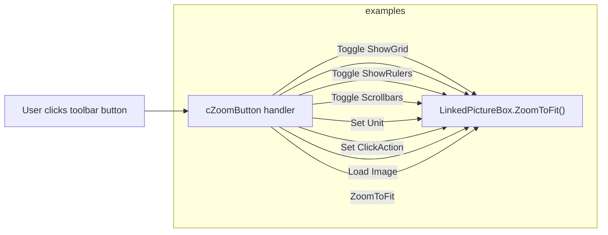

# ZoomButton (`cZoomButton`) — Documentation

This document describes `cZoomButton` (file: `ZoomButton.vb`). `cZoomButton` is a small UI helper class that binds a set of toolbar/toggle buttons to a `ZRGPictureBoxControl` instance and forwards user actions (toggle grid, rulers, scrollbars, units, load image, zoom fit, zoom mode, measure mode) to the linked control.

## 1. Purpose and responsibilities

- Expose a `LinkedPictureBox` property which is the `ZRGPictureBoxControl` instance controlled by this UI.
- Keep UI state in sync with the linked picture box (`RefreshDisplayButtonState`).
- Handle button clicks and user interactions to change properties on the `LinkedPictureBox` (e.g., `ShowGrid`, `ShowRulers`, `ShowScrollbars`, `UnitOfMeasure`, `ClickAction`).
- Provide an image loader button to attach a background image to the linked control and call `ZoomToDefaultRect()`.

## 2. Key members (behavioural summary)

- `LinkedPictureBox` property
	- Getter / Setter. Setter calls `RefreshDisplayButtonState()` to sync UI toggles with the control.

- Event handlers:
	- `RefreshDisplayButtonState()` — read state from `LinkedPictureBox` and update toggle buttons and pixel-size textbox.
	- `btZoomFit_Click` — calls `LinkedPictureBox.ZoomToFit()`.
	- `btShowGrid_Click` — toggles `LinkedPictureBox.ShowGrid` and invokes `Redraw()`.
	- `btShowRuler_Click` — toggles `LinkedPictureBox.ShowRulers` and invokes `Redraw()`.
	- `btShowScrollBars_Click` — toggles `LinkedPictureBox.ShowScrollbars` and invokes `Redraw()`.
	- `btMeasure_Click` / `btZoom_Click` — set `LinkedPictureBox.ClickAction` to `MeasureDistance` or `Zoom`.
	- `btLoad_Click` — open file dialog, load image and call `LinkedPictureBox.ZoomToDefaultRect()`.
	- Unit radio buttons — set `LinkedPictureBox.UnitOfMeasure` and call `Redraw()`.
	- `tbPixelSizeMic_Click` — prompt user for new pixel size and call `LinkedPictureBox.Redraw(True)`.

## 3. Interaction diagram

This diagram shows that the `cZoomButton` handlers are thin controllers that call setters or methods on the linked picture box.

## 4. Notes and considerations

- `cZoomButton` depends on `LinkedPictureBox` being non-null for all operations; event handlers guard for null.
- UI state is refreshed after changes to ensure toggles reflect the actual state of the `LinkedPictureBox`.
- Exceptions are surfaced using `MsgBox` in the current implementation; consider replacing with structured logging for library usage.

---

