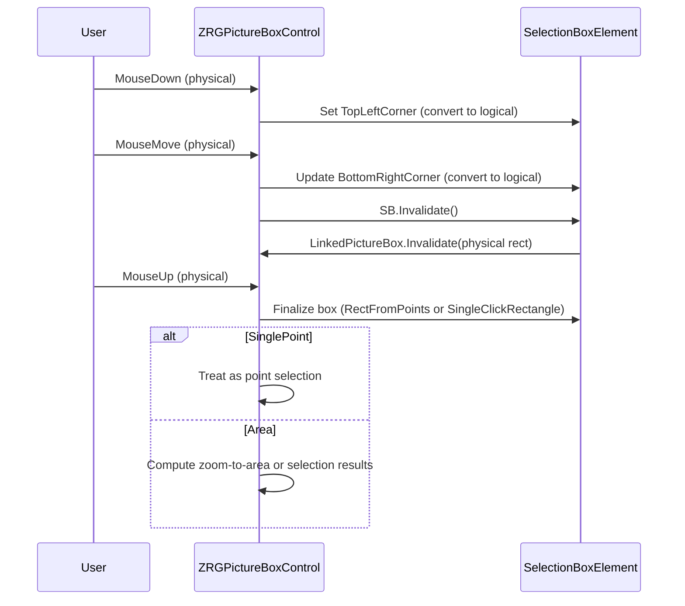

# SelectionBoxElement — Documentation

This document describes `SelectionBoxElement` (file: `SelectionBoxElement.vb`) — the helper class that implements selection and zoom box behavior inside `ZRGPictureBoxControl`.

## 1. Purpose

`SelectionBoxElement` encapsulates creating, updating, drawing and invalidating a selection rectangle used for area selection or zoom-to-area. It handles single-click selection (small area around click) vs area selection, maintains an optional keep-aspect-ratio mode, and converts between logical and physical coordinates when drawing.

## 2. Main fields and properties

- `TopLeftCorner`, `BottomRightCorner` — logical coordinates of the box corners; `RECT.InvalidPoint` used to signal uninitialized state.
- `KeepAspectRatio` (Boolean) — when true the rectangle maintains the control aspect ratio while dragging.
- `LinkedPictureBox` — reference to the containing `ZRGPictureBoxControl`.
- Drawing resources: shared pens and brushes (`myBoxPenAreaSelection`, `myBoxPenSingleClick`, `myBoxBrush`).

- `IsInvalid` (ReadOnly) — returns true when corners are not set.
- `PointSelectAreaSize` (private) — logical size representing the area for single-click selection (derived from 15 physical pixels via `GraphicInfo`).
- `SingleClickRectangle` (private) — `RECT` computed around `TopLeftCorner` for single-click selection.
- `IsCreatedFromSinglePoint` (ReadOnly) — true when the box was created by a single click (bottom right inside single-click rect or corners equal).

## 3. Key methods

- `New(picBox As ZRGPictureBoxControl)` — constructor storing `LinkedPictureBox`.
- `RectFromPoints(first, second) As RECT` — returns a normalized RECT built from two logical points. If `KeepAspectRatio` is set it adjusts the second point to maintain the containing control aspect ratio.
- `Reset()` — clears the box to invalid state.
- `Draw(GR As Graphics, Optional usePhysicalCoords As Boolean = True)` — draws the selection box on the supplied graphics object. When `usePhysicalCoords` is true the logical rect is transformed using `LinkedPictureBox.GraphicInfo.ToPhysicalRect` before drawing. Single-click boxes are drawn as red outline; area selection uses filled translucent brush and black outline.
- `Invalidate()` — invalidates the control region covered by the selection box (converts to physical rect and calls `LinkedPictureBox.Invalidate(r)` with a 1-pixel inflation).

## 4. Lifecycle / interaction flow

This flow demonstrates how mouse events drive the selection box creation and how `Invalidate()` limits repaint scope for performance.

## 5. Integration notes

- Drawing uses `LinkedPictureBox.GraphicInfo` for logical<->physical conversions; this ensures the box scales correctly across zoom changes.
- `KeepAspectRatio` is used during live dragging to maintain the same aspect ratio as the picture box, which is useful for zooming while preserving view proportions.
- `IsCreatedFromSinglePoint` is an important helper for clients to know whether the user intended a click selection vs an area selection.

---
