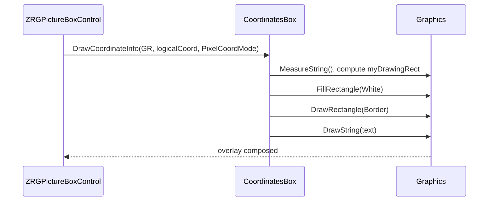

# CoordinatesBox — Documentation

This document describes `CoordinatesBox` (file: `CoordinatesBox.vb`) — the helper class inside `ZRGPictureBoxControl` that draws the floating coordinates box (bottom-right corner) showing the current mouse position in the selected measurement unit.

---

## 1. Purpose

`CoordinatesBox` is responsible for formatting and drawing a small overlay that displays the current cursor coordinates (or any provided logical coordinate) using the active `UnitOfMeasure`. It computes its drawing rectangle, prevents overlap with scrollbars, and exposes its rectangle via `DrawingRect` so other components (e.g., `CrossCursor`) can avoid drawing over it.

## 2. Key members
	
- Fields
	- `myPictureBoxControl As ZRGPictureBoxControl` — parent control reference.
	- `myDrawingRect As Rectangle` — computed rectangle (physical coordinates) where the coordinate box is painted.
	- `myLastCoordToDraw As Point` — last logical coordinate drawn.
- Properties
	- `PictureBoxControl` (setter private) — associated parent control.
	- `UnitOfMeasure` (read-only) — convenience accessor to parent `UnitOfMeasure`.
	- `DrawingRect` (read-only) — exposes the current physical rectangle used for display.
- Helpers
	- `UnitOfMeasureFactor` — returns micron-per-unit factor using `MeasureSystem.CustomUnitToMicron(1, UnitOfMeasure)`.
	- `UnitOfMeasureString` — readable unit string from `MeasureSystem.UniMisDescription`.
	
## 3. Main method: `DrawCoordinateInfo`

Signature: `Public Sub DrawCoordinateInfo(ByVal GR As Graphics, ByVal CoordToDraw As Point, Optional ByVal PixelCoordMode As Boolean = False)`

Behavior:

1. Validates inputs and `CoordToDraw` sentinel values.
2. Stores `myLastCoordToDraw`.
3. Prepares a small font `Arial narrow, 8` and computes `borderSize` based on measuring the underscore character to center vertical padding.
4. Computes conversion factor `_umsf` = `UnitOfMeasureFactor` — if `PixelCoordMode = True`, uses 1 (i.e., show pixels, not units).
5. Formats `textToDraw`:
	- If pixel mode: format with two decimals for X/Y.
	- Else: if `UnitOfMeasure` is `micron`, format as integer (no decimals), otherwise include two decimal places and append the unit string.
6. Measures `textBox` size and updates `myDrawingRect` position anchored to the bottom-right of the `ClientRectangle` (accounts for visible scrollbars by reducing width/height by 1 pixel when `HScroll`/`VScroll` are set).
7. Draws a white background rectangle and black border, then draws the formatted text inside with slight padding.

**Notes on invalidation:**

- The method keeps an `oldTextBox` static to detect size changes and forces invalidation (caller-level) when the size changes to avoid leaving artifact remnants.

## 4. Usage and integration

- `ZRGPictureBoxControl` invokes `CoordinatesBox.DrawCoordinateInfo` from its paint method when `ShowMouseCoordinates` is enabled and the mouse is over the control. It passes either logical coords converted to physical, or when in pixel mode it passes pixel coords.
- Other helper classes (e.g., `CrossCursor`) consult `CoordinatesBox.DrawingRect` to avoid drawing over the coordinates overlay.

Mermaid sequence (paint integration)

## 5. Implementation notes

- Font is hard-coded to `Arial narrow, 8` as a static allocation. If localization or DPI scaling is needed, consider using control font metrics or scaling the font by `ScaleFactor`.
- `DrawCoordinateInfo` expects `CoordToDraw` values in logical units when `PixelCoordMode=False` and does the unit conversion internally for display; ensure callers pass the expected coordinate space.
- This helper draws directly to the passed `Graphics` without changing transforms; callers should ensure transforms are appropriate when invoked.

---

