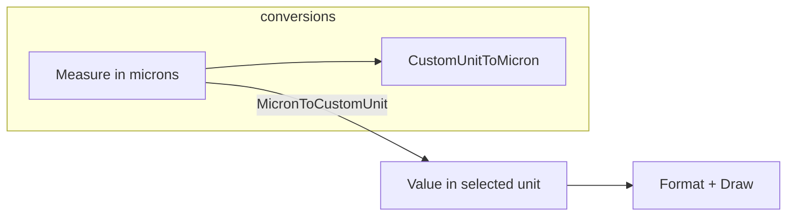

# MeasureSystem — Documentation

This document describes `MeasureSystem` (file: `MeasureSys.vb`) — a small utility class for unit conversions used by the picture box and helpers.

---

## 1. Purpose

`MeasureSystem` centralizes conversion logic between internal measurement units (micron) and other user-facing units: mm, inches, dmm (decimillimeter?), and meters. It provides formatting helpers and raises a change event when the user unit changes.

## 2. Types and API

- `Public Enum enUniMis` — units supported:
	- `micron` (internal default)
	- `mm` (millimeters)
	- `inches`
	- `dmm` (decimillimeter/centi? represented as 100 micron units)
	- `meters`
> this is need to expand with other units like `cm`, `feet` 

- `Public Shared Event MeasureUnitChanged(ByVal NewUnit As enUniMis)` — raised when `UserUnit` property changes (instance-level property triggers this shared event via setter).
- `Public Property UserUnit As enUniMis` — current user unit; default set to `micron` in constructor.
- Conversion functions (static/shared and instance helpers):
	- `Public Shared Function MicronToCustomUnit(Measure_micron As Double, CustomUnit As enUniMis, Optional Round As Boolean = False) As Double`
		- Converts from micron to given `CustomUnit`. Optional rounding modes are provided for common display precision rules.
- `Public Shared Function MicronToCustomUnit(Measure_micron As Integer, CustomUnit As enUniMis, Optional Round As Boolean = False) As Integer` (Integer overload)
- `Public Function MicronToUserUnit(Measure_micron As Double, Optional Round As Boolean = False) As Double`
	- Uses `UserUnit` to convert.
- `Public Shared Function CustomUnitToMicron(MeasureValue As Double, CustomUnit As enUniMis) As Integer`
	- Convert from custom unit to micron.
- `Public Function UserUnitToMicron(MeasureValue As Double) As Integer`
	- Uses `UserUnit`.
- Helpers:
	- `Public Function UserUnitDescription() As String` — returns a short string label for `UserUnit`.
	- `Public Sub FillComboWithAvailableUnits(cbMeasureUnit As ComboBox)` — populates a ComboBox with unit descriptions and selects the current `UserUnit`.
	- `Public Shared Function UniMisDescription(UNIT As enUniMis) As String` — static mapping to unit strings (`"inches"`, `"micron"`, `"mm"`, `"m"`, `"dmm"`).

## 3. Behavior and rounding rules

- Rounding behaviors in `MicronToCustomUnit` use heuristics to produce sensible display precision:
  - `inches` rounding uses two decimal places (inch/100) when `Round=True`.
  - `mm` rounding uses one decimal place (mm/10) when `Round=True`.
  - `meters` rounding uses one decimal place when `Round=True`.
  - `dmm` rounding truncates to integer units.

- `CustomUnitToMicron` multiplies user units by scalars: `inches` -> 25400, `mm` -> 1000, `meters` -> 1_000_000, `dmm` -> 100, `micron` -> 1.

## 4. Interaction with the rest of the control

- `Rulers` and `CoordinatesBox` use `MeasureSystem.CustomUnitToMicron` and `MicronToCustomUnit` to convert internal micron values into displayed numbers and to pick appropriate tick spacing.
- The picture box raises `OnMeasureUnitChanged` when its `UnitOfMeasure` property changes; `Rulers` subscribe and mark their bitmaps for redraw.

## 5. Mermaid: simple conversion flow

## 6. Implementation notes

- Constructor sets default `UserUnit = micron`.
- `UserUnit` setter raises `MeasureUnitChanged` when changed.
- Current implementation uses `MsgBox` in exception catches; consider structured logging for non-interactive usage.

---

