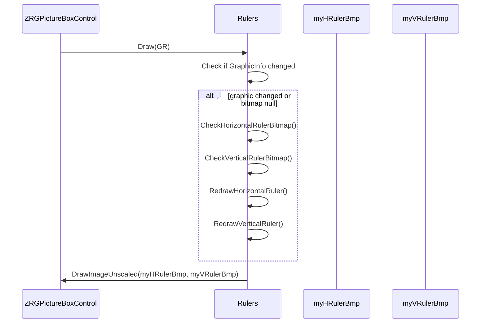

# Rulers — Documentation

This document describes the private nested `Rulers` class inside `ZRGPictureBoxControl` (file: `Rulers.vb`). The `Rulers` class renders the horizontal and vertical rulers, computes tick steps and labels, caches ruler bitmaps and exposes small helper functions for drag-lines and origin icons.

---

## 1. Purpose

**`Rulers`** provides:
- Horizontal and vertical ruler bitmap generation and caching.
- Label rendering using a compact digit mask generator (`DrawNumberBitmap`).
- Computation of a unit-aware tick step (`GetRulerStep`).
- Drag-line rendering helpers for ruler-based drag operations.

It is tightly coupled to `ZRGPictureBoxControl` and reads view state from `PictureBoxControl.GraphicInfo`, `UnitOfMeasure` and `ScaleFactor`.

## 2. Main responsibilities & members

- **`DrawNumberBitmap`** (nested private class)
	- Implements digit stroke templates (6-pixel wide digit masks).
	- Builds segment lists for each printable digit and sign and draws scaled numbers into a `Graphics` with `DrawScaledNumber`.
- **Cached bitmaps**
	- `myHRulerBmp` — bitmap for horizontal ruler.
	- `myVRulerBmp` — bitmap for vertical ruler.
	- `myOriginBmp` / `myOriginBmpSnapped` — little icons for origin.
- **Shared pens and brushes**
	- `RulerPen`, `myDragPen`, and other color resources.
- **Redraw flags**
	- `NeedsHorizontalRedraw`, `NeedsVerticalRedraw` and `myLastGraphicInfo` to detect when to rebuild cached bitmaps.

## 3. Important methods

- `RedrawHorizontalRuler()` / `RedrawVerticalRuler()`
	- Create a `Graphics` context of the ruler bitmap (via `PictureBoxControl.GetScaledGraphicObject(bitmap)`).
	- Clear background and draw ticks and numbers using `digitMaskCreator.DrawScaledNumber`.
	- Update `NeedsHorizontalRedraw` / `NeedsVerticalRedraw` flags.
- `GetRulerStep()`
	- Determines the appropriate tick spacing (in microns or inches) using `CalculateBaseStep` and rounding to friendly series (1,2,5 × powers of 10).
- `CheckHorizontalRulerBitmap()` / `CheckVerticalRulerBitmap()`
	- Ensure bitmaps are allocated with stable sizes (rounded to 100px) and set redraw flags when replacement occurs.
- `Draw(GR As Graphics)`
	- Main public draw method invoked by the parent control. It ensures bitmaps are up-to-date, draws cached bitmaps, and paints origin icon. It temporarily resets transforms (saves/restores Graphics state).
- `DrawHorizontalDragDropLine` / `DrawVerticalDragDropLine`
	- Utility methods to draw dashed drag-lines at a physical coordinate derived from logical values.

## 4. Algorithms and details

- **Numeric label drawing**
	- `DrawNumberBitmap` stores stroke templates for digits and punctuation. `DrawScaledNumber` converts the stroke templates to logical positions using current `ScaleFactor` and issues `DrawLines` calls.
- **Step selection**
	- `GetRulerStep()` computes a base step from available space and estimated label pixel widths, applies `FreeSpaceFactor` (1.75) and selects a rounded value among series of 1,2,5 × 10^n (and scales for inches using baseUnit = 25400 microns).
- **Ruler bitmap sizing**
	- Bitmaps are created with width/height rounded up to the next 100 pixels to reduce frequent allocations during live resize.

## 5. Interactions and sequence (redraw flow)

This sequence shows cache validation -> optional redraw -> draw to target Graphics.

## 6. Integration notes & edge cases

- **`Rulers`** relies on **`PictureBoxControl.GraphicInfo`** that must be synchronized with control `ClientSize` and scale before calling `Draw`.
- **Bitmap** allocation uses large rounding to reduce churn; memory use may be significant for very large control sizes.
- **`DrawNumberBitmap`** uses integer templates — numeric labels are drawn as polylines; this keeps dependency on fonts low and yields stable visual appearance independent of GDI font rendering variability.
- Exceptions use `MsgBox` in current code; for library usage replace with logging or rethrow.

---

