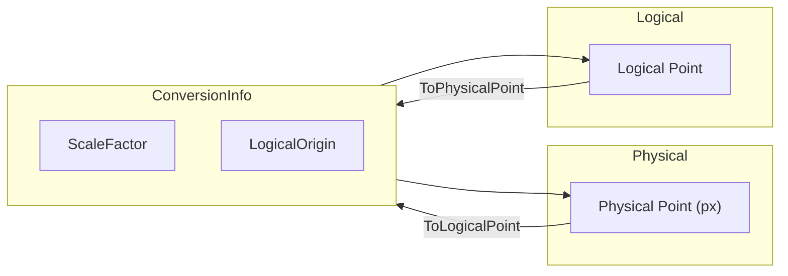

# ConversionInfo — Documentation

This document describes `ConversionInfo` (file: `ConversionInfo.vb`) — the core conversion helper used by `ZRGPictureBoxControl` to map between physical pixel coordinates and logical coordinates and to maintain view state (scale and logical origin).

---

## 1. Purpose

`ConversionInfo` centralizes the following responsibilities:

- Store physical viewport dimensions (`PhysicalWidth`, `PhysicalHeight`).
- Maintain `ScaleFactor` linking physical pixels to logical units.
- Store `LogicalOrigin` (top-left logical point currently displayed).
- Provide conversion methods between physical and logical coordinates and dimensions.
- Provide convenience operations like `Clone()` and `CopyParamsFrom()`.

## 2. Properties and behavior

- `PhysicalWidth`, `PhysicalHeight` (Integer) — expected to reflect the control's client area size in pixels.
- `ScaleFactor` (Single) — positive scale value where:
	- Logical size = Physical size / ScaleFactor
	- Setter ensures `myScaleFactor` is positive (`Math.Abs`) and guards against NaN/Infinity by normalizing to 1.

- `LogicalWidth`, `LogicalHeight` (Integer) — computed properties:
	- `Get` returns `PhysicalWidth / ScaleFactor` (asserts ScaleFactor != 0).
	- `Set` updates `ScaleFactor = PhysicalWidth / Value` (if Value != 0).

- `LogicalArea` (RECT) — composes `LogicalOrigin`, `LogicalWidth`, and `LogicalHeight` into a `RECT` for convenience. Setter updates `LogicalOrigin` and `LogicalWidth`/`LogicalHeight`.

- Operators \`=\` and \`<>\` compare `PhysicalWidth`, `PhysicalHeight`, `ScaleFactor`, and `LogicalOrigin`.

## 3. Conversion methods

- Physical -> Logical
	- `ToLogicalCoordX(PhysicalCoordX As Single) As Single` -> returns `PhysicalCoordX / ScaleFactor + LogicalOrigin.X`.
	- `ToLogicalCoordY(PhysicalCoordY As Single) As Single` -> returns `PhysicalCoordY / ScaleFactor + LogicalOrigin.Y`.
	- `ToLogicalDimension(dimension As Single) As Single` -> `dimension / ScaleFactor` (size invariant to origin).
	- `ToLogicalPoint(PhysicalPoint As Point) As Point` and overload `(X as Integer, Y as Integer)`.

- Logical -> Physical
	- `ToPhysicalCoordX(LogicalCoordX As Single) As Single` -> `(LogicalCoordX - LogicalOrigin.X) * ScaleFactor`.
	- `ToPhysicalCoordY(LogicalCoordY As Single) As Single` -> `(LogicalCoordY - LogicalOrigin.Y) * ScaleFactor`.
	- `ToPhysicalDimension(dimension As Single) As Single` -> `dimension * ScaleFactor`.
	- `ToPhysicalPoint(LogicalPoint As Point) As Point`.
	- `ToPhysicalRect(LogicalRect As RECT) As RECT` -> maps each corner through `ToPhysicalCoordX/Y`.

Notes:
- Most methods are wrapped in try/catch and call `MsgBox` on exceptions; consider removing UI-based error reporting for a library and prefer throws or logging.

## 4. Dot / DPI helper

- `DotToMicron(BitmapDPI As Integer) As Single` — converts bitmap DPI to micron per pixel using formula `1 / ((BitmapDPI / 25.4) / 1000)`.

## 5. Clone / copy

- `Clone()` returns a new `ConversionInfo` with copied parameters via `CopyParamsFrom`.
- `CopyParamsFrom(info As ConversionInfo)` copies `PhysicalWidth`, `PhysicalHeight`, `ScaleFactor`, and `LogicalOrigin`.

## 6. Mermaid: conversions and usage

## 7. Integration notes

- `ConversionInfo` is central to correct rendering: host control must keep `PhysicalWidth` and `PhysicalHeight` synchronized with control client size before painting.
- When changing `ScaleFactor` or `LogicalOrigin`, call control `Invalidate()`/`Redraw()` as appropriate to update caches and bitmaps used by helpers (rulers, selection box, etc.).
- Equality operator is used by `Rulers` to detect when the drawing cache needs rebuild (`myLastGraphicInfo <> PictureBoxControl.GraphicInfo`).

## 8. Recommendations

- Avoid UI dialogs (`MsgBox`) inside conversion helpers. Throw or log on exceptional states.
- Consider making `ToPhysicalPoint`/`ToLogicalPoint` accept floating-point `PointF` to preserve sub-pixel precision for high DPI scenarios; current integer rounding may reduce precision on small-scale zoom.

---
