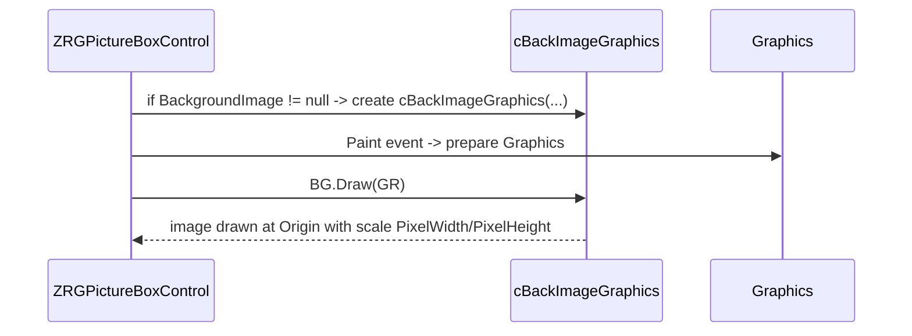

# BackImageGraphics — Documentation

This document describes `cBackImageGraphics` and the `enBitmapOriginPosition` enum (file: `BackImageGraphics.vb`). `cBackImageGraphics` provides a tiny helper to render a background bitmap into the picture-box logical space using a configurable pixel-to-logical size.

---

## 1. Types

- `enBitmapOriginPosition`
	- `TopLeft` — image origin placed at the given origin point.
	- `Custom` — reserved for custom origin behaviour (the implementation currently stores the enum but drawing uses the given Origin coordinates).
- `cBackImageGraphics` — helper class to draw an image aligned to a logical origin and scaled by pixel-size parameters.

## 2. Responsibilities

- Store a reference to a source `Bitmap` and a drawing origin (`Origin`).
- Maintain pixel-size parameters `PixelWidth` and `PixelHeight` (micron-per-pixel or similar scale factor in the host code) used to scale the image when drawing.
- Provide `Draw(Graphics)` to render the bitmap at the requested origin and size.
- `Dispose()` to free the underlying `Bitmap` resource.

## 3. Key fields and constructor

- `Friend Origin As Point` — image placement origin in the host coordinate space.
- `Private BitmapImage As Bitmap` — the bitmap to draw.
- `Private BitmapOrigin As enBitmapOriginPosition` — chosen origin mode.
- `Private PixelWidth As Double, PixelHeight As Double` — scale factors for width/height.

Constructor signature:

`Public Sub New(ByVal BitmapImg As Bitmap, ByVal OriginX As Integer, ByVal OriginY As Integer, ByVal OriginPosition As enBitmapOriginPosition, ByVal Pixel_Width As Double, ByVal Pixel_Height As Double)`

Behavior:
- Stores `BitmapImage`, `Origin`, `BitmapOrigin`, `PixelWidth` and `PixelHeight`.
- Ensures minimum pixel dimensions (10) to avoid tiny scaling (clamps values below 10 to 10).

## 4. Draw method

`Public Sub Draw(ByVal GR As Graphics)`

- If `BitmapImage` is Nothing, returns.
- Calls `GR.DrawImage(BitmapImage, New Rectangle(Origin.X, Origin.Y, BitmapImage.Width * PixelWidth, BitmapImage.Height * PixelWidth), 0, 0, BitmapImage.Width, BitmapImage.Height, GraphicsUnit.Pixel)` to draw the scaled image.

Notes:
- The call uses `PixelWidth` for both width and height multiplication; if `PixelHeight` was intended to differ this is a likely bug/typo in the original implementation — verify intended behaviour and correct to use `PixelHeight` for the height multiplication if necessary.

## 5. Dispose / lifecycle

- `Dispose()` attempts to `Dispose()` the `BitmapImage` and set it to `Nothing`.
- The host `ZRGPictureBoxControl` sets `myPictureBoxImageGR` when the `Image` property is set; callers should call `Dispose()` when replacing/removing the background image to free memory.

## 6. Integration and usage

- Instantiate `cBackImageGraphics` when a background image is set on the picture box with an origin and desired pixel-size.
- During `OnPaint`, the host should call `myPictureBoxImageGR.Draw(graphics)` to render the background before drawing overlays (grid, rulers, selection box, etc.).

## 7. Recommendations

- Consider using `PixelHeight` in the `Draw` call for the height scaling if non-square pixel size is supported.
- Wrap `BitmapImage` handling in safe disposal patterns at host level to avoid resource leaks and GDI handle exhaustion.
- Avoid `MsgBox` in library helpers; prefer exceptions or logging for diagnostics.

---
