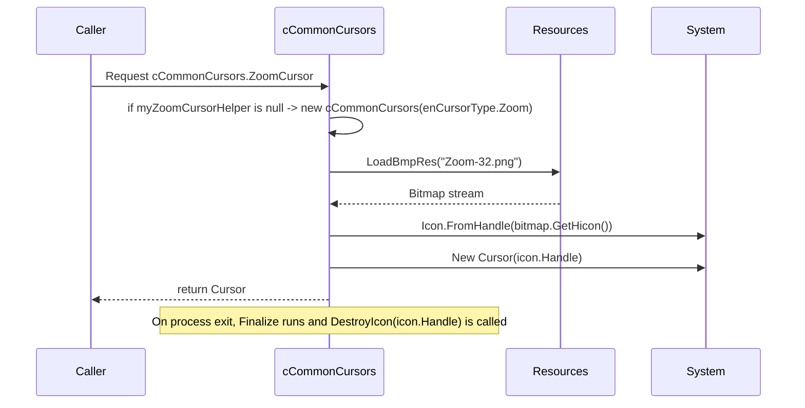

# cCommonCursors — Documentation

This document describes `cCommonCursors` (file: `Cursors\cCommonCursors.vb`). The class provides a small helper to load custom cursor bitmaps embedded as resources and expose them as `Cursor` objects for use by the picture-box control.

---

## 1. Purpose

- Load embedded bitmap resources for visual cursors (zoom, edit) and convert them into `System.Windows.Forms.Cursor` instances.
- Cache created cursor helpers to avoid repeated resource allocations.
- Provide `ZoomCursor` and `EditCursor` shared read-only properties to the rest of the application.

## 2. Key implementation details

- Uses P/Invoke to call `DestroyIcon` from `user32.dll` to free icon handles during finalization.
- Constructor `New(CursorType As enCursorType)`:
	- Loads bitmap resource by name (e.g., `"Zoom-32.png"` or `"Edit.png"`) using `LoadBmpRes`.
	- Creates an `Icon` from the bitmap handle: `Icon.FromHandle(bmp.GetHicon)`.
	- Creates a `Cursor` from the `Icon` handle: `New Cursor(myInternalIcon.Handle)`.
	- Stores `myInternalIcon` and `myCustomCursor` on the instance.

- `LoadBmpRes(cursorName As String)` scans assembly manifest resource names and returns a `Bitmap` constructed from the resource stream when `EndsWith(cursorName)` matches.
- `Finalize()` attempts to call `DestroyIcon(myInternalIcon.Handle)` to release the native icon handle, then calls `MyBase.Finalize()`.
- Static caching: `myEditCursorHelper` and `myZoomCursorHelper` are stored and returned via static properties `EditCursor` and `ZoomCursor`.

## 3. API

- `Public Shared ReadOnly Property EditCursor As Cursor` — lazy-initializes `myEditCursorHelper` and returns `CustomCursor`. Returns `Cursors.No` on error.
- `Public Shared ReadOnly Property ZoomCursor As Cursor` — lazy-initializes `myZoomCursorHelper` and returns `CustomCursor`. Returns `Cursors.No` on error.

## 4. Sequence / lifecycle diagram

## 5. Notes and caveats

- `Icon.FromHandle` returns an `Icon` that wraps a native `HICON` handle; documentation requires that callers call `DestroyIcon` when they are done with that handle. This class calls `DestroyIcon` in `Finalize`, but `Finalize` timing is non-deterministic. Consider implementing `IDisposable` and providing an explicit `Dispose()` to deterministically free the icon handle when no longer needed.
- `LoadBmpRes` searches resource names via `thisAssembly.GetManifestResourceNames()` and matches `EndsWith(cursorName)`; this is case-sensitive in the code's equality check. If resource naming differs (assembly prefix), the method will still find matching names due to `EndsWith` but be cautious when adding resources.
- The code shows `MsgBox` usage in catch blocks; for library code, prefer structured logging or throwing exceptions.

## 6. Recommendation

- Implement `IDisposable` to dispose `myCustomCursor` and call `DestroyIcon` deterministically.
- Consider embedding .cur/.ico resources instead of bitmaps to avoid icon handle creation via `GetHicon` and potential transparency/hotspot issues.

---

If you want, I can draft a small `IDisposable` upgrade patch to make resource cleanup deterministic (create `Dispose()` that calls `DestroyIcon` and disposes internal cursor/icon).