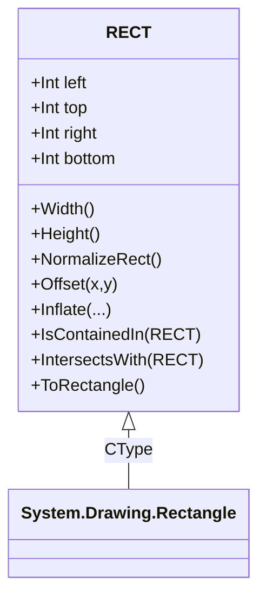
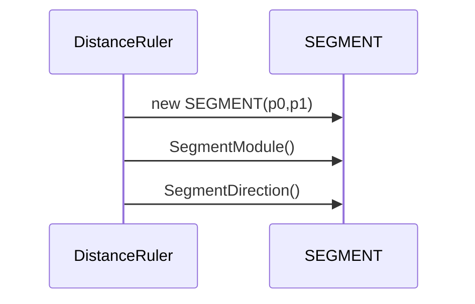

<!--> PublicTypes.md -->
# PublicTypes — Documentation

This document documents `PublicTypes.vb`: small public enums and two core geometric structures (`RECT` and `SEGMENT`) used across the control.

---

## 1. Overview

`PublicTypes.vb` contains:

- Enums: `GridKind`, `enClickAction`, `ResizeMode`.
- `RECT` structure: an integer rectangle type with many helpers (normalization, offset, inflate, conversion, intersection, containment tests, operators and constructors).
- `SEGMENT` structure: represents a line segment with helpers for length and direction.

These low-level types are used by `ZRGPictureBoxControl` and its helpers (rulers, selection box, distance ruler, etc.) for robust geometry operations in logical coordinates.

## 2. Enums

- `GridKind` — visualization mode for grid: `FullLines`, `Points`, `Crosses`.
- `enClickAction` — interaction mode: `None`, `Zoom`, `MeasureDistance`.
- `ResizeMode` — resizing strategy: `Normal`, `Stretch`.

These enums are small and used by public properties and UI controls (e.g., `ClickAction` on the picture box or `GridView`).

## 3. `RECT` structure

`RECT` models an integer rectangle using fields `left`, `top`, `right`, `bottom` (inclusive left/top, exclusive semantics for width/height are computed by `Width`/`Height`).

Key features:

- Constructors from `Rectangle`, `RectangleF`, point arrays, points+size, and explicit coords.
- Conversion operators to/from `System.Drawing.Rectangle` and `RectangleF`.
- Properties: `X`, `Y`, `Width`, `Height`, `CenterPoint`, `Size`, `TopLeft`, `TopRight`, `BottomRight`, `BottomLeft`, centers, `IsZeroSized`, `IsNonZeroSized`, `IsNormalized`.
- Normalization helpers: `AssertIfNotNormalized()`, `NormalizeRect()` (swaps coordinates if needed).
- Mutators: `Offset`, `Inflate` (multiple overloads), `ExpandFromFixedPoint(zoomMultiplier, fixedPoint)`.
- Containment and intersection: `IsContainedIn`, `Contains` (overloads), `IntersectsWith`, `Intersect`, `Union`, `UnionWithoutZeroSized`, `IntersectWithoutInvalid`.
- Utility: `ToPointArray()`, `ToRectangle()`, `CoordsBoundaries(coords())`.

Usage notes:

- `RECT.InvalidPoint()` returns a sentinel `Point` with `Integer.MaxValue` used across the codebase for "unset" points.
- `NormalizeRect()` should be used after constructing a `RECT` from arbitrary points to ensure `left <= right` and `top <= bottom`.
- `ExpandFromFixedPoint` is useful for zooming rectangles from a fixed focal point.

Mermaid diagram: basic relations and common methods

## 4. `SEGMENT` structure

`SEGMENT` represents a 2D segment using integer end points `(X0,Y0)` and `(X1,Y1)` with properties `P0` and `P1`.

Key features:

- Constructors from coordinates, points or copy-construction.
- `ContainsX(x)` — checks whether a vertical projection x falls on the segment's X interval (handles either orientation).
- `MediumPoint()` — midpoint.
- `SegmentModule()` / `SegmentModule(P0,P1)` — Euclidean length.
- `SegmentDirection()` — returns the angle (in radians) of the segment relative to standard mathematical coordinates, with special-case handling for vertical/horizontal segments and quadrant logic to avoid division-by-zero and provide correct signed angle.
- Equality operators \`=\` and \`<>\` comparing endpoints.

Mermaid snippet: usage with DistanceRuler

## 5. Implementation notes and caveats

- Many methods use `MsgBox` to surface exceptions. For library use, consider replacing with logging or throwing to the caller.
- `RECT.InvalidPoint()` uses `Integer.MaxValue` sentinel which must be consistently checked by callers.
- `SegmentDirection` performs careful quadrant math; keep tests for edge cases (zero-length segments, vertical/horizontal) if refactoring.

---
