### File Content

- [1. ZRGPictureBoxControl — Detailed Draft](https://github.com/AhmedGalalIsmail/CoNSoL-TakeOff/blob/CoNSoL-TakeOff-AIV3/CoNSoL-TakeOff-AI-Docs/ZRGPictureBoxControl-in-Details/ZRGPictureBoxControl-in-Details.md#1-zrgpictureboxcontrol--detailed-draft)
	- [1. High level purpose](https://github.com/AhmedGalalIsmail/CoNSoL-TakeOff/blob/CoNSoL-TakeOff-AIV3/CoNSoL-TakeOff-AI-Docs/ZRGPictureBoxControl-in-Details/ZRGPictureBoxControl-in-Details.md#1-high-level-purpose)
	- [2. File / class structure (regions and main members)](https://github.com/AhmedGalalIsmail/CoNSoL-TakeOff/blob/CoNSoL-TakeOff-AIV3/CoNSoL-TakeOff-AI-Docs/ZRGPictureBoxControl-in-Details/ZRGPictureBoxControl-in-Details.md#2-file--class-structure-regions-and-main-members)
	- [3. Public properties and what they do](https://github.com/AhmedGalalIsmail/CoNSoL-TakeOff/blob/CoNSoL-TakeOff-AIV3/CoNSoL-TakeOff-AI-Docs/ZRGPictureBoxControl-in-Details/ZRGPictureBoxControl-in-Details.md#3-public-properties-and-what-they-do)
	- [4. Events and how to use them](https://github.com/AhmedGalalIsmail/CoNSoL-TakeOff/blob/CoNSoL-TakeOff-AIV3/CoNSoL-TakeOff-AI-Docs/ZRGPictureBoxControl-in-Details/ZRGPictureBoxControl-in-Details.md#4-events-and-how-to-use-them)
	- [5. Related helper classes and files (collaboration)](https://github.com/AhmedGalalIsmail/CoNSoL-TakeOff/blob/CoNSoL-TakeOff-AIV3/CoNSoL-TakeOff-AI-Docs/ZRGPictureBoxControl-in-Details/ZRGPictureBoxControl-in-Details.md#5-related-helper-classes-and-files-collaboration)
	- [6. Key workflows and sequences](https://github.com/AhmedGalalIsmail/CoNSoL-TakeOff/blob/CoNSoL-TakeOff-AIV3/CoNSoL-TakeOff-AI-Docs/ZRGPictureBoxControl-in-Details/ZRGPictureBoxControl-in-Details.md#6-key-workflows-and-sequences)
	- [7. Typical usage patterns for integrators](https://github.com/AhmedGalalIsmail/CoNSoL-TakeOff/blob/CoNSoL-TakeOff-AIV3/CoNSoL-TakeOff-AI-Docs/ZRGPictureBoxControl-in-Details/ZRGPictureBoxControl-in-Details.md#7-typical-usage-patterns-for-integrators)
	- [8. Important implementation notes and edge-cases](https://github.com/AhmedGalalIsmail/CoNSoL-TakeOff/blob/CoNSoL-TakeOff-AIV3/CoNSoL-TakeOff-AI-Docs/ZRGPictureBoxControl-in-Details/ZRGPictureBoxControl-in-Details.md#8-important-implementation-notes-and-edge-cases)
 	- [9. Cross-file invariants / contracts](https://github.com/AhmedGalalIsmail/CoNSoL-TakeOff/blob/CoNSoL-TakeOff-AIV3/CoNSoL-TakeOff-AI-Docs/ZRGPictureBoxControl-in-Details/ZRGPictureBoxControl-in-Details.md#9-cross-file-invariants--contracts)
  	- [10. Where to look next in the codebase](https://github.com/AhmedGalalIsmail/CoNSoL-TakeOff/blob/CoNSoL-TakeOff-AIV3/CoNSoL-TakeOff-AI-Docs/ZRGPictureBoxControl-in-Details/ZRGPictureBoxControl-in-Details.md#10-where-to-look-next-in-the-codebase)
- [2. ZoomButton (cZoomButton) — Documentation](https://github.com/AhmedGalalIsmail/CoNSoL-TakeOff/blob/CoNSoL-TakeOff-AIV3/CoNSoL-TakeOff-AI-Docs/ZRGPictureBoxControl-in-Details/ZRGPictureBoxControl-in-Details.md#2-zoombutton-czoombutton--documentation)
	- [1. Purpose and responsibilities](https://github.com/AhmedGalalIsmail/CoNSoL-TakeOff/blob/CoNSoL-TakeOff-AIV3/CoNSoL-TakeOff-AI-Docs/ZRGPictureBoxControl-in-Details/ZRGPictureBoxControl-in-Detailed.md#1-purpose-and-responsibilities)
	- [2. Key members (behavioural summary)](https://github.com/AhmedGalalIsmail/CoNSoL-TakeOff/blob/CoNSoL-TakeOff-AIV3/CoNSoL-TakeOff-AI-Docs/ZRGPictureBoxControl-in-Details/ZRGPictureBoxControl-in-Detailed.md#2-key-members-behavioural-summary)
	- [3. Interaction diagram](https://github.com/AhmedGalalIsmail/CoNSoL-TakeOff/blob/CoNSoL-TakeOff-AIV3/CoNSoL-TakeOff-AI-Docs/ZRGPictureBoxControl-in-Details/ZRGPictureBoxControl-in-Detailed.md#3-interaction-diagram)
	- [4. Notes and considerations](https://github.com/AhmedGalalIsmail/CoNSoL-TakeOff/blob/CoNSoL-TakeOff-AIV3/CoNSoL-TakeOff-AI-Docs/ZRGPictureBoxControl-in-Details/ZRGPictureBoxControl-in-Detailed.md#4-notes-and-considerations)
- [3. SelectionBoxElement — Documentation](https://github.com/AhmedGalalIsmail/CoNSoL-TakeOff/blob/CoNSoL-TakeOff-AIV3/CoNSoL-TakeOff-AI-Docs/ZRGPictureBoxControl-in-Details/ZRGPictureBoxControl-in-Details.md#3-selectionboxelement--documentation)
	- [1. Purpose](https://github.com/AhmedGalalIsmail/CoNSoL-TakeOff/blob/CoNSoL-TakeOff-AIV3/CoNSoL-TakeOff-AI-Docs/ZRGPictureBoxControl-in-Details/ZRGPictureBoxControl-in-Detailed.md#1-purpose)
	- [2. Main fields and properties](https://github.com/AhmedGalalIsmail/CoNSoL-TakeOff/blob/CoNSoL-TakeOff-AIV3/CoNSoL-TakeOff-AI-Docs/ZRGPictureBoxControl-in-Details/ZRGPictureBoxControl-in-Detailed.md#2-main-fields-and-properties)
	- [3. Key methods](https://github.com/AhmedGalalIsmail/CoNSoL-TakeOff/blob/CoNSoL-TakeOff-AIV3/CoNSoL-TakeOff-AI-Docs/ZRGPictureBoxControl-in-Details/ZRGPictureBoxControl-in-Detailed.md#3-key-methods)
	- [4. Lifecycle / interaction flow](https://github.com/AhmedGalalIsmail/CoNSoL-TakeOff/blob/CoNSoL-TakeOff-AIV3/CoNSoL-TakeOff-AI-Docs/ZRGPictureBoxControl-in-Details/ZRGPictureBoxControl-in-Detailed.md#4-lifecycle--interaction-flow)
	- [5. Integration notes](https://github.com/AhmedGalalIsmail/CoNSoL-TakeOff/blob/CoNSoL-TakeOff-AIV3/CoNSoL-TakeOff-AI-Docs/ZRGPictureBoxControl-in-Details/ZRGPictureBoxControl-in-Detailed.md#5-integration-notes)
- [4. CoordinatesBox — Documentation](https://github.com/AhmedGalalIsmail/CoNSoL-TakeOff/blob/CoNSoL-TakeOff-AIV3/CoNSoL-TakeOff-AI-Docs/ZRGPictureBoxControl-in-Details/ZRGPictureBoxControl-in-Details.md#4-coordinatesbox--documentation)
	- [1. Purpose](https://github.com/AhmedGalalIsmail/CoNSoL-TakeOff/blob/CoNSoL-TakeOff-AIV3/CoNSoL-TakeOff-AI-Docs/ZRGPictureBoxControl-in-Details/ZRGPictureBoxControl-in-Detailed.md#1-purpose-1)
	- [2. Key members](https://github.com/AhmedGalalIsmail/CoNSoL-TakeOff/blob/CoNSoL-TakeOff-AIV3/CoNSoL-TakeOff-AI-Docs/ZRGPictureBoxControl-in-Details/ZRGPictureBoxControl-in-Detailed.md#2-key-members)
	- [3. Main method: DrawCoordinateInfo](https://github.com/AhmedGalalIsmail/CoNSoL-TakeOff/blob/CoNSoL-TakeOff-AIV3/CoNSoL-TakeOff-AI-Docs/ZRGPictureBoxControl-in-Details/ZRGPictureBoxControl-in-Detailed.md#3-main-method-drawcoordinateinfo)
	- [4. Usage and integration](https://github.com/AhmedGalalIsmail/CoNSoL-TakeOff/blob/CoNSoL-TakeOff-AIV3/CoNSoL-TakeOff-AI-Docs/ZRGPictureBoxControl-in-Details/ZRGPictureBoxControl-in-Detailed.md#4-usage-and-integration)
	- [5. Implementation notes](https://github.com/AhmedGalalIsmail/CoNSoL-TakeOff/blob/CoNSoL-TakeOff-AIV3/CoNSoL-TakeOff-AI-Docs/ZRGPictureBoxControl-in-Details/ZRGPictureBoxControl-in-Detailed.md#5-implementation-notes)
- [5. MeasureSystem — Documentation](https://github.com/AhmedGalalIsmail/CoNSoL-TakeOff/blob/CoNSoL-TakeOff-AIV3/CoNSoL-TakeOff-AI-Docs/ZRGPictureBoxControl-in-Details/ZRGPictureBoxControl-in-Details.md#5-measuresystem--documentation)
	- [1. Purpose](https://github.com/AhmedGalalIsmail/CoNSoL-TakeOff/blob/CoNSoL-TakeOff-AIV3/CoNSoL-TakeOff-AI-Docs/ZRGPictureBoxControl-in-Details/ZRGPictureBoxControl-in-Detailed.md#1-purpose-2)
	- [2. Types and API](https://github.com/AhmedGalalIsmail/CoNSoL-TakeOff/blob/CoNSoL-TakeOff-AIV3/CoNSoL-TakeOff-AI-Docs/ZRGPictureBoxControl-in-Details/ZRGPictureBoxControl-in-Detailed.md#2-types-and-api)
	- [3. Behavior and rounding rules](https://github.com/AhmedGalalIsmail/CoNSoL-TakeOff/blob/CoNSoL-TakeOff-AIV3/CoNSoL-TakeOff-AI-Docs/ZRGPictureBoxControl-in-Details/ZRGPictureBoxControl-in-Detailed.md#3-behavior-and-rounding-rules)
	- [4. Interaction with the rest of the control](https://github.com/AhmedGalalIsmail/CoNSoL-TakeOff/blob/CoNSoL-TakeOff-AIV3/CoNSoL-TakeOff-AI-Docs/ZRGPictureBoxControl-in-Details/ZRGPictureBoxControl-in-Detailed.md#4-interaction-with-the-rest-of-the-control)
	- [5. Mermaid: simple conversion flow](https://github.com/AhmedGalalIsmail/CoNSoL-TakeOff/blob/CoNSoL-TakeOff-AIV3/CoNSoL-TakeOff-AI-Docs/ZRGPictureBoxControl-in-Details/ZRGPictureBoxControl-in-Detailed.md#5-mermaid-simple-conversion-flow)
- [6. Rulers — Documentation](https://github.com/AhmedGalalIsmail/CoNSoL-TakeOff/blob/CoNSoL-TakeOff-AIV3/CoNSoL-TakeOff-AI-Docs/ZRGPictureBoxControl-in-Details/ZRGPictureBoxControl-in-Details.md#6-rulers--documentation)
	- [1. Purpose](https://github.com/AhmedGalalIsmail/CoNSoL-TakeOff/blob/CoNSoL-TakeOff-AIV3/CoNSoL-TakeOff-AI-Docs/ZRGPictureBoxControl-in-Details/ZRGPictureBoxControl-in-Detailed.md#1-purpose-3)
	- [2. Main responsibilities & members](https://github.com/AhmedGalalIsmail/CoNSoL-TakeOff/blob/CoNSoL-TakeOff-AIV3/CoNSoL-TakeOff-AI-Docs/ZRGPictureBoxControl-in-Details/ZRGPictureBoxControl-in-Detailed.md#2-main-responsibilities--members)
	- [3. Important methods](https://github.com/AhmedGalalIsmail/CoNSoL-TakeOff/blob/CoNSoL-TakeOff-AIV3/CoNSoL-TakeOff-AI-Docs/ZRGPictureBoxControl-in-Details/ZRGPictureBoxControl-in-Detailed.md#3-important-methods)
	- [4. Algorithms and details](https://github.com/AhmedGalalIsmail/CoNSoL-TakeOff/blob/CoNSoL-TakeOff-AIV3/CoNSoL-TakeOff-AI-Docs/ZRGPictureBoxControl-in-Details/ZRGPictureBoxControl-in-Detailed.md#4-algorithms-and-details)
	- [5. Interactions and sequence (redraw flow)](https://github.com/AhmedGalalIsmail/CoNSoL-TakeOff/blob/CoNSoL-TakeOff-AIV3/CoNSoL-TakeOff-AI-Docs/ZRGPictureBoxControl-in-Details/ZRGPictureBoxControl-in-Detailed.md#5-interactions-and-sequence-redraw-flow)
	- [6. Integration notes & edge cases](https://github.com/AhmedGalalIsmail/CoNSoL-TakeOff/blob/CoNSoL-TakeOff-AIV3/CoNSoL-TakeOff-AI-Docs/ZRGPictureBoxControl-in-Details/ZRGPictureBoxControl-in-Detailed.md#6-integration-notes--edge-cases)
- [7. DistanceRuler — Documentation](https://github.com/AhmedGalalIsmail/CoNSoL-TakeOff/blob/CoNSoL-TakeOff-AIV3/CoNSoL-TakeOff-AI-Docs/ZRGPictureBoxControl-in-Details/ZRGPictureBoxControl-in-Details.md#7-distanceruler--documentation)
	- [1. Purpose](https://github.com/AhmedGalalIsmail/CoNSoL-TakeOff/blob/CoNSoL-TakeOff-AIV3/CoNSoL-TakeOff-AI-Docs/ZRGPictureBoxControl-in-Details/ZRGPictureBoxControl-in-Detailed.md#1-purpose-4)
	- [2. Public types](https://github.com/AhmedGalalIsmail/CoNSoL-TakeOff/blob/CoNSoL-TakeOff-AIV3/CoNSoL-TakeOff-AI-Docs/ZRGPictureBoxControl-in-Details/ZRGPictureBoxControl-in-Detailed.md#2-public-types)
	- [3. Main members](https://github.com/AhmedGalalIsmail/CoNSoL-TakeOff/blob/CoNSoL-TakeOff-AIV3/CoNSoL-TakeOff-AI-Docs/ZRGPictureBoxControl-in-Details/ZRGPictureBoxControl-in-Detailed.md#3-main-members)
	- [4. Core methods and behavior](https://github.com/AhmedGalalIsmail/CoNSoL-TakeOff/blob/CoNSoL-TakeOff-AIV3/CoNSoL-TakeOff-AI-Docs/ZRGPictureBoxControl-in-Details/ZRGPictureBoxControl-in-Detailed.md#4-core-methods-and-behavior)
	- [5. Interaction flow](https://github.com/AhmedGalalIsmail/CoNSoL-TakeOff/blob/CoNSoL-TakeOff-AIV3/CoNSoL-TakeOff-AI-Docs/ZRGPictureBoxControl-in-Details/ZRGPictureBoxControl-in-Detailed.md#5-interaction-flow)
	- [6. Units and scaling](https://github.com/AhmedGalalIsmail/CoNSoL-TakeOff/blob/CoNSoL-TakeOff-AIV3/CoNSoL-TakeOff-AI-Docs/ZRGPictureBoxControl-in-Details/ZRGPictureBoxControl-in-Detailed.md#6-units-and-scaling)
	- [7. Integration notes and recommendations](https://github.com/AhmedGalalIsmail/CoNSoL-TakeOff/blob/CoNSoL-TakeOff-AIV3/CoNSoL-TakeOff-AI-Docs/ZRGPictureBoxControl-in-Details/ZRGPictureBoxControl-in-Detailed.md#7-integration-notes-and-recommendations)
- [8. ConversionInfo — Documentation](https://github.com/AhmedGalalIsmail/CoNSoL-TakeOff/blob/CoNSoL-TakeOff-AIV3/CoNSoL-TakeOff-AI-Docs/ZRGPictureBoxControl-in-Details/ZRGPictureBoxControl-in-Details.md#8-conversioninfo--documentation)
	- [1. Purpose](https://github.com/AhmedGalalIsmail/CoNSoL-TakeOff/blob/CoNSoL-TakeOff-AIV3/CoNSoL-TakeOff-AI-Docs/ZRGPictureBoxControl-in-Details/ZRGPictureBoxControl-in-Detailed.md#1-purpose-5)
	- [2. Properties and behavior](https://github.com/AhmedGalalIsmail/CoNSoL-TakeOff/blob/CoNSoL-TakeOff-AIV3/CoNSoL-TakeOff-AI-Docs/ZRGPictureBoxControl-in-Details/ZRGPictureBoxControl-in-Detailed.md#2-properties-and-behavior)
	- [3. Conversion methods](https://github.com/AhmedGalalIsmail/CoNSoL-TakeOff/blob/CoNSoL-TakeOff-AIV3/CoNSoL-TakeOff-AI-Docs/ZRGPictureBoxControl-in-Details/ZRGPictureBoxControl-in-Detailed.md#3-conversion-methods)
	- [4. Dot / DPI helper](https://github.com/AhmedGalalIsmail/CoNSoL-TakeOff/blob/CoNSoL-TakeOff-AIV3/CoNSoL-TakeOff-AI-Docs/ZRGPictureBoxControl-in-Details/ZRGPictureBoxControl-in-Detailed.md#4-dot--dpi-helper)
	- [5. Clone / copy](https://github.com/AhmedGalalIsmail/CoNSoL-TakeOff/blob/CoNSoL-TakeOff-AIV3/CoNSoL-TakeOff-AI-Docs/ZRGPictureBoxControl-in-Details/ZRGPictureBoxControl-in-Detailed.md#5-clone--copy)
	- [6. Mermaid: conversions and usage](https://github.com/AhmedGalalIsmail/CoNSoL-TakeOff/blob/CoNSoL-TakeOff-AIV3/CoNSoL-TakeOff-AI-Docs/ZRGPictureBoxControl-in-Details/ZRGPictureBoxControl-in-Detailed.md#6-mermaid-conversions-and-usage)
	- [7. Integration notes](https://github.com/AhmedGalalIsmail/CoNSoL-TakeOff/blob/CoNSoL-TakeOff-AIV3/CoNSoL-TakeOff-AI-Docs/ZRGPictureBoxControl-in-Details/ZRGPictureBoxControl-in-Detailed.md#7-integration-notes)
	- [8. Recommendations](https://github.com/AhmedGalalIsmail/CoNSoL-TakeOff/blob/CoNSoL-TakeOff-AIV3/CoNSoL-TakeOff-AI-Docs/ZRGPictureBoxControl-in-Details/ZRGPictureBoxControl-in-Detailed.md#8-recommendations)
- [9. BackImageGraphics — Documentation](https://github.com/AhmedGalalIsmail/CoNSoL-TakeOff/blob/CoNSoL-TakeOff-AIV3/CoNSoL-TakeOff-AI-Docs/ZRGPictureBoxControl-in-Details/ZRGPictureBoxControl-in-Details.md#9-backimagegraphics--documentation)
	- [1. Types](https://github.com/AhmedGalalIsmail/CoNSoL-TakeOff/blob/CoNSoL-TakeOff-AIV3/CoNSoL-TakeOff-AI-Docs/ZRGPictureBoxControl-in-Details/ZRGPictureBoxControl-in-Detailed.md#1-types)
	- [2. Responsibilities](https://github.com/AhmedGalalIsmail/CoNSoL-TakeOff/blob/CoNSoL-TakeOff-AIV3/CoNSoL-TakeOff-AI-Docs/ZRGPictureBoxControl-in-Details/ZRGPictureBoxControl-in-Detailed.md#2-responsibilities)
	- [3. Key fields and constructor](https://github.com/AhmedGalalIsmail/CoNSoL-TakeOff/blob/CoNSoL-TakeOff-AIV3/CoNSoL-TakeOff-AI-Docs/ZRGPictureBoxControl-in-Details/ZRGPictureBoxControl-in-Detailed.md#3-key-fields-and-constructor)
	- [4. Draw method](https://github.com/AhmedGalalIsmail/CoNSoL-TakeOff/blob/CoNSoL-TakeOff-AIV3/CoNSoL-TakeOff-AI-Docs/ZRGPictureBoxControl-in-Details/ZRGPictureBoxControl-in-Detailed.md#4-draw-method)
	- [5. Dispose / lifecycle](https://github.com/AhmedGalalIsmail/CoNSoL-TakeOff/blob/CoNSoL-TakeOff-AIV3/CoNSoL-TakeOff-AI-Docs/ZRGPictureBoxControl-in-Details/ZRGPictureBoxControl-in-Detailed.md#5-dispose--lifecycle)
	- [6. Integration and usage](https://github.com/AhmedGalalIsmail/CoNSoL-TakeOff/blob/CoNSoL-TakeOff-AIV3/CoNSoL-TakeOff-AI-Docs/ZRGPictureBoxControl-in-Details/ZRGPictureBoxControl-in-Detailed.md#6-integration-and-usage)
	- [7. Recommendations](https://github.com/AhmedGalalIsmail/CoNSoL-TakeOff/blob/CoNSoL-TakeOff-AIV3/CoNSoL-TakeOff-AI-Docs/ZRGPictureBoxControl-in-Details/ZRGPictureBoxControl-in-Detailed.md#7-recommendations)
- [10. CrossCursor — Documentation](https://github.com/AhmedGalalIsmail/CoNSoL-TakeOff/blob/CoNSoL-TakeOff-AIV3/CoNSoL-TakeOff-AI-Docs/ZRGPictureBoxControl-in-Details/ZRGPictureBoxControl-in-Details.md#10-crosscursor--documentation)
	- [1. Purpose](https://github.com/AhmedGalalIsmail/CoNSoL-TakeOff/blob/CoNSoL-TakeOff-AIV3/CoNSoL-TakeOff-AI-Docs/ZRGPictureBoxControl-in-Details/ZRGPictureBoxControl-in-Detailed.md#1-purpose-6)
	- [2. Key fields and properties](https://github.com/AhmedGalalIsmail/CoNSoL-TakeOff/blob/CoNSoL-TakeOff-AIV3/CoNSoL-TakeOff-AI-Docs/ZRGPictureBoxControl-in-Details/ZRGPictureBoxControl-in-Detailed.md#2-key-fields-and-properties)
	- [3. Drawing logic](https://github.com/AhmedGalalIsmail/CoNSoL-TakeOff/blob/CoNSoL-TakeOff-AIV3/CoNSoL-TakeOff-AI-Docs/ZRGPictureBoxControl-in-Details/ZRGPictureBoxControl-in-Detailed.md#3-drawing-logic)
	- [4. Interaction with other components](https://github.com/AhmedGalalIsmail/CoNSoL-TakeOff/blob/CoNSoL-TakeOff-AIV3/CoNSoL-TakeOff-AI-Docs/ZRGPictureBoxControl-in-Details/ZRGPictureBoxControl-in-Detailed.md#4-interaction-with-other-components)
	- [5. Usage and lifecycle](https://github.com/AhmedGalalIsmail/CoNSoL-TakeOff/blob/CoNSoL-TakeOff-AIV3/CoNSoL-TakeOff-AI-Docs/ZRGPictureBoxControl-in-Details/ZRGPictureBoxControl-in-Detailed.md#5-usage-and-lifecycle)
	- [6. Edge-cases and recommendations](https://github.com/AhmedGalalIsmail/CoNSoL-TakeOff/blob/CoNSoL-TakeOff-AIV3/CoNSoL-TakeOff-AI-Docs/ZRGPictureBoxControl-in-Details/ZRGPictureBoxControl-in-Detailed.md#6-edge-cases-and-recommendations)
- [11. cCommonCursors — Documentation](https://github.com/AhmedGalalIsmail/CoNSoL-TakeOff/blob/CoNSoL-TakeOff-AIV3/CoNSoL-TakeOff-AI-Docs/ZRGPictureBoxControl-in-Details/ZRGPictureBoxControl-in-Details.md#11-ccommoncursors--documentation)
	- [1. Purpose](https://github.com/AhmedGalalIsmail/CoNSoL-TakeOff/blob/CoNSoL-TakeOff-AIV3/CoNSoL-TakeOff-AI-Docs/ZRGPictureBoxControl-in-Details/ZRGPictureBoxControl-in-Detailed.md#1-purpose-7)
	- [2. Key implementation details](https://github.com/AhmedGalalIsmail/CoNSoL-TakeOff/blob/CoNSoL-TakeOff-AIV3/CoNSoL-TakeOff-AI-Docs/ZRGPictureBoxControl-in-Details/ZRGPictureBoxControl-in-Detailed.md#2-key-implementation-details)
	- [3. API](https://github.com/AhmedGalalIsmail/CoNSoL-TakeOff/blob/CoNSoL-TakeOff-AIV3/CoNSoL-TakeOff-AI-Docs/ZRGPictureBoxControl-in-Details/ZRGPictureBoxControl-in-Detailed.md#3-api)
	- [4. Sequence / lifecycle diagram](https://github.com/AhmedGalalIsmail/CoNSoL-TakeOff/blob/CoNSoL-TakeOff-AIV3/CoNSoL-TakeOff-AI-Docs/ZRGPictureBoxControl-in-Details/ZRGPictureBoxControl-in-Detailed.md#4-sequence--lifecycle-diagram)
	- [5. Notes and caveats](https://github.com/AhmedGalalIsmail/CoNSoL-TakeOff/blob/CoNSoL-TakeOff-AIV3/CoNSoL-TakeOff-AI-Docs/ZRGPictureBoxControl-in-Details/ZRGPictureBoxControl-in-Detailed.md#5-notes-and-caveats)
	- [6. Recommendation](https://github.com/AhmedGalalIsmail/CoNSoL-TakeOff/blob/CoNSoL-TakeOff-AIV3/CoNSoL-TakeOff-AI-Docs/ZRGPictureBoxControl-in-Details/ZRGPictureBoxControl-in-Detailed.md#6-recommendation)
- [12. PublicTypes — Documentation](https://github.com/AhmedGalalIsmail/CoNSoL-TakeOff/blob/CoNSoL-TakeOff-AIV3/CoNSoL-TakeOff-AI-Docs/ZRGPictureBoxControl-in-Details/ZRGPictureBoxControl-in-Details.md#12-publictypes--documentation)
	- [1. Overview](https://github.com/AhmedGalalIsmail/CoNSoL-TakeOff/blob/CoNSoL-TakeOff-AIV3/CoNSoL-TakeOff-AI-Docs/ZRGPictureBoxControl-in-Details/ZRGPictureBoxControl-in-Detailed.md#1-overview)
	- [2. Enums](https://github.com/AhmedGalalIsmail/CoNSoL-TakeOff/blob/CoNSoL-TakeOff-AIV3/CoNSoL-TakeOff-AI-Docs/ZRGPictureBoxControl-in-Details/ZRGPictureBoxControl-in-Detailed.md#2-enums)
	- [3. RECT structure](https://github.com/AhmedGalalIsmail/CoNSoL-TakeOff/blob/CoNSoL-TakeOff-AIV3/CoNSoL-TakeOff-AI-Docs/ZRGPictureBoxControl-in-Details/ZRGPictureBoxControl-in-Detailed.md#3-rect-structure)
	- [4. SEGMENT structure](https://github.com/AhmedGalalIsmail/CoNSoL-TakeOff/blob/CoNSoL-TakeOff-AIV3/CoNSoL-TakeOff-AI-Docs/ZRGPictureBoxControl-in-Details/ZRGPictureBoxControl-in-Detailed.md#4-segment-structure)
	- [5. Implementation notes and caveats](https://github.com/AhmedGalalIsmail/CoNSoL-TakeOff/blob/CoNSoL-TakeOff-AIV3/CoNSoL-TakeOff-AI-Docs/ZRGPictureBoxControl-in-Details/ZRGPictureBoxControl-in-Detailed.md#5-implementation-notes-and-caveats)
- [13. Examples](https://github.com/AhmedGalalIsmail/CoNSoL-TakeOff/blob/CoNSoL-TakeOff-AIV3/CoNSoL-TakeOff-AI-Docs/ZRGPictureBoxControl-in-Details/ZRGPictureBoxControl-in-Details.md#13-examples)
	- [01- ZRGPictureBoxControl](https://github.com/AhmedGalalIsmail/CoNSoL-TakeOff/blob/CoNSoL-TakeOff-AIV3/CoNSoL-TakeOff-AI-Docs/ZRGPictureBoxControl-in-Details/ZRGPictureBoxControl-in-Details.md#01--zrgpictureboxcontrol)
	- [02-ZoomButton](https://github.com/AhmedGalalIsmail/CoNSoL-TakeOff/blob/CoNSoL-TakeOff-AIV3/CoNSoL-TakeOff-AI-Docs/ZRGPictureBoxControl-in-Details/ZRGPictureBoxControl-in-Details.md#02-zoombutton)
	- [03-SelectionBoxElement](https://github.com/AhmedGalalIsmail/CoNSoL-TakeOff/blob/CoNSoL-TakeOff-AIV3/CoNSoL-TakeOff-AI-Docs/ZRGPictureBoxControl-in-Details/ZRGPictureBoxControl-in-Details.md#03-selectionboxelement)
	- [04-CoordinatesBox](https://github.com/AhmedGalalIsmail/CoNSoL-TakeOff/blob/CoNSoL-TakeOff-AIV3/CoNSoL-TakeOff-AI-Docs/ZRGPictureBoxControl-in-Details/ZRGPictureBoxControl-in-Details.md#04-coordinatesbox)
	- [05-MeasureSystem](https://github.com/AhmedGalalIsmail/CoNSoL-TakeOff/blob/CoNSoL-TakeOff-AIV3/CoNSoL-TakeOff-AI-Docs/ZRGPictureBoxControl-in-Details/ZRGPictureBoxControl-in-Details.md#05-measuresystem)
	- [06-Ruler](https://github.com/AhmedGalalIsmail/CoNSoL-TakeOff/blob/CoNSoL-TakeOff-AIV3/CoNSoL-TakeOff-AI-Docs/ZRGPictureBoxControl-in-Details/ZRGPictureBoxControl-in-Details.md#06-ruler)
	- [07-DistanceRuler](https://github.com/AhmedGalalIsmail/CoNSoL-TakeOff/blob/CoNSoL-TakeOff-AIV3/CoNSoL-TakeOff-AI-Docs/ZRGPictureBoxControl-in-Details/ZRGPictureBoxControl-in-Details.md#07-distanceruler)
	- [08-ConversionInfo](https://github.com/AhmedGalalIsmail/CoNSoL-TakeOff/tree/CoNSoL-TakeOff-AIV3/CoNSoL-TakeOff-AI-Docs/ZRGPictureBoxControl-in-Details#08-conversioninfo)
	- [09-BackImageGraphics](https://github.com/AhmedGalalIsmail/CoNSoL-TakeOff/tree/CoNSoL-TakeOff-AIV3/CoNSoL-TakeOff-AI-Docs/ZRGPictureBoxControl-in-Details#09-backimagegraphics)
	- [10-CrossCursor](https://github.com/AhmedGalalIsmail/CoNSoL-TakeOff/tree/CoNSoL-TakeOff-AIV3/CoNSoL-TakeOff-AI-Docs/ZRGPictureBoxControl-in-Details#10-crosscursor)
	- [11-cCommonCursors](https://github.com/AhmedGalalIsmail/CoNSoL-TakeOff/tree/CoNSoL-TakeOff-AIV3/CoNSoL-TakeOff-AI-Docs/ZRGPictureBoxControl-in-Details#11-ccommoncursors)
	- [12-PublicTypes](https://github.com/AhmedGalalIsmail/CoNSoL-TakeOff/blob/CoNSoL-TakeOff-AIV3/CoNSoL-TakeOff-AI-Docs/ZRGPictureBoxControl-in-Details/ZRGPictureBoxControl-in-Detailed.md#12-publictypes)
	- [13-Extra notes & best practices](https://github.com/AhmedGalalIsmail/CoNSoL-TakeOff/blob/CoNSoL-TakeOff-AIV3/CoNSoL-TakeOff-AI-Docs/ZRGPictureBoxControl-in-Details/ZRGPictureBoxControl-in-Detailed.md#13-extra-notes--best-practices)

# 1. ZRGPictureBoxControl — Detailed Draft

This document describes the `ZRGPictureBoxControl` class (primary file: `ZRGPictureBoxControl.vb`) in detail: structures, actions, properties, methods, nested helpers, workflows, and relationships with other classes/files in the project.

---

## 1. High level purpose

`ZRGPictureBoxControl` is a custom WinForms `UserControl` designed to present a large logical coordinate space with pan/zoom, measurement tools, rulers, grid/snap, selection/zoom-box, optional background image support, and precision coordinate conversion between logical units (micron/mm/inches/etc.) and physical pixels. It centralizes view state via a `ConversionInfo` instance and exposes events and APIs for interactive workflows (selection, measuring, zooming).

## 1.1 High-level component relationships (diagram)

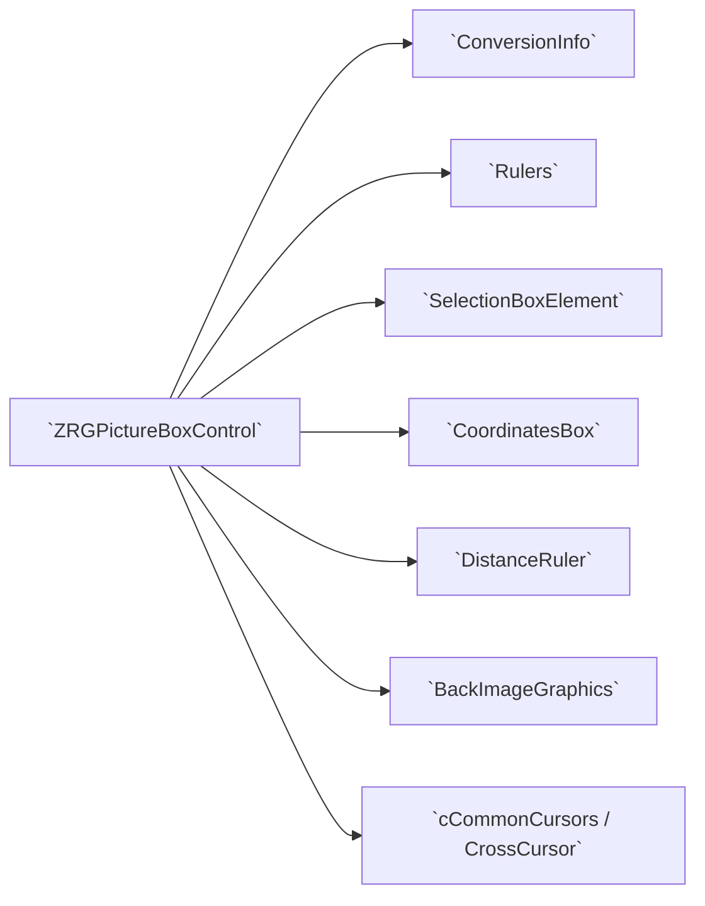

This graph clarifies that `ZRGPictureBoxControl` is the central coordinator; helpers depend on it and on `ConversionInfo` for coordinate transforms.

## 2. File / class structure (regions and main members)

- Constants and pan/zoom tuning: `ZoomMultiplier`, `PanFactorNoShift`, `PanFactorWithShift`.
- Default logical sizes: `DefaultMinLogicalWindowSize`, `DefaultMaxLogicalWindowSize`.
- Default measurement unit constant: `DefaultUnitOfMeasure` (uses `MeasureSystem.enUniMis`).
- Events: multiple `Shadows` events for mouse interactions and several control-specific events:
	- `MouseClick`, `MouseMove`, `MouseDown`, `MouseUp`, `MouseEnter`, `MouseLeave`, `Paint` (shadowed to provide typed sender and logical coord info).
	- `OnMeasureCompleted`, `OnRedrawCompleted`, `OnPictureBoxDoubleClick`, `OnMinimumZoomLevelReached`, `OnMaximumZoomLevelReached`.
	- `OnMeasureUnitChanged`, `OnClickActionChanged`.
- Private variables: internal state including `ConversionInfo` (`myGraphicInfo`), click action, rulers (`myRulers`), selection box, distance ruler, background image state, double-buffer bitmaps, flags for layout/dragging and more.

### Double buffering members

- `myRefreshBackBuffer` — persistent buffer until a `Refresh()` clears it.
- `myRedrawBackBuffer` — persistent buffer until an explicit `Redraw()` or when content requires rebuild.

### Background image members

- Properties and backing fields for image, image position/origin, and `cBackImageGraphics` instance (`myPictureBoxImageGR`) which knows how to draw the background image at the requested pixel-to-logical size.

### Layout and view bounds

- Logical window size, origin and conversion via `ConversionInfo`.
- `myMinLogicalWindowSize`, `myMaxLogicalWindowSize`.

### Flags controlling visibility

- `myShowMouseCoordinates`, `myShowRulers`, `myShowGrid`, and `ShowScrollbars` (via `AutoScroll`).

### Selection, grid, cursors

- `SelectionBoxElement` (`mySelectionBox`) handles selection/zoom box UI and logic.
- Custom cursors via `cCommonCursors` and `CrossCursor` helper.

## 3. Public properties and what they do

Below are the important public properties defined in `ZRGPictureBoxControl.vb` (file-level properties). Each property often reads/writes into `GraphicInfo` or internal fields.

- `ScaleFactor` (Single)
	- Gets/sets `GraphicInfo.ScaleFactor`. The setter enforces logical min/max window size constraints (based on `MinLogicalWindowSize`/`MaxLogicalWindowSize`) and rejects changes that would violate limits.
	
- `LogicalOrigin` (Point)
	- Maps to `GraphicInfo.LogicalOrigin`. The origin of the logical view.
	
- `LogicalCenter` (ReadOnly Point)
	- Computed center point in logical coordinates (origin + width/height/2).
	
- `LogicalWidth`, `LogicalHeight` (Integer)
	- Forwarded to `GraphicInfo.LogicalWidth` and `GraphicInfo.LogicalHeight`.
	
- `LogicalArea` (RECT)
	- Returns the `GraphicInfo.LogicalArea`; private setter mirrors changes into `GraphicInfo`.
	
- `MinLogicalWindowSize`, `MaxLogicalWindowSize` (Size)
	- Constraints that influence scale changes and visible area.

- `GraphicInfo` (ConversionInfo)
  - Main conversion object (exposes methods to convert between physical and logical coordinates and holds `ScaleFactor`, `LogicalOrigin`, and `PhysicalWidth/Height`).
	
- Visual flags/properties
	- `ShowPictureBoxBackgroundImage` (toggle background image rendering), `ShowMouseCoordinates`, `ShowGrid`, `ShowRulers`.
	
- Color properties
	- `BackgroundColor`, `CrossCursorColor` (through `FullCrossCursor.Color`), `ZoomSelectionBoxColor`.
	
- Grid properties
	- `GridView`, `GridStep`, `SmartGridAdjust`.
	
- Input state helpers (Shared ReadOnly properties)
	- `IsShiftKeyPressed`, `IsAltKeyPressed`, `IsCtrlKeyPressed` — check current modifier keys via `Control.ModifierKeys`.
	
- Scrollbar control
	- `ShowScrollbars` wraps `AutoScroll`. Setting this updates scroll state and calls `UpdateScrollbars()` (not shown in this file excerpt) when enabling.
	
- `ClickAction` (enClickAction)
	- Sets the current mouse action mode (e.g., `Zoom`, `MeasureDistance`) and applies behavior side-effects: sets selection box aspect ratio and updates cursor to `ZoomCursor` or `EditCursor`. It raises `OnClickActionChanged`.
	
- `SelectionBox` (ReadOnly)
	- Exposes `SelectionBoxElement` instance to consumers.
	
- `ResizeMode` (ResizeMode)
	- Public property to configure resizing behavior (e.g., `Stretch`).
	
- `IsLayoutSuspended`, `IsDragging`, `IsLoaded`, `ContainsMousePosition` (ReadOnly helpers)
	
- `BorderStyle` (overloaded) — stored in `myBorderStyle` to control painting border style for the control.
	
- `UnitOfMeasure` (MeasureSystem.enUniMis)
	- Controls displayed measurement unit. Changing it raises `OnMeasureUnitChanged` and triggers `Invalidate()` if rulers or coordinates are shown.
	
- `VisibleRect` (ReadOnly RECT)
	- Computed visible logical rectangle, based on `LogicalOrigin` and `LogicalWidth`/`LogicalHeight`.

Additionally, the file defines `ShouldSerialize*` private helper methods to control designer serialization for some properties.

## 4. Events and how to use them

- Input and painting events are shadowed to provide typed sender (`ZRGPictureBoxControl`) and logical coordinates where appropriate (e.g., `MouseClick` event provides `LogicalCoord`). Subscribe to these for interaction integration.
- `OnMeasureCompleted` - raised by `DistanceRuler` when a measurement capture finishes; it provides logical start/end points.
- `OnRedrawCompleted` - raised when an internal redraw completes (useful when caching is in effect).
- `OnMeasureUnitChanged` - emitted when `UnitOfMeasure` changes.
- `OnClickActionChanged` - emitted when the `ClickAction` property is changed.

## 5. Related helper classes and files (collaboration)

- `ConversionInfo.vb` — central conversion utilities for mapping logical <-> physical coordinates. `GraphicInfo` instance of this class is used throughout.
- `PublicTypes.vb` — `RECT`, `SEGMENT`, `GridKind`, `enClickAction`, `ResizeMode` definitions and geometry operations.
- `Rulers.vb` — nested helper for drawing horizontal and vertical rulers, creating scaled numeric labels, caching ruler bitmaps, and computing step intervals. Rulers read `GraphicInfo` and `UnitOfMeasure` to determine tick intervals and numeric formatting.
- `SelectionBoxElement.vb` — manages selection/zoom rectangle, aspect ratio enforcement, drawing and invalidation logic for selection boxes.
- `CoordinatesBox.vb` — draws the floating coordinate box (bottom-right) showing current mouse coordinates and selected units.
- `DistanceRuler.vb` — handles interactive measurement capture (mouse capture, drawing, angle/length formatting) and raises `CaptureFinished`/`OnMeasureCompleted`.
- `BackImageGraphics.vb` — draws the optional background bitmap using a pixel-size (micron per pixel) model.
- `MeasureSys.vb` — unit conversion helpers and human-readable unit strings.
- `Cursors\cCommonCursors.vb` and `Cursors\CrossCursor.vb` implement custom cursors and crosshair drawing.

These helpers are implemented as nested or cooperating classes so that `ZRGPictureBoxControl` stays the single integration point for UI interaction and drawing.

## 6. Key workflows and sequences

Below are the primary runtime flows and how `ZRGPictureBoxControl` coordinates behavior.

1) Initialization / load
	- On create, `ConversionInfo` is initialized with default `ScaleFactor`/physical sizes.
	- `Rulers`, `SelectionBoxElement`, `DistanceRuler` and `CrossCursor` instances are created and bound to the control.
	
2) Setting the background image
	- Assign to the `Image` property. The setter creates `cBackImageGraphics` (`myPictureBoxImageGR`) with configured `ImageCustomOrigin` and pixel size (`BackgroundImagePixelSize_Mic`).
	- `Invalidate()` triggers redraw where the `BackImageGraphics.Draw` is invoked during painting when `ShowPictureBoxBackgroundImage` is true.
	
3) Coordinate conversion (core concept)
	- `GraphicInfo.ScaleFactor` defines how many physical pixels correspond to logical units.
	- To show logical coordinates (e.g., mouse position), call `GraphicInfo.ToLogicalPoint(physicalPoint)`.
	- To place UI elements in physical coordinates based on logical values, call `GraphicInfo.ToPhysicalPoint`/`ToPhysicalRect`.
	
4) Zoom and pan
	- `ScaleFactor` changes are validated against min/max logical window sizes. Changing `ScaleFactor` updates `GraphicInfo` and triggers redraw. Zoom commands typically use `ZoomMultiplier` to calculate new `ScaleFactor`.
	- Panning updates `LogicalOrigin`.
	
5) Paint/redraw double-buffering
	- There are two cached buffers:
		 - `myRefreshBackBuffer`: used across Refresh cycles until `Refresh()` discards it.
		 - `myRedrawBackBuffer`: used until a `Redraw()` or when the content requires rebuilding (e.g., changing the background image or scale).
	- `Rulers` maintain their own cached bitmaps; when `GraphicInfo` changes, `Rulers` mark needs for redraw and reconstruct their bitmaps.
	- On `OnPaint`, cached bitmaps are composed: background image, grid, rulers, selection box, distance ruler overlay, crosshair and coordinates box are drawn in sequence. After painting, `OnRedrawCompleted` can be raised.
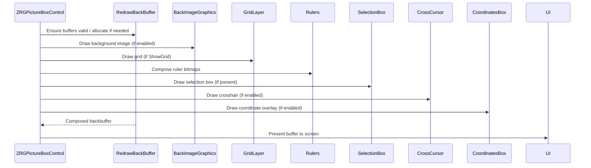

6) Selection / zoom box workflow
	- `ClickAction` set to `Zoom` will make `SelectionBox.KeepAspectRatio = True` and cursor set to `ZoomCursor`.
	- Mouse down stores a logical start point (`myLastMouseDownPoint`) and sets `SelectionBox.TopLeftCorner`.
	- Mouse move updates `SelectionBox.BottomRightCorner` (converted to logical coords) and calls `SelectionBox.Invalidate()` to update the screen region.
	- Mouse up finalizes the rectangle. If selection area is larger than a threshold, compute new `ScaleFactor` and `LogicalOrigin` to fit selected area; otherwise treat as single-click selection.
	
7) Measuring distances
	- `ClickAction = MeasureDistance` switches to measurement mode with `FullCrossCursor` displayed.
	- Interaction leverages `DistanceRuler`: mouse down starts capture, mouse up finishes and `DistanceRuler` raises `CaptureFinished` -> `ZRGPictureBoxControl` maps physical points to logical with `GraphicInfo.ToLogicalPoint` and raises `OnMeasureCompleted` with logical endpoints.
	
8) Rulers
	- `Rulers` compute a base step through `GetRulerStep` using `LogicalWidth`/`LogicalHeight`, numeric digit masks and `MeasureSystem` conversions.
	- Ruler bitmaps are cached and only rebuilt when `GraphicInfo` or size changes.
	
9) Cursor and crosshair
	- `CurrentCursor` property controls the visible cursor, but when `UseWaitCursor` is active, the property prevents changes.
	- `CrossCursor` draws either a small cross or a full-screen crosshair based on `ClickAction`. It uses logical-to-physical mapping to position arms and respects the coordinates box so as not to paint under it.

## 7. Typical usage patterns for integrators

- To embed the control in a form: drop `ZRGPictureBoxControl` on the form and set `UnitOfMeasure` and `BackgroundColor` as needed.
- To programmatically zoom to a rectangle: set `GraphicInfo.LogicalArea` or compute `ScaleFactor` and `LogicalOrigin` to fit an area.
- To respond to user actions: subscribe to `OnMeasureCompleted`, `MouseClick` (typed with logical coords), `OnClickActionChanged`.
- To provide custom context menu: handle the `ShowContextMenuRequired` event or call `RaiseContextMenuRequest` to request it.

## 8. Important implementation notes and edge-cases

- The scale and logical-area validation logic in `ScaleFactor` setter prevents invalid zoom that would expose view outside allowed logical sizes.
- Several methods use `MsgBox` to surface exceptions; consider replacing with logging or throwing for library usage.
- Many classes cache heavy resources (bitmaps, cursors). Their lifecycle should be managed carefully: `Dispose` or finalizer patterns exist in some helpers but not uniformly.

## 9. Cross-file invariants / contracts

- `ConversionInfo` must reflect current `PhysicalWidth`/`PhysicalHeight` (control client size) before painting; other helpers rely on it to compute `ToPhysicalPoint`.
- `Rulers` rely on `MeasureSystem` conversions for unit-aware tick spacing and label formatting.

## 10. Where to look next in the codebase

- `ConversionInfo.vb` — for precise conversion formulas.
- `Rulers.vb` — to understand numeric mask generation and cached ruler bitmaps.
- `SelectionBoxElement.vb` and `CoordinatesBox.vb` — for UI overlay logic.
- `DistanceRuler.vb` — for measurement interaction and display.

---

# 2. ZoomButton (`cZoomButton`) — Documentation

This document describes `cZoomButton` (file: `ZoomButton.vb`). `cZoomButton` is a small UI helper class that binds a set of toolbar/toggle buttons to a `ZRGPictureBoxControl` instance and forwards user actions (toggle grid, rulers, scrollbars, units, load image, zoom fit, zoom mode, measure mode) to the linked control.

## 1. Purpose and responsibilities

- Expose a `LinkedPictureBox` property which is the `ZRGPictureBoxControl` instance controlled by this UI.
- Keep UI state in sync with the linked picture box (`RefreshDisplayButtonState`).
- Handle button clicks and user interactions to change properties on the `LinkedPictureBox` (e.g., `ShowGrid`, `ShowRulers`, `ShowScrollbars`, `UnitOfMeasure`, `ClickAction`).
- Provide an image loader button to attach a background image to the linked control and call `ZoomToDefaultRect()`.

## 2. Key members (behavioural summary)

- `LinkedPictureBox` property
	- Getter / Setter. Setter calls `RefreshDisplayButtonState()` to sync UI toggles with the control.

- Event handlers:
	- `RefreshDisplayButtonState()` — read state from `LinkedPictureBox` and update toggle buttons and pixel-size textbox.
	- `btZoomFit_Click` — calls `LinkedPictureBox.ZoomToFit()`.
	- `btShowGrid_Click` — toggles `LinkedPictureBox.ShowGrid` and invokes `Redraw()`.
	- `btShowRuler_Click` — toggles `LinkedPictureBox.ShowRulers` and invokes `Redraw()`.
	- `btShowScrollBars_Click` — toggles `LinkedPictureBox.ShowScrollbars` and invokes `Redraw()`.
	- `btMeasure_Click` / `btZoom_Click` — set `LinkedPictureBox.ClickAction` to `MeasureDistance` or `Zoom`.
	- `btLoad_Click` — open file dialog, load image and call `LinkedPictureBox.ZoomToDefaultRect()`.
	- Unit radio buttons — set `LinkedPictureBox.UnitOfMeasure` and call `Redraw()`.
	- `tbPixelSizeMic_Click` — prompt user for new pixel size and call `LinkedPictureBox.Redraw(True)`.

## 3. Interaction diagram

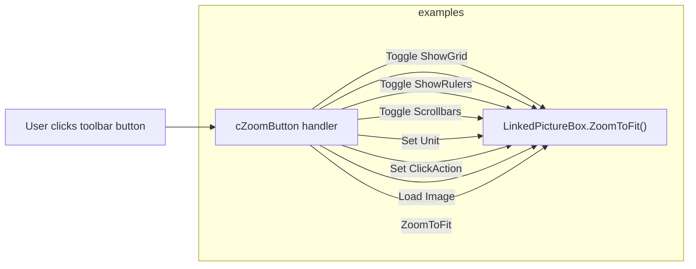

This diagram shows that the `cZoomButton` handlers are thin controllers that call setters or methods on the linked picture box.

## 4. Notes and considerations

- `cZoomButton` depends on `LinkedPictureBox` being non-null for all operations; event handlers guard for null.
- UI state is refreshed after changes to ensure toggles reflect the actual state of the `LinkedPictureBox`.
- Exceptions are surfaced using `MsgBox` in the current implementation; consider replacing with structured logging for library usage.

---

# 3. SelectionBoxElement — Documentation

This document describes `SelectionBoxElement` (file: `SelectionBoxElement.vb`) — the helper class that implements selection and zoom box behavior inside `ZRGPictureBoxControl`.

## 1. Purpose

`SelectionBoxElement` encapsulates creating, updating, drawing and invalidating a selection rectangle used for area selection or zoom-to-area. It handles single-click selection (small area around click) vs area selection, maintains an optional keep-aspect-ratio mode, and converts between logical and physical coordinates when drawing.

## 2. Main fields and properties

- `TopLeftCorner`, `BottomRightCorner` — logical coordinates of the box corners; `RECT.InvalidPoint` used to signal uninitialized state.
- `KeepAspectRatio` (Boolean) — when true the rectangle maintains the control aspect ratio while dragging.
- `LinkedPictureBox` — reference to the containing `ZRGPictureBoxControl`.
- Drawing resources: shared pens and brushes (`myBoxPenAreaSelection`, `myBoxPenSingleClick`, `myBoxBrush`).

- `IsInvalid` (ReadOnly) — returns true when corners are not set.
- `PointSelectAreaSize` (private) — logical size representing the area for single-click selection (derived from 15 physical pixels via `GraphicInfo`).
- `SingleClickRectangle` (private) — `RECT` computed around `TopLeftCorner` for single-click selection.
- `IsCreatedFromSinglePoint` (ReadOnly) — true when the box was created by a single click (bottom right inside single-click rect or corners equal).

## 3. Key methods

- `New(picBox As ZRGPictureBoxControl)` — constructor storing `LinkedPictureBox`.
- `RectFromPoints(first, second) As RECT` — returns a normalized RECT built from two logical points. If `KeepAspectRatio` is set it adjusts the second point to maintain the containing control aspect ratio.
- `Reset()` — clears the box to invalid state.
- `Draw(GR As Graphics, Optional usePhysicalCoords As Boolean = True)` — draws the selection box on the supplied graphics object. When `usePhysicalCoords` is true the logical rect is transformed using `LinkedPictureBox.GraphicInfo.ToPhysicalRect` before drawing. Single-click boxes are drawn as red outline; area selection uses filled translucent brush and black outline.
- `Invalidate()` — invalidates the control region covered by the selection box (converts to physical rect and calls `LinkedPictureBox.Invalidate(r)` with a 1-pixel inflation).

## 4. Lifecycle / interaction flow

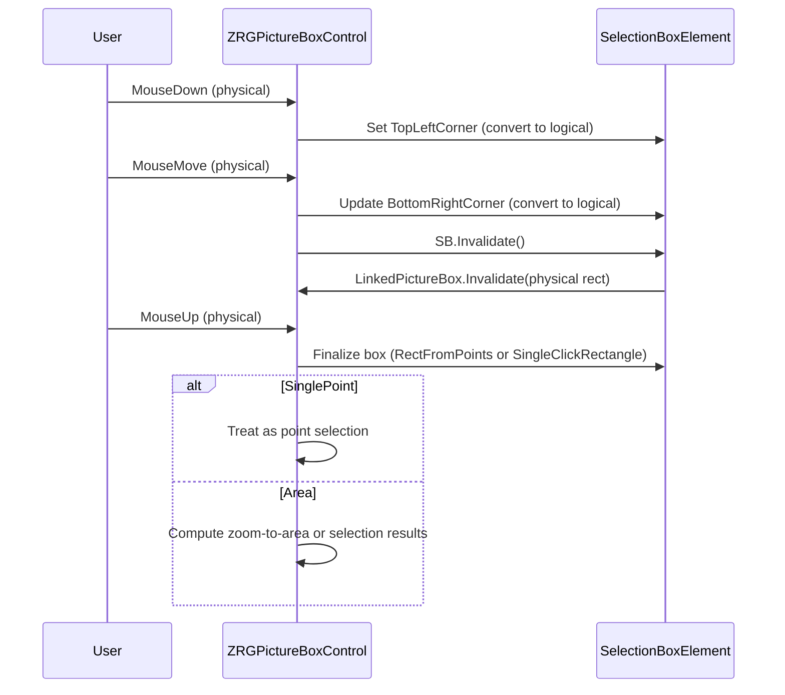

This flow demonstrates how mouse events drive the selection box creation and how `Invalidate()` limits repaint scope for performance.

## 5. Integration notes

- Drawing uses `LinkedPictureBox.GraphicInfo` for logical<->physical conversions; this ensures the box scales correctly across zoom changes.
- `KeepAspectRatio` is used during live dragging to maintain the same aspect ratio as the picture box, which is useful for zooming while preserving view proportions.
- `IsCreatedFromSinglePoint` is an important helper for clients to know whether the user intended a click selection vs an area selection.

---

# 4. CoordinatesBox — Documentation

This document describes `CoordinatesBox` (file: `CoordinatesBox.vb`) — the helper class inside `ZRGPictureBoxControl` that draws the floating coordinates box (bottom-right corner) showing the current mouse position in the selected measurement unit.

---

## 1. Purpose

`CoordinatesBox` is responsible for formatting and drawing a small overlay that displays the current cursor coordinates (or any provided logical coordinate) using the active `UnitOfMeasure`. It computes its drawing rectangle, prevents overlap with scrollbars, and exposes its rectangle via `DrawingRect` so other components (e.g., `CrossCursor`) can avoid drawing over it.

## 2. Key members

- Fields
  - `myPictureBoxControl As ZRGPictureBoxControl` — parent control reference.
  - `myDrawingRect As Rectangle` — computed rectangle (physical coordinates) where the coordinate box is painted.
  - `myLastCoordToDraw As Point` — last logical coordinate drawn.

- Properties
  - `PictureBoxControl` (setter private) — associated parent control.
  - `UnitOfMeasure` (read-only) — convenience accessor to parent `UnitOfMeasure`.
  - `DrawingRect` (read-only) — exposes the current physical rectangle used for display.

- Helpers
  - `UnitOfMeasureFactor` — returns micron-per-unit factor using `MeasureSystem.CustomUnitToMicron(1, UnitOfMeasure)`.
  - `UnitOfMeasureString` — readable unit string from `MeasureSystem.UniMisDescription`.

## 3. Main method: `DrawCoordinateInfo`

Signature: `Public Sub DrawCoordinateInfo(ByVal GR As Graphics, ByVal CoordToDraw As Point, Optional ByVal PixelCoordMode As Boolean = False)`

Behavior:

1. Validates inputs and `CoordToDraw` sentinel values.
2. Stores `myLastCoordToDraw`.
3. Prepares a small font `Arial narrow, 8` and computes `borderSize` based on measuring the underscore character to center vertical padding.
4. Computes conversion factor `_umsf` = `UnitOfMeasureFactor` — if `PixelCoordMode = True`, uses 1 (i.e., show pixels, not units).
5. Formats `textToDraw`:
   - If pixel mode: format with two decimals for X/Y.
   - Else: if `UnitOfMeasure` is `micron`, format as integer (no decimals), otherwise include two decimal places and append the unit string.
6. Measures `textBox` size and updates `myDrawingRect` position anchored to the bottom-right of the `ClientRectangle` (accounts for visible scrollbars by reducing width/height by 1 pixel when `HScroll`/`VScroll` are set).
7. Draws a white background rectangle and black border, then draws the formatted text inside with slight padding.

Notes on invalidation:

- The method keeps an `oldTextBox` static to detect size changes and forces invalidation (caller-level) when the size changes to avoid leaving artifact remnants.

## 4. Usage and integration

- `ZRGPictureBoxControl` invokes `CoordinatesBox.DrawCoordinateInfo` from its paint method when `ShowMouseCoordinates` is enabled and the mouse is over the control. It passes either logical coords converted to physical, or when in pixel mode it passes pixel coords.
- Other helper classes (e.g., `CrossCursor`) consult `CoordinatesBox.DrawingRect` to avoid drawing over the coordinates overlay.

Mermaid sequence (paint integration)

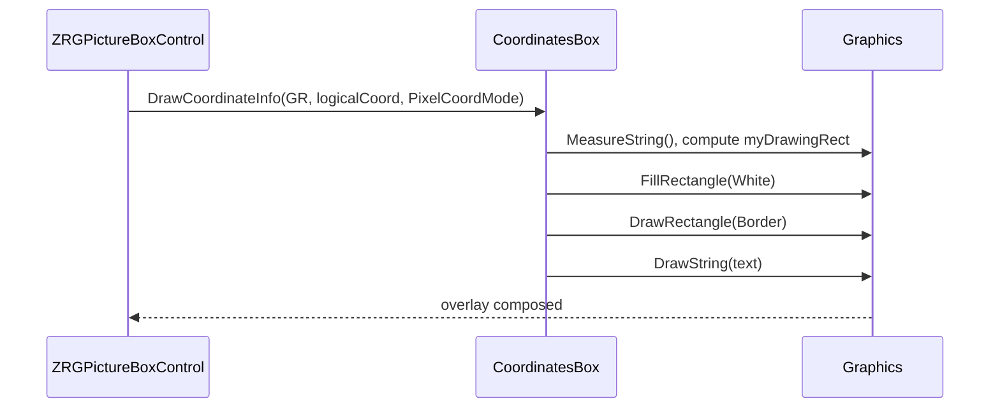

## 5. Implementation notes

- Font is hard-coded to `Arial narrow, 8` as a static allocation. If localization or DPI scaling is needed, consider using control font metrics or scaling the font by `ScaleFactor`.
- `DrawCoordinateInfo` expects `CoordToDraw` values in logical units when `PixelCoordMode=False` and does the unit conversion internally for display; ensure callers pass the expected coordinate space.
- This helper draws directly to the passed `Graphics` without changing transforms; callers should ensure transforms are appropriate when invoked.

---

# 5. MeasureSystem — Documentation

This document describes `MeasureSystem` (file: `MeasureSys.vb`) — a small utility class for unit conversions used by the picture box and helpers.

---

## 1. Purpose

`MeasureSystem` centralizes conversion logic between internal measurement units (micron) and other user-facing units: mm, inches, dmm (decimillimeter?), and meters. It provides formatting helpers and raises a change event when the user unit changes.

## 2. Types and API

- `Public Enum enUniMis` — units supported:
	- `micron` (internal default)
	- `mm` (millimeters)
	- `inches`
	- `dmm` (decimillimeter/centi? represented as 100 micron units)
	- `meters`
> this is need to expand with other units like `cm`, `feet` 

- `Public Shared Event MeasureUnitChanged(ByVal NewUnit As enUniMis)` — raised when `UserUnit` property changes (instance-level property triggers this shared event via setter).
- `Public Property UserUnit As enUniMis` — current user unit; default set to `micron` in constructor.
- Conversion functions (static/shared and instance helpers):
	- `Public Shared Function MicronToCustomUnit(Measure_micron As Double, CustomUnit As enUniMis, Optional Round As Boolean = False) As Double`
		- Converts from micron to given `CustomUnit`. Optional rounding modes are provided for common display precision rules.
- `Public Shared Function MicronToCustomUnit(Measure_micron As Integer, CustomUnit As enUniMis, Optional Round As Boolean = False) As Integer` (Integer overload)
- `Public Function MicronToUserUnit(Measure_micron As Double, Optional Round As Boolean = False) As Double`
	- Uses `UserUnit` to convert.
- `Public Shared Function CustomUnitToMicron(MeasureValue As Double, CustomUnit As enUniMis) As Integer`
	- Convert from custom unit to micron.
- `Public Function UserUnitToMicron(MeasureValue As Double) As Integer`
	- Uses `UserUnit`.
- Helpers:
	- `Public Function UserUnitDescription() As String` — returns a short string label for `UserUnit`.
	- `Public Sub FillComboWithAvailableUnits(cbMeasureUnit As ComboBox)` — populates a ComboBox with unit descriptions and selects the current `UserUnit`.
	- `Public Shared Function UniMisDescription(UNIT As enUniMis) As String` — static mapping to unit strings (`"inches"`, `"micron"`, `"mm"`, `"m"`, `"dmm"`).

## 3. Behavior and rounding rules

- Rounding behaviors in `MicronToCustomUnit` use heuristics to produce sensible display precision:
  - `inches` rounding uses two decimal places (inch/100) when `Round=True`.
  - `mm` rounding uses one decimal place (mm/10) when `Round=True`.
  - `meters` rounding uses one decimal place when `Round=True`.
  - `dmm` rounding truncates to integer units.

- `CustomUnitToMicron` multiplies user units by scalars: `inches` -> 25400, `mm` -> 1000, `meters` -> 1_000_000, `dmm` -> 100, `micron` -> 1.

## 4. Interaction with the rest of the control

- `Rulers` and `CoordinatesBox` use `MeasureSystem.CustomUnitToMicron` and `MicronToCustomUnit` to convert internal micron values into displayed numbers and to pick appropriate tick spacing.
- The picture box raises `OnMeasureUnitChanged` when its `UnitOfMeasure` property changes; `Rulers` subscribe and mark their bitmaps for redraw.

## 5. Mermaid: simple conversion flow

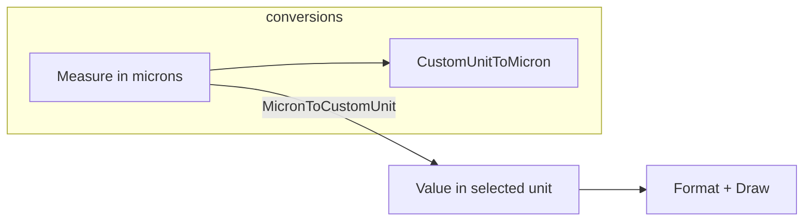

## 6. Implementation notes

- Constructor sets default `UserUnit = micron`.
- `UserUnit` setter raises `MeasureUnitChanged` when changed.
- Current implementation uses `MsgBox` in exception catches; consider structured logging for non-interactive usage.

---

# 6. Rulers — Documentation

This document describes the private nested `Rulers` class inside `ZRGPictureBoxControl` (file: `Rulers.vb`). The `Rulers` class renders the horizontal and vertical rulers, computes tick steps and labels, caches ruler bitmaps and exposes small helper functions for drag-lines and origin icons.

---

## 1. Purpose

**`Rulers`** provides:
- Horizontal and vertical ruler bitmap generation and caching.
- Label rendering using a compact digit mask generator (`DrawNumberBitmap`).
- Computation of a unit-aware tick step (`GetRulerStep`).
- Drag-line rendering helpers for ruler-based drag operations.

It is tightly coupled to `ZRGPictureBoxControl` and reads view state from `PictureBoxControl.GraphicInfo`, `UnitOfMeasure` and `ScaleFactor`.

## 2. Main responsibilities & members

- **`DrawNumberBitmap`** (nested private class)
	- Implements digit stroke templates (6-pixel wide digit masks).
	- Builds segment lists for each printable digit and sign and draws scaled numbers into a `Graphics` with `DrawScaledNumber`.
- **Cached bitmaps**
	- `myHRulerBmp` — bitmap for horizontal ruler.
	- `myVRulerBmp` — bitmap for vertical ruler.
	- `myOriginBmp` / `myOriginBmpSnapped` — little icons for origin.
- **Shared pens and brushes**
	- `RulerPen`, `myDragPen`, and other color resources.
- **Redraw flags**
	- `NeedsHorizontalRedraw`, `NeedsVerticalRedraw` and `myLastGraphicInfo` to detect when to rebuild cached bitmaps.

## 3. Important methods

- `RedrawHorizontalRuler()` / `RedrawVerticalRuler()`
	- Create a `Graphics` context of the ruler bitmap (via `PictureBoxControl.GetScaledGraphicObject(bitmap)`).
	- Clear background and draw ticks and numbers using `digitMaskCreator.DrawScaledNumber`.
	- Update `NeedsHorizontalRedraw` / `NeedsVerticalRedraw` flags.
- `GetRulerStep()`
	- Determines the appropriate tick spacing (in microns or inches) using `CalculateBaseStep` and rounding to friendly series (1,2,5 × powers of 10).
- `CheckHorizontalRulerBitmap()` / `CheckVerticalRulerBitmap()`
	- Ensure bitmaps are allocated with stable sizes (rounded to 100px) and set redraw flags when replacement occurs.
- `Draw(GR As Graphics)`
	- Main public draw method invoked by the parent control. It ensures bitmaps are up-to-date, draws cached bitmaps, and paints origin icon. It temporarily resets transforms (saves/restores Graphics state).
- `DrawHorizontalDragDropLine` / `DrawVerticalDragDropLine`
	- Utility methods to draw dashed drag-lines at a physical coordinate derived from logical values.

## 4. Algorithms and details

- **Numeric label drawing**
	- `DrawNumberBitmap` stores stroke templates for digits and punctuation. `DrawScaledNumber` converts the stroke templates to logical positions using current `ScaleFactor` and issues `DrawLines` calls.
- **Step selection**
	- `GetRulerStep()` computes a base step from available space and estimated label pixel widths, applies `FreeSpaceFactor` (1.75) and selects a rounded value among series of 1,2,5 × 10^n (and scales for inches using baseUnit = 25400 microns).
- **Ruler bitmap sizing**
	- Bitmaps are created with width/height rounded up to the next 100 pixels to reduce frequent allocations during live resize.

## 5. Interactions and sequence (redraw flow)

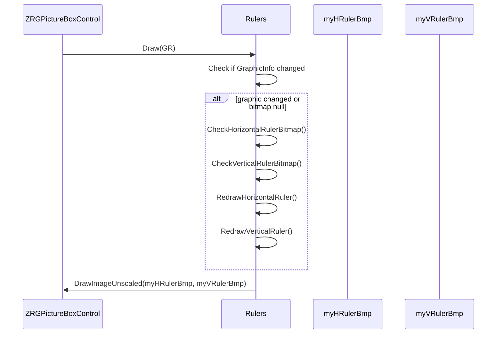

This sequence shows cache validation -> optional redraw -> draw to target Graphics.

## 6. Integration notes & edge cases

- **`Rulers`** relies on **`PictureBoxControl.GraphicInfo`** that must be synchronized with control `ClientSize` and scale before calling `Draw`.
- **Bitmap** allocation uses large rounding to reduce churn; memory use may be significant for very large control sizes.
- **`DrawNumberBitmap`** uses integer templates — numeric labels are drawn as polylines; this keeps dependency on fonts low and yields stable visual appearance independent of GDI font rendering variability.
- Exceptions use `MsgBox` in current code; for library usage replace with logging or rethrow.

---

# 7. DistanceRuler — Documentation

This document describes `DistanceRuler` (file: `DistanceRuler.vb`) — a helper class that implements interactive distance capture inside `ZRGPictureBoxControl`.

---

## 1. Purpose

`DistanceRuler` enables the user to draw a line between two points on the control to measure distance and angle. It implements mouse capture, painting of the temporary measurement (including arc showing angle and overlay label with length and angle) and raises a `CaptureFinished` event when the measurement completes.

## 2. Public types

- `CaptureEventArgs` — simple EventArgs-derived type that exposes `StartPoint` and `EndPoint` (physical coordinates passed from mouse events).
- `Public Event CaptureFinished(ByVal sender As Object, ByVal e As CaptureEventArgs)` — raised on mouse up to signal completion.

## 3. Main members

- State
  - `_mouseCaptured` — indicates active capture.
  - `_origin` and `_last` — points (physical coordinates) tracking start and current end.
  - `_angle`, `_length` — computed angle/length values.

- Appearance
  - `_lineWidth`, `_compArray` (compound pen array), `ForeColor` and `BackColor` proxy to `PictureBoxControl` properties.

- `PictureBoxControl` — reference to the containing `ZRGPictureBoxControl` used for unit conversions and invalidation.

## 4. Core methods and behavior

- Constructor `New(pictureBox As ZRGPictureBoxControl)`
  - Requires a non-null `pictureBox` reference.

- Mouse handlers
  - `MouseDown(sender, e)` — starts capture, stores `_origin` = e.Location and sets `_mouseCaptured = True`.
  - `MouseMove(sender, e)` — while `_mouseCaptured`, updates `_last` and may cause invalidation (current code primarily updates internal state).
  - `MouseUp(sender, e)` — ends capture, sets `_mouseCaptured = False`, calls `myPictureBoxControl.Invalidate()` and raises `CaptureFinished` with the captured start/end physical points.

- `Painting(GR As Graphics, Optional ScaleFactor As Double = 1.0)`
  - If `_mouseCaptured` is false, returns immediately.
  - Computes segment direction (via `SEGMENT.SegmentDirection()`), converts to degrees and normalizes angle.
  - Computes scaled length using `LineLength` and unit conversion factors: `Scale = PictureBoxControl.ScaleFactor * UnitOfMeasureFactor` and formats a label `"length (angle°)"`.
  - Draws origin cross, arc, line, and a rotated text label centered on segment midpoint.

- Utility helpers
  - `CvRadToDeg(RadAngle)` — converts radians to degrees.
  - `CutDecimals` / `strCutDecimals` — rounding helpers for label formatting.
  - `NormalizeRect` — utility to make a rectangle from two points.
  - `LineLength` — computes Euclidean length (scaled) between two points.
  - `Angle` — computes angle in degrees from two points.

## 5. Interaction flow

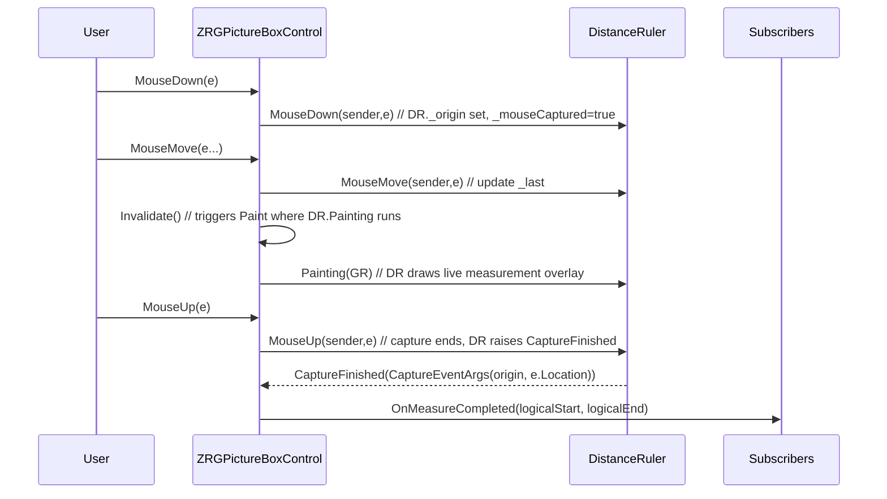

This sequence shows how `DistanceRuler` is driven by `ZRGPictureBoxControl` mouse events and how it paints a live overlay while capturing.

## 6. Units and scaling

- The length displayed is scaled by `ScaleFactor` and `MeasureSystem` unit conversions.
- `UnitOfMeasureFactor` converts the dimensionless internal units to the user unit for the label.

## 7. Integration notes and recommendations

- `DistanceRuler` expects the host control to call its `Painting` method from the control paint loop when the capture is active. In the current design it is attached to the parent control and `ZRGPictureBoxControl` calls `DistanceRuler.Painting`.
- The `CaptureFinished` event passes physical points; the host typically converts them to logical coordinates using `GraphicInfo.ToLogicalPoint` before raising `OnMeasureCompleted`.
- Consider replacing `MsgBox` usage with structured logging or throwing exceptions for library usage.
- The angle computation uses `Math.Atan((p1.Y - p2.Y) / (p1.X - p2.X))` which may produce division-by-zero if p1.X == p2.X; the code currently handles vertical/horizontal corner cases earlier in `SEGMENT.SegmentDirection` for more robust behavior; nevertheless, verify angle computation edge cases when refactoring.

---


# 8. ConversionInfo — Documentation

This document describes `ConversionInfo` (file: `ConversionInfo.vb`) — the core conversion helper used by `ZRGPictureBoxControl` to map between physical pixel coordinates and logical coordinates and to maintain view state (scale and logical origin).

---

## 1. Purpose

`ConversionInfo` centralizes the following responsibilities:

- Store physical viewport dimensions (`PhysicalWidth`, `PhysicalHeight`).
- Maintain `ScaleFactor` linking physical pixels to logical units.
- Store `LogicalOrigin` (top-left logical point currently displayed).
- Provide conversion methods between physical and logical coordinates and dimensions.
- Provide convenience operations like `Clone()` and `CopyParamsFrom()`.

## 2. Properties and behavior

- `PhysicalWidth`, `PhysicalHeight` (Integer) — expected to reflect the control's client area size in pixels.
- `ScaleFactor` (Single) — positive scale value where:
	- Logical size = Physical size / ScaleFactor
	- Setter ensures `myScaleFactor` is positive (`Math.Abs`) and guards against NaN/Infinity by normalizing to 1.
	
- `LogicalWidth`, `LogicalHeight` (Integer) — computed properties:
	- `Get` returns `PhysicalWidth / ScaleFactor` (asserts ScaleFactor != 0).
	- `Set` updates `ScaleFactor = PhysicalWidth / Value` (if Value != 0).
	
- `LogicalArea` (RECT) — composes `LogicalOrigin`, `LogicalWidth`, and `LogicalHeight` into a `RECT` for convenience. Setter updates `LogicalOrigin` and `LogicalWidth`/`LogicalHeight`.
	
- Operators \`=\` and \`<>\` compare `PhysicalWidth`, `PhysicalHeight`, `ScaleFactor`, and `LogicalOrigin`.

## 3. Conversion methods

- Physical -> Logical
	- `ToLogicalCoordX(PhysicalCoordX As Single) As Single` -> returns `PhysicalCoordX / ScaleFactor + LogicalOrigin.X`.
	- `ToLogicalCoordY(PhysicalCoordY As Single) As Single` -> returns `PhysicalCoordY / ScaleFactor + LogicalOrigin.Y`.
	- `ToLogicalDimension(dimension As Single) As Single` -> `dimension / ScaleFactor` (size invariant to origin).
	- `ToLogicalPoint(PhysicalPoint As Point) As Point` and overload `(X as Integer, Y as Integer)`.
	
- Logical -> Physical
	- `ToPhysicalCoordX(LogicalCoordX As Single) As Single` -> `(LogicalCoordX - LogicalOrigin.X) * ScaleFactor`.
	- `ToPhysicalCoordY(LogicalCoordY As Single) As Single` -> `(LogicalCoordY - LogicalOrigin.Y) * ScaleFactor`.
	- `ToPhysicalDimension(dimension As Single) As Single` -> `dimension * ScaleFactor`.
	- `ToPhysicalPoint(LogicalPoint As Point) As Point`.
	- `ToPhysicalRect(LogicalRect As RECT) As RECT` -> maps each corner through `ToPhysicalCoordX/Y`.
	
Notes:
- Most methods are wrapped in try/catch and call `MsgBox` on exceptions; consider removing UI-based error reporting for a library and prefer throws or logging.

## 4. Dot / DPI helper

- `DotToMicron(BitmapDPI As Integer) As Single` — converts bitmap DPI to micron per pixel using formula `1 / ((BitmapDPI / 25.4) / 1000)`.

## 5. Clone / copy

- `Clone()` returns a new `ConversionInfo` with copied parameters via `CopyParamsFrom`.
- `CopyParamsFrom(info As ConversionInfo)` copies `PhysicalWidth`, `PhysicalHeight`, `ScaleFactor`, and `LogicalOrigin`.

## 6. Mermaid: conversions and usage

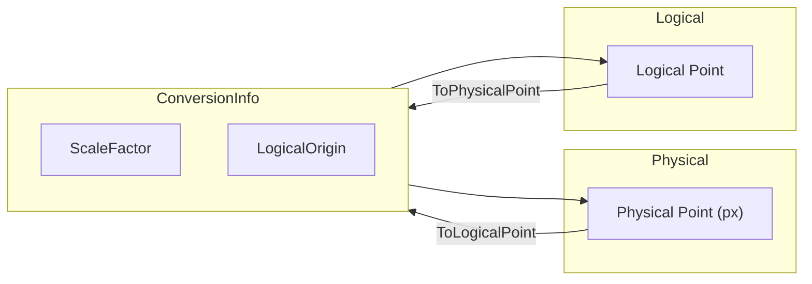

## 7. Integration notes

- `ConversionInfo` is central to correct rendering: host control must keep `PhysicalWidth` and `PhysicalHeight` synchronized with control client size before painting.
- When changing `ScaleFactor` or `LogicalOrigin`, call control `Invalidate()`/`Redraw()` as appropriate to update caches and bitmaps used by helpers (rulers, selection box, etc.).
- Equality operator is used by `Rulers` to detect when the drawing cache needs rebuild (`myLastGraphicInfo <> PictureBoxControl.GraphicInfo`).

## 8. Recommendations

- Avoid UI dialogs (`MsgBox`) inside conversion helpers. Throw or log on exceptional states.
- Consider making `ToPhysicalPoint`/`ToLogicalPoint` accept floating-point `PointF` to preserve sub-pixel precision for high DPI scenarios; current integer rounding may reduce precision on small-scale zoom.

---

# 9. BackImageGraphics — Documentation

This document describes `cBackImageGraphics` and the `enBitmapOriginPosition` enum (file: `BackImageGraphics.vb`). `cBackImageGraphics` provides a tiny helper to render a background bitmap into the picture-box logical space using a configurable pixel-to-logical size.

---

## 1. Types

- `enBitmapOriginPosition`
	- `TopLeft` — image origin placed at the given origin point.
	- `Custom` — reserved for custom origin behaviour (the implementation currently stores the enum but drawing uses the given Origin coordinates).
- `cBackImageGraphics` — helper class to draw an image aligned to a logical origin and scaled by pixel-size parameters.

## 2. Responsibilities

- Store a reference to a source `Bitmap` and a drawing origin (`Origin`).
- Maintain pixel-size parameters `PixelWidth` and `PixelHeight` (micron-per-pixel or similar scale factor in the host code) used to scale the image when drawing.
- Provide `Draw(Graphics)` to render the bitmap at the requested origin and size.
- `Dispose()` to free the underlying `Bitmap` resource.

## 3. Key fields and constructor

- `Friend Origin As Point` — image placement origin in the host coordinate space.
- `Private BitmapImage As Bitmap` — the bitmap to draw.
- `Private BitmapOrigin As enBitmapOriginPosition` — chosen origin mode.
- `Private PixelWidth As Double, PixelHeight As Double` — scale factors for width/height.

Constructor signature:

`Public Sub New(ByVal BitmapImg As Bitmap, ByVal OriginX As Integer, ByVal OriginY As Integer, ByVal OriginPosition As enBitmapOriginPosition, ByVal Pixel_Width As Double, ByVal Pixel_Height As Double)`

Behavior:
- Stores `BitmapImage`, `Origin`, `BitmapOrigin`, `PixelWidth` and `PixelHeight`.
- Ensures minimum pixel dimensions (10) to avoid tiny scaling (clamps values below 10 to 10).

## 4. Draw method

`Public Sub Draw(ByVal GR As Graphics)`

- If `BitmapImage` is Nothing, returns.
- Calls `GR.DrawImage(BitmapImage, New Rectangle(Origin.X, Origin.Y, BitmapImage.Width * PixelWidth, BitmapImage.Height * PixelWidth), 0, 0, BitmapImage.Width, BitmapImage.Height, GraphicsUnit.Pixel)` to draw the scaled image.

Notes:
- The call uses `PixelWidth` for both width and height multiplication; if `PixelHeight` was intended to differ this is a likely bug/typo in the original implementation — verify intended behaviour and correct to use `PixelHeight` for the height multiplication if necessary.

## 5. Dispose / lifecycle

- `Dispose()` attempts to `Dispose()` the `BitmapImage` and set it to `Nothing`.
- The host `ZRGPictureBoxControl` sets `myPictureBoxImageGR` when the `Image` property is set; callers should call `Dispose()` when replacing/removing the background image to free memory.

## 6. Integration and usage

- Instantiate `cBackImageGraphics` when a background image is set on the picture box with an origin and desired pixel-size.
- During `OnPaint`, the host should call `myPictureBoxImageGR.Draw(graphics)` to render the background before drawing overlays (grid, rulers, selection box, etc.).

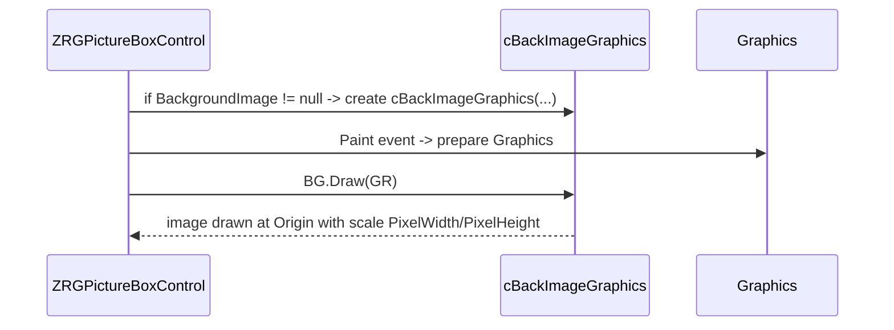

## 7. Recommendations

- Consider using `PixelHeight` in the `Draw` call for the height scaling if non-square pixel size is supported.
- Wrap `BitmapImage` handling in safe disposal patterns at host level to avoid resource leaks and GDI handle exhaustion.
- Avoid `MsgBox` in library helpers; prefer exceptions or logging for diagnostics.

---

# 10. CrossCursor — Documentation

This document describes `CrossCursor` (file: `Cursors\CrossCursor.vb`) — the helper class inside `ZRGPictureBoxControl` that renders a crosshair cursor overlay on the picture-box surface.

---

## 1. Purpose

`CrossCursor` draws a crosshair centered at a logical coordinate. It supports both a compact cross (local arms of configurable size) and a full-picture-box cross (full-width/height lines) used for precise measurement and edit modes. It coordinates with `CoordinatesBox` to avoid drawing over the coordinate overlay.

## 2. Key fields and properties

- `myPictureBox As ZRGPictureBoxControl` — parent control reference.
- `mySize As Size` — cross size when not full-screen; default `DefaultSize = 20x20`.
- `myFullPictureBoxCross As Boolean` — when true, draw full-width and full-height crosshair lines across the control.
- `myColor As Color` — pen color used to draw crosshair lines.
- `myCrossPosition As Point` — the logical coordinate where the crosshair is drawn (`RECT.InvalidPoint` when unset).
- `myLastCross*Point` — cached physical end points for the last drawn cross (top/left/right/bottom) to allow optimized redraws or hit checks.
- `myCoordinatesBox As CoordinatesBox` — optional reference to avoid drawing the cross over the coordinate overlay.

Properties:

- `PictureBoxControl` (read-only) — parent control.
- `Size` — get/set cross size.
- `Color` — get/set cross color.
- `CoordinatesBox` — link to the coordinates overlay so `CrossCursor` does not draw on it.
- `CrossPosition` — logical coordinate for cross drawing; `ResetCrossPosition()` clears it.

## 3. Drawing logic

`DrawCross(GR As Graphics, LogicalCoord As Point)` performs the following steps:

1. Validate parent and logical coordinate.
2. Convert logical coordinate to physical coordinate using `PictureBoxControl.GraphicInfo.ToPhysicalPoint(LogicalCoord)`.
3. Determine drawing bounds (min = 0,0; max = control width/height) and adjust to avoid `CoordinatesBox.DrawingRect` if present:
	- If not full-screen and the cross center lies inside the coordinates box, do not draw.
	- Otherwise shrink maximum extents to leave space for the coordinates box so lines do not overlap it.
4. Compute physical end points depending on `myFullPictureBoxCross`:
	- Full-screen: left = 0, right = control width; top = 0, bottom = control height; both lines cross at physicalCrossCoords.
	- Compact: arms extend half `mySize` from the center.
5. Clamp end points to control bounds.
6. Draw two lines (horizontal and vertical) using a `Pen(myColor)`.

The method carefully clamps coordinates to avoid drawing outside the control area (prevents drawing onto other controls) and respects the coordinates overlay.

## 4. Interaction with other components

- `CoordinatesBox.DrawingRect` is inspected to avoid overlay collisions; `CrossCursor` shortens arms or skips drawing when the cross would overlap the coordinates box.
- `CrossCursor` uses `PictureBoxControl.GraphicInfo` so it renders consistently at all zoom levels.
- `CrossCursor` is typically invoked from the parent's paint routine after underlying layers (background, grid, selection) are drawn, and before mouse overlays are presented.

Mermaid sequence: how cross cursor gets drawn during paint

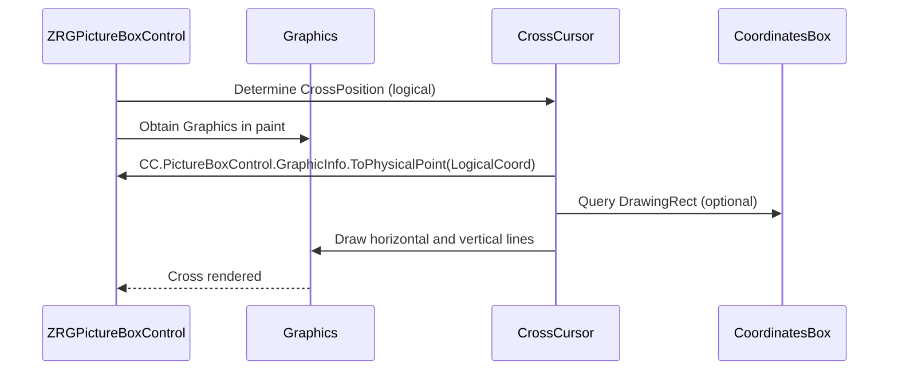

## 5. Usage and lifecycle

- Construct with `New(picPictureBox As ZRGPictureBoxControl)` and the parent stores the instance.
- Set `CrossPosition` when the mouse moves or measurement mode is active; call `PictureBox.Invalidate()` for the region impacted to refresh the cross.
- Use `ResetCrossPosition()` to hide the cross.

## 6. Edge-cases and recommendations

- The code uses integer coordinates; on high DPI or sub-pixel rendering, consider using `PointF` and `Graphics.DrawLine` overloads accepting `Single` for smoother rendering.
- The `CoordinatesBox` exclusion logic is basic and assumes the overlay is anchored at bottom-right; if layout changes, update logic accordingly.
- Current code uses `MsgBox` for exception reporting; for library or headless usage replace with logging or exceptions.

---

# 11. cCommonCursors — Documentation

This document describes `cCommonCursors` (file: `Cursors\cCommonCursors.vb`). The class provides a small helper to load custom cursor bitmaps embedded as resources and expose them as `Cursor` objects for use by the picture-box control.

---

## 1. Purpose

- Load embedded bitmap resources for visual cursors (zoom, edit) and convert them into `System.Windows.Forms.Cursor` instances.
- Cache created cursor helpers to avoid repeated resource allocations.
- Provide `ZoomCursor` and `EditCursor` shared read-only properties to the rest of the application.

## 2. Key implementation details

- Uses P/Invoke to call `DestroyIcon` from `user32.dll` to free icon handles during finalization.
- Constructor `New(CursorType As enCursorType)`:
	- Loads bitmap resource by name (e.g., `"Zoom-32.png"` or `"Edit.png"`) using `LoadBmpRes`.
	- Creates an `Icon` from the bitmap handle: `Icon.FromHandle(bmp.GetHicon)`.
	- Creates a `Cursor` from the `Icon` handle: `New Cursor(myInternalIcon.Handle)`.
	- Stores `myInternalIcon` and `myCustomCursor` on the instance.
	
- `LoadBmpRes(cursorName As String)` scans assembly manifest resource names and returns a `Bitmap` constructed from the resource stream when `EndsWith(cursorName)` matches.
- `Finalize()` attempts to call `DestroyIcon(myInternalIcon.Handle)` to release the native icon handle, then calls `MyBase.Finalize()`.
- Static caching: `myEditCursorHelper` and `myZoomCursorHelper` are stored and returned via static properties `EditCursor` and `ZoomCursor`.

## 3. API

- `Public Shared ReadOnly Property EditCursor As Cursor` — lazy-initializes `myEditCursorHelper` and returns `CustomCursor`. Returns `Cursors.No` on error.
- `Public Shared ReadOnly Property ZoomCursor As Cursor` — lazy-initializes `myZoomCursorHelper` and returns `CustomCursor`. Returns `Cursors.No` on error.

## 4. Sequence / lifecycle diagram

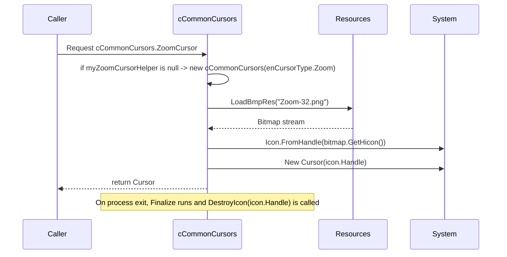

## 5. Notes and caveats

- `Icon.FromHandle` returns an `Icon` that wraps a native `HICON` handle; documentation requires that callers call `DestroyIcon` when they are done with that handle. This class calls `DestroyIcon` in `Finalize`, but `Finalize` timing is non-deterministic. Consider implementing `IDisposable` and providing an explicit `Dispose()` to deterministically free the icon handle when no longer needed.
- `LoadBmpRes` searches resource names via `thisAssembly.GetManifestResourceNames()` and matches `EndsWith(cursorName)`; this is case-sensitive in the code's equality check. If resource naming differs (assembly prefix), the method will still find matching names due to `EndsWith` but be cautious when adding resources.
- The code shows `MsgBox` usage in catch blocks; for library code, prefer structured logging or throwing exceptions.

## 6. Recommendation

- Implement `IDisposable` to dispose `myCustomCursor` and call `DestroyIcon` deterministically.
- Consider embedding .cur/.ico resources instead of bitmaps to avoid icon handle creation via `GetHicon` and potential transparency/hotspot issues.

---

If you want, I can draft a small `IDisposable` upgrade patch to make resource cleanup deterministic (create `Dispose()` that calls `DestroyIcon` and disposes internal cursor/icon).

---

# 12. PublicTypes — Documentation

This document documents `PublicTypes.vb`: small public enums and two core geometric structures (`RECT` and `SEGMENT`) used across the control.

---

## 1. Overview

`PublicTypes.vb` contains:

- Enums: `GridKind`, `enClickAction`, `ResizeMode`.
- `RECT` structure: an integer rectangle type with many helpers (normalization, offset, inflate, conversion, intersection, containment tests, operators and constructors).
- `SEGMENT` structure: represents a line segment with helpers for length and direction.

These low-level types are used by `ZRGPictureBoxControl` and its helpers (rulers, selection box, distance ruler, etc.) for robust geometry operations in logical coordinates.

## 2. Enums

- `GridKind` — visualization mode for grid: `FullLines`, `Points`, `Crosses`.
- `enClickAction` — interaction mode: `None`, `Zoom`, `MeasureDistance`.
- `ResizeMode` — resizing strategy: `Normal`, `Stretch`.

These enums are small and used by public properties and UI controls (e.g., `ClickAction` on the picture box or `GridView`).

## 3. `RECT` structure

`RECT` models an integer rectangle using fields `left`, `top`, `right`, `bottom` (inclusive left/top, exclusive semantics for width/height are computed by `Width`/`Height`).

- Key features:
	- Constructors from `Rectangle`, `RectangleF`, point arrays, points+size, and explicit coords.
	- Conversion operators to/from `System.Drawing.Rectangle` and `RectangleF`.
	- Properties: `X`, `Y`, `Width`, `Height`, `CenterPoint`, `Size`, `TopLeft`, `TopRight`, `BottomRight`, `BottomLeft`, centers, `IsZeroSized`, `IsNonZeroSized`, `IsNormalized`.
	- Normalization helpers: `AssertIfNotNormalized()`, `NormalizeRect()` (swaps coordinates if needed).
	- Mutators: `Offset`, `Inflate` (multiple overloads), `ExpandFromFixedPoint(zoomMultiplier, fixedPoint)`.
	- Containment and intersection: `IsContainedIn`, `Contains` (overloads), `IntersectsWith`, `Intersect`, `Union`, `UnionWithoutZeroSized`, `IntersectWithoutInvalid`.
	- Utility: `ToPointArray()`, `ToRectangle()`, `CoordsBoundaries(coords())`.
	
- Usage notes:
	
	- `RECT.InvalidPoint()` returns a sentinel `Point` with `Integer.MaxValue` used across the codebase for "unset" points.
	- `NormalizeRect()` should be used after constructing a `RECT` from arbitrary points to ensure `left <= right` and `top <= bottom`.
	- `ExpandFromFixedPoint` is useful for zooming rectangles from a fixed focal point.

Mermaid diagram: basic relations and common methods

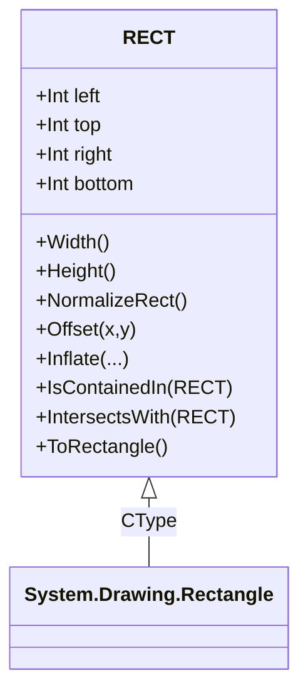

## 4. `SEGMENT` structure

`SEGMENT` represents a 2D segment using integer end points `(X0,Y0)` and `(X1,Y1)` with properties `P0` and `P1`.

Key features:

- Constructors from coordinates, points or copy-construction.
- `ContainsX(x)` — checks whether a vertical projection x falls on the segment's X interval (handles either orientation).
- `MediumPoint()` — midpoint.
- `SegmentModule()` / `SegmentModule(P0,P1)` — Euclidean length.
- `SegmentDirection()` — returns the angle (in radians) of the segment relative to standard mathematical coordinates, with special-case handling for vertical/horizontal segments and quadrant logic to avoid division-by-zero and provide correct signed angle.
- Equality operators \`=\` and \`<>\` comparing endpoints.

Mermaid snippet: usage with DistanceRuler

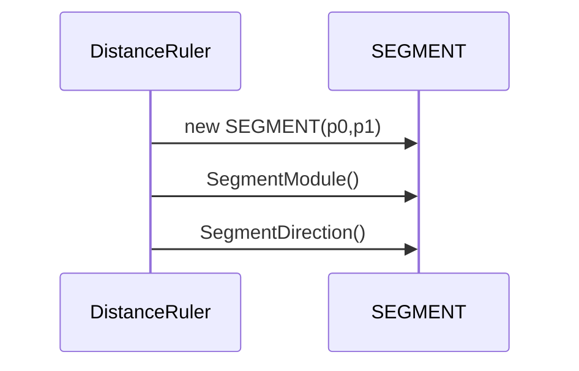

## 5. Implementation notes and caveats

- Many methods use `MsgBox` to surface exceptions. For library use, consider replacing with logging or throwing to the caller.
- `RECT.InvalidPoint()` uses `Integer.MaxValue` sentinel which must be consistently checked by callers.
- `SegmentDirection` performs careful quadrant math; keep tests for edge cases (zero-length segments, vertical/horizontal) if refactoring.

---

# 13. Examples
## 01- ZRGPictureBoxControl

Reference and short usage examples.

- Public API quick example (VB.NET):

```vb
' Assume zpb is a ZRGPictureBoxControl instance on the form
' Subscribe to events
AddHandler zpb.MouseClick, Sub(sender, e)
    ' e provides logical coords (see control docs)
End Sub
AddHandler zpb.OnMeasureCompleted, Sub(startPt, endPt)
    ' startPt and endPt are logical points from measurement
End Sub

' Programmatic zoom to a logical rect
Dim r As New RECT(0,0,10000,8000)
zpb.ShowLogicalWindow(r, CenterWindow:=True)

' Zoom forward/back
zpb.ZoomForwardUsingCenter(New Point(zpb.VisibleRect.CenterPoint.X, zpb.VisibleRect.CenterPoint.Y))
zpb.ZoomBackOnLogicalCenter()

' Toggle UI flags
zpb.ShowGrid = True
zpb.ShowRulers = True
zpb.UnitOfMeasure = MeasureSystem.enUniMis.mm
zpb.Redraw()
```

Mermaid: event flow for a measurement

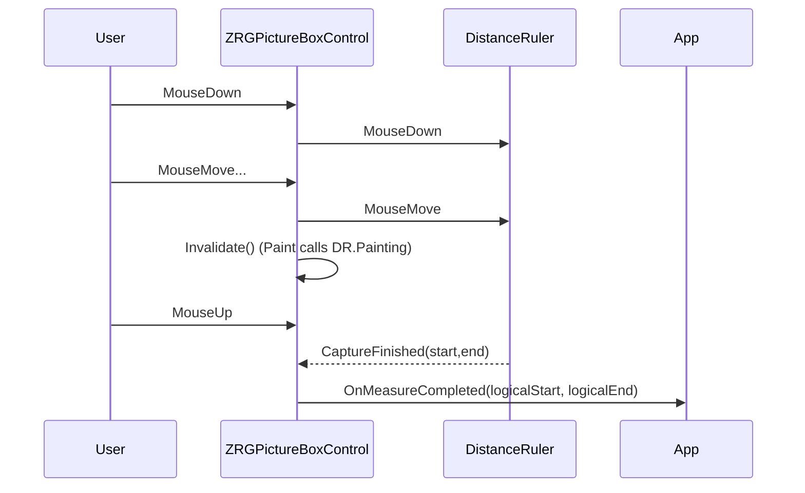

---

## 02-ZoomButton

Mapping of UI elements to `LinkedPictureBox` actions (summary):

- `btViewRulers` -> `LinkedPictureBox.ShowRulers`
- `btViewGrid` -> `LinkedPictureBox.ShowGrid`
- `btViewScrollBars` -> `LinkedPictureBox.ShowScrollbars`
- `btMeasure` -> `LinkedPictureBox.ClickAction = MeasureDistance`
- `btZoom` -> `LinkedPictureBox.ClickAction = Zoom`
- `btZoomFit` -> `LinkedPictureBox.ZoomToFit()`
- `btLoad` -> load image and `LinkedPictureBox.ZoomToDefaultRect()`
- `tbPixelSizeMic` -> `LinkedPictureBox.BackgroundImagePixelSize_Mic`

Example: wire a simple toolstrip button

```vb
Private Sub btnZoomFit_Click(sender As Object, e As EventArgs)
    If myZoomButton.LinkedPictureBox IsNot Nothing Then
        myZoomButton.LinkedPictureBox.ZoomToFit()
    End If
End Sub
```

Mermaid: control -> picturebox interactions

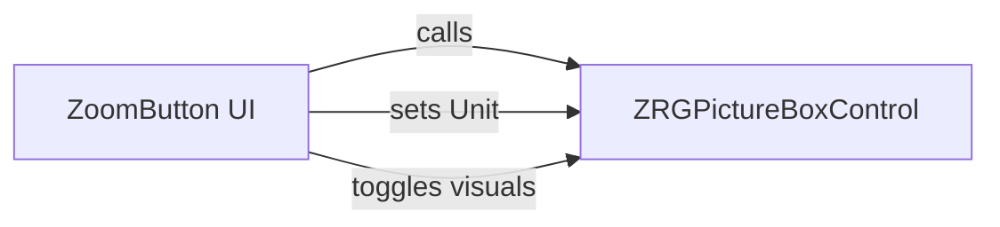

---

## 03-SelectionBoxElement

Short snippet showing typical mouse handling integration in the parent control:

```vb
Protected Overrides Sub OnMouseDown(e As MouseEventArgs)
    If ClickAction = enClickAction.Zoom Then
        Dim logical As Point = GraphicInfo.ToLogicalPoint(e.Location)
        SelectionBox.TopLeftCorner = logical
    End If
End Sub

Protected Overrides Sub OnMouseMove(e As MouseEventArgs)
    If SelectionBox.TopLeftCorner <> RECT.InvalidPoint Then
        SelectionBox.BottomRightCorner = GraphicInfo.ToLogicalPoint(e.Location)
        SelectionBox.Invalidate()
    End If
End Sub

Protected Overrides Sub OnMouseUp(e As MouseEventArgs)
    If Not SelectionBox.IsInvalid Then
        ' finalize: compute rect and zoom
        Dim sel As RECT = SelectionBox
        If Not sel.IsZeroSized Then
            ShowLogicalWindow(sel, CenterWindow:=False)
        End If
        SelectionBox.Reset()
    End If
End Sub
```

Mermaid: selection flow

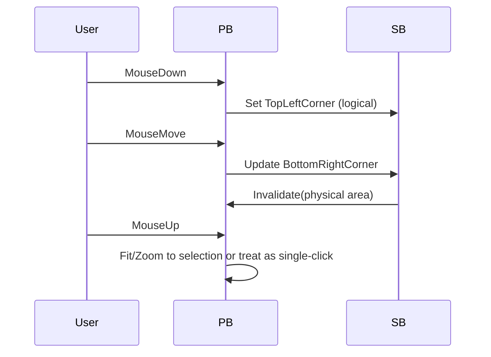

---

## 04-CoordinatesBox

Example: call from `OnPaint` to draw current logical mouse location:

```vb
Protected Overrides Sub OnPaint(e As PaintEventArgs)
    MyBase.OnPaint(e)
    If ShowMouseCoordinates Then
        Dim logicalMouse As Point = GraphicInfo.ToLogicalPoint(Me.PointToClient(Control.MousePosition))
        CoordinatesBox.DrawCoordinateInfo(e.Graphics, logicalMouse, PixelCoordMode:=False)
    End If
End Sub
```

Notes:
- `CoordinatesBox.DrawingRect` can be used by `CrossCursor` to avoid overlap.

---

## 05-MeasureSystem

Simple conversion examples:

```vb
Dim microns As Double = 25400 ' 1 inch in microns
Dim inches As Double = MeasureSystem.MicronToCustomUnit(microns, MeasureSystem.enUniMis.inches)
' inches == 1.0

Dim mm As Double = MeasureSystem.MicronToCustomUnit(2000, MeasureSystem.enUniMis.mm)
' mm == 2

' Convert user input 2 mm to microns
Dim micronsFromMM As Integer = MeasureSystem.CustomUnitToMicron(2, MeasureSystem.enUniMis.mm)
' micronsFromMM == 2000
```

Mermaid: unit conversion flow

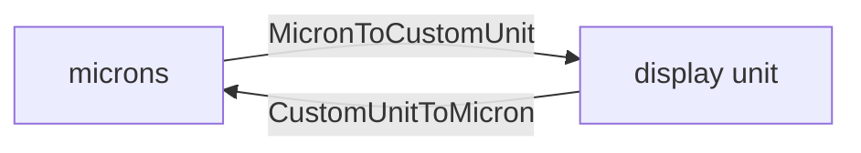

---

## 06-Ruler

Usage: `Rulers.Draw(graphics)` is invoked by the parent paint routine; the `Rulers` class caches bitmaps and rebuilds them when view changes.

- Call `Rulers.GetRulerStep()` to read current tick spacing.
- `Rulers.DrawHorizontalDragDropLine(gr, yLogical)` draws a visual helper line for drag operations.

Example: parent paint compose order (simplified)

```vb
Using g As Graphics = e.Graphics
    ' Draw cached background
    If myPictureBoxImageGR IsNot Nothing Then myPictureBoxImageGR.Draw(g)
    ' Draw grid
    DrawGrid(g)
    ' Draw rulers on top
    myRulers.Draw(g)
End Using
```

---

## 07-DistanceRuler

Wiring example (attach to parent mouse events and paint):

```vb
' In parent initialization
AddHandler myDistanceRuler.CaptureFinished, AddressOf OnDistanceCaptured

Private Sub OnDistanceCaptured(sender As Object, e As CaptureEventArgs)
    Dim startLogical As Point = GraphicInfo.ToLogicalPoint(e.StartPoint)
    Dim endLogical As Point = GraphicInfo.ToLogicalPoint(e.EndPoint)
    RaiseEvent OnMeasureCompleted(startLogical, endLogical)
End Sub

' In OnPaint
If myDistanceRuler IsNot Nothing Then
    myDistanceRuler.Painting(e.Graphics)
End If
```

Sequence diagram included earlier in component docs.

---

## 08-ConversionInfo

Examples converting mouse pixel coords to logical coords and back:

```vbnet
Dim physical As New Point(mouseX, mouseY)
Dim logical As Point = GraphicInfo.ToLogicalPoint(physical)
Dim backPhysical As Point = GraphicInfo.ToPhysicalPoint(logical)
' backPhysical should equal (approximately) original physical coords if scale/origin unchanged
```

Notes: prefer `PointF` support if sub-pixel precision needed.

---

## 09-BackImageGraphics

Example of setting and using the background image from application code:

```vbnet
zpb.Image = Image.FromFile("C:\images\tile.png")
zpb.BackgroundImagePixelSize_Mic = 100 ' micron per pixel
zpb.ImageCustomOrigin = New Point(0,0)
zpb.ShowPictureBoxBackgroundImage = True
zpb.Redraw(True)
```

Mermaid: background draw order shown in `ZRGPictureBoxControl` docs.

---

## 10-CrossCursor

How to update and draw cross cursor on mouse move:

```vbnet
Protected Overrides Sub OnMouseMove(e As MouseEventArgs)
    Dim logical As Point = GraphicInfo.ToLogicalPoint(e.Location)
    FullCrossCursor.CrossPosition = logical
    Invalidate() ' or Invalidate(region around cross)
End Sub

Protected Overrides Sub OnPaint(e As PaintEventArgs)
    MyBase.OnPaint(e)
    FullCrossCursor.DrawCross(e.Graphics)
End Sub
```

---

## 11-cCommonCursors

Suggestion: implement `IDisposable` to deterministically free native icon handles. Current usage exposes shared `EditCursor` and `ZoomCursor` properties which lazy-load resources.

Example IDisposable sketch (not applied):

```vbnet
Public Sub Dispose()
    If myInternalIcon IsNot Nothing Then
        DestroyIcon(myInternalIcon.Handle)
        myInternalIcon = Nothing
    End If
    If myCustomCursor IsNot Nothing Then
        myCustomCursor.Dispose()
        myCustomCursor = Nothing
    End If
End Sub
```

---

## 12-PublicTypes

Quick reference: `RECT` and `SEGMENT` APIs are used for geometry. `RECT.InvalidPoint()` returns sentinel point.

Example: make a `RECT` from points and normalize

```vbnet
Dim r As New RECT(pt1, pt2)
r.NormalizeRect()
If r.IsZeroSized Then Return
```

---

## 13-Extra notes & best practices

- Avoid `MsgBox` in library code; replace with structured logging or rethrow exceptions so calling code can handle them.
- Dispose heavy GDI objects (Bitmaps, Pens, Cursors, Icons) deterministically to avoid handle leaks.
- Prefer `PointF` and floating conversions for high DPI/subpixel accuracy where appropriate.
- Keep paint order stable: Background -> Grid -> Image overlays -> Rulers -> Selection/Measurement overlays -> Cross cursor -> Coordinates box.

<!--If you want, I can generate small focused code snippets or an API table for any one of the numbered items above.-->

---

