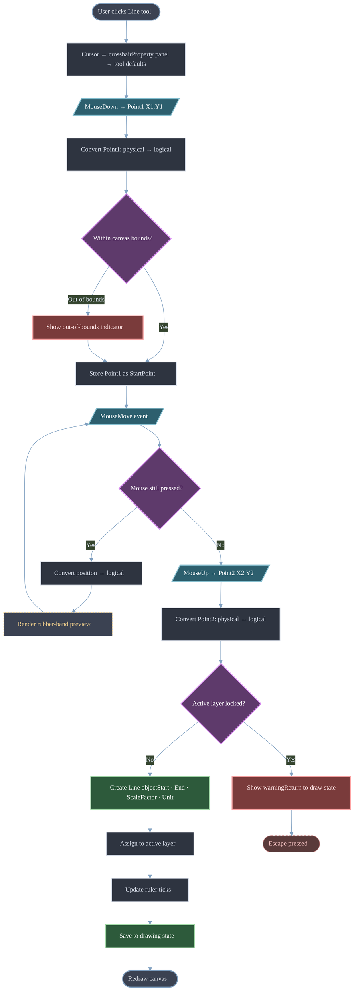
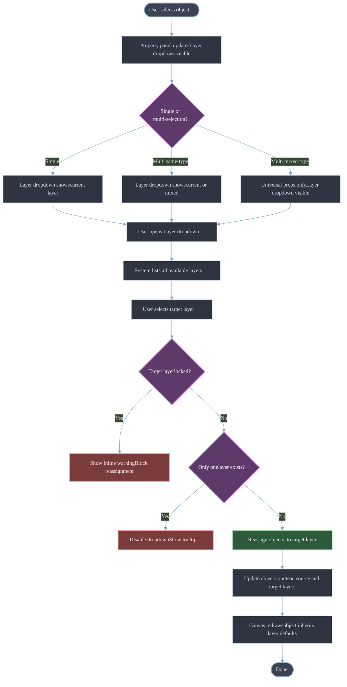
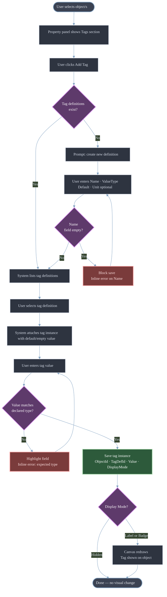
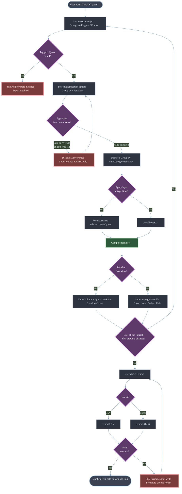
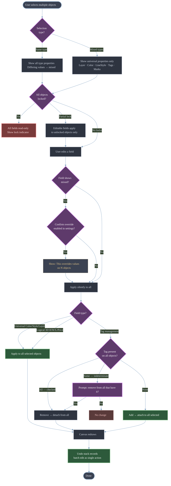
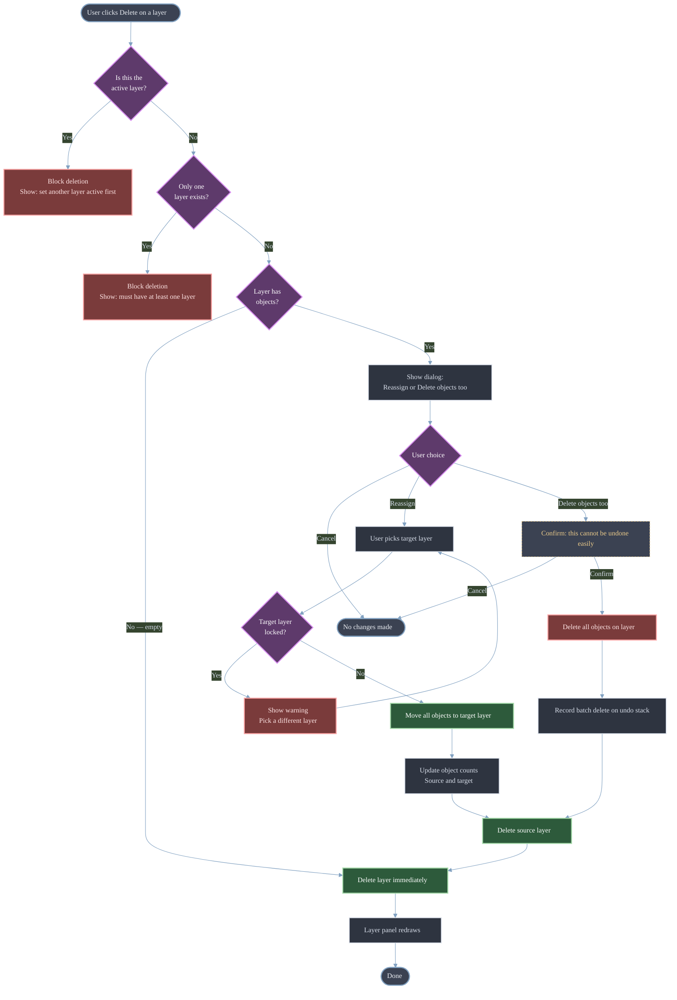
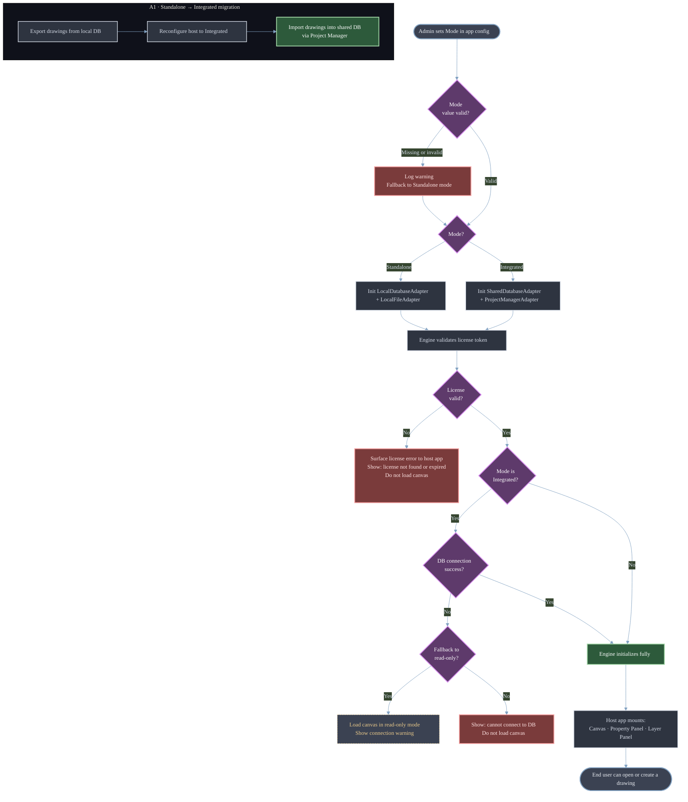

```mermaid
%%{init: {
  'theme': 'base',
  'themeVariables': {
	'background': '#1A1B26',
	'primaryColor': '#2F3545',
	'primaryTextColor': '#D9E0EE',
	'primaryBorderColor': '#414868',
	'lineColor': '#81A1C1',
	'tertiaryColor': '#0F111A',
	'fontSize': '14px',
	'fontFamily': 'Inter, -apple-system, sans-serif'
  },
  'flowchart': {
	'curve': 'basis',
	'padding': 15
  }
}}%%
flowchart TD
classDef terminator fill:#3B4252,stroke:#81A1C1,stroke-width:2px,color:#ECEFF4
classDef process fill:#2E3440,stroke:#D8DEE9,stroke-width:1.5px,color:#D8DEE9
classDef decision fill:#5E3A6B,stroke:#D68BEE,stroke-width:2px,color:#FFFFFF
classDef io fill:#2D5F6E,stroke:#88C0D0,stroke-width:2px,color:#FFFFFF
classDef error fill:#7A3B3B,stroke:#F8A3A3,stroke-width:2px,color:#FFE6E6
classDef preview fill:#3B4252,stroke:#EBCB8B,stroke-dasharray:3,color:#EBCB8B
classDef success fill:#2D5A3B,stroke:#A3D8A8,stroke-width:2px,color:#FFFFFF
classDef cancel fill:#5A3A3A,stroke:#C17E7E,stroke-dasharray:4,color:#F5C2C2

	A([User opens Symbol Library panel]):::terminator
	B{Library<br/>empty?}:::decision
	B1[Show empty state<br/>Prompt: import or create]:::error
	C[System lists symbols by category]:::process
	D{User action}:::decision
	E[User locates symbol]:::process
	F[User selects symbol file]:::io
	G{Valid<br/>format?}:::decision
	G1[Show import error]:::error
	H[Add to project library]:::success
	I[User drags to canvas<br/>or double-clicks to insert]:::process
	J{Set scale/rotation<br/>before placing?}:::decision
	K[User sets Scale X·Y · Rotation<br/>in property panel]:::process
	L[Use defaults: Scale 1,1 · Rotation 0°]:::process
	M[System enters insert mode<br/>Ghost preview on cursor]:::preview
	N{Active layer<br/>locked?}:::decision
	N1[Show warning<br/>Block placement]:::error
	O[User clicks placement point]:::io
	P[Check circular block reference]:::process
	P1[Block · Show error:<br/>cannot contain itself]:::error
	Q[Place symbol instance<br/>at clicked position]:::success
	R[Assign to active layer<br/>Save to drawing state]:::process
	S{Place another<br/>instance?}:::decision
	T[Press Escape to exit insert mode]:::cancel
	U([Canvas redraws]):::terminator

	A --> B
	B -->|Yes| B1
	B1 --> C
	B -->|No| C
	C --> D
	D -->|Browse/Search| E
	D -->|Import from file| F
	F --> G
	G -->|No| G1
	G1 --> D
	G -->|Yes| H
	H --> E
	E --> I
	I --> J
	J -->|Yes| K
	J -->|No| L
	K & L --> M
	M --> N
	N -->|Yes| N1
	N -->|No| O
	O --> P
	P -->|Detected| P1
	P -->|Clear| Q
	Q --> R
	R --> S
	S -->|Yes| M
	S -->|No| T
	T --> U
```

> HTML Page: [[HTML Pages/05_SDLC_Library/Untitled.html|Open HTML Page]]

# ***00 — الحوكمة***

## 0001 — حوكمة دورة حياة تطوير البرمجيات

- **الهدف**: تحديد معايير الوثائق، ودورة حياتها، وملكية الوثائق خلال دورة حياة تطوير البرمجيات.
- **المعايير**  
	- دورة الحياة: مسودة ← قيد المراجعة ← مُعتمد ← مُهمل  
	- الترقيم: رئيسي. ثانوي. تصحيحي (مثال: 1.0.0)  
- وتيرة المراجعة: ربع سنوية أو عند حدوث تغيير جوهري  
- **البيانات الوصفية المطلوبة**  
    
	- المرحلة  
	- المالك  
	- الحالة  
	- الإصدار  
	- آخر تحديث  
	- المراجعون

---

# ***01 — التأسيس***

## 🎯 الهدف

---

تحديد **الرؤية التجارية، ونطاق المنتج، والمستخدمين، ومعايير النجاح** لمنصة CoNSoL وتطبيقها الرئيسي **CoNSoL‑TakeOff**.

يجيب هذا المستند عن:

- ما المشكلة التي نحلّها؟
- ما هو CoNSoL؟
- ما هو CoNSoL‑TakeOff؟
- لمن هذا؟
- ما هو ضمن النطاق مقابل خارج النطاق؟

---

## 🏗️ 1. ما هو CoNSoL؟

ء**CoNSoL (حل الإنشاءات)** هو **منصة إدارة إنشاءات معيارية** مصممة وفق بنية المحور والفروع.

### خصائص المنصة

- **المحرّك الأساسي:** CoNSoL‑Engine
    - التنسيق
    - الخدمات المشتركة
    - الترخيص
    - الاتصال بين الوحدات
- **الوحدة الإلزامية:** CoNSoL‑Project Manager
    - المشاريع
    - الجداول الزمنية
    - التبعيات
    - تخصيص الموارد
- **وحدات اختيارية:**
    - ءCoNSoL‑TakeOff
    - ءCoNSoL‑HR
    - ءCoNSoL‑Docs
    - أخرى (مستقبلاً)

### المبدأ المعماري

> **بعض الوحدات يمكنها العمل بشكل مستقل، بينما تتطلب أخرى المحرّك الأساسي.**

---

## 🧱 2. ما هو CoNSoL‑TakeOff؟

ء**CoNSoL‑TakeOff** هو **أداة حصر وتقدير إنشائية تعتمد على المرئيات أولاً**.

### الفكرة الأساسية

> ✏️ **الرسم ليس زخرفة. الرسم هو إدخال بيانات.**

يقوم المستخدمون **برسم العناصر الإنشائية بصرياً**، وتُعامَل تلك الرسومات على أنها:

- كائنات بيانات
- ذات هندسة
- ذات معنى تجاري
- بكميات وتكاليف قابلة للحساب

---

### القدرات الرئيسية

- رسم عناصر مادية (جدران، بلاطات، غرف، أعمدة)
- إسناد معنى واقعي للأشكال
- ربط الأشكال بـ:
    - المواد
    - الصيغ
    - الأسعار
- الحساب التلقائي لـ:
    - الكميات
    - التكاليف
    - تفصيل المواد

---

### أوضاع النشر

|الوضع|الوصف|
|---|---|
|مستقل|تطبيق سطح مكتب، قاعدة بيانات محلية، ترخيص مستقل|
|متكامل|مُضمَّن داخل CoNSoL‑Engine، قاعدة بيانات مشتركة، ترخيص حزمة|

---

## ❗ 3. بيان المشكلة

### نقاط الألم الحالية

- جداول البيانات اليدوية عرضة للأخطاء
- أدوات CAD منفصلة عن التقدير
- حصر الكميات بطيء وغير متسق
- التغييرات تتطلب إعادة عمل عبر الأدوات

---

### لماذا تفشل الأدوات الحالية

|نوع الأداة|القصور|
|---|---|
|Excel|لا يوجد سياق بصري|
|CAD|لا توجد منطق أعمال|
|برامج التقدير|لا يوجد إدخال رسم مباشر|

---

## ✅ 4. الحل المقترح

يوفّر CoNSoL‑TakeOff:

- ✅ واجهة رسم بصرية
- ✅ كائنات مدفوعة بالبيانات الوصفية
- ✅ حساب كميات لحظي
- ✅ مواد وصيغ مدعومة بقاعدة بيانات
- ✅ تجميع تلقائي للتكاليف

---

## 👥 5. المستخدمون المستهدفون

### المستخدمون الأساسيون

- مقدّرو الإنشاءات
- مهندسو المواقع
- مسّاحو الكميات

### مستخدمون ثانويون

- المعماريون / المصممون
- فرق المشتريات
- مديرو المشاريع

---

## 🔄 6. سير عمل المستخدم عالي المستوى

```
Setup → Draw → Define → Store → Calculate → Report
```

حيث:

- **الرسم** = الهندسة البصرية
- **التعريف** = المعنى التجاري
- **الحساب** = الكميات والتكلفة

---

## 🧩 7. المفاهيم الأساسية

### 7.1 أنماط الأبعاد

|النمط|المعنى|
|---|---|
|D0|عدد|
|D1|طول|
|D2|مساحة|
|D3|حجم|

كل كائن مرسوم يستخدم **نمط أبعاد واحدًا بالضبط**.

---

### 7.2 الكائنات المتداخلة

- أبواب داخل الجدران
- فتحات داخل البلاطات
- النوافذ تُطرَح من مساحة الجدار

---

## 📦 8. النطاق

### ✅ ضمن النطاق (الإصدار 1 / العرض التجريبي)

- لوحة رسم ثنائية الأبعاد
- خصائص ثلاثية الأبعاد منطقية (H × W × L)
- المواد والصيغ
- تقدير التكلفة
- نشر مستقل

---

### ❌ خارج النطاق (الإصدار 1)

- تصيير ثلاثي الأبعاد حقيقي
- تعاون لحظي
- مزامنة سحابية
- رسم بمساعدة الذكاء الاصطناعي (مستقبلاً)

---

## 📊 9. معايير النجاح

### نجاح العرض التجريبي

- يمكن للمستخدم رسم جدار خلال < 5 دقائق
- يعرض النظام الكمية تلقائياً
- يتم توليد تقدير التكلفة
- يوجد ملخص قابل للتصدير

---

### نجاح المنتج

- تقليل زمن التقدير
- أخطاء كميات أقل
- تكرار تصميم أسرع

---

## ⚠️ 10. الافتراضات والقيود

### الافتراضات

- المستخدمون على دراية بمفاهيم الإنشاءات
- الاستخدام على سطح المكتب أولاً
- مستخدم واحد لمرحلة العرض التجريبي

### القيود

- منصة Windows في البداية
- بيئة .NET
- العمل دون اتصال أولاً في الوضع المستقل

---

## 🔗 مستندات ذات صلة

- [0102-التخطيط](https://app.notion.com/p/CoNSoL-Documents-Library-V2/MegaFile/01-Inception/0102-Planning)
- [0201-توثيق التصميم](https://app.notion.com/p/CoNSoL-Documents-Library-V2/MegaFile/02-Design/020101-System%20Context)
- [0208-تصميم تجربة وواجهة المستخدم](https://app.notion.com/p/CoNSoL-Documents-Library-V2/MegaFile/02-Design/0208-UX_UI%20Design)
- ء[0104-SRS](https://app.notion.com/p/CoNSoL-Documents-Library-V2/MegaFile/01-Inception/0104-SRS)

---
> نهاية — تحليل المتطلبات
---
## 🗓️ 0102 — التخطيط

**النوع:** 📋 خطة متجددة

**يملؤها:** مدير المشروع

✅ بنية قياسية (جداول فقط):

### خارطة الطريق

| **المرحلة** | **النطاق** | **المالك** | **الهدف** |
| ----------- | ---------- | ---------- | --------- |
|             |            |            |           |

### المخاطر

| **الخطر** | **الاحتمالية** | **الأثر** | **التخفيف** |
| --------- | -------------- | --------- | ----------- |
|           |                |           |             |

---
> نهاية — التخطيط
---

## 🔗 0103 — تتبع المتطلبات

**النوع:** 📋 سجل

**يملؤها:** ضمان الجودة / مدير المشروع

| **معرّف المتطلب** | **المصدر** | **التصميم** | **الكود** | **الاختبار** |
| ----------------- | ---------- | ----------- | --------- | ------------ |
|                   |            |             |           |              |

**المرحلة:** البدء
**المالك:** المنتج + ضمان الجودة
**الحالة:** مسودة

### **الهدف**
ضمان تتبّع كامل من المتطلبات حتى التسليم.

### **القوالب**

- مصفوفة تتبّع المتطلبات (RTM)
- اصطلاحات معرّف المتطلب

---

## 📘 0104 — مواصفات متطلبات البرمجيات (SRS)

## محرك الرسم CoNSoL‑TakeOff

---

### ضبط المستند

|الحقل|القيمة|
|---|---|
|معرّف المستند|SRS-SCAD-001|
|المنتج|CoNSoL‑TakeOff|
|النطاق|محرك الرسم (مكوّن قابل لإعادة الاستخدام)|
|الحالة|مسودة|

---

## 1. مقدمة

### 1.1 الهدف

يحدد هذا المستند **متطلبات البرمجيات** الخاصة بـ **محرك الرسم CoNSoL‑TakeOff**، وهو مكوّن رسم وحصر ثنائي الأبعاد قابل لإعادة الاستخدام مخصص لتطبيقات سطح المكتب والويب المضيفة.

ويعمل كـ:

- عقد بين المنتج والهندسة
- مرجع لضمان الجودة والتحقق
- خط أساس للتحسينات المستقبلية

---

### 1.2 النطاق

يوفّر محرك الرسم:

- لوحة بصرية ثنائية الأبعاد
- خصائص ثلاثية الأبعاد منطقية (H × W × L)
- أدوات رسم (أشكال، منحنيات، نص، أبعاد، رموز)
- لوحات حساسة للسياق
- إدارة الطبقات
- الوسوم الذكية والعلامات المخصصة
- تجميع الكميات والتسعير

### خارج النطاق (الإصدار 1)

- تصيير ثلاثي الأبعاد حقيقي
- تعاون لحظي
- مزامنة سحابية

---

### 1.3 التعريفات والاختصارات

|المصطلح|التعريف|
|---|---|
|الإحداثيات المنطقية|نظام إحداثيات مدرك للوحدات|
|الإحداثيات الفيزيائية|بكسلات الشاشة|
|الوسم الذكي|بيانات وصفية مرتبطة بالكائنات|
|العلامة المخصصة|علامة بصرية مرتبطة بالكائنات|
|الحصر|استخراج الكميات والتكلفة من الرسومات|

---

## 2. الوصف العام

### 2.1 منظور المنتج

محرك الرسم هو **مكتبة**، وليس تطبيقاً مستقلاً.

ويُستهلَك بواسطة:

- CoNSoL‑TakeOff (مستقل)
- CoNSoL‑Suite (متكامل)

---

### 2.2 بيئة التشغيل

- سطح المكتب: Windows (WPF / WinForms)
- الويب: Blazor / HTML5 Canvas (مستقبلاً)
- بيئة .NET

---

### 2.3 قيود التصميم

- يجب أن يكون المحرك الأساسي محايداً تجاه إطار واجهة المستخدم
- يجب فصل الإحداثيات المنطقية عن الفيزيائية
- يجب تقسيم منطق التحقق:
    - على مستوى البيانات (المحرك)
    - على مستوى واجهة المستخدم (العرض)

---

## 3. أصحاب المصلحة وفئات المستخدمين

|المستخدم|الوصف|
|---|---|
|المصمم|ينشئ الرسومات ويحررها|
|المقدّر|يراجع الكميات والتكاليف|
|مطوّر التطبيق المضيف|يدمج المحرك|
|المشرف|يدير النشر والترخيص|

---

## 4. سياق النظام والنشر

### 4.1 أوضاع النشر

|الوضع|الوصف|
|---|---|
|مستقل|قاعدة بيانات محلية، ملفات محلية|
|متكامل|قاعدة بيانات مشتركة، خدمات الحزمة|

---

## 5. المتطلبات الوظيفية

### 5.1 أدوات الرسم

### الأشكال الأساسية

|المعرّف|المتطلب|
|---|---|
|FR‑DT‑001|يجب أن يسمح النظام برسم خط عبر النقر على البداية/النهاية|
|FR‑DT‑002|يجب أن يدعم النظام الخطوط متعددة المقاطع|
|FR‑DT‑003|يجب أن يدعم النظام رسم المستطيل|
|FR‑DT‑004|يجب أن يدعم النظام رسم الدائرة|
|FR‑DT‑005|يجب أن يدعم النظام رسم القطع الناقص|

---

### المنحنيات

|المعرّف|المتطلب|
|---|---|
|FR‑DT‑010|يجب أن يدعم النظام رسم القوس|
|FR‑DT‑011|يجب أن يدعم النظام رسم المنحنى المرن|
|FR‑DT‑012|يجب أن يدعم النظام منحنيات Bezier|

---

### التعليقات والأبعاد

|المعرّف|المتطلب|
|---|---|
|FR‑DT‑020|يجب أن يدعم النظام النص|
|FR‑DT‑021|يجب أن يدعم النظام النص متعدد الأسطر|
|FR‑DT‑022|يجب أن يدعم النظام أسطر الإشارة|
|FR‑DT‑023|يجب أن يدعم النظام جميع أنواع الأبعاد القياسية|
|FR‑DT‑025|يجب أن يسمح النظام بتجاوز البُعد مع تحذير|

---

### الرموز والبلوكات

|المعرّف|المتطلب|
|---|---|
|FR‑DT‑030|يجب أن يدعم النظام مكتبة رموز|
|FR‑DT‑031|يجب أن تكون الرموز قابلة للإدراج عبر السحب أو النقر المزدوج|
|FR‑DT‑033|يجب منع المراجع الدائرية للبلوكات|

---

### الوسوم الذكية

|المعرّف|المتطلب|
|---|---|
|FR‑DT‑040|يجب أن يعرّف المستخدمون الوسوم الذكية|
|FR‑DT‑041|يجب أن ترتبط الوسوم الذكية بأي كائن|
|FR‑DT‑043|يجب أن تدعم الوسوم التجميع|
|FR‑DT‑045|يجب أن تكون مخرجات التجميع قابلة للتصدير|

---

### العلامات المخصصة

|المعرّف|المتطلب|
|---|---|
|FR‑DT‑050|يجب أن يعرّف المستخدمون العلامات المخصصة|
|FR‑DT‑051|يجب أن تكون العلامات قابلة للربط بالكائنات|
|FR‑DT‑052|يجب أن تكون العلامات قابلة للعدّ|

---

### 5.2 اللوحة ونظام الإحداثيات

|المعرّف|المتطلب|
|---|---|
|FR‑CV‑001|يجب أن تعمل اللوحة بالإحداثيات المنطقية|
|FR‑CV‑004|يجب ألا يغيّر التحريك والتكبير البيانات المنطقية|
|FR‑CV‑007|مطلوب معاينة الشريط المطاطي|

---

### 5.3 لوحة الخصائص

|المعرّف|المتطلب|
|---|---|
|FR‑PP‑001|يجب أن تكون لوحة الخصائص حساسة للسياق|
|FR‑PP‑004|يجب أن تُظهر القيم المختلطة `(mixed)`|
|FR‑PP‑008|يجب أن تظهر حقول الأبعاد الثلاثية المنطقية حيثما ينطبق|

---

### 5.4 لوحة الطبقات

|المعرّف|المتطلب|
|---|---|
|FR‑LP‑001|يجب أن تدعم الطبقات الظهور والقفل والطباعة|
|FR‑LP‑003|يجب أن يطالب حذف طبقة تحتوي على كائنات بإعادة الإسناد|
|FR‑LP‑004|يجب منع حذف الطبقة النشطة|

---

## 6. متطلبات واجهة المستخدم والتفاعل

### 6.1 واجهة المستخدم العامة

- الوضع الفاتح والداكن
- لوحات متجاوبة
- تغذية راجعة فورية للتحقق

---

### 6.2 نموذج تفاعل الأدوات

- MouseDown → البدء
- MouseMove → المعاينة
- MouseUp → التثبيت
- Escape → الإلغاء

---

### 6.3 قواعد التحقق

- منع الأشكال ذات الحجم الصفري
- إبراز الإدخال غير الصالح بشكل مضمّن
- تفضيل التحذيرات غير الحاجبة

---

### 6.4 سلوك التحديد المتعدد

- الحقول المشتركة قابلة للتحرير
- إخفاء الحقول الخاصة بالنوع
- `(mixed)` تحل محل القيم المختلفة

---

## 7. المتطلبات غير الوظيفية

|المعرّف|الفئة|المتطلب|
|---|---|---|
|NFR‑001|الأداء|< 16 مللي ثانية لإعادة الرسم|
|NFR‑004|قابلية النقل|محرك أساسي محايد لواجهة المستخدم|
|NFR‑006|التسلسل|JSON دون فقدان|

---

## 8. معمارية المكوّنات

```
Engine (UI‑free)
├── Drawing Objects
├── Coordinate Service
├── Layer Service
├── Tag & Mark Service
├── Take‑Off Service (optional)
└── Serialization
```

---

## 9. نموذج البيانات (نظرة عامة)

(انظر [020103-Data_Model](https://app.notion.com/p/CoNSoL-Documents-Library-V2/MegaFile/02-Design/020103-Data%20Model) للتعريف الكامل)

---

## **10. حالات الاستخدام**

## UC‑001 — رسم خط على اللوحة

|الحقل|القيمة|
|---|---|
|الفاعل|المصمم|
|الشرط المسبق|يوجد رسم مفتوح؛ توجد طبقة واحدة على الأقل ومضبوطة كنشطة|
|المتطلبات ذات الصلة|FR-DT-001, FR-DT-002, FR-CV-007, FR-CV-008, FR-UI-011, FR-UI-013|
|المُحفِّز|ينقر المستخدم على أداة الخط في صندوق الأدوات|

### مخطط التدفق



### التدفق الرئيسي

1. ينقر المستخدم على أداة **`Line`**
2. يضبط النظام المؤشر إلى `*crosshair*`؛ وتتحوّل لوحة الخصائص إلى افتراضات الأداة
3. ينقر المستخدم على **`Point1`** على اللوحة
4. يحوّل النظام Point1 من الفيزيائية (`px`) إلى ***`*logical coordinates*`**
5. يتحقق النظام من أن **`Point1`** داخل حدود اللوحة
6. يخزّن النظام **`Point1`** كـ `StartPoint`
7. يحرّك المستخدم الفأرة — ويرسم النظام خط **`rubber-band preview`** من `StartPoint` إلى موضع المؤشر الحالي عند كل حدث `MouseMove`
8. ينقر المستخدم على **`Point2`**
9. يحوّل النظام **`Point2`** إلى الإحداثيات المنطقية
10. ينشئ النظام كائن **`Line`** `{ StartPoint, EndPoint, ScaleFactor, Unit }`
11. يُسند النظام الخط إلى **`active layer`**
12. يحدّث النظام **`ruler ticks`** لتعكس الـ **`*geometry*`** الجديدة
13. يحفظ النظام الخط في حالة الرسم (`JSON` / `DB`)
14. تعيد اللوحة الرسم مُظهِرةً الخط الدائم

### التدفقات البديلة

### A1 — وضع الخط متعدد المقاطع

- بعد الخطوة 6، يواصل المستخدم النقر على نقاط إضافية
- يخزّن النظام كل نقرة كنقطة نهاية مقطع جديد ويمدّ الشريط المطاطي من النقطة الأخيرة
- ينقر المستخدم نقراً مزدوجاً أو يضغط **Enter** لتثبيت جميع المقاطع ككائن خط متعدد واحد
- يستمر التدفق من الخطوة 10

### A2 — تفعيل الالتقاط للشبكة / التقاط الكائنات

- عند الخطوة 3 أو الخطوة 8، يلتقط المؤشر أقرب تقاطع شبكة أو نقطة التقاط كائن
- يُستخدم الإحداثي الملتقَط بدلاً من موضع المؤشر الخام
- يستمر التدفق بشكل طبيعي

### A3 — نقطة خارج حدود اللوحة (تحذير دون منع)

- عند الخطوة 5، يكتشف النظام أن Point1 خارج حدود اللوحة المنطقية
- يعرض النظام مؤشر تجاوز الحدود لكنه لا يمنع الإجراء
- يستمر التدفق من الخطوة 6 بالإحداثي المتجاوز للحدود

### تدفقات الاستثناء

### E1 — يضغط المستخدم Escape أثناء الرسم

- في أي لحظة بعد الخطوة 3 وقبل الخطوة 10
- يلغي النظام العملية، ويتجاهل نقطة البداية، ويمسح معاينة الشريط المطاطي
- يعيد النظام المؤشر إلى حالة الخمول؛ ولا يتم إنشاء أي كائن

### E2 — الطبقة النشطة مقفلة

- عند الخطوة 11، يكتشف النظام أن الطبقة النشطة مقفلة
- يعرض النظام تحذيراً مضمّناً: «الطبقة النشطة مقفلة — لا يمكن وضع الكائن»
- لا يُحفظ الكائن؛ ويعود النظام إلى حالة الرسم ليختار المستخدم طبقة مختلفة

### الشرط اللاحق

يوجد كائن خط (أو خط متعدد) في حالة الرسم، ومرئي على اللوحة، ومُسنَد إلى الطبقة النشطة، ومنعكس في عدد كائنات الطبقة.

---

## UC-002 · إسناد كائن إلى طبقة

|الحقل|القيمة|
|---|---|
|الفاعل|المصمم|
|الشرط المسبق|يوجد كائن واحد على الأقل على اللوحة؛ توجد طبقتان على الأقل|
|المتطلبات ذات الصلة|FR-LP-001, FR-PP-007, FR-UI-020|
|المُحفِّز|يختار المستخدم كائناً ويغيّر إسناد طبقته في لوحة الخصائص|

### مخطط التدفق



### التدفق الرئيسي

1. ينقر المستخدم على كائن على اللوحة لتحديده
2. تتحدّث لوحة الخصائص لإظهار خصائص الكائن، بما في ذلك قائمة **Layer** المنسدلة
3. يفتح المستخدم قائمة الطبقات المنسدلة
4. يسرد النظام جميع الطبقات المتاحة (غير المحذوفة)
5. يختار المستخدم الطبقة الهدف
6. يعيد النظام إسناد الكائن إلى الطبقة المحددة
7. يحدّث النظام عدد الكائنات على كل من الطبقة المصدر والطبقة الهدف
8. تعيد اللوحة الرسم — يرث الكائن لون الطبقة الهدف الافتراضي ونمط الخط وسماكة الخط (ما لم يكن للكائن تجاوزات صريحة)

### التدفقات البديلة

### **A1 — تحديد متعدد، نفس النوع**

- يحدّد المستخدم كائنات متعددة (نفس النوع) قبل الخطوة 3
- تُظهر قائمة الطبقات المنسدلة `(mixed)` إذا كانت الكائنات على طبقات مختلفة
- يختار المستخدم الطبقة الهدف — ويعيد النظام إسناد جميع الكائنات المحددة
- تتحدّث أعداد كائنات جميع الطبقات المتأثرة

### **A2 — تحديد متعدد، أنواع مختلطة**

- تُظهر لوحة الخصائص الخصائص العامة فقط بما في ذلك الطبقة
- السلوك مطابق لـ A1 فيما عدا ذلك

### **A3 — الإسناد عبر لوحة الطبقات ("تحديد الكل في الطبقة" + النقل)**

- ينقر المستخدم بزر الفأرة الأيمن على طبقة في لوحة الطبقات → "تحديد جميع الكائنات"
- تصبح جميع الكائنات في تلك الطبقة محددة
- يغيّر المستخدم الطبقة في لوحة الخصائص → تنتقل جميع الكائنات إلى الطبقة الجديدة

### تدفقات الاستثناء

### **E1 — الطبقة الهدف مقفلة**

- عند الخطوة 6، يكتشف النظام أن الطبقة الهدف مقفلة
- يعرض النظام تحذيراً مضمّناً: «الطبقة الهدف مقفلة»
- يُمنع إعادة الإسناد؛ ويُحتفظ بإسناد الطبقة الأصلي

### **E2 — توجد طبقة واحدة فقط**

- عند الخطوة 4، تُظهر القائمة المنسدلة طبقة واحدة فقط
- إعادة الإسناد غير ذات معنى؛ وقد يعطّل النظام القائمة المنسدلة أو يُظهر تلميحاً: «أضف مزيداً من الطبقات لإعادة الإسناد»

### الشرط اللاحق

ينتمي الكائن (أو الكائنات) المحدد إلى الطبقة المختارة. أعداد الكائنات على الطبقات المتأثرة دقيقة. تعكس الخصائص البصرية افتراضات الطبقة الجديدة (ما لم تُتجاوز على مستوى الكائن).

---

## UC-003 · إرفاق وسم ذكي بكائن

|الحقل|القيمة|
|---|---|
|المتطلبات ذات الصلة|FR-DT-040, FR-DT-041, FR-DT-042, VAL-010 (نوع قيمة الوسم)|
|الفاعل|المصمم|
|الشرط المسبق|كائن محدد؛ يوجد تعريف وسم ذكي واحد على الأقل (أو ينشئ المستخدم واحداً مضمّناً)|
|المُحفِّز|يفتح المستخدم قسم الوسوم في لوحة الخصائص ويضيف وسماً|

### مخطط التدفق



### التدفق الرئيسي

1. يحدّد المستخدم كائناً على اللوحة
2. تُظهر لوحة الخصائص قسم **Tags** (مطوي افتراضياً إذا لم تكن هناك وسوم مرفقة)
3. ينقر المستخدم على **Add Tag**
4. يعرض النظام قائمة تعريفات الوسوم الموجودة
5. يختار المستخدم تعريف وسم (مثل `Material: text`)
6. يرفق النظام نسخة وسم بالكائن بقيمة فارغة أو افتراضية
7. يُدخل/يختار المستخدم قيمة الوسم (مثل `"Concrete"`)
8. يتحقق النظام من القيمة وفقاً لنوع القيمة المُعلَن للوسم
9. يحفظ النظام نسخة الوسم: `{ ObjectId, TagDefinitionId, Value, DisplayMode }`
10. إذا كان وضع العرض **Label** أو **Badge**، تعيد اللوحة الرسم مُظهِرةً الوسم على الكائن

### التدفقات البديلة

### A1 — إنشاء تعريف وسم جديد مضمّن

- عند الخطوة 4، ينقر المستخدم على **New Tag Definition**
- يُدخل المستخدم: الاسم، نوع القيمة (text / number / boolean / list)، القيمة الافتراضية، الوحدة (اختياري)
- يحفظ النظام التعريف في مكتبة وسوم المشروع
- يستمر التدفق من الخطوة 5 مع تحديد التعريف الجديد مسبقاً

### A2 — إرفاق نفس الوسم بكائنات متعددة

- يحدّد المستخدم كائنات متعددة قبل الخطوة 3
- يُظهر قسم الوسوم اتحاد الوسوم؛ الوسوم الموجودة على جميع الكائنات = محددة؛ الوسوم على بعضها = غير محددة
- يضيف المستخدم وسماً → يرفقه النظام بجميع الكائنات المحددة
- يحصل كل كائن على نسخة وسم خاصة به (يمكن ضبط القيم بشكل فردي لاحقاً)

### A3 — تغيير وضع العرض

- بعد الخطوة 9، يغيّر المستخدم وضع العرض من Hidden → Label أو Badge
- تعيد اللوحة الرسم مُظهِرةً تسمية/شارة الوسم على الكائن

### تدفقات الاستثناء

### E1 — عدم تطابق نوع القيمة

- عند الخطوة 8، يُدخل المستخدم قيمة غير رقمية لوسم من نوع Number
- يُبرز النظام حقل القيمة برسالة خطأ مضمّنة: «قيمة رقمية متوقعة»
- لا تُحفظ نسخة الوسم حتى تُصحّح القيمة

### E2 — تعريف الوسم بلا اسم

- عند A1، يحاول المستخدم حفظ تعريف بحقل اسم فارغ
- يمنع النظام الحفظ؛ رسالة خطأ مضمّنة على حقل الاسم

### الشرط اللاحق

نسخة الوسم مرفقة بالكائن، ومخزّنة في حالة الرسم، ومرئية على اللوحة إذا كان وضع العرض Label أو Badge.

---

## UC-004 · تشغيل ملخص كميات الحصر

|الفاعل|المقدّر|
|---|---|
|الحقل|القيمة|
|الشرط المسبق|يحتوي كائن واحد على الأقل على خصائص ثلاثية الأبعاد منطقية (H, W, L) و/أو وسوم ذكية بقيم رقمية مُسنَدة|
|المتطلبات ذات الصلة|FR-DT-043, FR-DT-044, FR-DT-045, FR-PP-008|
|المُحفِّز|يفتح المستخدم لوحة التجميع / الحصر|

### مخطط التدفق



### التدفق الرئيسي

1. يفتح المستخدم **Take-Off panel** (عرض مستقل أو لوحة مرسّاة)
2. يفحص النظام جميع الكائنات في الرسم الحالي التي لها نسخ وسوم أو خصائص ثلاثية الأبعاد منطقية
3. يعرض النظام خيارات التجميع:
    - **Group by**: اسم الوسم / الطبقة / نوع الكائن
    - **Aggregate function**: Count / Sum / Average / Min / Max
4. يختار المستخدم التجميع ودالة التجميع
5. يحسب النظام مجموعة النتائج ويعرضها كجدول:
    - الأعمدة: المجموعة، الوسم/الخاصية، القيمة المجمّعة، الوحدة
    - الصفوف: صف واحد لكل مجموعة
6. يراجع المستخدم الجدول
7. ينقر المستخدم على **Export**
8. يصدّر النظام الجدول إلى CSV أو Excel (يختار المستخدم الصيغة)
9. يؤكد النظام نجاح التصدير بمسار الملف / رابط التنزيل

### التدفقات البديلة

### A1 — التصفية حسب الطبقة قبل التجميع

- قبل الخطوة 4، يختار المستخدم طبقة واحدة أو أكثر لتضمينها
- يقصر النظام الفحص على الكائنات في تلك الطبقات فقط
- يستمر التدفق من الخطوة 4

### A2 — التصفية حسب نوع الكائن

- يضيف المستخدم مرشّح نوع الكائن (مثل المستطيلات فقط)
- يقصر النظام التجميع على الكائنات المطابقة
- مفيد لـ: «إجمالي مساحة جميع مستطيلات الغرف»

### A3 — عرض تجميع التكلفة

- يتحول المستخدم إلى **Cost view**
- يُظهر النظام: الحجم (H×W×L) × الكمية × سعر الوحدة = التكلفة الإجمالية لكل كائن
- يُظهر صف الملخص التكلفة الإجمالية الكلية
- قابل للتصدير بنفس الصيغ

### A4 — إعادة التشغيل بعد تغييرات الرسم

- يعدّل المستخدم الكائنات (يضيف/يحرّر الأبعاد أو الوسوم) ثم يعود إلى لوحة الحصر
- ينقر المستخدم على **Refresh**
- يعيد النظام الفحص ويحدّث جدول النتائج

### تدفقات الاستثناء

### E1 — لم يُعثر على كائنات موسومة

- عند الخطوة 2، لا يجد النظام كائنات بخصائص ذات صلة
- يُظهر النظام رسالة حالة فارغة: «لم يُعثر على كائنات بوسوم أو أبعاد. أسنِد وسوماً ذكية أو أبعاداً منطقية للكائنات أولاً.»
- التصدير معطّل

### E2 — Sum/Average على وسم من نوع نصي

- عند الخطوة 4، يختار المستخدم Sum أو Average لوسم من نوع نصي
- يعطّل النظام تلك الدوال لذلك الوسم؛ ويتوفر Count فقط
- تلميح مضمّن: «Sum وAverage متاحان فقط للوسوم الرقمية»

### E3 — مسار التصدير غير قابل للكتابة (وضع سطح المكتب)

- عند الخطوة 8، يتعذر على النظام الكتابة إلى المسار المحدد
- يُظهر النظام خطأ: «يتعذر الكتابة إلى هذا الموقع. اختر مجلداً مختلفاً.»
- يُعاد محاولة التصدير دون فقدان جدول النتائج

### الشرط اللاحق

يُحسب جدول ملخص الحصر ويُصدّر اختيارياً. لا تُعدّل أي كائنات رسم بهذه العملية.

---

## UC-005 · إدراج رمز من المكتبة

|الحقل|القيمة|
|---|---|
|الفاعل|المصمم|
|الشرط المسبق|يوجد رسم مفتوح؛ يوجد تعريف رمز واحد على الأقل في مكتبة المشروع أو المكتبة العامة|
|المتطلبات ذات الصلة|FR-DT-030, FR-DT-031, FR-DT-032, FR-DT-033|
|المُحفِّز|يفتح المستخدم لوحة مكتبة الرموز|

### مخطط التدفق



### التدفق الرئيسي

1. يفتح المستخدم لوحة **Symbol Library**
2. يسرد النظام الرموز المتاحة مجمّعة حسب الفئة
3. يتصفح المستخدم أو يبحث عن رمز
4. يسحب المستخدم الرمز إلى اللوحة (أو ينقر نقراً مزدوجاً لتفعيل وضع الإدراج)
5. يدخل النظام **insert mode**: يُظهر المؤشر معاينة شبحية للرمز
6. يضع المستخدم المؤشر عند نقطة الإدراج المطلوبة وينقر
7. يضع النظام نسخة رمز عند الموضع المنقور بمقياس افتراضي (1،1) وتدوير (0°)
8. يُسند النظام النسخة إلى الطبقة النشطة
9. يحفظ النظام نسخة الرمز في حالة الرسم
10. تعيد اللوحة الرسم مُظهِرةً الرمز الموضوع

### التدفقات البديلة

### A1 — ضبط المقياس / التدوير قبل الوضع

- بعد الخطوة 4 وقبل الخطوة 6، يضبط المستخدم Scale X وScale Y والتدوير في لوحة الخصائص (وضع افتراضات الأداة)
- تستخدم النسخة الموضوعة القيم المحددة

### A2 — وضع نسخ متعددة

- بعد الخطوة 7، يبقى النظام في وضع الإدراج
- يواصل المستخدم النقر لوضع نسخ إضافية من نفس الرمز
- يضغط المستخدم Escape للخروج من وضع الإدراج

### A3 — تحرير قيم السمات بعد الوضع

- بعد الخطوة 10، يحدّد المستخدم النسخة الموضوعة
- تُظهر لوحة الخصائص **Attribute Values** قابلة للتحرير (أزواج مفتاح-قيمة مُعرّفة في تعريف البلوك)
- يحرّر المستخدم القيم؛ يحفظها النظام في النسخة (لا يُعدّل تعريف البلوك)

### A4 — استيراد رمز من ملف

- في لوحة مكتبة الرموز، ينقر المستخدم على **Import**
- يختار المستخدم ملف رمز (الصيغة قيد التحديد — JSON / بلوك DXF)
- يتحقق النظام ويضيف التعريف إلى مكتبة المشروع
- يستمر التدفق من الخطوة 3

### تدفقات الاستثناء

### E1 — اكتشاف مرجع بلوك دائري

- يحاول المستخدم تعريف رمز يحتوي على نفسه (مباشرةً أو عبر الوسائط)
- يمنع النظام حفظ التعريف برسالة خطأ: «اكتُشف مرجع دائري — لا يمكن أن يحتوي الرمز على نفسه»

### E2 — الطبقة النشطة مقفلة

- عند الخطوة 8، يكتشف النظام أن الطبقة النشطة مقفلة
- يعرض النظام تحذيراً ويمنع الوضع
- يجب على المستخدم إلغاء قفل الطبقة أو التبديل إلى طبقة نشطة مختلفة

### **E3 — مكتبة الرموز فارغة**

- عند الخطوة 2، لا توجد رموز
- يُظهر النظام حالة فارغة مع مطالبة باستيراد رمز أو إنشائه

### الشرط اللاحق

توجد نسخة رمز على اللوحة، مُسنَدة إلى الطبقة النشطة، بالموضع والمقياس والتدوير وقيم السمات الصحيحة.

---

## UC-006 · تحرير خصائص تحديد متعدد

|الحقل|القيمة|
|---|---|
|الفاعل|المصمم|
|الشرط المسبق|يوجد كائنان على الأقل على اللوحة|
|المتطلبات ذات الصلة|FR-UI-020, FR-UI-021, FR-UI-022, FR-UI-023, FR-PP-004, FR-PP-005|
|المُحفِّز|يحدّد المستخدم كائنات متعددة (تحديد بنافذة، تحديد متقاطع، أو Ctrl+click)|

### مخطط التدفق



### التدفق الرئيسي

1. يحدّد المستخدم كائنات متعددة
2. يحدّد النظام نوع التحديد: نفس النوع أو أنواع مختلطة
3. **إذا كانت من نفس النوع:** تُظهر لوحة الخصائص جميع خصائص ذلك النوع؛ الحقول ذات القيم المختلفة تُظهر `(mixed)`
4. **إذا كانت أنواعاً مختلطة:** تُظهر لوحة الخصائص الخصائص العامة فقط (الطبقة، اللون، نمط الخط، سماكة الخط، الظهور، القفل، الملاحظات، الوسوم، العلامات)
5. يحرّر المستخدم حقلاً مشتركاً (مثل اللون)
6. يطبّق النظام القيمة الجديدة على **جميع الكائنات المحددة**
7. تعيد اللوحة الرسم مُجسّدةً التغيير عبر جميع الكائنات المتأثرة

### التدفقات البديلة

### A1 — تحرير حقل `(mixed)`

- ينقر المستخدم على حقل يُظهر `(mixed)` ويُدخل قيمة جديدة
- يستبدل النظام القيم المختلفة على جميع الكائنات المحددة بالقيمة الجديدة الواحدة
- قد يُعرض تأكيد: «سيؤدي هذا إلى تجاوز قيم مختلفة على N كائن» (قابل للتهيئة)

### A2 — تحرير حقول الأبعاد الثلاثية المنطقية في التحديد المتعدد

- تتبع الحقول H وW وL والكمية وسعر الوحدة نفس نمط `(mixed)`
- يضبط التحرير نفس القيمة على جميع الكائنات المحددة

### A3 — إدارة الوسوم في التحديد المتعدد

- الوسوم الموجودة على **جميع** الكائنات المحددة تظهر محددة
- الوسوم الموجودة على **بعض** الكائنات تظهر غير محددة (مربع اختيار ثلاثي الحالة)
- إضافة وسم → يُرفق بجميع الكائنات المحددة
- إزالة وسم محدد → يُزال من جميع الكائنات المحددة
- إزالة وسم غير محدد → يطالب: «إزالة من جميع الكائنات التي تحتوي عليه؟»

### A4 — الحقول الخاصة بالنوع في تحديد متعدد من نفس النوع

- مثال: تحديد خطين: إحداثيات البداية/النهاية تُظهر `(mixed)`؛ والتحرير يضبط نفس القيمة على كليهما
- هذه حالة طرفية نادراً ما يريدها المستخدم — يطبّق النظام دون منع

### تدفقات الاستثناء

### E1 — جميع الكائنات المحددة مقفلة

- يُظهر النظام جميع الحقول للقراءة فقط مع مؤشر قفل
- لا يمكن إجراء أي تحرير حتى يُلغى قفل كائن واحد على الأقل

### E2 — قفل جزئي في التحديد

- بعض الكائنات المحددة مقفلة وبعضها غير مقفل
- يطبّق النظام التحرير على الكائنات غير المقفلة فقط
- إشعار مضمّن: «تم تخطي N كائن مقفل»

### الشرط اللاحق

تعكس جميع الكائنات المحددة غير المقفلة قيم الخصائص المحرّرة. تعيد اللوحة الرسم. يسجّل مكدّس التراجع التحرير الدُفعي كإجراء واحد قابل للتراجع.

---

## UC-007 · حذف طبقة تحتوي على كائنات

|الحقل|القيمة|
|---|---|
|الفاعل|المصمم|
|الشرط المسبق|توجد طبقتان على الأقل؛ تحتوي الطبقة الهدف على كائن واحد أو أكثر|
|المتطلبات ذات الصلة|FR-LP-003, FR-LP-004|
|المُحفِّز|ينقر المستخدم على حذف على طبقة في لوحة الطبقات|

### مخطط التدفق



### التدفق الرئيسي

1. ينقر المستخدم على **Delete** على طبقة تحتوي على كائنات
2. يكتشف النظام أن الطبقة تحتوي على كائنات (عدد الكائنات > 0)
3. يعرض النظام مربع حوار بخيارين:
    - **إعادة إسناد الكائنات إلى طبقة:** `[layer dropdown]`
    - **حذف الكائنات أيضاً**
4. يختار المستخدم **إعادة الإسناد** ويحدد طبقة هدف
5. ينقل النظام جميع الكائنات من الطبقة المحذوفة إلى الطبقة الهدف
6. يحدّث النظام عدد الكائنات على كلتا الطبقتين
7. يحذف النظام الطبقة المصدر
8. تعيد لوحة الطبقات الرسم دون الطبقة المحذوفة

### التدفقات البديلة

### A1 — يختار المستخدم «حذف الكائنات أيضاً»

- عند الخطوة 3، يختار المستخدم **حذف الكائنات أيضاً** ويؤكد
- يزيل النظام جميع الكائنات في الطبقة من حالة الرسم
- يحذف النظام الطبقة
- تُزال الكائنات من اللوحة؛ يسجّل مكدّس التراجع الحذف الدُفعي كإجراء واحد قابل للتراجع

### A2 — الطبقة لا تحتوي على كائنات (عدد الكائنات = 0)

- عند الخطوة 2، يكتشف النظام أن الطبقة فارغة
- يتخطى النظام مربع الحوار ويحذف الطبقة فوراً
- يقفز التدفق إلى الخطوة 7

### A3 — الحذف عبر اختصار لوحة المفاتيح أو قائمة السياق

- يُشغّل نفس التدفق من نقطة دخول مختلفة؛ والسلوك مطابق

### تدفقات الاستثناء

### E1 — الطبقة الهدف هي الطبقة النشطة

- عند الخطوة 1، يحاول المستخدم حذف الطبقة النشطة حالياً
- يمنع النظام الحذف برسالة مضمّنة: «لا يمكن حذف الطبقة النشطة. اضبط طبقة أخرى كنشطة أولاً.»
- لا يُعرض مربع حوار؛ ولا تُجرى أي تغييرات

### E2 — تبقى طبقة واحدة فقط

- يمنع النظام الحذف برسالة مضمّنة: «يجب أن يحتوي الرسم على طبقة واحدة على الأقل.»

### E3 — يلغي المستخدم مربع الحوار

- عند الخطوة 3، ينقر المستخدم على إلغاء
- لا تُجرى أي تغييرات؛ وتبقى الطبقة وجميع كائناتها سليمة

### الشرط اللاحق

لم تعد الطبقة الهدف موجودة في قائمة الطبقات. جميع الكائنات التي كانت عليها إما أُعيد إسنادها إلى طبقة أخرى (بأعداد كائنات صحيحة) أو حُذفت من حالة الرسم. تعكس اللوحة الحالة النهائية.

---

## UC-008 · التبديل بين الوضع المستقل والمتكامل

|الفاعل|مشرف النظام / تقنية المعلومات|
|---|---|
|الحقل|القيمة|
|المتطلبات ذات الصلة|NFR-008 (الترخيص)، معمارية المكوّنات §8|
|الشرط المسبق|مكتبة محرك CoNSoL-TakeOff مثبّتة؛ يوجد ترخيص صالح للوضع الهدف|
|المُحفِّز|ينشر المشرف التطبيق المضيف أو يعيد تهيئته|

_**ملاحظة**_

هذه حالة استخدام **وقت النشر**، وليست إجراءً تشغيلياً للمستخدم النهائي. يُضبط الوضع بواسطة التطبيق المضيف عند بدء التشغيل عبر التهيئة — لا يبدّل المستخدم الأوضاع في منتصف الجلسة.

### مخطط التدفق



### التدفق الرئيسي

1. يضبط المشرف وضع النشر في تهيئة التطبيق المضيف (مثل `app.config`، متغير بيئة، أو خيار المُثبّت):
    - `Mode = Standalone` أو `Mode = Integrated`
2. يهيّئ التطبيق المضيف محرك CoNSoL-TakeOff بمحوّل التخزين المناسب:
    - **Standalone:** `LocalDatabaseAdapter` + `LocalFileAdapter`
    - **Integrated:** `SharedDatabaseAdapter` + `ProjectManagerAdapter`
3. يتحقق المحرك من رمز الترخيص للوضع المحدد
4. الترخيص صالح → يهيّئ المحرك بالكامل؛ ويتابع التطبيق المضيف تحميل واجهة الرسم
5. يربط التطبيق المضيف مكوّنات لوحة الرسم ولوحة الخصائص ولوحة الطبقات
6. يمكن للمستخدم النهائي الآن فتح رسم أو إنشاؤه

### التدفقات البديلة

### A1 — الترحيل من المستقل إلى المتكامل

- يصدّر المشرف الرسومات الموجودة من قاعدة البيانات المحلية المستقلة (باستخدام File → Export)
- يعيد المشرف تهيئة المضيف إلى الوضع المتكامل
- يستورد المشرف الرسومات إلى قاعدة البيانات المشتركة عبر مدير المشروع
- أصبحت الرسومات الآن متاحة لمستخدمي الحزمة الآخرين

### تدفقات الاستثناء

### E1 — فشل التحقق من الترخيص

- عند الخطوة 3، يتعذر على المحرك التحقق من رمز الترخيص
- يُظهر المحرك خطأ ترخيص للتطبيق المضيف
- يُظهر التطبيق المضيف رسالة مناسبة للمستخدم النهائي (مثل «الترخيص غير موجود أو منتهي الصلاحية»)
- لا تُحمّل لوحة الرسم

### E2 — فشل اتصال محوّل التخزين (الوضع المتكامل)

- عند الخطوة 2، يتعذر على `SharedDatabaseAdapter` الاتصال بقاعدة البيانات المشتركة
- يُظهر المحرك خطأ اتصال
- يُظهر التطبيق المضيف: «يتعذر الاتصال بقاعدة البيانات المشتركة. تحقق من الشبكة أو تهيئة قاعدة البيانات.»
- قد يعود التطبيق اختيارياً إلى وضع القراءة فقط

### E3 — قيمة التهيئة مفقودة أو غير صالحة

- عند الخطوة 1، الوضع غير مضبوط أو له قيمة غير معروفة
- يعود التطبيق المضيف إلى `Standalone` كوضع آمن افتراضي
- يُسجّل تحذير

### الشرط اللاحق

يعمل محرك CoNSoL-TakeOff في الوضع الصحيح مع محوّل التخزين المناسب ونموذج الترخيص ونقاط التكامل النشطة. يتفاعل المستخدمون النهائيون مع نفس واجهة الرسم بغض النظر عن الوضع.

---
>✅ تم الحفاظ على جميع حالات الاستخدام وفهرستها
---

## 11. القيود والافتراضات

- سطح المكتب أولاً
- مستخدم واحد في البداية
- لا يوجد تعاون لحظي

---

### 12. الملحق

### أسئلة مفتوحة

- تغذية تلقائية للأبعاد الثلاثية المنطقية أم يدوية؟
- محرك مشترك للوسوم والعلامات؟
- صيغة مكتبة الرموز؟

---
> نهاية — مواصفات متطلبات البرمجيات
---


---

- ## 🗓️ 0102 — التخطيط ^0102

- **النوع:** 📋 خطة عمل **مُعَدّ من قِبَل:** مدير المشروع  
-   
- ✅ هيكل قياسي (جداول فقط):

- ### خارطة الطريق ^010201

- | المرحلة | النطاق | المالك | الهدف |  
-   
- | :---- | :---- | :---- | :---- |  
-   
- | | | | |

- ### المخاطر ^010202

| المخاطر | الاحتمالية | التأثير | التخفيف |     |
| :------ | :--------- | :------ | :------ | --- |
|         |            |         |         |     |
  
- ---

-   
- نهاية — التخطيط  
-   
- ---

- ## 🔗 0103 — تتبع المتطلبات

- **النوع:** 📋 سجل **المُعَبَّر بواسطة:** ضمان الجودة / مدير المشروع  
-   
- | معرف الطلب | المصدر | التصميم | الكود | الاختبار |  
-   
- | :---- | :---- | :---- | :---- | :---- |  
-   
- | | | | | |  
-   
- **المرحلة:** التأسيس **المالك:** المنتج \+ ضمان الجودة **الحالة:** مسودة

- ### **الغرض**

- ضمان التتبع الكامل من المتطلبات إلى التسليم.

- ### **القوالب**

- مصفوفة تتبع المتطلبات (RTM)  
- اصطلاحات تعريف المتطلبات  
-   
- ---

- ## 📘 0104 — مواصفات متطلبات البرمجيات (SRS)

- ### محرك رسم CoNSoL-TakeOff

- ---

- ### التحكم في المستندات

- | الحقل | القيمة |  
-   
- | :---- | :---- |  
-   
- | معرف المستند | SRS-SCAD-001 |  
-   
- | المنتج | CoNSoL-TakeOff |  
-   
- | النطاق | محرك الرسم (مكون قابل لإعادة الاستخدام) |  
-   
- | الحالة | مسودة |  
-   
- ---

- ### 1\. مقدمة

- #### 1.1 الغرض

- تحدد هذه الوثيقة **متطلبات البرمجيات** لـ **محرك رسم CoNSoL-TakeOff**، وهو مكون قابل لإعادة الاستخدام للرسم ثنائي الأبعاد وحساب الكميات، مصمم لتطبيقات سطح المكتب وتطبيقات الويب. ... يُستخدم كـ:  
-   
- عقد بين فريق المنتج وفريق الهندسة  
- مرجع لضمان الجودة والتحقق  
- أساس للتحسينات المستقبلية  
-   
- ---

- #### 1.2 النطاق

- يوفر محرك الرسم ما يلي:  
-   
- لوحة عرض ثنائية الأبعاد  
- خصائص ثلاثية الأبعاد منطقية (الارتفاع × العرض × الطول)  
- أدوات الرسم (الأشكال، المنحنيات، النصوص، الأبعاد، الرموز)  
- لوحات حساسة للسياق  
- إدارة الطبقات  
- علامات ذكية وعلامات مخصصة  
- تجميع الكميات والأسعار

- #### خارج النطاق (الإصدار 1\)

- عرض ثلاثي الأبعاد حقيقي  
- تعاون فوري  
- مزامنة سحابية  
-   
- ---

- #### 1.3 التعريفات والاختصارات

- | المصطلح | التعريف |  
-   
- | :---- | :---- |  
-   
- | الإحداثيات المنطقية | نظام إحداثيات مدرك للوحدات |  
-   
- | الإحداثيات الفيزيائية | وحدات البكسل على الشاشة |  
-   
- | الوسم الذكي | بيانات وصفية مُرفقة بالعناصر |  
-   
- | علامة مخصصة | علامة مرئية مُرفقة بالعناصر |  
-   
- | حساب الكميات | استخراج الكميات والتكاليف من الرسومات |  
-   
- \--

- ### 2\. الوصف العام

- #### 2.1 نظرة عامة على المنتج

- محرك الرسم عبارة عن **مكتبة**، وليس تطبيقًا قائمًا بذاته.  
-   
- محرك الرسم عبارة عن **مكتبة**، وليس تطبيقًا مستقلًا. يُستخدم بواسطة:  
-   
- CoNSoL-TakeOff (مستقل)  
-   
- CoNSoL-Suite (متكامل)  
-   
- ---

- #### 2.2 بيئة التشغيل

- سطح المكتب: ويندوز (WPF / WinForms)  
-   
- الويب: Blazor / HTML5 Canvas (مستقبلاً)  
-   
- بيئة .NET  
-   
- ---

- #### 2.3 قيود التصميم

- يجب أن يكون المحرك الأساسي مستقلاً عن إطار عمل واجهة المستخدم  
-   
- يجب فصل الإحداثيات المنطقية عن الإحداثيات الفيزيائية  
-   
- يجب تقسيم منطق التحقق إلى:  
-   
- مستوى البيانات (المحرك)  
-   
- مستوى واجهة المستخدم (العرض)  
-   
- ---

- ### 3\. أصحاب المصلحة وفئات المستخدمين

- | المستخدم | الوصف |  
-   
- | :---- | :---- |  
-   
- | المصمم | إنشاء الرسومات وتعديلها |  
-   
- | المُقدِّر | مراجعة الكميات والتكاليف |  
-   
- مطور التطبيق المضيف | دمج المحرك |  
-   
- المسؤول | إدارة النشر والترخيص |  
-   
- ---

- ### 4\. سياق النظام والنشر

- #### 4.1 أوضاع النشر

- | الوضع | الوصف |  
-   
- | :---- | :---- |  
-   
- | مستقل | قاعدة بيانات محلية، ملفات محلية |  
-   
- | متكامل | قاعدة بيانات مشتركة، خدمات المجموعة |  
-   
- ---

- ### 5\. المتطلبات الوظيفية

- #### 5.1 أدوات الرسم

- #### الأشكال الأساسية

- | المعرف | المتطلب |  
-   
- | :---- | :---- |  
-   
- | FR-DT-001 | يجب أن يسمح النظام برسم خط بالنقر على نقطة البداية/النهاية |  
-   
- | FR-DT-002 | يجب أن يدعم النظام الخطوط المتعددة الأجزاء |  
-   
- | FR-DT-003 | يجب أن يدعم النظام رسم المستطيلات |  
-   
- | FR-DT-004 | يجب أن يدعم النظام رسم الدوائر |  
-   
- | FR-DT-005 | يجب أن يدعم النظام رسم القطع الناقص |  
-   
- ---

- #### المنحنيات

- | المعرف | المتطلبات |  
-   
- | :---- | :---- |  
-   
- | FR-DT-010 | يجب أن يدعم النظام رسم الأقواس |  
-   
- | FR-DT-011 | يجب أن يدعم النظام رسم المنحنيات التكعيبية |  
-   
- | FR-DT-012 | يجب أن يدعم النظام منحنيات بيزير |  
-   
- ---

- #### التعليقات والأبعاد

- | المعرف | المتطلبات |  
-   
- | :---- | :---- |  
-   
- | FR-DT-020 | يجب أن يدعم النظام النصوص |  
-   
- | FR-DT-021 | يجب أن يدعم النظام النص متعدد الأسطر |  
-   
- FR-DT-022 | يجب أن يدعم النظام الخطوط الإرشادية |  
-   
- FR-DT-023 | يجب أن يدعم النظام جميع أنواع الأبعاد القياسية |  
-   
- FR-DT-025 | يجب أن يسمح النظام بتجاوز الأبعاد مع التنبيه |  
-   
- ---

- #### الرموز والكتل

- | المعرف | المتطلبات |  
-   
- | :---- | :---- |  
-   
- FR-DT-030 | يجب أن يدعم النظام مكتبة الرموز |  
-   
- FR-DT-031 | يجب أن تكون الرموز قابلة للإدراج عن طريق السحب أو النقر المزدوج |  
-   
- FR-DT-033 | يجب حظر مراجع الكتل الدائرية |  
-   
- ---

- #### العلامات الذكية

- | المعرف | المتطلبات |  
-   
- | :---- | :---- |  
-   
- | FR-DT-040 | يجب على المستخدمين تعريف العلامات الذكية |  
-   
- | FR-DT-041 | يجب ربط العلامات الذكية بأي عنصر |  
-   
- | FR-DT-043 | يجب أن تدعم العلامات التجميع |  
-   
- | FR-DT-045 | يجب أن يكون ناتج التجميع قابلاً للتصدير |  
-   
- ---

- #### العلامات المخصصة

- | المعرف | المتطلبات |  
-   
- | :---- | :---- |  
-   
- |  
- FR-DT-050 | يجب على المستخدمين تحديد علامات مخصصة |  
-   
- | FR-DT-051 | يجب أن تكون العلامات قابلة للربط بالكائنات |  
-   
- | FR-DT-052 | يجب أن تكون العلامات قابلة للعد |  
-   
- ---

- #### 5.2 لوحة الرسم ونظام الإحداثيات

- | المعرف | المتطلبات |  
-   
- | :---- | :---- |  
-   
- | FR-CV-001 | يجب أن تعمل لوحة الرسم بنظام الإحداثيات المنطقية |  
-   
- | FR-CV-004 | يجب ألا يؤثر التحريك والتكبير على البيانات المنطقية |  
-   
- | FR-CV-007 | مطلوب معاينة الشريط المطاطي |  
-   
- ---

- #### 5.3 لوحة الخصائص

- | المعرف | المتطلبات |  
-   
- | :---- | :---- |  
-   
- | FR-PP-001 | يجب أن تكون لوحة الخصائص حساسة للسياق |  
-   
- | FR-PP-004 | يجب أن تظهر القيم المختلطة `(مختلط)` |  
-   
- | FR-PP-008 | يجب أن تظهر الحقول المنطقية ثلاثية الأبعاد عند الاقتضاء |  
-   
- ---

- #### 5.4 لوحة الطبقات

- | المعرف | المتطلبات |  
-   
- | :---- | :---- |  
-   
- | FR-LP-001 | يجب أن تدعم الطبقات الرؤية والقفل والطباعة |  
-   
- | FR-LP-003 | سيؤدي حذف طبقة تحتوي على كائنات إلى إعادة تعيينها |  
-   
- | FR-LP-004 | يجب حظر حذف الطبقة النشطة |  
-   
- ---

- ### 6 متطلبات واجهة المستخدم والتفاعل

- #### 6.1 واجهة المستخدم العامة

- الوضع الفاتح والوضع الداكن  
- لوحات متجاوبة  
- ملاحظات التحقق من صحة البيانات مضمنة  
-   
- ---

- #### 6.2 نموذج تفاعل الأدوات

- الضغط على زر الفأرة → بدء  
- تحريك زر الفأرة → معاينة  
- رفع زر الفأرة → تأكيد  
- زر الهروب → إلغاء  
-   
- ---

- #### 6.3 قواعد التحقق من صحة البيانات

- حظر الأشكال ذات الحجم الصفري  
- تمييز المدخلات غير الصالحة مضمنة  
- تفضيل التحذيرات غير المحظورة  
-   
- ---

- #### 6.4 سلوك التحديد المتعدد

- إمكانية تحرير الحقول المشتركة  
- إخفاء الحقول الخاصة بنوع معين  
- استبدال القيم المختلفة بـ `(مختلط)`  
-   
- ---

- ### 7\. المتطلبات غير الوظيفية

- | المعرف | الفئة | المتطلب |  
-   
- | :---- | :---- | :---- |  
-   
- | NFR-001 | الأداء | إعادة رسم أقل من 16 مللي ثانية |  
-   
- | NFR-004 | قابلية النقل | نواة مستقلة عن واجهة المستخدم |  
-   
- | NFR-006 | التسلسل | JSON بدون فقدان |  
-   
- ---

- ### 8\. بنية المكونات

- المحرك (بدون واجهة مستخدم)  
-   
- ├── رسم الكائنات  
-   
- ├── خدمة الإحداثيات  
-   
- ├── خدمة الطبقات  
-   
- ├── خدمة الوسم والتحديد  
-   
- ├── خدمة الاستخراج (اختيارية)  
-   
- └── التسلسل  
-   
- ---

- ### 9\. نموذج البيانات (نظرة عامة)

- (للاطلاع على التعريف الكامل، انظر: \[\[CoNSoL-Documents-Library-V2/MegaFile/02-Design/020103-Data Model|020103-Data\_Model\]\]  
-   
- ---

- ### 10\. حالات الاستخدام

- #### UC‑001 — رسم خط على اللوحة

- | الحقل | القيمة |  
-   
- | :---- | :---- |  
-   
- | المستخدم | المصمم |  
-   
- | الوظائف ذات الصلة | FR-DT-001، FR-DT-002، FR-CV-007، FR-CV-008، FR-UI-011، FR-UI-013 |  
-   
- | الشرط المسبق | أن يكون الرسم مفتوحًا؛ وأن تكون طبقة واحدة على الأقل موجودة ومُفعّلة |  
-   
- | المُشغّل | أن ينقر المستخدم على أداة الخط في صندوق الأدوات |

- ##### مخطط انسيابي ^FC1

- %%{init: {  
-   
- 'theme': 'base',  
-   
- 'themeVariables': {  
-   
- 'background': '\#1A1B26',  
-   
- 'primaryColor': '\#2F3545',  
-   
- 'primaryTextColor': '\#D9E0EE',  
-   
- 'primaryBorderColor': '\#414868',  
-   
- 'lineColor': '\#81A1C1',  
-   
- 'tertiaryColor': '\#0F111A',  
-   
- 'fontSize': '14px',  
-   
- 'fontFamily': 'Inter, \-apple-system, sans-serif'  
-   
- },  
-   
- 'flowchart': {  
-   
- 'curve': 'basis',  
-   
- 'padding': 15  
-   
- }  
-   
- }}%%  
-   
- مخطط انسيابي TD  
-   
- classDef terminator fill:\#3B4252,stroke:\#81A1C1,stroke-width:2px,color:\#ECEFF4  
-   
- classDef process fill:\#2E3440,stroke:\#D8DEE9,stroke-width:1.5px,color:\#D8DEE9  
-   
- classDef decision fill:\#5E3A6B,stroke:\#D68BEE,stroke-width:2px,color:\#FFFFFF  
-   
- classDef io fill:\#2D5F6E,stroke:\#88C0D0,stroke-width:2px,color:\#FFFFFF  
-   
- classDef error التعبئة: \#7A3B3B، الحد: \#F8A3A3، عرض الحد: 2 بكسل، اللون: \#FFE6E6  
-   
- معاينة الفئة: التعبئة: \#3B4252، الحد: \#EBCB8B، مصفوفة الحدود: 3، اللون: \#EBCB8B  
-   
- نجاح الفئة: التعبئة: \#2D5A3B، الحد: \#A3D8A8، عرض الحد: 2 بكسل، اللون: \#FFFFFF  
-   
- إلغاء الفئة: التعبئة: \#5A3A3A، الحد: \#C17E7E، مصفوفة الحدود: 4، اللون: \#F5C2C2  
-   
- أ (نقرة المستخدم على أداة الخط):::terminator  
-   
- ب (المؤشر ← علامة التصويب ← لوحة الخصائص ← الإعدادات الافتراضية للأداة):::process  
-   
- ج (الضغط على زر الفأرة ← النقطة 1\) X1,Y1/\]:::io  
-   
- D\[تحويل النقطة 1: من فيزيائي إلى منطقي\]:::process  
-   
- E{هل النقطة ضمن حدود اللوحة؟}:::decision  
-   
- F\[تخزين النقطة 1 كنقطة بداية\]:::process  
-   
- F1\[إظهار مؤشر الخروج عن الحدود\]:::error  
-   
- G\[/حدث تحريك الماوس/\]:::io  
-   
- H{هل لا يزال الماوس مضغوطًا؟}:::decision  
-   
- I\[تحويل الموضع إلى منطقي\]:::process  
-   
- J\[عرض معاينة الشريط المطاطي\]:::preview  
-   
- K\[/رفع الماوس → النقطة 2 X2,Y2/\]:::io  
-   
- L\[تحويل النقطة 2: من فيزيائي إلى منطقي\]:::process  
-   
- M{هل الطبقة النشطة مقفلة؟}:::decision  
-   
- M1\[إظهار تحذير\<br\\\>العودة إلى حالة الرسم\]:::error  
-   
- N\[إنشاء كائن خط\<br\\\>البداية · النهاية · عامل التكبير · الوحدة\]:::نجاح  
-   
- O\[تعيين للطبقة النشطة\]:::معالجة  
-   
- P\[تحديث علامات المسطرة\]:::معالجة  
-   
- Q\[حفظ حالة الرسم\]:::نجاح  
-   
- R\[إعادة رسم اللوحة\]:::إنهاء  
-   
- Z\[تم الضغط على زر الهروب\]:::إلغاء  
-   
- A \--\> B  
-   
- B \--\> C  
-   
- C \--\> D  
-   
- D \--\> E  
-   
- E \--\>|نعم| F  
-   
- E \--\>|خارج الحدود| F1  
-   
- F1 \--\> F  
-   
- F \--\> G  
-   
- G \--\> H  
-   
- H \--\>|نعم| أنا  
-   
- أنا ← J  
-   
- J ← G  
-   
- H ← |لا| K  
-   
- K ← L  
-   
- L ← M  
-   
- M ← |نعم| M1  
-   
- M1 ← Z  
-   
- M ← |لا| N  
-   
- N ← O  
-   
- O ← P  
-   
- P ← Q  
-   
- Q ← R

- ##### المسار الرئيسي ^MF1

1. ينقر المستخدم على أداة **`الخط`**  
-   
2. يضبط النظام المؤشر على *\`علامة التصويب*؛ وتتحول لوحة الخصائص إلى الإعدادات الافتراضية للأداة  
-   
3. ينقر المستخدم على **`النقطة 1`** على اللوحة  
-   
4. يحول النظام النقطة 1 من إحداثياتها الفيزيائية (`px`) إلى إحداثيات منطقية (\*\*\*)  
-   
5. يتحقق النظام من أن **`النقطة 1`** تقع ضمن حدود اللوحة  
-   
6. يخزن النظام \*\*\`P  
- 

`oint1`\*\* كـ `StartPoint` 7\. يُحرّك المستخدم الماوس \- يقوم النظام برسم خط معاينة مرن من `StartPoint` إلى موضع المؤشر الحالي عند كل حدث `MouseMove` 8\. ينقر المستخدم على `Point2`\*\* 9\. يُحوّل النظام `Point2`\*\* إلى إحداثيات منطقية 10\. يُنشئ النظام كائن `Line`\*\* يحتوي على `{ StartPoint, EndPoint, ScaleFactor, Unit }` 11\. يُعيّن النظام الخط إلى `active layer`\*\* 12\. يُحدّث النظام علامات المسطرة لتعكس الهندسة الجديدة 13\. يحفظ النظام الخط في حالة الرسم (`JSON` / `DB`) 14\. يُعيد النظام رسم اللوحة لعرض الخط الدائم

##### مسارات بديلة ^AF1

###### ***`A1` — خط متعدد الأجزاء الوضع***

- بعد الخطوة 6، يستمر المستخدم في النقر على نقاط إضافية.  
    
- يخزن النظام كل نقرة كنقطة نهاية جديدة للقطعة، ويمد الشريط المطاطي من آخر نقطة.  
    
- ينقر المستخدم نقرًا مزدوجًا أو يضغط على مفتاح الإدخال (Enter) لدمج جميع القطع ككائن خط متعدد واحد.  
    
- يستمر التدفق من الخطوة 10\.

###### ***`A2` — الالتقاط إلى الشبكة / التقاط الكائن مُفعّل***

- في الخطوة 3 أو الخطوة 8، يلتقط المؤشر إلى أقرب نقطة تقاطع مع الشبكة أو نقطة التقاط الكائن.  
    
- تُستخدم الإحداثيات الملتقطة بدلًا من موضع المؤشر الأصلي.  
    
- يستمر التدفق بشكل طبيعي.

###### ***`A3` — نقطة خارج حدود اللوحة (تحذير، لا تعيق)***

- في الخطوة 5، يكتشف النظام أن النقطة 1 خارج حدود اللوحة المنطقية.  
    
- يعرض النظام مؤشرًا على تجاوز الحدود، لكنه لا يعيق الإجراء.  
    
- يستمر التدفق من الخطوة 6 مع إحداثيات تجاوز الحدود.

##### تدفقات الاستثناء ^EF1

###### ***`E1` — يضغط المستخدم على مفتاح الهروب (Escape) أثناء الرسم***

- في أي وقت بعد الخطوة 3 وقبل الخطوة 10  
    
- يلغي النظام العملية، ويتجاهل نقطة البداية، ويمسح معاينة الشريط المطاطي  
    
- يعيد النظام المؤشر إلى وضع الخمول؛ ولا يتم إنشاء أي كائن

###### ***`E2` — الطبقة النشطة مقفلة***

- في الخطوة 11، يكتشف النظام أن الطبقة النشطة مقفلة  
    
- يعرض النظام تحذيرًا مضمنًا: "الطبقة النشطة مقفلة \- لا يمكن وضع الكائن"  
    
- لا يتم حفظ الكائن؛ يعود النظام إلى حالة الرسم ليختار المستخدم طبقة أخرى

##### الشرط اللاحق ^PC1

يوجد كائن خط (أو خط متعدد) في حالة الرسم، وهو مرئي على اللوحة، ومُعيّن للطبقة النشطة، وينعكس في عدد الكائنات في الطبقة.

---

#### UC-002 · تعيين عنصر لطبقة ^UC2

| الحقل | القيمة |

| :---- | :---- |

| المستخدم | المصمم |

| المتطلبات ذات الصلة | FR-LP-001، FR-PP-007، FR-UI-020 |

| الشرط المسبق | وجود عنصر واحد على الأقل على اللوحة؛ وجود طبقتين على الأقل |

| المُشغِّل | يقوم المستخدم بتحديد عنصر وتغيير تعيين طبقته في لوحة الخصائص |

##### مخطط انسيابي ^FC2

%%{init: {

'theme': 'base',

'themeVariables': {

'background': '\#1A1B26',

'primaryColor': '\#2F3545',

'primaryTextColor': '\#D9E0EE',

'primaryBorderColor': '\#414868',

'lineColor': '\#81A1C1',

'tertiaryColor': '\#0F111A',

'fontSize': '14px',

'fontFamily': 'Inter, \-apple-system, sans-serif'

},

'flowchart': {

'curve': 'basis',

'padding': 15

}

}}%%

مخطط انسيابي TD

classDef terminator fill:\#3B4252,stroke:\#81A1C1,stroke-width:2px,color:\#ECEFF4

classDef process fill:\#2E3440,stroke:\#D8DEE9,stroke-width:1.5px,color:\#D8DEE9

classDef decision fill:\#5E3A6B,stroke:\#D68BEE,stroke-width:2px,color:\#FFFFFF

classDef io fill:\#2D5F6E,stroke:\#88C0D0,stroke-width:2px,color:\#FFFFFF

classDef error التعبئة: \#7A3B3B، الحد: \#F8A3A3، عرض الحد: 2 بكسل، اللون: \#FFE6E6

classDef preview التعبئة: \#3B4252، الحد: \#EBCB8B، تباين الحد: 3، اللون: \#EBCB8B

classDef success التعبئة: \#2D5A3B، الحد: \#A3D8A8، عرض الحد: 2 بكسل، اللون: \#FFFFFF

classDef cancel التعبئة: \#5A3A3A، الحد: \#C17E7E، تباين الحد: 4، اللون: \#F5C2C2

A(\[User selects object\]):::terminator

B\["Property panel updates\<br\\\>Layer dropdown visible"\]:::process

C{"Single" أو\<br/\>تحديد متعدد؟}:::القرار

D\[قائمة الطبقات المنسدلة تعرض\<br\\\>الطبقة الحالية\]:::المعالجة

D1\[قائمة الطبقات المنسدلة تعرض\<br\\\>الطبقة الحالية أو المختلطة\]:::المعالجة

D2\[الخصائص العامة فقط\<br\\\>قائمة الطبقات المنسدلة مرئية\]:::المعالجة

E\[المستخدم يفتح قائمة الطبقات المنسدلة\]:::المعالجة

F\[النظام يعرض جميع الطبقات المتاحة\]:::المعالجة

G\[المستخدم يختار الطبقة المستهدفة\]:::المعالجة

H{الطبقة المستهدفة\<br\\\>مقفلة؟}:::القرار

H1\[عرض تحذير مضمن\<br\\\>حظر إعادة التعيين\]:::الخطأ

I{طبقة واحدة فقط\<br\\\>موجودة؟}:::القرار

I1\[تعطيل القائمة المنسدلة\<br\\\>عرض tooltip\]:::error

J\[إعادة تعيين الكائن/الكائنات إلى الطبقة الهدف\]:::success

K\["تحديث عدد الكائنات\<br\\\>في الطبقتين المصدر والهدف"\]:::process

L\["إعادة رسم اللوحة\<br\\\>يرث الكائن الإعدادات الافتراضية للطبقة"\]:::process

M(\[تم\]):::terminator

A \--\> B

B \--\> C

C \--\>|مفرد| D

C \--\>|متعدد من نفس النوع| D1

C \--\>|متعدد من أنواع مختلطة| D2

D & D1 & D2 \--\> E

E \--\> F

F \--\> G

G \--\> H

H \--\>|نعم| H1

H \--\>|لا| أنا

أنا ←|نعم| أنا 1

أنا ←|لا| ي

ي ←\> ك

ك ←\> ل

ل ←\> م

##### المسار الرئيسي ^MF2

1. ينقر المستخدم على عنصر في اللوحة لتحديده  
2. يتم تحديث لوحة الخصائص لعرض خصائص العنصر، بما في ذلك قائمة **الطبقة** المنسدلة  
3. يفتح المستخدم

ns قائمة الطبقات المنسدلة 4\. يعرض النظام جميع الطبقات المتاحة (غير المحذوفة) 5\. يختار المستخدم طبقة الهدف 6\. يعيد النظام تعيين الكائن إلى الطبقة المختارة 7\. يُحدّث النظام عدد الكائنات في كل من طبقة المصدر وطبقة الهدف 8\. يُعاد رسم اللوحة \- يرث الكائن اللون الافتراضي ونمط الخط وسماكة الخط لطبقة الهدف (إلا إذا كان للكائن تعديلات صريحة)

##### مسارات بديلة ^AF2

###### ***A1 \- تحديد متعدد، من نفس النوع***

4. يختار المستخدم عدة كائنات (من نفس النوع) قبل الخطوة 3  
     
5. تُظهر قائمة الطبقات المنسدلة `(مختلط)` إذا كانت الكائنات على طبقات مختلفة  
     
6. يختار المستخدم طبقة الهدف \- يعيد النظام تعيين جميع الكائنات المحددة  
     
7. يتم تحديث عدد الكائنات في جميع الطبقات المتأثرة

###### ***A2 \- تحديد متعدد، أنواع مختلطة***

8. تعرض لوحة الخصائص الخصائص العامة فقط، بما في ذلك الطبقة  
     
9. السلوك مطابق لما سبق A1

###### ***A3 — التعيين عبر لوحة الطبقات ("تحديد الكل في الطبقة" \+ نقل)***

10. ينقر المستخدم بزر الفأرة الأيمن على طبقة في لوحة الطبقات ← "تحديد جميع الكائنات"  
      
11. يتم تحديد جميع الكائنات في تلك الطبقة  
      
12. يغير المستخدم الطبقة في لوحة الخصائص ← تنتقل جميع الكائنات إلى الطبقة الجديدة

##### مسارات الاستثناء ^EF2

###### ***E1 — الطبقة المستهدفة مقفلة***

13. في الخطوة 6، يكتشف النظام أن الطبقة المستهدفة مقفلة  
      
14. يعرض النظام تحذيرًا مضمنًا: "الطبقة المستهدفة مقفلة"  
      
15. إعادة التعيين ممنوعة؛ يتم الاحتفاظ بتعيين الطبقة الأصلي

###### ***E2 — طبقة واحدة فقط موجودة***

16. في الخطوة 4، تعرض القائمة المنسدلة طبقة واحدة فقط  
      
17. إعادة التعيين غير مجدية؛ قد يُعطّل النظام القائمة المنسدلة أو يُظهر تلميحًا: "أضف المزيد من الطبقات لإعادة التعيين"

##### الشرط اللاحق ^PC2

ينتمي الكائن (الكائنات) المُحدد إلى الطبقة المختارة. عدد الكائنات في الطبقات المتأثرة دقيق. تعكس الخصائص المرئية الإعدادات الافتراضية للطبقة الجديدة (ما لم يتم تجاوزها على مستوى الكائن).

---

#### UC-003 · إرفاق علامة ذكية بكائن ^UC3

| الحقل | القيمة |

| :---- | :---- |

| الجهة الفاعلة | المصمم |

| FR ذات الصلة | FR-DT-040، FR-DT-041، FR-DT-042، VAL-010 (نوع قيمة العلامة) |

| الشرط المسبق | تم تحديد كائن؛ يوجد تعريف واحد على الأقل لعلامة ذكية (أو أنشأ المستخدم تعريفًا مضمنًا) |

| المُشغّل | يفتح المستخدم قسم العلامات في لوحة الخصائص ويضيف علامة |

##### مخطط انسيابي ^FC3

%%{init: {

'theme': 'base',

'themeVariables': {

'background': '\#1A1B26',

'primaryColor': '\#2F3545',

'primaryTextColor': '\#D9E0EE',

'primaryBorderColor': '\#414868',

'lineColor': '\#81A1C1',

'tertiaryColor': '\#0F111A',

'fontSize': '14px',

'fontFamily': 'Inter, \-apple-system, sans-serif'

},

'flowchart': {

'curve': 'basis',

'padding': 15

}

}}%%

مخطط انسيابي TD

classDef terminator fill:\#3B4252,stroke:\#81A1C1,stroke-width:2px,color:\#ECEFF4

classDef process fill:\#2E3440,stroke:\#D8DEE9,stroke-width:1.5px,color:\#D8DEE9

classDef decision fill:\#5E3A6B,stroke:\#D68BEE,stroke-width:2px,color:\#FFFFFF

classDef io fill:\#2D5F6E,stroke:\#88C0D0,stroke-width:2px,color:\#FFFFFF

classDef error التعبئة: \#7A3B3B، الحد: \#F8A3A3، عرض الحد: 2 بكسل، اللون: \#FFE6E6

معاينة تعريف الفئة: التعبئة: \#3B4252، الحد: \#EBCB8B، تباين الحد: 3، اللون: \#EBCB8B

نجاح تعريف الفئة: التعبئة: \#2D5A3B، الحد: \#A3D8A8، عرض الحد: 2 بكسل، اللون: \#FFFFFF

إلغاء تعريف الفئة: التعبئة: \#5A3A3A، الحد: \#C17E7E، تباين الحد: 4، اللون: \#F5C2C2

أ(\[يختار المستخدم عنصر/عناصر\]):::terminator

ب(\[لوحة الخصائص تعرض قسم الوسوم\]):::process

ج(\[ينقر المستخدم على إضافة وسم\]):::process

د{الوسم} {decision {decision { deferist ... وضع العرض:::نجاح

وضع العرض؟:::قرار

تم \- لا تغيير مرئي:::إنهاء

إعادة رسم اللوحة:::معالجة

أ ← ب

ب ← ج

ج ← د

د ←|نعم| هـ

د ←|لا| و

و ← ز

ز ← ز1

ز1 ←|نعم| ز2

ز2 ← ز

ز1 ←|لا| هـ

هـ ← ح

ح ← ط

ط ← ي

ي ← ك

ك ←|لا| K1

K1 ← J

K ← |نعم| L

L ← M

M ← |مخفي| N

M ← |ملصق أو شارة| O

O ← N

##### المسار الرئيسي ^MF3

1. يختار المستخدم عنصرًا على اللوحة  
2. تعرض لوحة الخصائص قسم **الوسوم** (مُصغّر افتراضيًا في حال عدم وجود وسوم مُرفقة)  
3. ينقر المستخدم على **إضافة وسم**  
4. يعرض النظام قائمة بتعريفات الوسوم الموجودة  
5. يختار المستخدم تعريف وسم (مثل: `Material: text`)  
6. يُرفق النظام نسخة من الوسم بالعنصر بقيمة فارغة أو افتراضية  
7. يُدخل المستخدم/يختار قيمة الوسم (مثل: `"Concrete"`)  
8. يتحقق النظام من صحة القيمة مقارنةً بنوع قيمة الوسم المُعلن  
9. يحفظ النظام نسخة الوسم

nce: `{ ObjectId, TagDefinitionId, Value, DisplayMode }` 10\. إذا كان وضع العرض **Label** أو **Badge**، فسيتم إعادة رسم اللوحة لعرض الوسم على الكائن.

##### مسارات بديلة ^AF3

###### ***A1 — إنشاء تعريف وسم جديد مضمن***

10. في الخطوة 4، ينقر المستخدم على **تعريف وسم جديد**  
      
11. يُدخل المستخدم: الاسم، نوع القيمة (نص / رقم / منطقي / قائمة)، القيمة الافتراضية، الوحدة (اختياري)  
      
12. يحفظ النظام التعريف في مكتبة الوسوم الخاصة بالمشروع  
      
13. يستمر المسار من الخطوة 5 مع تحديد التعريف الجديد مسبقًا

###### ***A2 — إرفاق الوسم نفسه بكائنات متعددة***

14. يحدد المستخدم كائنات متعددة قبل الخطوة 3  
      
15. يعرض قسم الوسوم اتحاد الوسوم؛ الوسوم الموجودة على جميع الكائنات \= مُحددة؛ الوسوم على بعض العناصر \= غير محدد  
      
16. يُضيف المستخدم وسمًا ← يقوم النظام بإرفاقه بجميع العناصر المحددة  
      
17. يحصل كل عنصر على نسخة وسم خاصة به (يمكن تعيين القيم بشكل فردي لاحقًا)

###### ***A3 — تغيير وضع العرض***

18. بعد الخطوة 9، يُغيّر المستخدم وضع العرض من مخفي إلى تسمية أو شارة  
19. يُعاد رسم لوحة الرسم لعرض تسمية/شارة الوسم على العنصر

##### مسارات الاستثناء ^EF3

###### ***E1 — عدم تطابق نوع القيمة***

20. في الخطوة 8، يُدخل المستخدم قيمة غير رقمية لوسم من نوع رقمي  
21. يُبرز النظام حقل القيمة مع ظهور خطأ مضمن: "القيمة المتوقعة رقمية"  
22. لا يتم حفظ نسخة الوسم حتى يتم تصحيح القيمة

###### ***E2 — تعريف الوسم بدون اسم***

23. في A1، يُحاول المستخدم حفظ تعريف مع حقل اسم فارغ  
24. يمنع النظام عملية الحفظ؛ خطأ مضمن في حقل الاسم

##### الشرط اللاحق ^PC3

يتم إرفاق نسخة الوسم بالكائن، وتخزينها في حالة الرسم، وتكون مرئية على لوحة الرسم إذا كان وضع العرض هو "ملصق" أو "شارة".

---

#### UC-004 · تشغيل ملخص كمية الجرد ^UC4

| الحقل | القيمة |

| :---- | :---- |

| الفاعل | المُقدِّر |

| متطلبات النظام ذات الصلة | FR-DT-043، FR-DT-044، FR-DT-045، FR-PP-008 |

| الشرط المسبق | يحتوي كائن واحد على الأقل على سمات ثلاثية الأبعاد منطقية (الارتفاع، العرض، الطول) و/أو وسوم ذكية بقيم رقمية مُخصصة |

| المُشغِّل | يفتح المستخدم لوحة التجميع / الجرد |

##### مخطط انسيابي ^FC4

%%{init: {

'theme': 'base',

'themeVariables': {

'background': '\#1A1B26',

'primaryColor': '\#2F3545',

'primaryTextColor': '\#D9E0EE',

'primaryBorderColor': '\#414868',

'lineColor': '\#81A1C1',

'tertiaryColor': '\#0F111A',

'fontSize': '14px',

'fontFamily': 'Inter, \-apple-system, sans-serif'

},

'flowchart': {

'curve': 'basis',

'padding': 15

}

}}%%

مخطط انسيابي TD

classDef terminator fill:\#3B4252,stroke:\#81A1C1,stroke-width:2px,color:\#ECEFF4

classDef process fill:\#2E3440,stroke:\#D8DEE9,stroke-width:1.5px,color:\#D8DEE9

classDef decision fill:\#5E3A6B,stroke:\#D68BEE,stroke-width:2px,color:\#FFFFFF

classDef io fill:\#2D5F6E,stroke:\#88C0D0,stroke-width:2px,color:\#FFFFFF

classDef error التعبئة: \#7A3B3B، الحد: \#F8A3A3، عرض الحد: 2 بكسل، اللون: \#FFE6E6

classDef preview التعبئة: \#3B4252، الحد: \#EBCB8B، تباين الحد: 3، اللون: \#EBCB8B

classDef success التعبئة: \#2D5A3B، الحد: \#A3D8A8، عرض الحد: 2 بكسل، اللون: \#FFFFFF

classDef cancel التعبئة: \#5A3A3A، الحد: \#C17E7E، تباين الحد: 4، اللون: \#F5C2C2

A(\[فتح المستخدم لوحة Take-Off\]):::terminator

B(\[يقوم النظام بفحص الكائنات بحثًا عن العلامات والسمات ثلاثية الأبعاد المنطقية\]):::process

C{Tagged هل تم العثور على كائنات؟ ::: قرار

C1 \[عرض رسالة حالة فارغة 

تم تعطيل التصدير\] ::: خطأ

D \[عرض خيارات التجميع 

التجميع حسب · دالة\] ::: معالجة

E {تم تحديد دالة التجميع 

} ::: قرار

E1 \[تعطيل الجمع/المتوسط ​​

عرض تلميح: رقمي فقط\] ::: خطأ

F \[يحدد المستخدم التجميع حسب 

ودالة التجميع\] ::: معالجة

G {تطبيق فلتر الطبقة 

أو النوع؟} ::: قرار

H \[تقييد المسح الضوئي إلى 

الطبقات/الأنواع المحددة\] ::: معالجة

I \[استخدام جميع الكائنات\] ::: معالجة

J \[حساب مجموعة النتائج\] ::: نجاح

K {تبديل إلى\<br/\>عرض التكلفة؟}:::قرار

L\[عرض الحجم × الكمية × سعر الوحدة\<br/\>صف الإجمالي الكلي\]:::معالجة

M\[عرض جدول التجميع\<br/\>المجموعة · السمة · القيمة · الوحدة\]:::معالجة

N{هل نقر المستخدم على تحديث\<br/\>بعد تغييرات الرسم؟}:::قرار

O\[هل نقر المستخدم على تصدير\]:::معالجة

P{التنسيق؟}:::قرار

Q\[تصدير CSV\]:::معالجة

R\[تصدير XLSX\]:::معالجة

S{هل تمت الكتابة بنجاح؟}:::قرار

T(\[تأكيد: مسار الملف / رابط التنزيل\]):::إنهاء

U\[عرض خطأ: تعذر الكتابة\<br/\>مطالبة باختيار مجلد\]:::خطأ

A \--\> ب

ب ← ج

ج ← لا | ج1

ج ← نعم | د

د ← هـ

هـ ← المجموع أو المتوسط ​​← على وسم نصي | هـ1

هـ1 ← د

هـ ← اختيار صحيح | و

و ← ز

ز ← نعم | ح

ز ← لا | ط

ح وط ← ي

ي ← ك

ك ← نعم | ل

ك ← لا | م

ل وم ← ن

ن ← نعم | ب

ن ← لا | س

س ← ع

ع ← ع ← ف

ع ← CSV | ق

ع ← إكسل | R

Q & R ← S

S ← |نعم| T

S ← |لا| U

U ← O

##### المسار الرئيسي ^MF4

1. يفتح المستخدم لوحة **Take-Off** (عرض مستقل أو لوحة مثبتة)  
     
2. يفحص النظام جميع العناصر في الرسم الحالي التي تحتوي على علامات أو سمات ثلاثية الأبعاد منطقية  
     
3. يعرض النظام خيارات التجميع:  
     
- **التجميع حسب**: اسم العلامة / الطبقة / نوع العنصر

nce: `{ ObjectId, TagDefinitionId, Value, DisplayMode }` 10\. إذا كان وضع العرض **Label** أو **Badge**، فسيتم إعادة رسم اللوحة لعرض الوسم على الكائن.

##### مسارات بديلة ^AF3

###### ***A1 — إنشاء تعريف وسم جديد مضمن***

- في الخطوة 4، ينقر المستخدم على **تعريف وسم جديد**  
    
- يُدخل المستخدم: الاسم، نوع القيمة (نص / رقم / منطقي / قائمة)، القيمة الافتراضية، الوحدة (اختياري)  
    
- يحفظ النظام التعريف في مكتبة الوسوم الخاصة بالمشروع  
    
- يستمر المسار من الخطوة 5 مع تحديد التعريف الجديد مسبقًا

###### ***A2 — إرفاق الوسم نفسه بكائنات متعددة***

- يحدد المستخدم كائنات متعددة قبل الخطوة 3  
    
- يعرض قسم الوسوم اتحاد الوسوم؛ الوسوم الموجودة على جميع الكائنات \= مُحددة؛ الوسوم على بعض العناصر \= غير محدد  
    
- يُضيف المستخدم وسمًا ← يقوم النظام بإرفاقه بجميع العناصر المحددة  
    
- يحصل كل عنصر على نسخة وسم خاصة به (يمكن تعيين القيم بشكل فردي لاحقًا)

###### ***A3 — تغيير وضع العرض***

- بعد الخطوة 9، يُغيّر المستخدم وضع العرض من مخفي إلى تسمية أو شارة  
- يُعاد رسم لوحة الرسم لعرض تسمية/شارة الوسم على العنصر

##### مسارات الاستثناء ^EF3

###### ***E1 — عدم تطابق نوع القيمة***

- في الخطوة 8، يُدخل المستخدم قيمة غير رقمية لوسم من نوع رقمي  
- يُبرز النظام حقل القيمة مع ظهور خطأ مضمن: "القيمة المتوقعة رقمية"  
- لا يتم حفظ نسخة الوسم حتى يتم تصحيح القيمة

###### ***E2 — تعريف الوسم بدون اسم***

- في A1، يُحاول المستخدم حفظ تعريف مع حقل اسم فارغ  
- يمنع النظام عملية الحفظ؛ خطأ مضمن في حقل الاسم

##### الشرط اللاحق ^PC3

يتم إرفاق نسخة الوسم بالكائن، وتخزينها في حالة الرسم، وتكون مرئية على لوحة الرسم إذا كان وضع العرض هو "ملصق" أو "شارة".

---

#### UC-004 · تشغيل ملخص كمية الجرد ^UC4

| الحقل | القيمة |

| :---- | :---- |

| الفاعل | المُقدِّر |

| متطلبات النظام ذات الصلة | FR-DT-043، FR-DT-044، FR-DT-045، FR-PP-008 |

| الشرط المسبق | يحتوي كائن واحد على الأقل على سمات ثلاثية الأبعاد منطقية (الارتفاع، العرض، الطول) و/أو وسوم ذكية بقيم رقمية مُخصصة |

| المُشغِّل | يفتح المستخدم لوحة التجميع / الجرد |

##### مخطط انسيابي ^FC4

%%{init: {

'theme': 'base',

'themeVariables': {

'background': '\#1A1B26',

'primaryColor': '\#2F3545',

'primaryTextColor': '\#D9E0EE',

'primaryBorderColor': '\#414868',

'lineColor': '\#81A1C1',

'tertiaryColor': '\#0F111A',

'fontSize': '14px',

'fontFamily': 'Inter, \-apple-system, sans-serif'

},

'flowchart': {

'curve': 'basis',

'padding': 15

}

}}%%

مخطط انسيابي TD

classDef terminator fill:\#3B4252,stroke:\#81A1C1,stroke-width:2px,color:\#ECEFF4

classDef process fill:\#2E3440,stroke:\#D8DEE9,stroke-width:1.5px,color:\#D8DEE9

classDef decision fill:\#5E3A6B,stroke:\#D68BEE,stroke-width:2px,color:\#FFFFFF

classDef io fill:\#2D5F6E,stroke:\#88C0D0,stroke-width:2px,color:\#FFFFFF

classDef error التعبئة: \#7A3B3B، الحد: \#F8A3A3، عرض الحد: 2 بكسل، اللون: \#FFE6E6

classDef preview التعبئة: \#3B4252، الحد: \#EBCB8B، تباين الحد: 3، اللون: \#EBCB8B

classDef success التعبئة: \#2D5A3B، الحد: \#A3D8A8، عرض الحد: 2 بكسل، اللون: \#FFFFFF

classDef cancel التعبئة: \#5A3A3A، الحد: \#C17E7E، تباين الحد: 4، اللون: \#F5C2C2

A(\[فتح المستخدم لوحة Take-Off\]):::terminator

B(\[يقوم النظام بفحص الكائنات بحثًا عن العلامات والسمات ثلاثية الأبعاد المنطقية\]):::process

C{Tagged هل تم العثور على كائنات؟ ::: قرار

C1 \[عرض رسالة حالة فارغة 

تم تعطيل التصدير\] ::: خطأ

D \[عرض خيارات التجميع 

التجميع حسب · دالة\] ::: معالجة

E {تم تحديد دالة التجميع 

} ::: قرار

E1 \[تعطيل الجمع/المتوسط ​​

عرض تلميح: رقمي فقط\] ::: خطأ

F \[يحدد المستخدم التجميع حسب 

ودالة التجميع\] ::: معالجة

G {تطبيق فلتر الطبقة 

أو النوع؟} ::: قرار

H \[تقييد المسح الضوئي إلى 

الطبقات/الأنواع المحددة\] ::: معالجة

I \[استخدام جميع الكائنات\] ::: معالجة

J \[حساب مجموعة النتائج\] ::: نجاح

K {تبديل إلى\<br/\>عرض التكلفة؟}:::قرار

L\[عرض الحجم × الكمية × سعر الوحدة\<br/\>صف الإجمالي الكلي\]:::معالجة

M\[عرض جدول التجميع\<br/\>المجموعة · السمة · القيمة · الوحدة\]:::معالجة

N{هل نقر المستخدم على تحديث\<br/\>بعد تغييرات الرسم؟}:::قرار

O\[هل نقر المستخدم على تصدير\]:::معالجة

P{التنسيق؟}:::قرار

Q\[تصدير CSV\]:::معالجة

R\[تصدير XLSX\]:::معالجة

S{هل تمت الكتابة بنجاح؟}:::قرار

T(\[تأكيد: مسار الملف / رابط التنزيل\]):::إنهاء

U\[عرض خطأ: تعذر الكتابة\<br/\>مطالبة باختيار مجلد\]:::خطأ

A \--\> ب

ب ← ج

ج ← لا | ج1

ج ← نعم | د

د ← هـ

هـ ← المجموع أو المتوسط ​​← على وسم نصي | هـ1

هـ1 ← د

هـ ← اختيار صحيح | و

و ← ز

ز ← نعم | ح

ز ← لا | ط

ح وط ← ي

ي ← ك

ك ← نعم | ل

ك ← لا | م

ل وم ← ن

ن ← نعم | ب

ن ← لا | س

س ← ع

ع ← ع ← ف

ع ← CSV | ق

ع ← إكسل | R

Q & R ← S

S ← |نعم| T

S ← |لا| U

U ← O

##### المسار الرئيسي ^MF4

1. يفتح المستخدم لوحة **Take-Off** (عرض مستقل أو لوحة مثبتة)  
     
2. يفحص النظام جميع العناصر في الرسم الحالي التي تحتوي على علامات أو سمات ثلاثية الأبعاد منطقية  
     
3. يعرض النظام خيارات التجميع:  
     
- **التجميع حسب**: اسم العلامة / الطبقة / نوع العنصر  
- **دالة التجميع**: العد / المجموع / المتوسط ​​/ الحد الأدنى / الحد الأقصى  
4. يختار المستخدم التجميع ودالة التجميع  
5. يحسب النظام مجموعة النتائج ويعرضها كجدول:  
     
- الأعمدة: المجموعة، الوسم/الخاصية، القيمة المجمعة، الوحدة  
    
- الصفوف: صف واحد لكل مجموعة  
    
6. يراجع المستخدم الجدول  
7. ينقر المستخدم على **تصدير**  
8. يصدر النظام الجدول إلى ملف CSV أو Excel (يختار المستخدم التنسيق)  
9. يؤكد النظام نجاح التصدير بمسار الملف/رابط التنزيل

##### مسارات بديلة ^AF4

###### ***A1 — التصفية حسب الطبقة قبل التجميع***

- قبل الخطوة 4، يختار المستخدم طبقة واحدة أو أكثر لتضمينها  
    
- يقصر النظام المسح على الكائنات الموجودة في تلك الطبقات فقط  
    
- يستمر المسار من الخطوة 4

###### ***A2 — التصفية حسب نوع الكائن***

- يضيف المستخدم عامل تصفية لنوع الكائن (مثلاً: فقط) المستطيلات)  
- يقتصر النظام على تجميع العناصر المتطابقة  
- مفيد لـ: "المساحة الإجمالية لجميع مستطيلات الغرفة"

###### ***A3 — عرض ملخص التكلفة***

- ينتقل المستخدم إلى **عرض التكلفة**  
    
- يعرض النظام: الحجم (الارتفاع × العرض × الطول) × الكمية × سعر الوحدة \= التكلفة الإجمالية لكل عنصر  
    
- يعرض صف الملخص إجمالي التكلفة  
    
- قابل للتصدير بنفس التنسيقات

###### ***A4 — إعادة التشغيل بعد تغييرات الرسم***

- يقوم المستخدم بتعديل العناصر (إضافة/تعديل الأبعاد أو العلامات) ثم يعود إلى لوحة حساب الكميات  
    
- ينقر المستخدم على **تحديث**  
    
- يعيد النظام المسح ويُحدّث جدول النتائج

##### مسارات الاستثناء ^EF4

###### ***E1 — لم يتم العثور على عناصر مُعلّمة***

- في الخطوة 2، لم يعثر النظام على أي عناصر ذات سمات ذات صلة  
    
- يعرض النظام رسالة حالة فارغة: "لا توجد عناصر ذات علامات أو أبعاد" تم العثور على البيانات. قم بتعيين العلامات الذكية أو الأبعاد المنطقية للكائنات أولاً.  
    
- التصدير مُعطّل

###### ***E2 — الجمع/المتوسط ​​لعلامة نصية***

- في الخطوة 4، يختار المستخدم الجمع أو المتوسط ​​لعلامة نصية.  
    
- يُعطّل النظام هذه الوظائف لتلك العلامة؛ ولا تتوفر سوى وظيفة العد.  
    
- تلميح مضمّن: "الجمع والمتوسط ​​متاحان فقط للعلامات الرقمية".

###### ***E3 — مسار التصدير غير قابل للكتابة (وضع سطح المكتب)***

- في الخطوة 8، يتعذر على النظام الكتابة إلى المسار المُحدد.  
    
- يعرض النظام الخطأ التالي: "لا يمكن الكتابة إلى هذا الموقع. اختر مجلدًا آخر".  
    
- تتم إعادة محاولة التصدير دون فقدان جدول النتائج.

##### الشرط اللاحق ^PC4

يتم حساب جدول ملخص الكميات، ويمكن تصديره اختياريًا. لا يتم تعديل أي كائنات رسم بهذه العملية.

---

---

#### UC-005 · إدراج رمز من المكتبة ^UC5

| الحقل | القيمة |

| :---- | :---- |

| المستخدم | المصمم |

| وظائف ذات صلة | FR-DT-030، FR-DT-031، FR-DT-032، FR-DT-033 |

| الشرط المسبق | رسم مفتوح؛ يوجد تعريف رمز واحد على الأقل في مكتبة المشروع أو المكتبة العامة |

| المُشغِّل | يفتح المستخدم لوحة مكتبة الرموز |

##### مخطط انسيابي ^FC5

%%{init: {

'theme': 'base',

'themeVariables': {

'background': '\#1A1B26',

'primaryColor': '\#2F3545',

'primaryTextColor': '\#D9E0EE',

'primaryBorderColor': '\#414868',

'lineColor': '\#81A1C1',

'tertiaryColor': '\#0F111A',

'fontSize': '14px',

'fontFamily': 'Inter, \-apple-system, sans-serif'

},

'flowchart': {

'curve': 'basis',

'padding': 15

}

}}%%

مخطط انسيابي TD

classDef terminator fill:\#3B4252,stroke:\#81A1C1,stroke-width:2px,color:\#ECEFF4

classDef process fill:\#2E3440,stroke:\#D8DEE9,stroke-width:1.5px,color:\#D8DEE9

classDef decision fill:\#5E3A6B,stroke:\#D68BEE,stroke-width:2px,color:\#FFFFFF

classDef io fill:\#2D5F6E,stroke:\#88C0D0,stroke-width:2px,color:\#FFFFFF

classDef error التعبئة: \#7A3B3B، الحد: \#F8A3A3، عرض الحد: 2 بكسل، اللون: \#FFE6E6

classDef preview التعبئة: \#3B4252، الحد: \#EBCB8B، تباين الحد: 3، اللون: \#EBCB8B

classDef success التعبئة: \#2D5A3B، الحد: \#A3D8A8، عرض الحد: 2 بكسل، اللون: \#FFFFFF

classDef cancel التعبئة: \#5A3A3A، الحد: \#C17E7E، تباين الحد: 4، اللون: \#F5C2C2

A(\[User opens Symbol Library panel\]):::terminator

B{Library\<br/\>empty?}:::decision

B1\[Show empty state\<br/\>Prompt: import or إنشاء\]:::خطأ

ج\[يعرض النظام الرموز حسب الفئة\]:::معالجة

د\[إجراء المستخدم}:::قرار

هـ\[يحدد المستخدم موقع الرمز\]:::معالجة

و\[يختار المستخدم ملف الرمز\]:::إدخال/إخراج

ز{تنسيق صالح؟}:::قرار

ز1\[عرض خطأ الاستيراد\]:::خطأ

ح\[إضافة إلى مكتبة المشروع\]:::نجاح

ط\[يسحب المستخدم إلى لوحة الرسم\<br/\>أو ينقر نقرًا مزدوجًا للإدراج\]:::معالجة

ي{ضبط المقياس/التدوير\<br/\>قبل الإدراج؟}:::قرار

ك\[يضبط المستخدم المقياس X·Y · التدوير\<br/\>في لوحة الخصائص\]:::معالجة

ل\[استخدام الإعدادات الافتراضية: المقياس 1،1 · التدوير 0°\]:::معالجة

M\[يدخل النظام وضع الإدخال

معاينة وهمية على المؤشر\]:::معاينة

N{الطبقة النشطة

مقفلة؟}:::قرار

N1\[إظهار تحذير

موضع الكتلة\]:::خطأ

O\[نقر المستخدم على نقطة الإدراج\]:::إدخال/إخراج

P\[التحقق من مرجع الكتلة الدائرية\]:::معالجة

P1\[كتلة · إظهار خطأ:

لا يمكن احتواء نفسها\]:::خطأ

Q\[وضع نسخة الرمز

في الموضع الذي تم النقر عليه\]:::نجاح

R\[تعيين للطبقة النشطة

حفظ حالة الرسم\]:::معالجة

S{وضع نسخة أخرى

؟}:::قرار

T\[اضغط على مفتاح الهروب للخروج من وضع الإدخال\]:::إلغاء

U(\[لوحة الرسم\] إعادة رسم:::المُنهي

أ ← ب

ب ←|نعم| ب1

ب1 ← ج

ب ←  
المهمة

K\[تطبيق على جميع العناصر المحددة\]:::نجاح

L{هل الوسم موجود على جميع العناصر؟}:::قرار

M\[إزالة ← فصل من الكل\]:::معالجة

N\[سؤال: هل تريد إزالته من جميع العناصر التي تحتوي عليه؟\]:::قرار

O\[لا تغيير\]:::إلغاء

P\[إضافة ← إرفاق بجميع العناصر المحددة\]:::نجاح

Q\[إعادة رسم اللوحة\]:::معالجة

R\[التراجع عن سجلات التراكم ← تعديل دفعة كإجراء واحد\]:::نجاح

S(\[تم\]):::إنهاء

A ← B

B ←|نفس النوع| C

B ←|أنواع مختلطة| D

C وD ← E

E ←|نعم| E1

E ← ← | قفل جزئي | E2

E ← ← | لا يوجد قفل | F

E2 ← ← F

F ← ← G

G ← ← | نعم | H

H ← ← | نعم | H1

H ← ← | لا | I

H1 ← ← I

G ← ← | لا | I

I ← ← J

J ← ← | لون/نمط/طبقة عام | K

J ← ← | أبعاد ثلاثية منطقية (ارتفاع/عرض/طول/سعر) | K

J ← ← | إدارة العلامات | L

L ← ← | الكل \- مُحدد | M

L ← ← | بعض \- غير مُحدد | N

N ← ← | نعم | M

N ← ← | لا | O

L ←|لا شيء| P

K & M & P ←\> Q

Q ←\> R

R ←\> S

##### المسار الرئيسي ^MF6

1. يختار المستخدم عدة عناصر  
     
2. يحدد النظام الاختيار: من نفس النوع أو أنواع مختلطة  
     
3. **في حالة اختيار نفس النوع:** تعرض لوحة الخصائص جميع خصائص هذا النوع؛ الحقول ذات القيم المختلفة تظهر بـ "(مختلط)"  
     
4. **في حالة الأنواع المختلطة:** تعرض لوحة الخصائص الخصائص العامة فقط (الطبقة، اللون، نمط الخط، سمك الخط، الرؤية، القفل، الملاحظات، العلامات، الوسوم)  
     
5. يقوم المستخدم بتعديل حقل مشترك (مثل اللون)  
     
6. يطبق النظام القيمة الجديدة على **جميع الكائنات المحددة**  
     
7. يُعاد رسم اللوحة لتعكس التغيير على جميع الكائنات المتأثرة

##### مسارات بديلة ^AF6

###### ***A1 — تعديل حقل "(مختلط)"***

- ينقر المستخدم على حقل يظهر بـ "(مختلط)" ويدخل قيمة جديدة  
    
- يستبدل النظام القيم المختلفة في جميع الكائنات المحددة بالقيمة الجديدة  
    
- قد تظهر رسالة تأكيد: "سيؤدي هذا إلى تجاوز القيم المختلفة في N كائنًا" (قابلة للتكوين)

###### ***A2 — تعديل الحقول المنطقية ثلاثية الأبعاد في التحديد المتعدد***

- الحقول H، W، تتبع قيم L والكمية وسعر الوحدة نفس النمط `(مختلط)`  
    
- يؤدي التحرير إلى تعيين نفس القيمة على جميع العناصر المحددة

###### ***A3 — إدارة العلامات في التحديد المتعدد***

- تظهر العلامات الموجودة على **جميع** العناصر المحددة كعلامات مُحددة  
    
- تظهر العلامات الموجودة على **بعض** العناصر كعلامات غير محددة (مربع اختيار ثلاثي الحالة)  
    
- إضافة علامة ← تُضاف إلى جميع العناصر المحددة  
    
- إزالة علامة مُحددة ← تُزال من جميع العناصر المحددة  
    
- إزالة علامة غير محددة ← يظهر سؤال: "هل تريد إزالتها من جميع العناصر التي تحتوي عليها؟"

##### ***A4 — الحقول الخاصة بالنوع في التحديد المتعدد من نفس النوع***

- مثال: عند تحديد سطرين: تظهر إحداثيات البداية/النهاية كـ `(مختلط)`؛ يؤدي التعديل إلى تعيين نفس القيمة في كلا العنصرين  
    
- هذه حالة نادرة الاستخدام، حيث يقوم النظام بتطبيق التغييرات دون حظر.

##### مسارات الاستثناء ^EF6

###### ***E1 \- جميع العناصر المحددة مقفلة***

- يعرض النظام جميع الحقول للقراءة فقط مع مؤشر قفل  
    
- لا يمكن إجراء أي تعديلات حتى يتم إلغاء قفل عنصر واحد على الأقل

###### ***E2 \- قفل جزئي في التحديد***

- بعض العناصر المحددة مقفلة، وبعضها الآخر غير مقفل  
    
- يطبق النظام التعديلات فقط على العناصر غير المقفلة  
    
- ملاحظة مضمنة: "تم تخطي N عنصرًا مقفلًا"

##### الشرط اللاحق ^PC6

تعكس جميع العناصر المحددة غير المقفلة قيم الخصائص المُعدّلة. يتم إعادة رسم اللوحة. يسجل سجل التراجع عملية التعديل المجمعة كإجراء واحد قابل للتراجع.

---

#### UC-007 · حذف طبقة تحتوي على عناصر ^UC7

| الحقل | القيمة |

| :---- | :---- | | ممثل | مصمم |

| ملفات فرنسية ذات صلة | FR-LP-003، FR-LP-004 |

| شرط مسبق | وجود طبقتين على الأقل؛ تحتوي الطبقة المستهدفة على عنصر واحد أو أكثر |

| مُشغِّل | ينقر المستخدم على زر حذف في لوحة الطبقات | ... \#\#\#\#\# مخطط انسيابي ^FC7

%%{init: {

'theme': 'base',

'themeVariables': {

'background': '\#1A1B26',

'primaryColor': '\#2F3545',

'primaryTextColor': '\#D9E0EE',

'primaryBorderColor': '\#414868',

'lineColor': '\#81A1C1',

'tertiaryColor': '\#0F111A',

'fontSize': '14px',

'fontFamily': 'Inter, \-apple-system, sans-serif'

},

'flowchart': {

'curve': 'basis',

'padding': 15

}

}}%%

مخطط انسيابي TD

classDef terminator fill:\#3B4252,stroke:\#81A1C1,stroke-width:2px,color:\#ECEFF4

classDef process fill:\#2E3440,stroke:\#D8DEE9,stroke-width:1.5px,color:\#D8DEE9

classDef decision fill:\#5E3A6B,stroke:\#D68BEE,stroke-width:2px,color:\#FFFFFF

classDef io fill:\#2D5F6E,stroke:\#88C0D0,stroke-width:2px,color:\#FFFFFF

classDef error التعبئة: \#7A3B3B، الحد: \#F8A3A3، عرض الحد: 2 بكسل، اللون: \#FFE6E6

classDef preview التعبئة: \#3B4252، الحد: \#EBCB8B، تباين الحد: 3، اللون: \#EBCB8B

classDef success التعبئة: \#2D5A3B، الحد: \#A3D8A8، عرض الحد: 2 بكسل، اللون: \#FFFFFF

classDef cancel التعبئة: \#5A3A3A، الحد: \#C17E7E، تباين الحد: 4، اللون: \#F5C2C2

A(\[User clicks Delete on a layer\]):::terminator

B{هل هذه الطبقة النشطة؟}:::decision

B1\[حظر الحذف\]

عرض: تعيين طبقة أخرى \[نشط أولاً\]:::خطأ

جـ {هل توجد طبقة واحدة فقط؟}:::قرار

جـ1 \[حظر الحذف

عرض: يجب أن تحتوي على طبقة واحدة على الأقل\]:::خطأ

د {هل تحتوي الطبقة على كائنات؟}:::قرار

هـ \[حذف الطبقة فوراً\]:::نجاح

و\[عرض مربع الحوار:  
إعادة تعيين أو حذف الكائنات أيضًا:::معالجة

G{اختيار المستخدم}:::قرار

H(\[لم يتم إجراء أي تغييرات\]):::إنهاء

I\[يختار المستخدم الطبقة المستهدفة\]:::معالجة

J{الطبقة المستهدفة مقفلة؟}:::قرار

J1\[عرض تحذير

اختر طبقة مختلفة\]:::خطأ

K\[نقل جميع الكائنات إلى الطبقة المستهدفة\]:::نجاح

L\[تحديث عدد الكائنات

المصدر والهدف\]:::معالجة

M\[تأكيد: لا يمكن التراجع عن هذا بسهولة\]:::معاينة

N\[حذف جميع الكائنات في الطبقة\]:::خطأ

O\[تسجيل حذف المجموعة في سجل التراجع\]:::معالجة

P\[حذف طبقة المصدر\]:::نجاح

Q\[لوحة الطبقات\] إعادة رسم\]:::معالجة

R(\[تم\]):::الإنهاء

A ← B

B ←|نعم| B1

B ←|لا| C

C ←|نعم| C1

C ←|لا| D

D ←|لا — فارغ| E

D ←|نعم| F

F ← G

G ←|إلغاء| H

G ←|إعادة تعيين| I

I ← J

J ←|نعم| J1

J1 ← I

J ←|لا| K

K ←\> L

L ←\> P

G ←|حذف الكائنات أيضًا| M

M ←|إلغاء| ح

م ← تأكيد ← N

N ← O

O ← P

P ← E

E ← Q

Q ← R

##### المسار الرئيسي ^MF7

1. ينقر المستخدم على زر **حذف** في طبقة تحتوي على كائنات.  
2. يكتشف النظام أن الطبقة تحتوي على كائنات (عدد الكائنات \> 0).  
3. يعرض النظام مربع حوار بخيارين:  
     
- **إعادة تعيين الكائنات إلى الطبقة:** `[قائمة الطبقات المنسدلة]`  
    
- **حذف الكائنات أيضًا**  
    
4. يختار المستخدم **إعادة تعيين** ويحدد الطبقة المستهدفة.  
     
5. ينقل النظام جميع الكائنات من الطبقة المحذوفة إلى الطبقة المستهدفة.  
     
6. يُحدّث النظام عدد الكائنات في كلتا الطبقتين.  
     
7. يحذف النظام الطبقة المصدر.  
     
8. تُعاد رسم لوحة الطبقات بدون الطبقة المحذوفة.

##### المسارات البديلة ^AF7

###### ***A1 — يختار المستخدم "حذف الكائنات". \*\*\* أيضًا***

- في الخطوة 3، يختار المستخدم **حذف الكائنات أيضًا** ويؤكد ذلك.  
    
- يقوم النظام بإزالة جميع الكائنات الموجودة على الطبقة من حالة الرسم.  
    
- يحذف النظام الطبقة.  
    
- تُزال الكائنات من لوحة الرسم؛ ويسجل سجل التراجع عملية الحذف المجمعة كإجراء واحد قابل للتراجع.

###### ***A2 — الطبقة فارغة (عدد الكائنات \= 0\)***

- في الخطوة 2، يكتشف النظام أن الطبقة فارغة.  
    
- يتجاوز النظام مربع الحوار ويحذف الطبقة فورًا.  
    
- ينتقل المسار إلى الخطوة 7\.

###### ***A3 — الحذف عبر اختصار لوحة المفاتيح أو قائمة السياق***

- يتم تشغيل نفس المسار من نقطة دخول مختلفة. السلوك متطابق

##### مسارات الاستثناء ^EF7

###### ***E1 — الطبقة المستهدفة هي الطبقة النشطة***

- في الخطوة 1، يحاول المستخدم حذف الطبقة النشطة حاليًا.  
    
- يمنع النظام الحذف برسالة مضمنة: "لا يمكن حذف الطبقة النشطة. عيّن طبقة أخرى كطبقة نشطة أولًا."  
    
- لا يظهر أي مربع حوار؛ ولا تُجرى أي تغييرات.

###### ***E2 — تبقى طبقة واحدة فقط***

- يمنع النظام الحذف برسالة مضمنة: "يجب أن يحتوي الرسم على طبقة واحدة على الأقل."

##### ***E3 — يلغي المستخدم مربع الحوار***

- في الخطوة 3، ينقر المستخدم على "إلغاء".  
    
- لا تُجرى أي تغييرات؛ تبقى الطبقة وجميع عناصرها سليمة.

##### الشرط اللاحق ^PC7

لم تعد الطبقة المستهدفة موجودة في قائمة الطبقات. يتم إما إعادة تعيين جميع العناصر التي كانت عليها إلى طبقة أخرى (مع عدد العناصر الصحيح) أو حذفها من حالة الرسم. تعكس اللوحة الحالة النهائية.

---

#### UC-008 · التبديل بين الوضع المستقل والوضع المتكامل ^UC8

| الحقل | القيمة |

| :---- | :---- |

| الجهة الفاعلة | مسؤول النظام / قسم تقنية المعلومات |

| المتطلبات ذات الصلة | NFR-008 (الترخيص)، بنية المكونات §8 |

| الشرط المسبق | مكتبة محرك CoNSoL-TakeOff مثبتة؛ يوجد ترخيص ساري المفعول للوضع المستهدف |

| المُشغِّل | يقوم المسؤول بنشر أو إعادة تهيئة التطبيق المضيف |

\[ملاحظة\!\]+ ***ملاحظة*** هذه حالة استخدام **وقت النشر**، وليست إجراءً يقوم به المستخدم النهائي أثناء التشغيل. يتم تحديد الوضع بواسطة التطبيق المضيف عند بدء التشغيل عبر التكوين — لا يقوم المستخدم بتغيير الأوضاع أثناء الجلسة.

##### مخطط انسيابي ^FC8

%%{init: {

'theme': 'base',

'themeVariables': {

'background': '\#1A1B26',

'primaryColor': '\#2F3545',

'primaryTextColor': '\#D9E0EE',

'primaryBorderColor': '\#414868',

'lineColor': '\#81A1C1',

'tertiaryColor': '\#0F111A',

'fontSize': '14px',

'fontFamily': 'Inter, \-apple-system, sans-serif'

},

'flowchart': {

'curve': 'basis',

'padding': 15

}

}}%%

مخطط انسيابي TD

classDef terminator fill:\#3B4252,stroke:\#81A1C1,stroke-width:2px,color:\#ECEFF4

classDef process fill:\#2E3440,stroke:\#D8DEE9,stroke-width:1.5px,color:\#D8DEE9

classDef decision fill:\#5E3A6B,stroke:\#D68BEE,stroke-width:2px,color:\#FFFFFF

classDef io fill:\#2D5F6E,stroke:\#88C0D0,stroke-width:2px,color:\#FFFFFF

classDef error التعبئة: \#7A3B3B، الحد: \#F8A3A3، عرض الحد: 2 بكسل، اللون: \#FFE6E6

classDef preview التعبئة: \#3B4252، الحد: \#EBCB8B، تباين الحد: 3، اللون: \#EBCB8B

classDef success التعبئة: \#2D5A3B، الحد: \#A3D8A8، عرض الحد: 2 بكسل، اللون: \#FFFFFF

classDef cancel التعبئة: \#5A3A3A، الحد: \#C17E7E، تباين الحد: 4، اللون: \#F5C2C2

A(\[يُحدد المسؤول الوضع في إعدادات التطبيق\]):::terminator

B{الوضع

قيمة صحيحة؟}:::decision

B1\[تسجيل تحذير

العودة إلى الوضع المستقل\] mode\\\]:::error

C{Mode?}:::decision

D\[Init LocalDatabaseAdapter\<br/\>+ LocalFileAdapter\]:::process

E\[Init SharedDatabaseAdapter\<br/

+ ProjectManagerAdapter\]:::process

F\[Engine validates license token\]:::process

G{License\<br/\>valid?}:::decision

G1\[Surface license error to host app\<br/\>Show: license not found or expired\<br/\>Do not load canvas\]:::error

H{Mode is\<br/\>Integrated?}:::decision

I{DB connection\<br/\>success?}:::decision

I1{Fallback to\<br/\>read-only?}:::decision

I2\[Load canvas in read-ly mode\<br/\>Show connection warning\]:::preview

I3\[Show: cannot connect to DB\<br/\>Do not load canvas\]:::error

J\[Engine initializes بنجاح

K\[تطبيق المضيف مثبت على: لوحة الرسم · لوحة الخصائص · لوحة الطبقات\]:::معالجة

L(\[يمكن للمستخدم النهائي فتح رسم أو إنشاء رسم\]):::إنهاء

الرسم البياني الفرعي Migration\["A1 · ترحيل مستقل → ترحيل متكامل"\]

الاتجاه LR

M1\[تصدير الرسومات من قاعدة البيانات المحلية\]:::معالجة

M2\[إعادة تهيئة المضيف إلى متكامل\]:::معالجة

M3\[استيراد الرسومات إلى قاعدة البيانات المشتركة عبر مدير المشروع\]:::نجاح

M1 \--\> M2 \--\> M3

النهاية

A \--\> B

B \--\>|مفقود أو غير صالح| B1

B1 \--\> C

B \--\>|صالح| C

C \--\>|مستقل| د

ج ←|متكامل| هـ

د و هـ ←| و

و ←|ز

ز ←|لا| ز1

ز ←|نعم| ح

ح ←|نعم| ي

ي ←|لا| ي1

ي1 ←|نعم| ي2

ي1 ←|لا| ي3

ي ←|نعم| ي

ح ←|لا| J

J ← K

K ← L

##### المسار الرئيسي ^MF8

1. يُحدد المسؤول وضع النشر في إعدادات التطبيق المضيف (مثل ملف `app.config`، أو متغير البيئة، أو خيار المُثبِّت):  
- `Mode = Standalone` أو `Mode = Integrated`  
2. يُهيئ التطبيق المضيف مُحرك CoNSoL-TakeOff باستخدام مُهايئ التخزين المُناسب:  
     
- **Standalone:** `LocalDatabaseAdapter` \+ `LocalFileAdapter`  
    
- **Integrated:** `SharedDatabaseAdapter` \+ `ProjectManagerAdapter`  
    
3. يتحقق المُحرك من صحة رمز الترخيص للوضع المُختار  
     
4. الترخيص صالح ← يتم تهيئة المُحرك بالكامل؛ يبدأ تطبيق المضيف بتحميل واجهة المستخدم للرسم.  
     
5. يربط تطبيق المضيف مكونات لوحة الرسم، ولوحة الخصائص، ولوحة الطبقات.  
     
6. يمكن للمستخدم النهائي الآن فتح رسم أو إنشاء رسم جديد.

##### مسارات بديلة ^AF8

###### ***A1 \- الانتقال من الوضع المستقل إلى الوضع المتكامل***

- يقوم المسؤول بتصدير الرسومات الموجودة من قاعدة البيانات المحلية المستقلة (باستخدام ملف ← تصدير).  
- يقوم المسؤول بإعادة تهيئة المضيف إلى الوضع المتكامل.  
- يقوم المسؤول باستيراد الرسومات إلى قاعدة البيانات المشتركة عبر مدير المشاريع.  
- أصبحت الرسومات متاحة الآن لمستخدمي المجموعة الآخرين.

##### مسارات استثناء ^EF8

###### ***E1 \- فشل التحقق من صحة الترخيص***

- في الخطوة 3، لا يستطيع المحرك التحقق من صحة رمز الترخيص.  
- يعرض المحرك خطأً في الترخيص لتطبيق المضيف.  
- يعرض تطبيق المضيف رسالة مناسبة للمستخدم النهائي (مثل: "الترخيص غير موجود أو منتهي الصلاحية").  
- لا تعمل لوحة الرسم. تحميل

###### ***E2 — فشل اتصال محول التخزين (الوضع المتكامل)***

- في الخطوة 2، يتعذر على `SharedDatabaseAdapter` الاتصال بقاعدة البيانات المشتركة.  
    
- يُظهر المحرك خطأ في الاتصال.  
    
- يعرض التطبيق المضيف الرسالة التالية: "لا يمكن الاتصال بقاعدة البيانات المشتركة. تحقق من إعدادات الشبكة أو قاعدة البيانات."  
    
- قد يعود التطبيق اختياريًا إلى وضع القراءة فقط.

###### ***E3 — قيمة الإعدادات مفقودة أو غير صالحة***

- في الخطوة 1، لم يتم تحديد الوضع أو أن قيمته غير معروفة.  
    
- يعود التطبيق المضيف إلى وضع `Standalone` كوضع آمن افتراضي.  
    
- تم تسجيل التحذير.

##### الشرط اللاحق ^PC8

يعمل محرك CoNSoL-TakeOff في الوضع الصحيح مع محول التخزين المناسب، ونموذج الترخيص، ونقاط التكامل النشطة. يتفاعل المستخدمون النهائيون مع واجهة المستخدم الرسومية نفسها بغض النظر عن الوضع.

---

✅ تم حفظ جميع حالات الاستخدام وفهرستها

---

### 11\. القيود والافتراضات

- تصميم سطح المكتب أولاً  
- مستخدم واحد مبدئياً  
- لا يوجد تعاون فوري

---

### 12\. الملحق

### أسئلة مفتوحة

- التغذية التلقائية ثلاثية الأبعاد المنطقية مقابل التغذية اليدوية؟  
    
- محرك مشترك للوسوم والعلامات؟  
    
- تنسيق مكتبة الرموز؟

---

نهاية — مواصفات متطلبات البرمجيات

---


# ***02 — التصميم***

## 📐 0201 — وثائق التصميم

---

### 🎯 الغرض

تحديد بنية النظام، وقرارات التصميم، والبنية التقنية لمنصة CoNSoL وتطبيق CoNSoL-TakeOff.

تُعدّ هذه الوثيقة المصدر الوحيد الموثوق للمعلومات حول:

- بنية النظام  
- مسؤوليات المكونات  
- تدفق البيانات  
- حدود التكامل

---

#### 📥 المدخلات

- \[\[CoNSoL-Documents-Library-V2/MegaFile/01-Inception/0101-Requirement\_Analysis|0101-Requirement\_Analysis\]\]  
- \[\[CoNSoL-Documents-Library-V2/MegaFile/01-Inception/0102-Planning|0102-Planning\]\]  
- سير العمل  
- رؤية المنتج

---

#### 📤 المخرجات

- مخططات البنية  
- تعريفات المكونات  
- نموذج البيانات  
- عقود التكامل

---

### 🏛️ ١. نظرة عامة على النظام

#### ١.١ بنية المنصة
```
مجموعة CoNSoL

├── النواة: محرك CoNSoL
├── إلزامي: مدير المشروع
├── الوحدات:
│ ├── تيك أوف
│ ├── الموارد البشرية
│ └── الوثائق
```
---

#### ١.٢ النمط المعماري

- نمط معياري (مركزي)  
- بنية متعددة الطبقات  
- نظام قابل للتوسيع/الإضافة  
- تصميم قائم على البيانات الوصفية

---

#### ١.٣ أنماط النشر

#### ✅ وضع التشغيل المستقل

- قاعدة بيانات محلية (SQLite)  
    
- مستخدم واحد  
    
- وضع التشغيل دون اتصال بالإنترنت

#### ✅ وضع التشغيل المتكامل

- قاعدة بيانات مشتركة  
- متصل بمحرك CoNSoL  
- بيئة متعددة المستخدمين

---

🔗 ذات صلة:

- \[\[CoNSoL-Documents-Library-V2/MegaFile/02-Design/0205-Architecture Decision Records-ADR|0205-Architecture\_Decision\_Records\_ADR\]\]

---

### 🌍 2\. سياق النظام

#### 2.1 الجهات الفاعلة

- المستخدم النهائي (مهندس، مُقدِّر تكاليف)  
    
- المسؤول (الترخيص والنشر)  
    
- الأنظمة الخارجية (واجهات برمجة التطبيقات المستقبلية)

---

#### 2.2 التبعيات الخارجية

- أنظمة قواعد البيانات (SQLite / SQL Server)  
    
- واجهات برمجة تطبيقات عرض نظام التشغيل  
    
- نظام الملفات

---

#### 2.3 حدود الثقة

- التنفيذ المحلي مقابل البيئة المشتركة  
- التخزين القائم على الملفات مقابل التخزين القائم على قواعد البيانات

---

### 🧩 3\. مكونات البنية الأساسية

#### 3.1 الطبقات عالية المستوى

```
طبقة العرض
↓
طبقة التطبيق
↓
المجال (منطق الأعمال)
↓
طبقة الوصول إلى البيانات
↓
```

---

#### 3.2 تفصيل المكونات

##### 🎨 طبقة واجهة المستخدم

- لوحة الرسم (سطح الرسم)  
- لوحة الخصائص  
- لوحة الطبقات  
- أشرطة الأدوات

---

##### 🧠 طبقة التطبيق

- منطق التنسيق  
- معالجة سير العمل  
- إدارة تفاعل المستخدم

---

##### ⚙️ طبقة المجال (المحرك الأساسي)

- محرك الرسم  
- محرك الحساب  
- محرك الوسوم  
- محرك العلامات  
- خدمة الطبقات

---

##### 💾 طبقة البيانات

- JSON التسلسل  
- الوصول إلى قاعدة البيانات (نمط المستودع)

---

🔗 ذات صلة:

- \[\[0301-Development\_Documentation\]\]

---

### 🧱 4\. بنية محرك الرسم

#### 4.1 التجريدات الأساسية

##### نموذج الشكل

- الهندسة (المرئية)  
- البيانات الوصفية للأعمال (المنطقية)

---

#### التسلسل الهرمي للأشكال

```
الشكل (الأساسي)
├── خط
├── مستطيل
├── دائرة
├── خط متعدد
├── نص
├── رمز
```

---

#### 4.2 نموذج التفاعل

- الضغط على زر الفأرة ← التقاط نقطة البداية  
- تحريك زر الفأرة ← عرض المعاينة (شريط مطاطي)  
- رفع زر الفأرة ← حفظ الكائن

---

#### 4.3 نظام الإحداثيات

- الإحداثيات المنطقية (الوحدات)  
- الإحداثيات الفيزيائية (البكسل)  
- عناصر التحكم في عامل التكبير التخطيط

---

### 🔄 5\. تصميم سير العمل

#### 5.1 مسار المستخدم الأساسي

مخطط انسيابي LR

أ \[الإعداد\] ← ب \[الرسم\]

ب ← ج \[التعريف\]

ج ← د \[التخزين\]

د ← هـ \[الحساب\]

هـ ← و \[التقرير\]

---

#### 5.2 مرحلة التعريف

- تعيين الشكل ← كتلة/مادة  
- تحديد وضع الأبعاد (D0–D3)  
- إرفاق الصيغ  
- معالجة الكائنات المتداخلة

---

### 🧮 6\. بنية الحساب

#### 6.1 أوضاع الأبعاد

| الوضع | الوصف |

| :---- | :---- | | D0 | العدد |

| D1 | الطول |

| D2 | المساحة |

| D3 | الحجم |

---

#### 6.2 مسؤوليات محرك الحساب

- حساب الكميات  
- تطبيق الصيغ  
- تجميع المواد  
- حساب التكلفة

---

#### 6.3 التعامل مع الكائنات المتداخلة

- الكائنات الفرعية تطرح من الكائن الأصل  
- مثال:  
- باب داخل جدار ← يقلل المساحة

---

🔗 ذات صلة:

- \[\[0301-Development\_Documentation\]\]  
- \[\[0401-Testing\_Documentation\]\]

---

### 🗄️ 7\. تصميم البيانات (مستوى عالٍ)

#### 7.1 أنواع البيانات

- بيانات هندسية ← أشكال  
- بيانات أعمال ← مواد، كتل  
- بيانات وصفية ← علامات، وسوم

---

#### 7.2 استراتيجية التخزين

- JSON لحالة اللوحة  
- قاعدة بيانات للاستمرارية  
- نهج هجين

---

🔗 نموذج مفصل:

- \[\[020103-Data\_Model\]\]

---

### 🔌 8\. تصميم التكامل

#### 8.1 التكامل الداخلي

- المحرك ↔ مكونات واجهة المستخدم  
- الحساب ↔ نموذج البيانات

---

#### 8.2 التكامل الخارجي (مستقبلاً)

- واجهات برمجة تطبيقات REST  
- استيراد/تصدير الملفات  
- أدوات إعداد التقارير

---

#### 8.3 بنية الإضافات

- إضافة العلامات الذكية  
- إضافة العلامات المخصصة  
- مكتبات الرموز

---

### 🌐 9 بنية النشر

#### 9.1 مستقل

- تطبيق قابل للتنفيذ  
- قاعدة بيانات مضمنة  
- وحدة تخزين محلية

---

#### 9.2 متكامل

- مُستضاف ضمن محرك CoNSoL  
- قاعدة بيانات مشتركة  
- اتصال متعدد الوحدات

---

🔗 ذات صلة:

- \[\[0501-Deployment\_Documentation\]\]

---

### 📡 10 تصميم قابلية المراقبة

#### 10.1 التسجيل

- إجراءات المستخدم  
- الأخطاء  
- مقاييس الأداء

---

#### 10.2 المراقبة

- أداء العرض  
- وقت الحساب

---

#### 10.3 التنبيهات (مستقبلاً)

- أعطال النظام  
- تلف البيانات

---

### ✅ 11 خصائص الجودة

#### 11.1 الأداء

- استجابة تفاعلية أقل من 100 مللي ثانية  
- عرض سلس مع مجموعات البيانات الكبيرة

---

#### 11.2 قابلية التوسع

- دعم آلاف الأشكال  
- استخدام فعال للذاكرة

---

#### 11.3 الموثوقية

- آلية الحفظ التلقائي  
- استعادة النظام بعد الأعطال

---

#### 11.4 سهولة الصيانة

- فصل الطبقات  
- مكونات معيارية

---

#### 11.5 الأمان

- تحكم في الوصول إلى الملفات  
- منطق حساب آمن

---

### 🎨 12 اعتبارات تجربة المستخدم وإمكانية الوصول

- الشبكة \+ المحاذاة  
- اختصارات لوحة المفاتيح  
- الوضع الداكن/الفاتح  
- إمكانية الوصول (التباين، التكبير/التصغير)

---

🔗 ذات صلة:

- \[\[Docs/05\_CoNSoL-TakeOff-SDLC-Documents-Library/0502-Design/0208-ux\_ui\_design\_en\]\]

---

### ⚠️ 13\. المخاطر والاعتبارات

- منطق التحديد المتعدد المعقد  
- الأداء مع الرسومات الكبيرة  
- اتساق البيانات بين JSON وقاعدة البيانات  
- فصل التحقق من صحة واجهة المستخدم عن التحقق من صحة المحرك

---

### ✅ قائمة التحقق من التصميم

- [ ] تم تحديد البنية  
- [ ] تم تحديد المكونات  
- [ ] البيانات

تم فصل المكونات بوضوح

- [ ] تم تحديد نقاط التكامل  
- [ ] تم التحقق من صحة نموذج النشر

---

### 📌 ملاحظات

هذه الوثيقة مرتبطة بما يلي:

- المتطلبات → \[\[CoNSoL-Documents-Library-V2/MegaFile/01-Inception/0101-Requirement\_Analysis|0101-Requirement\_Analysis\]\]  
- التخطيط → \[\[CoNSoL-Documents-Library-V2/MegaFile/01-Inception/0102-Planning|0102-Planning\]\]  
- التطوير → \[\[CoNSoL-Documents-Library-V2/MegaFile/01-Inception/0103-Requirements Traceability|0301-Development\_Documentation\]\]  
- الاختبار → \[\[CoNSoL-Documents-Library-V2/MegaFile/04-Verification/0401-Testing Documentation|0401-Testing\_Documentation\]\]

---

نهاية — وثائق التصميم

---

## 020101 — سياق النظام

### **قائمة التحقق**

- الأنظمة الخارجية  
- الجهات الفاعلة  
- حدود الثقة  
- توقعات زمن الاستجابة

---

## 020102 — مخططات C4

### **قائمة التحقق**

- السياق  
- الحاوية  
- المكون  
- الكود  
- مفتاح الرموز والترقيم

---

## 🗄️ 020103 — نموذج البيانات

---

### 🎯 الغرض

تحديد هياكل البيانات المنطقية والمادية المستخدمة بواسطة نظام CoNSoL-TakeOff، بما في ذلك:

- بيانات الرسم (الهندسة)  
- بيانات الأعمال (المواد، الصيغ)  
- البيانات الوصفية (الوسوم، الطبقات)  
- التخزين (JSON \+ قاعدة بيانات)

---

### 📥 المدخلات

- \[\[CoNSoL-Documents-Library-V2/MegaFile/02-Design/0201-Design Documentation|0201-Design\_Documentation\]\]  
    
- \[\[CoNSoL-Documents-Library-V2/MegaFile/01-Inception/0101-Requirement\_Analysis|0101-Requirement\_Analysis\]\]

---

### 📤 المخرجات

- مخطط قاعدة البيانات  
- بنية JSON  
- علاقات البيانات  
- التخزين الاستراتيجيات

---

### 🧠 1\. نظرة عامة على نموذج البيانات

#### 1.1 مبادئ التصميم

- ✅ **فصل الاهتمامات**  
    
- البيانات الهندسية مقابل بيانات الأعمال  
    
- ✅ **الاعتماد على البيانات الوصفية**  
    
- نظام وسم مرن  
    
- ✅ **قابل للتوسيع**  
    
- يدعم الإضافات (الوسوم، العلامات، الرموز)  
    
- ✅ **قابل للتحديث**  
    
- تخزين البيانات باستخدام JSON

---

#### 1.2 مجالات البيانات الأساسية

| المجال | الوصف |

| :---- | :---- |

| البيانات الهندسية | الأشكال والبيانات المكانية |

| الأعمال | المواد، الصيغ |

| البيانات الوصفية | الوسوم، الطبقات، العلامات |

| التخزين | JSON \+ قاعدة البيانات |

---

### 🧱 2\. نموذج الكيان الأساسي

#### 2.1 كائن الرسم (الكيان الأساسي)

{

"id": "uuid",

"type": "rectangle",

"layerId": "layer-001",

"geometry": {},

"business": {},

"tags": \[\],

"marks": \[\]

}

---

#### 2.2 نموذج الهندسة

"geometry": {

"type": "rectangle",

"topLeft": { "x": 100, "y": 150 },

"width": 200,

"height": 50

}

##### الأنواع المدعومة

- خط  
- مستطيل  
- دائرة  
- خط متعدد  
- نص  
- رمز

---

#### 2.3 الأعمال النموذج

"business": {

"blockRef": "BLOCK\_WALL",

"dimensionMode": "D2",

"formulaCode": "M15\_1\_2\_4",

"quantity": 10,

"unit": "m2",

"unitPrice": 20.5

}

---

#### 2.4 خصائص الأبعاد الثلاثية المنطقية

"logical3D": {

"height": 3.0,

"width": 5.0,

"length": 10.0,

"volume": 150,

"area": ​​50

}

---

### 🧮 نموذج الأبعاد الثلاثية

#### 3.1 أوضاع الأبعاد

| الوضع | الوصف |

| :---- | :---- |

| D0 | العدد |

| D1 | الطول |

| D2 | المساحة |

| D3 | الحجم |

---

#### 3.2 القيم المشتقة

| الخاصية | المصدر |

| :---- | :---- |

| الطول | هندسة الخط |

| المساحة | العرض × الارتفاع |

| الحجم | المساحة × العمق |

---

### 🧩 4\. نموذج البيانات الوصفية

#### 4.1 العلامات الذكية

##### التعريف

{

"tagId": "tag-001",

"name": "Material",

"valueType": "text"

}

---

#### المثال

JSON

{

"objectId": "obj-001",

"tagId": "tag-001",

"value": "Concrete"

}

---

#### 4.2 العلامات المخصصة

{

"markId": "mark-001",

"type": "Inspection",

"position": { "x": 100, "y": 200 },

"label": "Issue \#1"

}

---

#### 4.3 الطبقات

{

"layerId": "layer-001",

"name": "Walls",

"visible": true,

"locked": false,

"color": "\#FF0000"

}

---

### 🗄️ 5\. مخطط قاعدة البيانات

#### 5.1 CanvasLayouts

| الحقل | النوع |

| :---- | :---- |

| CanvasId | نص (مفتاح أساسي) |

| الوحدة | نص |

| عامل التكبير | حقيقي |

| الخلفية | نص |

| تاريخ الإنشاء | تاريخ ووقت |

---

#### 5.2 CanvasElements

| الحقل | النوع |

| :---- | :---- |

| ElementId | نص (مفتاح أساسي) |

| CanvasId | نص (مفتاح خارجي) |

| النوع | نص |

| GeometryJSON | نص |

| BusinessJSON | نص |

---

#### 5.3 الكتل

| الحقل | النوع |

| :---- | :---- |

| معرف الكتلة | نص |

| الاسم | نص |

| نمط الأبعاد | نص |

| رمز الصيغة | نص |

---

#### 5.4 المواد

| الحقل | النوع |

| :---- | :---- |

| معرف المادة | نص |

| الاسم | نص |

| الوحدة | نص |

| السعر | حقيقي |

---

#### 5.5 الصيغ

| الحقل | النوع |

| :---- | :---- |

| رمز الصيغة | نص |

| التعبير | نص |

| نمط الأبعاد | نص |

---

#### 5.6 الأسعار

| الحقل | النوع |

| :---- | :---- |

| معرف المادة | نص |

| السعر | حقيقي |

| تاريخ السريان | تاريخ ووقت |

---

### 🔗 6\. علاقات الكيانات

تخطيطات اللوحة

└── عناصر اللوحة

├── الكتل

├── المواد

└── الصيغ

---

#### 6.1 علاقات المفاتيح

- اللوحة → العناصر (1:N)  
    
- العنصر → الكتلة (N:1)  
    
- الكتلة → الصيغة (1:1)  
    
- الصيغة → المواد (1:N)

---

### 💾 7\. استراتيجية التسلسل

#### 7.1 تنسيق الملف

- الامتداد: `.takeoff`  
- التنسيق

JSON

- اختياري: ضغط \+ تشفير

---

#### 7.2 بنية JSON

{

"canvas": {},

"elements": \[\],

"materials": {},

"calculations": {}

}

---

#### 7.3 التحكم في الإصدار

"version": "1.0"

---

### 🔄 8\. دورة حياة البيانات

#### 8.1 التدفق

إدخال المستخدم ← إنشاء الشكل ← تعيين البيانات الوصفية ← حفظ JSON ← حفظ قاعدة البيانات ← الحساب

---

#### 8.2 أنواع الحالة

- مسودة (غير محفوظة)  
    
- محفوظة (ملف/قاعدة بيانات)  
    
- محسوبة (معالجة لاحقة)

---

### 📡 9\. نموذج التجميع

#### 9.1 مدخلات التجميع

- العلامات  
- الطبقات  
- أنواع الكائنات  
- القيم المنطقية ثلاثية الأبعاد

---

#### 9.2 مخرجات التجميع

{

"ملخص المواد": {

"الأسمنت": { "الكمية": 10، "التكلفة": 50 }

}

}

---

### ⚠️ 10\. القيود والقواعد

#### 10.1 قواعد التحقق

- يجب أن تكون البيانات الهندسية صحيحة (حجم أكبر من صفر)  
- يجب أن يتطابق نمط البُعد مع نوع الكائن  
- يجب أن تتطابق الصيغة مع نمط البُعد

---

#### 10.2 سلامة البيانات

- فرض علاقات المفتاح الخارجي  
- التحقق من صحة مخطط JSON  
- منع المعرفات المكررة

---

### ✅ 11\. إدارة البيانات

#### 11.1 الملكية

| البيانات | المالك |

| :---- | :---- |

| البيانات الهندسية | المحرك |

| الأعمال | المنتج |

| التسعير | الإدارة |

---

#### 11.2 الاحتفاظ بالبيانات

- الاحتفاظ بالملفات المحلية إلى أجل غير مسمى  
- تنظيف قاعدة البيانات اختياري

---

### ✅ قائمة التحقق من نموذج البيانات

- [ ] فصل البيانات الهندسية عن البيانات التجارية  
- [ ] تعريف مخطط JSON  
- [ ] تعريف مخطط قاعدة البيانات  
- [ ] ربط العلاقات  
- [ ] تعريف قواعد التحقق

---

### 📌 ملاحظات

يدعم هذا النموذج:

- الوضع المستقل ✅  
- الوضع المتكامل ✅  
- مزامنة سحابية مستقبلية ✅

---

نهاية — توثيق نموذج البيانات

---

## 0202 — توثيق الأمان

**المسؤول:** الأمان

### **الغرض**

تحديد ضوابط الأمان ونمذجة التهديدات.

### **القوالب**

- نموذج التهديدات (STRIDE)  
- إدارة الهوية والوصول (IAM)  
- البرمجة الآمنة  
- إدارة الثغرات الأمنية  
- إدارة الأسرار  
- رسم خرائط الامتثال

---

## 0203 — الامتثال والشؤون القانونية

**المسؤول:** الشؤون القانونية

### **القوالب**

- اللوائح (اللائحة العامة لحماية البيانات، ISO، SOC2، إلخ)  
- مقر البيانات  
- تقييم أثر حماية البيانات (DPIA)  
- الترخيص (SPDX)  
- التزامات اتفاقية مستوى الخدمة (SLA)  
- متطلبات سجل التدقيق

---

## 0204 — إدارة المخاطر

**المسؤول:** إدارة المشاريع

### **القوالب**

- سجل المخاطر  
- تقييم المخاطر  
- تتبع إجراءات التخفيف  
- مخاطر التبعية  
- مخاطر سلسلة التوريد

---

## 0205 — سجلات قرارات البنية (ADR)

**المالك:** الهندسة المعمارية

### **القوالب**

- السياق  
- القرار  
- البدائل  
- العواقب  
- دورة حياة الحالة

---

## 0206 — إدارة البيانات

**المالك:** البيانات

### **الغرض**

تحديد كيفية إدارة البيانات وحمايتها.

### **القوالب**

- تصنيف البيانات  
- ملكية البيانات  
- سياسات الوصول  
- قواعد جودة البيانات  
- استراتيجية الاحتفاظ

---

## 0207 — التكلفة والعمليات المالية

**المالك:** المنصة

### **الغرض**

ضمان تصميم فعال من حيث التكلفة.

### **القوالب**

- تقدير التكاليف  
- تنبيهات الميزانية  
- استراتيجية الوسوم  
- تخصيص التكاليف

---

## 🎨 0208 — تصميم تجربة المستخدم وواجهة المستخدم

---

### 🎯 الغرض

تحديد **تجربة المستخدم، وسلوك واجهة المستخدم، وقواعد التفاعل** لمحرك الرسم CoNSoL-TakeOff.

تحدد هذه الوثيقة ما يلي:

- أدوات الرسم وأنواعها  
- اللوحات (الخاصية، الطبقة، الرمز)  
- سلوك التحقق  
- التفاعل المنطقي ثلاثي الأبعاد  
- مفاهيم تجربة المستخدم الموجهة نحو التجميع

---

### 📥 المدخلات

- \[\[CoNSoL-Documents-Library-V2/MegaFile/01-Inception/0101-Requirement\_Analysis|0101-Requirement\_Analysis\]\]  
- استراتيجية المنصة وخارطة الطريق  
- مواصفات التحقق من أدوات الرسم واللوحات وواجهة المستخدم (المصدر)

---

### 📤 المخرجات

- تعريفات سلوك واجهة المستخدم  
- قواعد التفاعل  
- منطق التحقق (على مستوى واجهة المستخدم)  
- قيود تجربة المستخدم للتنفيذ

---

### 🧠 1\. مبادئ تصميم تجربة المستخدم

#### 1.1 المبادئ الأساسية

- **الأولوية للرؤية** — الرسم هو المدخل الأساسي  
    
- **الاعتماد على البيانات** — تعكس واجهة المستخدم البيانات الوصفية الأساسية  
    
- **عدم التدمير** — التنبيه قبل الحظر  
    
- **حساسية السياق** — تتكيف اللوحات مع حالة التحديد  
    
- **قابلية إعادة الاستخدام** — مصممة كمكونات قابلة للتضمين

---

#### 1.2 فلسفة لوحة الرسم

- لوحة الرسم **ثنائية الأبعاد بصريًا**  
    
- قد تحمل الكائنات **خصائص ثلاثية الأبعاد منطقية**  
    
- العرض لا يعني بالضرورة المعنى التجاري

---

### ✏️ 2 أدوات الرسم

#### 2.1 الأشكال الأساسية

##### 2.1.1 الخط

- قطعة واحدة: انقر على البداية ← انقر على النهاية  
- عدة قطع (وضع الخط المتعدد):  
- نقرات متواصلة  
- انقر نقرًا مزدوجًا / اضغط على مفتاح الإدخال للتأكيد

###### *الخصائص*

- البداية (س، ص)  
- ​​النهاية (س، ص)  
- ​​الطول (تلقائي)  
- الزاوية (تلقائي)  
- نمط الخط  
- سُمك الخط  
- اللون

---

##### 2.1.2 المستطيل

- عن طريق سحب الزاوية  
- عن طريق سحب المركز

###### *الخصائص*

- نقطة الأصل (س، ص)  
- ​​العرض  
- الارتفاع  
- الدوران  
- نصف قطر الزاوية (اختياري)  
- نمط الخط  
- التعبئة

---

##### 2.1.3 الدائرة

- المركز \+ نصف القطر  
- قطر بنقطتين  
- دائرة بثلاث نقاط

###### *الخصائص*

- المركز (س، ص)  
- نصف القطر  
- القطر  
- نمط الخط  
- التعبئة

---

##### 2.1.4 القطع الناقص

- المركز \+ المحاور  
- المربع المحيط

###### *الخصائص*

- نصف المحور الأكبر  
- نصف المحور الأصغر  
- الدوران  
- نمط الخط  
- التعبئة

---

#### 2.2 المنحنيات

##### 2.2.1 القوس

- قوس بثلاث نقاط  
- البداية \+ المركز \+ النهاية  
- البداية \+ المركز \+ الزاوية

#### 

## *الخصائص*

- المركز  
- نصف القطر  
- زاوية البداية  
- زاوية النهاية  
- طول القوس  
- الاتجاه (مع عقارب الساعة/عكس عقارب الساعة)

---

##### 2.2.2 المنحنى السبليكي

- نقاط تحكم بمقابض شد  
- مفتوح أو مغلق

###### *الخصائص*

- قائمة نقاط التحكم  
- الشد  
- مفتاح تبديل حالة الإغلاق

---

##### 2.2.3 منحنى بيزير

- منحنى بيزير تكعيبي  
- قابل للتسلسل

###### *الخصائص*

- نقاط ارتكاز  
- مقابض تحكم

---

#### 2.3 النص والتعليقات

##### 2.3.1 النص

- سطر واحد

###### *الخصائص*

- المحتوى  
- نوع الخط  
- الحجم  
- علامات النمط  
- المحاذاة  
- التدوير

---

#### 2.3.2 نص متعدد الأسطر (MText)

- مربع محدد  
- التفاف الكلمات تلقائيًا

---

#### 2.3.3 خط التوجيه / النص التوضيحي

- سهم \+ نص توضيحي

---

#### 2.4 الأبعاد

- خطي  
- محاذي  
- زاوي  
- نصف القطر  
- القطر

**القواعد**

- القيم محسوبة تلقائيًا  
- يُسمح بالتجاوز (مع تحذير)

---

#### 2.5 الرموز والكتل

##### مثيل الكتلة

- مُدرج كوحدة واحدة  
- قابل للتكبير والتصغير والتدوير

##### تعريف الكتلة

- نقطة الأساس  
- هندسة العناصر الفرعية  
- تعريفات السمات

---

#### 2.6 ذكي الوسوم

##### الغرض

**الوسوم الذكية هي أدوات تجميع بيانات**، وليست علامات مرئية.

- الاسم  
- نوع القيمة (نص / رقم / منطقي / قائمة)  
- وحدة اختيارية

**أوضاع العرض**

- مخفي  
- تسمية  
- شارة

---

#### 2.7 العلامات المخصصة

#### الغرض

**العلامات المخصصة هي أدوات تجميع مرئية**، وليست حقول بيانات.

- الشكل (دائرة، معين، SVG)  
- اللون  
- قالب التسمية

---

### ✅ التمييز الرئيسي

| الميزة | الوسم الذكي | العلامة المخصصة |

| :---- | :---- | :---- |

| يحمل قيمة | ✅ | ❌ |

| مجمع رقميًا | ✅ | ❌ |

| تمييز مرئي | ⚠️ | ✅ |

---

### 🧱 3\. لوحة الطبقات

#### 3.1 خصائص الطبقة

- الاسم  
- الرؤية  
- القفل  
- الطباعة  
- اللون  
- نمط الخط  
- سُمك الخط  
- عدد العناصر (للقراءة فقط)

---

#### 3.2 قواعد الطبقات

- طبقة واحدة نشطة دائمًا  
    
- الطبقات المقفلة:  
    
- مرئية  
    
- غير قابلة للتعديل  
    
- ترث العناصر الإعدادات المرئية الافتراضية من الطبقة ما لم يتم تغييرها

---

#### 3.3 دورة حياة الطبقة

- إنشاء  
- تكرار  
- دمج  
- حذف (مع إعادة التعيين أو تأكيد الحذف)

---

### 🧰 4\. لوحة الخصائص

#### 4.1 حساسية السياق

| التحديد | السلوك |

| :---- | :---- |

| لا شيء | خصائص اللوحة |

| كائن واحد | الخصائص الكاملة |

| متعدد، من نفس النوع | مشترك \+ (مختلط) |

| متعدد، أنواع مختلطة | عام فقط |

| الأداة النشطة | الإعدادات الافتراضية للأداة |

---

#### 4.2 الخصائص العامة

- معرّف الكائن (للقراءة فقط)  
    
- نوع الكائن (للقراءة فقط)  
    
- الطبقة  
    
- اللون  
    
- نمط الخط  
    
- سُمك الخط  
    
- الرؤية  
    
- القفل  
    
- الملاحظات  
    
- العلامات  
    
- الوسوم  
    
- العلامات

---

#### 4.3 خصائص ثلاثية الأبعاد منطقية

تُستخدم **فقط للكمية والتسعير**، وليس للرندر.

- الارتفاع (ح)  
- العرض (ع)  
- الطول / العمق (ل)  
- نظام الوحدات  
- المساحة (تلقائي)  
- الحجم (تلقائي)  
- مُضاعِف الكمية  
- سعر الوحدة  
- التكلفة الإجمالية (تلقائي)

---

### ✅ 5 قواعد التحقق (على مستوى واجهة المستخدم)

#### 5.1 التحقق من صحة الرسم

- حظر الأشكال ذات الحجم الصفري  
- فرض الحد الأدنى من النقاط  
- حظر الأقواس المنحنية  
- تحذير بشأن المضلعات المتقاطعة ذاتيًا (غير محظورة)

---

#### 5.2 التحقق من صحة لوحة الخصائص

- الحقول الرقمية فقط  
- توحيد الدوران (0-360)  
- الكمية ≥ 1  
- السعر ≥ 0

---

#### 5.3 التحقق من صحة الطبقات

- حظر الأسماء المكررة  
- حظر حذف الطبقة النشطة  
- إخفاء جميع الطبقات ← تحذير

---

#### 5.4 قواعد التحديد المتعدد

- عرض العنصر النائب `(مختلط)`  
- التحرير يُلغي جميع العناصر المحددة  
- إخفاء الحقول الخاصة بالنوع عند التحديد المختلط

---

### ⚠️ 6 أبرز اعتبارات التصميم

#### 6.1 قابلية التطبيق المنطقي ثلاثي الأبعاد

- ينطبق فقط على:  
    
- الأشكال التي تمثل عناصر مادية  
    
- لا ينطبق على:  
    
- النصوص  
    
- الأبعاد

---

#### 6.2 العلامات الذكية مقابل العلامات المخصصة

- محركات منفصلة  
- إمكانية وجود بنية تحتية مشتركة للتجميع (مستقبلاً)

---

#### 6.3 فصل التحقق

- التحقق من صحة البيانات ← المحرك  
- التغذية الراجعة المرئية ← واجهة المستخدم

---

### 🧩 7\. إمكانية إعادة استخدام المكونات

- اللوحات تعتمد على البيانات الوصفية  
- الأدوات قابلة للتوصيل  
- قواعد التحقق تعريفية

---

#### 🔗 المستندات ذات الصلة

- \[\[CoNSoL-Documents-Library-V2/MegaFile/02-Design/0201-Design Documentation|0201-Design\_Documentation\]\]  
- \[\[CoNSoL-Documents-Library-V2/MegaFile/02-Design/020103-Data Model|020103-Data\_Model\]\]  
- \[\[CoNSoL-Documents-Library-V2/MegaFile/01-Inception/0104-SRS|0104-SRS\]\]  
- \[\[CoNSoL-Documents-Library-V2/MegaFile/03-Implementation/0301-Development Documentation|0301-Development\_Documentation\]\]

##### **القوالب**

- نماذج أولية  
- نماذج تصميمية  
- نظام التصميم  
- التحقق من إمكانية الوصول

---

نهاية — تصميم تجربة المستخدم وواجهة المستخدم

---

# ***03 — التنفيذ***

## 💻 0301 — وثائق التطوير

---

### 🎯 الغرض

تحديد معايير البرمجة، وأنماط البنية، وسير عمل التطوير، وإرشادات التنفيذ لنظام CoNSoL-TakeOff.

تضمن هذه الوثيقة ما يلي:

- جودة كود متسقة  
- بنية قابلة للصيانة  
- تنفيذ قابل للتوسع

---

#### 📥 المدخلات

- \[\[CoNSoL-Documents-Library-V2/MegaFile/02-Design/0201-Design Documentation|0201-Design\_Documentation\]\]  
- \[\[CoNSoL-Doc

uments-Library-V2/MegaFile/02-Design/020103-Data Model|020103-Data\_Model\]\]

---

#### 📤 المخرجات

- شفرة المصدر  
- نواتج البناء  
- واجهات برمجة التطبيقات  
- التطبيق التنفيذي

---

### 🧠 1\. مبادئ التطوير

#### 1.1 المبادئ الأساسية

- ✅ فصل الاهتمامات  
- ✅ بنية نظيفة  
- ✅ تصميم قائم على المجال  
- ✅ ترابط منخفض / تماسك عالٍ  
- ✅ قابلية الاختبار

---

#### 1.2 معايير البرمجة

#### التسمية

- الفئات → `PascalCase`  
- الدوال → `PascalCase`  
- المتغيرات → `camelCase`  
- الثوابت → `UPPER_CASE`

---

#### مثال

Public Class DrawingCanvas

Public Property ZoomLevel As Double

End Class

---

#### 1.3 تنظيم الكود

/CoNSoL-TakeOff

├── الأساسيات

├── التطبيق

├── البنية التحتية

├── واجهة المستخدم

└── الاختبارات

---

### 🏗️ 2\. تنفيذ البنية

#### 2.1 بنية الطبقات

طبقة واجهة المستخدم

↓

طبقة التطبيق

↓

طبقة المجال

↓

طبقة البنية التحتية

---

#### 2.2 المسؤوليات

| الطبقة | المسؤولية |

| :---- | :---- |

| واجهة المستخدم | العرض والتفاعل |

| التطبيق | حالات الاستخدام |

| المجال | منطق الأعمال |

| البنية التحتية | قاعدة البيانات، الملفات |

---

### 🎨 3\. تنفيذ محرك الرسم

#### 3.1 مكون اللوحة

#### المسؤوليات

- معالجة العرض  
- معالجة أحداث الماوس  
- إدارة قائمة الأشكال

---

#### مثال

Public Class DrawingCanvas

Inherits UserControl

Public Property Shapes As List(Of Shape)

Protected Overrides Sub OnMouseDown(e As MouseEventArgs)

' بدء الرسم

End Sub

End Class

---

#### 3.2 تجريد الشكل

Public MustInherit Class Shape

Public Property Id As GUID

Public Property Type As String

Public Property Metadata As Dictionary(Of String, Object)

Public MustOverride Sub Draw(g As Graphics)

Public MustOverride Function HitTest(p As PointF) As Boolean

End Class

---

#### 3.3 الشكل الأنواع

- خط  
- مستطيل  
- دائرة  
- خط متعدد  
- نص  
- رمز

---

### 🔄 4\. نموذج التفاعل

#### 4.1 دورة حياة الحدث

الضغط على زر الفأرة ← تهيئة الشكل

تحريك زر الفأرة ← تحديث المعاينة

رفع زر الفأرة ← تثبيت الشكل

---

#### 4.2 معالجة الإحداثيات

- تحويل الإحداثيات الفيزيائية إلى إحداثيات منطقية  
- تطبيق قواعد الالتقاط  
- التحقق من الحدود

---

### 🧠 5\. طبقة التطبيق (حالات الاستخدام)

#### 5.1 حالات الاستخدام الأساسية

- رسم شكل  
- تعيين بيانات وصفية  
- حساب الكمية  
- إنشاء تقرير

---

#### 5.2 مثال على خدمة

Public Class DrawingService

Public Sub AddShape(shape As Shape)

' إضافة إلى الحالة

End Sub

End Class

---

### ⚙️ 6\. منطق المجال

#### 6.1 محرك الحساب

##### المسؤوليات

- حساب الكمية  
- حساب المواد  
- تجميع التكاليف

---

#### مثال

Public Function CalculateArea(rect As RectangleShape) As Double

Return rect.Width \* rect.Height

End Function

---

#### 6.2 معالجة الأبعاد

Select Case dimensionMode

Case "D0"

Return count

Case "D2"

Return width \* height

End Select

---

#### 6.3 منطق الكائنات المتداخلة

totalArea \-= doorArea

---

### 💾 7\. طبقة الوصول إلى البيانات

#### 7.1 نمط المستودع

الواجهة العامة IRepository(Of T)

الدالة GetAll() كـ List(Of T)

الإجراء الفرعي Save(entity As T)

نهاية الواجهة

---

#### 7.2 الوصول إلى قاعدة البيانات

- SQLite (مستقل)  
    
- SQL Server (متكامل)

---

#### 7.3 التسلسل

Dim json \= JsonConvert.SerializeObject(canvas)

---

### 🧩 8\. تصميم واجهة برمجة التطبيقات (API)

#### 8.1 واجهات برمجة التطبيقات الداخلية

- واجهة برمجة تطبيقات الرسم  
- واجهة برمجة تطبيقات الحساب  
- واجهة برمجة تطبيقات البيانات

---

#### 8.2 مثال على الواجهة

الواجهة العامة ICalculationEngine

الدالة Calculate(shape As Shape) As Double

نهاية الواجهة

---

#### 8.3 نقاط التوسعة

- العلامات الذكية  
- العلامات المخصصة  
- مكتبات الرموز

---

### 🔧 9\. إدارة التكوين

#### 9.1 البيئات

- التطوير  
- الاختبار  
- الإنتاج

---

#### 9.2 أنواع التكوين

- اتصال قاعدة البيانات  
- علامات الميزات  
- إعدادات التسجيل

---

### 🧪 10\. جودة الكود

### 10.1 قائمة مراجعة الكود

- [ ] اتباع قواعد التسمية  
- [ ] عدم وجود منطق مكرر  
- [ ] معالجة الأخطاء بشكل صحيح  
- [ ] إضافة اختبارات الوحدة

---

### 10.2 التحليل الثابت

- أدوات التدقيق اللغوي  
- تنسيق الكود

---

### 🚀 11\. البناء والتشغيل

### 11.1 عملية البناء

الكود ← التجميع ← الاختبار ← التغليف

---

### 11.2 المخرجات

- الملف التنفيذي (.exe)  
- ملف التثبيت (.msi / MSIX)

---

### 🧪 12\. خطافات الاختبار (جانب التطوير)

- اختبارات الوحدة للهندسة  
- قاعدة بيانات وهمية لاختبار التكامل  
- اختبارات التحقق

---

🔗 ذات صلة:

- \[\[0401-Testing\_Documentation\]\]

---

### 📡 13\. التسجيل والتصحيح

### 13.1 التسجيل

Logger.Log("تم إنشاء الشكل")

---

### 13.2 أدوات التصحيح

- مصحح أخطاء Visual Studio  
- تتبع السجلات

---

### ⚠️ 14\. معالجة الأخطاء

#### 14.1 الاستراتيجية

- الفشل السريع للأخطاء الحرجة  
- استعادة البيانات لأخطاء واجهة المستخدم

---

#### 14.2 مثال

Try

SaveCanvas()

Catch ex As Exception

Logger.Log(ex.Message)

End Try

---

### ✅ 15\. اعتبارات الأداء

- استخدام التخزين المؤقت المزدوج  
- تجنب إعادة الرسم الكاملة  
- تحسين التعامل مع المجموعات الكبيرة

---

### ✅ 16\. اعتبارات الأمان

- التحقق من صحة المدخلات  
- حماية الوصول إلى الملفات  
- تجنب الأخطاء غير المقصودة

فك تسلسل آمن

---

### ✅ قائمة التحقق من التطوير

- تم تطبيق بنية الطبقات  
    
- تم فصل المحرك عن واجهة المستخدم  
    
- تم دمج نموذج البيانات  
    
- تم تعريف واجهات برمجة التطبيقات  
    
- تم كتابة الاختبارات  
    
- تمت إضافة التسجيل

---

### 📌 ملاحظات

تتوافق هذه الوثيقة مع:

- \[\[CoNSoL-Documents-Library-V2/MegaFile/02-Design/0201-Design Documentation|0201-Design\_Documentation\]\]  
- \[\[CoNSoL-Documents-Library-V2/MegaFile/02-Design/020103-Data Model|020103-Data\_Model\]\]  
- \[\[CoNSoL-Documents-Library-V2/MegaFile/04-Verification/0401-Testing Documentation|0401-Testing\_Documentation\]\]

---

نهاية — وثائق التطوير

---

### 0302 — وثائق واجهة برمجة التطبيقات (API)

**المسؤول:** قسم الهندسة

### **القوالب**

- مواصفات OpenAPI  
- استراتيجية التحكم في الإصدارات  
- نماذج المصادقة  
- حدود المعدل  
- معالجة الأخطاء

---

## 0303 — إدارة التكوين

**المسؤول:** قسم المنصة

### **القوالب**

- قاعدة بيانات إدارة التكوين (CMDB)  
- تكوينات البيئة  
- الخطوط الأساسية  
- اكتشاف الانحرافات

---

## 0304 — استراتيجية DevSecOps و CI/CD

**المسؤول:** قسم المنصة الأمن

### **الغرض**

تحديد مسارات العمل الآلية.

### **القوالب**

- مراحل خط الأنابيب  
- تحليل أمان النظام (SAST) / تحليل أمان البيانات (DAST) / تحليل أمان النظام (SCA)  
- إدارة العناصر  
- الأسرار في خطوط الأنابيب  
- بوابات السياسات

---

## 0305 — استراتيجية البيئة

**المسؤول:** المنصة

### **القوالب**

- تعريفات البيئة  
- مسار الترقية  
- ضوابط الوصول  
- سياسات البيانات لكل بيئة

---

# ***04 — التحقق***

## 0401 — توثيق الاختبار

**المسؤول:** ضمان الجودة

### **القوالب**

- استراتيجية الاختبار  
- خطة الاختبار  
- حالات الاختبار  
- تغطية الأتمتة  
- اختبار الأداء  
- اختبار قبول المستخدم (UAT)  
- دورة حياة العيوب

---

## 0402 — إدارة الإصدارات والتغييرات

**المسؤول:** إدارة الإصدارات

### **القوالب**

- جدول الإصدارات  
- طلبات التغيير  
- سجلات مجلس إدارة التغيير  
- التحقق بعد الإصدار

---

# ***05 — التسليم***

## 0501 — وثائق النشر

**المسؤول:** المنصة

### **القوالب**

- ملاحظات الإصدار  
- أدلة تشغيل النشر  
- البنية التحتية كبرنامج  
- التكامل المستمر/التسليم المستمر  
- استراتيجيات التراجع  
- مصفوفة البيئة

---

# ***06 — العمليات***

## 0601 — العمليات والصيانة

**المسؤول:** مهندس موثوقية النظام

### **القوالب**

- أدلة التشغيل  
- اتفاقية مستوى الخدمة/اتفاقيات مستوى الخدمة  
- تخطيط السعة  
- النسخ الاحتياطي والاستعادة  
- التحديثات  
- عملية إيقاف التشغيل

---

## 0602 — إدارة الحوادث والمشاكل

**المسؤول:** مهندس موثوقية النظام

### **القوالب**

- دورة حياة الحادث  
- مصفوفة الخطورة  
- تحليل السبب الجذري / تقرير التحقيق الأولي  
- الإجراءات التصحيحية

---

## 0603 — استمرارية الأعمال والتعافي من الكوارث

**المسؤول:** المنصة

### **القوالب**

- نقطة الاستعادة / وقت الاستعادة  
- خطط تجاوز الأعطال  
- تدريبات التعافي من الكوارث  
- إجراءات الاستمرارية

---

## 0604 — وثائق المستخدم والتدريب

**المسؤول:** تعليم المنتج

### **القوالب**

- أدلة المستخدم  
- الدروس التعليمية  
- الأسئلة الشائعة  
- ملاحظات إمكانية الوصول

---

## 0605 — وثائق العمليات

**المسؤول:** الحوكمة

### **القوالب**

- السياسات  
- سجلات التدقيق  
- جلسات الاسترجاع  
- رسم خرائط الامتثال

---

## 0606 — إمكانية المراقبة

**المسؤول:** sre

### **القوالب**

- المراقبة  
- التسجيل  
- التتبع  
- التنبيهات  
- ميزانيات الأخطاء

---

# ***العناصر الشاملة***

## بوابات الجودة ✅

- مرحلة التأسيس ← الموافقة على المتطلبات  
- التصميم ← اجتياز مراجعة البنية  
- التنفيذ ← اجتياز الكود والتكامل المستمر  
- التحقق ← اجتياز الاختبارات  
- التسليم ← الموافقة على الإصدار

---

## ترقيم المستندات

التنسيق: XXYYZZ

- XX \= المرحلة  
- YY \= الفئة  
- ZZ \= المستند الفرعي
