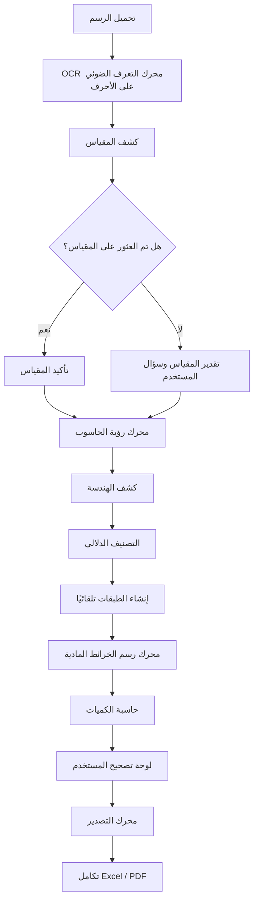
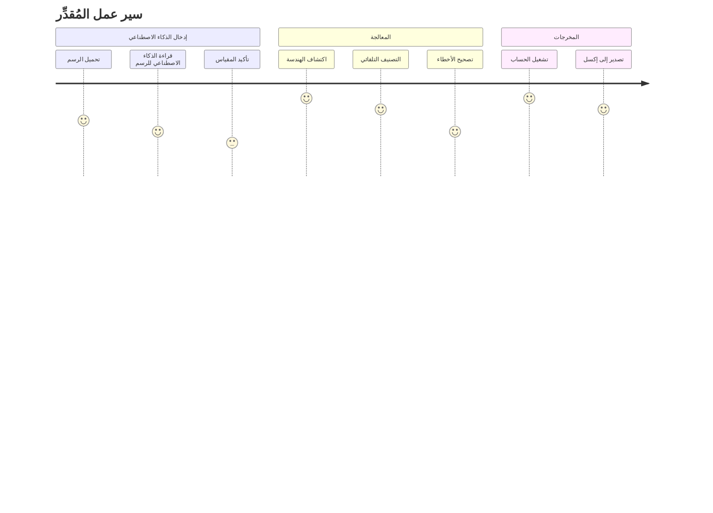

---
aliases:
  - CoNSoL-TakeOff AI Product Story Draft
doc_id: 0601-draft
status: draft
version: 1.3.0-draft
owner: product + engineering
audience: product owner + AI coding agents + solo developer
source_doc:
  - "0601_CoNSoL-TakeOff AI - PRODUCT STORY_single_file_V1.2.md"
related_docs:
  - "0000_AGENT_BRIEFING.md"
  - "0001_MASTER_DASHBOARD.md"
  - "05_SDLC_Library/05_Mega-File.md"
  - "05_SDLC_Library/0005_CoNSoL-TakeOff_SDLC_Gap_Analysis.md"
  - "06_VIBE_CODING_GUIDE/0_CoNSoL_Production_Layers.md"
  - "06_VIBE_CODING_GUIDE/1_Task_Backlog.md"
last_updated: 2026-06
---
# 🏛 مسودة قصة المنتج - CoNSoL-TakeOff AI
 
> الغرض من المسودة: تحويل قصة منتج الذكاء الاصطناعي 0601 المستقلة إلى تنسيق مكتبة الوثائق الحية دون الكتابة فوق خطة التنفيذ اليدوية الحالية MVP.

---

## 🔁 الحالة

هذه الوثيقة عبارة عن مسودة تربط بين:

- مكتبة دورة حياة تطوير البرمجيات الحالية، والتي تركز على نموذج WinForms MVP الذي يعتمد على العمل اليدوي بشكل أساسي.
- قصة المنتج 0601، والتي تحدد الرؤية الأوسع نطاقًا لعملية الانطلاق المدعومة بالذكاء الاصطناعي.

تبقى قائمة المهام المتراكمة الحالية هي المصدر الموثوق للتنفيذ حتى تتم مراجعة عناصر الذكاء الاصطناعي المذكورة أدناه وإضافتها إلى ملف `1_Task_Backlog.md` مع معرّفات UC وFR وGAP قابلة للتتبع.

---
## 👩‍🔬 تقييم التغطية

| **الموضوع من 0601** | **تغطية المكتبة الحالية** | **إجراءات مقترحة** |
| -------------------------------------- | ----------------------------------------- | --------------------------------------------------------------- |
| حساب الكميات والتقدير المرئي | مُغطى في 0101، UC-001..UC-008، L01..L04 | يُحتفظ به كأساس للمنتج الأولي |
| الرسم كعناصر أعمال قابلة للقياس | مُغطى بشكل مكثف | إعادة الاستخدام كنموذج إخراج الذكاء الاصطناعي الأساسي |
| الطبقات، والرؤية، والقفل | مُغطى ولكن لم يتم تنفيذه بالكامل | إكمال T-006، T-017، T-024، T-025 قبل أتمتة طبقة الذكاء الاصطناعي |
| الكمية، والتكلفة، والتقارير | مُغطى ولكن لم يتم تنفيذه بشكل كامل | أكمل T-010..T-023 قبل اعتماد البيانات المُولّدة بواسطة الذكاء الاصطناعي |
| تحميل الرسم | غير مُغطّى كوحدة تحكم نشطة | أضف وحدة التحكم المقترحة UC-AI-001 |
| استخراج النصوص/التعرف الضوئي على الأحرف | غير مُغطّى | أضف وحدات التحكم المقترحة UC-AI-002 وFR-AI-001..003 |
| كشف المقياس | مذكور في 0601 فقط | أضف وحدة التحكم المقترحة UC-AI-003 واستخدم التأكيد اليدوي |
| كشف/إعادة رسم الأشكال الهندسية | غير مُغطّى | أضف وحدة التحكم المقترحة UC-AI-004 بعد استقرار L01/L03 |
| التصنيف الدلالي | غير مُغطّى | أضف وحدة التحكم المقترحة UC-AI-005 بعد وجود العلامات/الطبقات/تعيين المواد |
| موثوقية الذكاء الاصطناعي ومراجعته | غير مُغطّى | أضف وحدة التحكم المقترحة UC-AI-006 قبل قبول أي مُخرجات للذكاء الاصطناعي |
| حفظ/تدقيق مُخرجات الذكاء الاصطناعي | غير موجود في مخطط علاقات الكيانات | اقترح إضافات لمخطط علاقات الكيانات قبل البرمجة |

القرار: بناء النموذج الأولي اليدوي الحالي أولاً، ثم إضافة مدخلات الذكاء الاصطناعي كآلية استيراد ومراجعة مُتحكَّم بها. يجب أن يُولِّد مُحرك الذكاء الاصطناعي كائنات رسم قابلة للتعديل، دون تجاوز مُحركات اللوحة، والطبقة، والوسم، والحساب، والتصدير الحالية.

---
## 🌟 رؤية المنتج

> حمّل رسمًا -> احصل على الكميات والتكاليف والتقارير في دقائق.

CoNSoL-TakeOff AI هو محرك حساب كميات مدعوم بالذكاء الاصطناعي، يحوّل رسومات التصميم ثنائية الأبعاد إلى عناصر بناء قابلة للقياس. يهدف النظام إلى تقليل إعادة الرسم اليدوي، واكتشاف معلومات الرسم، وتصنيف العناصر، وتنظيمها في طبقات، وإنتاج الكميات وتقديرات التكاليف، وإعداد تقارير قابلة للتصدير.

---

## 📝 الغرض من المنتج

- تمكين متخصصي الإنشاءات من تحويل الرسومات التصميمية ثنائية الأبعاد إلى بيانات قابلة للقياس تُنتج ما يلي:
	- الكميات
	- تقديرات التكاليف
	- التقارير
- التجربة المرجوة:
	- أقل جهد يدوي
	- تحكم المستخدم في كل نتيجة مُعتمدة
	- إمكانية تدقيق مخرجات الذكاء الاصطناعي
	- دقة عالية من خلال المراجعة والتصحيح والتتبع

---

## 🎯 المشكلة

لا تزال عملية حساب كميات الإنشاءات تعتمد بشكل كبير على العمل اليدوي.

- **غالبًا ما يحتاج مهندسو الإنشاءات، ومُقدّرو التكاليف، والمقاولون إلى:**
	- قضاء ساعات في إعادة رسم المخططات
	- تفسير الرسومات يدويًا
	- استخراج الأبعاد
	- تحديد عناصر البناء
	- تخصيص المواد
	- إعادة حساب الكميات
	- إنشاء التقارير يدويًا
- **ينتج عن ذلك:**
	- أخطاء بشرية
	- ضياع الوقت
	- تجاوزات في التكاليف
	- مخرجات غير متناسقة

---

## 🚀الحل

يحوّل برنامج ConSoL-TakeOff AI الرسومات إلى بيانات أعمال منظمة، متعددة الطبقات، وقابلة للمعالجة.

لا يحلّ الذكاء الاصطناعي محلّ مُقدّر التكاليف، بل يُسرّع عملية الإعداد من خلال إنتاج مسودة أولية لنموذج الرسم:

- استخراج النصوص والبيانات الوصفية
- تحديد المقياس
- تحديد الأشكال الهندسية
- تصنيف عناصر البناء
- إنشاء طبقات تلقائيًا
- اقتراح تعيينات المواد
- درجات الثقة
- إمكانية مراجعة التصحيحات
- حساب الكميات وملخصات التكاليف

---
## 👥 المستخدمون المستهدفون

### المستخدمون الأساسيون
- مساحو الكميات
- مقدّرو التكاليف
- مهندسو مدنيون
- مقاولون

### المستخدمون الثانويون
- مديرو المشاريع
- مراقبو التكاليف
- فرق المشتريات

---

## 🧭 فلسفة المنتج

- الذكاء الاصطناعي يُساعد؛ والمستخدم هو صاحب القرار.
- المستخدمون يتحكمون ببيانات المشروع المُعتمدة.
- يجب أن تكون المخرجات قابلة للمراجعة والتعديل والتتبع.
- يجب أن تتصرف عناصر الرسم المُنشأة تمامًا مثل العناصر المرسومة يدويًا بعد اعتمادها.

---

## ⚙️ المبدأ الأساسي للمنتج

يُصبح كل عنصر رسم مُكتشف كائنًا تجاريًا.

- 🧱 **أمثلة:**
	- جدار
	- باب
	- نافذة
	- بلاطة
	- عمود
	- عارضة
- 📦 *يحتوي كل عنصر على:*
	- تعيين الطبقات
	- الشكل الهندسي
	- قواعد الكميات
	- تعيين المواد
	- خصائص التكلفة
	- العلاقات مع العناصر الأخرى
	- بيانات المصدر/الثقة عند إنتاجها بواسطة الذكاء الاصطناعي

---

## 🔄 سير العمل المدعوم بالذكاء الاصطناعي

1. يقوم المستخدم بتحميل رسم.
2. يستخرج النظام النص والبيانات الوصفية.
3. يكتشف النظام المقياس أو يطلبه.
4. يكتشف النظام الشكل الهندسي.
5. يصنف النظام عناصر البناء.
6. يعيد النظام رسم الرسم المُحمّل كعناصر قابلة للتعديل على لوحة الرسم.
7. يصنف النظام العناصر في طبقات مع عناصر تحكم في الرؤية والقفل.
8. يُعيّن النظام درجات الثقة.
9. يراجع المستخدم النتائج ويصححها.
10. يحسب النظام الكميات. ١١. يقوم النظام بإنشاء التقارير.
11. يقوم النظام بتصدير بيانات الأعمال.


ملخص سير العمل:

```txt
تحميل -> كشف -> تصنيف -> مراجعة -> حساب -> تصدير
```



---
## 📊 نظرة عامة على بنية النظام

يقدم الإصدار 0601 مسارًا لاستقبال بيانات الذكاء الاصطناعي، والذي يجب أن يكون متقدمًا على محرك MVP اليدوي الحالي.

```نص
استقبال بيانات الذكاء الاصطناعي -> محرك المعالجة -> العرض المرئي -> تحكم المستخدم -> الحساب -> التصدير
```


القاعدة المعمارية المهمة: يجب أن تتحول مخرجات الذكاء الاصطناعي إلى بيانات عادية في نطاق CoNSoL قبل إجراء أي عملية حسابية أو تصدير. وهذا يضمن بقاء سير العمل اليدوي والذكاء الاصطناعي على أساس مشترك.

---

## 🗺 رحلة المستخدم الحقيقية



---

## 🚫 محاذاة وحدة التحكم الحالية

| **وحدة التحكم الحالية** | **الغرض الحالي**            | **العلاقة 0601**                                                      |
| ----------------------- | --------------------------- | --------------------------------------------------------------------- |
| UC-001                  | رسم خط على اللوحة           | يجب أن تكون الخطوط المولدة بواسطة الذكاء الاصطناعي من نفس نوع الكائن  |
| UC-002                  | تعيين كائن لطبقة            | يجب أن يقترح الذكاء الاصطناعي طبقات، ولكن يمكن للمستخدم التعديل       |
| UC-003                  | إرفاق علامة ذكية            | يمكن للذكاء الاصطناعي اقتراح علامات/فئات مواد لاحقًا                  |
| UC-004                  | تشغيل ملخص كمية الجرد       | يعتمد ناتج الذكاء الاصطناعي على هذه الآلة الحاسبة                     |
| UC-005                  | إدراج رمز من المكتبة        | قد يصنف الذكاء الاصطناعي الرموز أو يرسم خريطة للكتل المكتشفة          |
| UC-006                  | تعديل خصائص التحديد المتعدد | ضروري للتصحيح الجماعي لناتج الذكاء الاصطناعي                          |
| UC-007                  | حذف طبقة تحتوي على كائنات   | مطلوب لتنظيف الطبقات المُنشأة                                         |
| UC-008                  | تبديل وضع النشر             | يجب أن يلتزم وضع الذكاء الاصطناعي بحدود الإصدار المستقل v1            |
| UC-013                  | حفظ/فتح ملف المشروع         | يجب حفظ بيانات الذكاء الاصطناعي بعد الموافقة على مخطط علاقات الكيانات |
| UC-014                  | تصدير قائمة الكميات إلى ملف | القيمة التجارية النهائية لاستقبال الذكاء الاصطناعي                    |


---

## ⚒ حالات استخدام جديدة مقترحة للذكاء الاصطناعي

هذه مسودات مقترحة. لم تُدرج بعد في قائمة المهام النشطة.


| **معرف حالة الاستخدام** | **العنوان**                             | **الغرض**                                                                                          | **يعتمد على**                                    |
| ----------------------- | --------------------------------------- | -------------------------------------------------------------------------------------------------- | ------------------------------------------------ |
| UC-AI-001               | تحميل رسم لاستقبال الذكاء الاصطناعي     | استيراد ملف PDF/صورة/بيانات نقطية مشتقة من CAD إلى مساحة عمل المشروع                               | UC-013، L03 حفظ البيانات                         |
| UC-AI-002               | استخراج النصوص والبيانات الوصفية        | تشغيل تقنية التعرف الضوئي على الحروف (OCR) واستخراج تسميات الرسومات والأبعاد وتلميحات كتلة العنوان | UC-AI-001                                        |
| UC-AI-003               | الكشف عن المقياس وتأكيده                | اقتراح المقياس، ثم طلب تأكيد المستخدم قبل تحويل الشكل الهندسي                                      | T-001، T-008                                     |
| UC-AI-004               | الكشف عن الشكل الهندسي وإعادة رسمه      | تحويل الخطوط/المستطيلات/الخطوط المتعددة المكتشفة إلى كائنات قابلة للتحرير على لوحة الرسم           | L01 اختبار التصادم/ثبات الإحداثيات، L03 الكيانات |
| UC-AI-005               | تصنيف عناصر البناء                      | اقتراح جدار/باب/نافذة/بلاطة/عمود/جسر وإنشاء طبقات تلقائيًا                                         | UC-002، UC-003، UC-AI-004                        |
| UC-AI-006               | مراجعة نتائج الذكاء الاصطناعي وتصحيحها  | إظهار مستوى الثقة، والسماح بالقبول/الرفض/التحرير/التصحيح الجماعي                                   | لوحات UC-006، L04                                |
| UC-AI-007               | تحديد خصائص المواد والتكلفة             | اقتراح المواد/الصيغ بناءً على التصنيف والوسوم                                                      | UC-003، UC-004                                   |
| UC-AI-008               | تصدير بيانات الذكاء الاصطناعي المُراجعة | إعداد التقارير من البيانات المقبولة/المراجعة فقط                                                   | UC-004، UC-014                                   |


---

## 🏗 المتطلبات الوظيفية المقترحة

| **معرف المتطلبات الوظيفية** | **المتطلب**                                                                                         | **ملاحظات**                                                 |
| --------------------------- | --------------------------------------------------------------------------------------------------- | ----------------------------------------------------------- |
| FR-AI-001                   | يجب أن يسمح النظام للمستخدم بتحميل ملف رسم مدعوم لاستقبال بيانات الذكاء الاصطناعي                   | يجب أن يبدأ دعم الملفات بشكل محدود: صورة/ملف PDF نقطي أولاً |
| FR-AI-002                   | يجب على النظام تخزين الملف المصدر المرفوع بشكل منفصل عن عناصر الرسم المقبولة                        | يتطلب مراجعة مخطط علاقات الكيانات                           |
| FR-AI-003                   | يجب على النظام استخراج النصوص والبيانات الوصفية من الرسم المرفوع                                    | يجب أن تكون مخرجات التعرف الضوئي على الأحرف قابلة للمراجعة  |
| FR-AI-004                   | يجب على النظام اكتشاف مقياس الرسم أو طلبه قبل تحويل الأشكال الهندسية إلى وحدات منطقية               | يلزم تأكيد المستخدم                                         |
| FR-AI-005                   | يجب على النظام اكتشاف الأشكال الهندسية المرشحة من الرسم المرفوع                                     | لا تُعتبر الأشكال المرشحة موثوقة إلا بعد قبولها             |
| FR-AI-006                   | يجب على النظام تحويل الأشكال الهندسية المرشحة المقبولة إلى عناصر لوحة رسم عادية                     | يجب إعادة استخدام نموذج الكائن L01/L03                      |
| FR-AI-007                   | يجب على النظام تصنيف العناصر المرشحة حسب نوع الإنشاء                                                | يجب أن يتضمن التصنيف مستوى الثقة                            |
| FR-AI-008                   | يجب على النظام إنشاء طبقات تلقائيًا أو اقتراحها بناءً على نتائج التصنيف                             | يجب عدم حذف طبقات المستخدم أو الكتابة فوقها                 |
| FR-AI-009                   | يجب أن يعرض النظام مستوى الثقة ومصدر كل عنصر مقترح بواسطة الذكاء الاصطناعي                          | مطلوب للتدقيق                                               |
| FR-AI-010                   | يجب أن يسمح النظام للمستخدمين بقبول أو رفض أو تعديل العناصر المقترحة من الذكاء الاصطناعي قبل الحساب | تدخل بشري                                                   |
| FR-AI-011                   | يجب أن يحسب النظام الكميات فقط من العناصر المقبولة                                                  | يتجنب الإبلاغ غير المقصود من البيانات غير المراجعة          |
| FR-AI-012                   | يجب أن يحتفظ النظام ببيانات تعريف التدقيق الخاصة بالذكاء الاصطناعي بعد الحفظ/الفتح                  | يعتمد على قرار مخطط علاقات الكيانات/مخطط الملف              |
| FR-AI-013                   | يجب أن يصدر النظام الكميات المراجعة وملخصات التكاليف إلى تنسيقات جاهزة للاستخدام التجاري            | يعيد استخدام UC-014                                         |

---
## 🧧 تأثير طبقة الإنتاج

| **الطبقة**                               | **التأثير من 0601**                                                                                           | **قاعدة البناء**                                                                |
| ---------------------------------------- | ------------------------------------------------------------------------------------------------------------- | ------------------------------------------------------------------------------- |
| L01 لوحة الرسم ومحرك الرسم               | عرض الأشكال الهندسية المولدة بالذكاء الاصطناعي ككائنات قابلة للتحرير؛ عرض طبقات المصدر/الثقة لاحقًا           | إكمال تحويل الإحداثيات واختبار الاصطدام أولًا                                   |
| L02 منطق الأعمال والحساب                 | تعيين المواد، تعيين التصنيف إلى الصيغة، تجميع الكمية/التكلفة                                                  | يجب أن تعمل الآلة الحاسبة قبل أن تصبح مخرجات الذكاء الاصطناعي ذات قيمة          |
| L03 نموذج البيانات والاستمرارية          | العناصر المحملة، نتائج التعرف الضوئي على الأحرف، مرشحو الذكاء الاصطناعي، بيانات التعريف الخاصة بالثقة/التدقيق | لا توجد كيانات جديدة قبل تحديث مخطط علاقات الكيانات                             |
| L04 واجهة المستخدم/تجربة المستخدم والعرض | تدفق التحميل، تأكيد المقياس، لوحة مراجعة/تصحيح الذكاء الاصطناعي                                               | البناء بعد استقرار لوحات الطبقة/الخصائص                                         |
| L05 هندسة وجودة الكود                    | عقود خدمة جديدة للاستقبال/التعرف الضوئي على الأحرف/القياس/الرؤية/التصنيف/المراجعة                             | استخدام الواجهات وحقن البيانات؛ إبقاء الذكاء الاصطناعي خارج نطاق النظام الأساسي |
| L06 الاختبار والتحقق                     | تجهيزات للرسومات، حالات التعرف الضوئي على الأحرف، حالات كشف المقياس، قبول الهندسة                             | إضافة اختبارات قبل استدعاء سير عمل الذكاء الاصطناعي                             |
| L07 البناء والتغليف والنشر               | تغليف أي تبعيات وقت تشغيل التعرف الضوئي على الأحرف/الرؤية الحاسوبية                                           | يجب أن يظل التثبيت المستقل بسيطًا                                               |
| L08 المراقبة والتسجيل                    | تسجيل خطوات الاستقبال، ومستوى الثقة، وقرارات المستخدم، والأعطال، والتوقيتات                                   | عدم تسجيل محتوى الرسم الحساس                                                    |


---

## 🤖 عقود خدمة الذكاء الاصطناعي المقترحة

هذه الأسماء هي مسودات مرشحة لتخطيط L05/واجهة برمجة التطبيقات.

| **الواجهة**                    | **المسؤولية**                                                    |
| ------------------------------ | ---------------------------------------------------------------- |
| `IDrawingImportService`        | قبول ملف المصدر، والتحقق من النوع/الحجم، وإنشاء جلسة استيراد     |
| `IOcrService`                  | استخراج النص والبيانات الوصفية من المصدر المرفوع                 |
| `IScaleDetectionService`       | اقتراح المقياس ومستوى الثقة، وطلب تأكيد المستخدم عند الشك        |
| `IGeometryDetectionService`    | إنتاج نماذج هندسية مرشحة من ملف المصدر                           |
| `IObjectClassificationService` | تصنيف النماذج الهندسية المرشحة كأنواع كائنات إنشائية             |
| `IAiReviewService`             | إدارة حالة القبول/الرفض/التعديل للنماذج المرشحة للذكاء الاصطناعي |
| `IMaterialSuggestionService`   | اقتراح تعيينات المواد/الصيغ من التصنيف والوسوم                   |

قاعدة التنفيذ: تُنتج هذه الخدمات نماذج مرشحة. النماذج التي تمت مراجعتها فقط هي التي تصبح كائنات رسم دائمة.


---
## 📅 ​​إضافات البيانات المقترحة

لا تُنفذ هذه الإضافات حتى يتم تحديث الملفين `0005_CoNSoL-TakeOff_SDLC_Gap_Analysis.md` و`020103 Data Model`.

| **الكيان المرشح** | **الغرض** |
| ----------------------- | ------------------------------------------------------ |
| `IMPORT_SESSION` | تشغيل واحد لمعالجة بيانات الذكاء الاصطناعي لرسم مصدر واحد |
| `SOURCE_ARTIFACT` | بيانات تعريف الملف المرفوع ومرجع التخزين |
| `OCR_RESULT` | النص المستخرج، والمربعات المحيطة، ومستوى الثقة |
| `AI_GEOMETRY_CANDIDATE` | تم اكتشاف الشكل المرشح قبل موافقة المستخدم |
| `AI_CLASSIFICATION` | الفئة الدلالية للمرشح، ومستوى الثقة، والأساس المنطقي/المصدر |
| `AI_REVIEW_DECISION` | قرار المستخدم بالقبول/الرفض/التعديل مع الطابع الزمني |

قاعدة الحفظ: يجب أن تشير الملفات المقبولة إلى سجلات `DRAWING_OBJECT` العادية، وليس إلى تكرار الشكل الهندسي النهائي في نموذج منفصل خاص بالذكاء الاصطناعي.


---

## 🛠 خارطة طريق التنفيذ

### 🧪 المرحلة 1 - أساسيات استقبال الذكاء الاصطناعي

- تحميل الرسم
- التحقق من صحة ملف المصدر
- تخزين ملف المصدر
- تشغيل التعرف الضوئي على الأحرف/استخراج النص
- عرض البيانات الوصفية المستخرجة

### ⚙️ المرحلة 2 - المقياس والهندسة

- تحديد المقياس
- مطالبة المستخدم بتأكيد المقياس
- تحديد الهندسة المرشحة
- تحويل الهندسة باستخدام `CoordinateConverter`
- معاينة المرشحين على الرسم الأصلي

### 🧠 المرحلة 3 - الطبقات الذكية والتصنيف

- تصنيف الكائنات المكتشفة
- اقتراح الطبقات تلقائيًا
- اقتراح تعيينات المواد
- الحفاظ على مستوى الثقة وتتبع المصدر

### 📤 المرحلة 4 - تصحيح المستخدم والتصدير

- قبول/رفض/تعديل الكائنات المرشحة
- تحويل الكائنات المقبولة إلى كائنات لوحة عادية
- تشغيل حساب الكميات
- تصدير التقارير

---
## ⛳ خطة استمرار التطوير الموصى بها

الخطة الأكثر أمانًا هي الاستمرار في البناء بالترتيب الموضح بالفعل بواسطة `0_CoNSoL_Production_Layers.md` و`1_Task_Backlog.md`، ثم قم بترقية 0601 إلى SDLC المباشر بمجرد أن يصبح الأساس اليدوي قابلاً للاستخدام.

### الموجة 0 - محاذاة الوثائق

الهدف: جعل 0601 مرئيًا في المكتبة المباشرة دون تعطيل عمل MVP الحالي.

- احتفظ بهذه المسودة كجسر لقصة المنتج.
- أضف حالات استخدام الذكاء الاصطناعي الرسمية إلى SRS فقط بعد المراجعة.
- إضافة فجوات الذكاء الاصطناعي إلى تحليل الفجوات فقط بعد الموافقة على قرارات ERD/حدود الخدمة.
- أضف مهام الذكاء الاصطناعي إلى `1_Task_Backlog.md` فقط مع إمكانية تتبع UC/FR/GAP.

### الموجة 1 - كريم الأساس اليدوي MVP

الهدف: جعل الهندسة التي أنشأها المستخدم جديرة بالثقة.

**المهام الأساسية:**

- ء T-001 تحويل الإحداثيات
- ء T-002..T-005 منطق الاختبار والاختيار
- كيان الطبقة T-006
- ء T-008 CanvasLayoutValidator
- ء T-010..T-013 آلة حاسبة D0/D1/D2/D3
- ء T-014..T-016 أساس الأمر/التراجع

السبب: لا يمكن مراجعة الهندسة التي تم إنشاؤها بواسطة الذكاء الاصطناعي أو حسابها بأمان حتى يتم تحويل الإحداثيات والطبقات والتحقق من الصحة ومنطق الآلة الحاسبة والتراجع.

### الموجة 2 - تدفق منتج MVP

الهدف: أكمل المسار الشامل من الرسم إلى إخراج الإقلاع.

المهام الأساسية:

- واجهات الخدمة T-017..T-020
- ملخص إقلاع T-021..T-023 وتجميع التكاليف والتصدير
- ء T-024..T-031 لوحة طبقة وأسلاك لوحة الملكية
- ء T-032..T-034 استراتيجية الاختبار الأول ومشاريع الاختبار
- ء T-047..T-049 اختبارات القبول لحالات الاستخدام الأساسية

النتيجة: يمكن أن يدعم التطبيق وعد MVP الحالي: الرسم والطبقة والتعريف والحساب والتصدير.

### الموجة 3 - ترويج SDLC لاستهلاك الذكاء الاصطناعي

الهدف: تحويل 0601 من قصة المنتج إلى عمل SDLC قابل للتنفيذ.

التسليمات:

- أضف UC-AI-001..UC-AI-008 إلى قسم SRS/حالة الاستخدام.
- إضافة FR-AI-001..FR-AI-013 إلى المتطلبات.
- إضافة إضافات بيانات الذكاء الاصطناعي المقترحة إلى ERD للمراجعة.
- إضافة عقود الخدمة للاستيراد والتعرف الضوئي على الحروف وكشف المقياس والكشف الهندسي والتصنيف والمراجعة.
- إضافة تركيبات اختبارية للرسومات المصدرية ومخرجات المرشح المتوقعة.

### الموجة 4 - أفضل لاعب في تناول الذكاء الاصطناعي

الهدف: استيراد رسم وإنتاج كائنات قماشية تمت مراجعتها وقابلة للتحرير.

نطاق التنفيذ الأول:

- تحميل الصورة / PDF النقطية.
- استخراج نص التعرف الضوئي على الحروف.
- كشف المقياس أو تأكيده يدويًا.
- كشف هندسة الخط / المستطيل البسيط.
- معاينة المرشحين.
- السماح للمستخدم بقبول/رفض/تحرير المرشحين.
- تحويل المرشحين المقبولين إلى سجلات `DRAWING_OBJECT` عادية.

خارج نطاق الذكاء الاصطناعي الأول:

- تقدير مستقل تماما.
- تدريب YOLO/نموذج مخصص.
- الاستدلال السحابي.
- تصدير لم تتم مراجعته.
- كشف ثلاثي الأبعاد حقيقي.

### الموجة 5 - تصنيف الذكاء الاصطناعي ومخرجات الأعمال

الهدف: ربط الهندسة المكتشفة بواسطة الذكاء الاصطناعي بالمعنى التجاري.

القدرات الأساسية:

- تصنيف الأشياء المرشحة كجدار أو باب أو نافذة أو لوح أو عمود أو شعاع.
- اقتراح الطبقات تلقائيًا.
- اقتراح تعيينات المواد / الصيغة.
- تشغيل حساب الإقلاع الحالي على الكائنات المقبولة.
- تصدير الكميات والتكاليف المقبولة/المراجعة.

---

## 💡 عرض القيمة الأساسية

| **الميزة**                    | **فائدة**                                   |
| ----------------------------- | ------------------------------------------- |
| رسومات قراءة الذكاء الاصطناعي | توفير وقت التحضير                           |
| الكشف التلقائي عن المقياس     | تحسين دقة القياس                            |
| فصل الطبقة                    | جعل الرسومات التي تم إنشاؤها قابلة للمراجعة |
| رسم الخرائط المادية           | إنتاج رؤية أسرع للتكلفة                     |
| تصدير التقارير                | تسليم مخرجات جاهزة للأعمال                  |

---

## ✅ مقاييس النجاح

- تقليل وقت التحضير للإقلاع
- أخطاء قياس أقل
- إعادة رسم يدوي أقل تكرارًا
- توليد تقرير أسرع
- اتساق أعلى عبر المشاريع
- معدل قبول المستخدم للمرشحين الذين تم إنشاؤهم بواسطة الذكاء الاصطناعي
- النسبة المئوية لكائنات الذكاء الاصطناعي التي تتطلب التصحيح
- الوقت من التحميل إلى تقرير الإقلاع الذي تمت مراجعته

---

## 🔥 الفروق الرئيسية

- لا يلزم الرسم اليدوي لإعداد التمريرة الأولى
- تفسير الرسم بمساعدة الذكاء الاصطناعي
- التصحيح والقبول الذي يتحكم فيه المستخدم
- مصمم لسير عمل الإقلاع الحقيقي للبناء
- يستخدم نفس نموذج كائن الأعمال للبيانات اليدوية والبيانات التي تم إنشاؤها بواسطة الذكاء الاصطناعي

---

## 💼التأثير على الأعمال

- تقليل وقت التقدير من ساعات إلى دقائق لأنواع الرسم المدعومة.
- تحسين الاتساق عبر المشاريع.
- جعل سير عمل التقدير أكثر قابلية للتطوير.
- إعداد مسار للتكامل المستقبلي مع أنظمة إدارة المشاريع.

---
## 📊 مسودة مصفوفة التنفيذ

هذه مسودة عناصر التخطيط 0601. لا ينبغي استبدال ملف `1_Task_Backlog.md` بها إلا بعد الموافقة عليها ومتابعتها.


| **المعرف** | **الفئة**        | **المهمة**              | **الحالة**          | **يعتمد على**                | **ملاحظات**                                           |
| ---------- | ---------------- | ----------------------- | ------------------- | ---------------------------- | ----------------------------------------------------- |
| AI-001     | الذكاء الاصطناعي | استخراج نص OCR          | مقترح               | UC-AI-001                    | المزود المرشح: Tesseract أو ما يعادله                 |
| AI-002     | الذكاء الاصطناعي | كشف المقياس             | مقترح               | AI-001، T-001                | يعتمد على النمط أولاً؛ يلزم تأكيد المستخدم            |
| AI-003     | الذكاء الاصطناعي | كشف الشكل الهندسي       | مقترح               | AI-002، T-002..T-005         | مسار معالجة بيانات على غرار OpenCV؛ هندسة بسيطة أولاً |
| AI-004     | الذكاء الاصطناعي | محرك التصنيف            | مُقترح              | AI-003، UC-002، UC-003       | قائم على القواعد أولاً، ثم التعلم الآلي لاحقاً        |
| AI-005     | الذكاء الاصطناعي | تكامل YOLO              | مستقبلي             | AI-003، مجموعة بيانات مُصنفة | ترقية مستقبلية، ليس منتجًا أوليًا قابلًا للتطبيق      |
| UI-001     | واجهة المستخدم   | عرض Canvas              | أساسيات نشطة        | مهام L01                     | النظام الحالي؛ تحسين الموثوقية                        |
| UI-002     | واجهة المستخدم   | لوحة الطبقات            | قائمة مهام نشطة     | T-024                        | مطلوب قبل الإنشاء التلقائي للطبقات                    |
| UI-003     | واجهة المستخدم   | لوحة الخصائص            | قائمة مهام نشطة     | T-026..T-031                 | مطلوب لسير عمل التصحيح                                |
| UI-004     | واجهة المستخدم   | تجربة المستخدم للاختيار | قائمة المهام النشطة | T-002..T-005                 | مطلوب للمراجعة/التعديل                                |
| BUS-001    | الأعمال          | حاسبة الكميات           | قائمة المهام النشطة | T-010..T-013                 | يجب إكمالها قبل قيمة تقرير الذكاء الاصطناعي           |
| BUS-002    | الأعمال          | تعيين المواد            | مقترح               | UC-003، UC-004               | التوسيع بعد استقرار الحاسبة                           |
| EXP-001    | تصدير            | تصدير Excel/CSV         | قائمة المهام النشطة | T-023                        | CSV أولاً لكل قائمة مهام حالية                        |
| EXP-002    | تصدير            | تصدير PDF               | مستقبلي             | EXP-001                      | الإضافة بعد تصدير MVP                                 |
| SYS-001    | النظام           | التسجيل                 | قائمة المهام النشطة | T-053..T-055                 | تمديد لمعالجة بيانات الذكاء الاصطناعي لاحقًا          |
| SYS-002    | النظام           | مقياس التكوين/الافتراضي | قائمة المهام النشطة | T-008، T-015                 | مطلوب للمقياس الافتراضي                               |
| SYS-003    | النظام           | التخزين المؤقت          | مستقبلي             | AI-001                       | فقط عند الحاجة إليه من قِبل أداء المعالجة             |


---

## 📝 القرارات المفتوحة

| **القرار** | **أهميته** | **الخطوة التالية الموصى بها** |
| ---------------------- | ----------------------------------------- | ---------------------------------------------------- |
| دعم ملفات مصدر الذكاء الاصطناعي | يتحكم في النطاق والتبعيات | البدء بصورة/ملف PDF نقطي فقط |
| موفر OCR/CV | يؤثر على التغليف والترخيص | تقييم الموفرين المحليين/غير المتصلين بالإنترنت أولاً |
| إضافات مخطط علاقات الكيانات | مطلوب قبل العمل على التخزين الدائم | مسودة امتداد مخطط علاقات الكيانات ومراجعتها قبل البرمجة |
| نموذج الثقة | ضروري لثقة المستخدم | تخزين مستوى الثقة لكل مرشح وتصنيف |
| بوابة المراجعة | يمنع ظهور مخرجات الذكاء الاصطناعي غير المراجعة في التقارير | يتطلب القبول/الرفض/التعديل قبل الحساب/التصدير |
| تأثير التغليف | قد تُعقّد مكتبات التعرف الضوئي على الأحرف/التحقق من صحة البيانات عملية التثبيت | يُحل بعد قرار التغليف المستقل L07 |


---

## ✍ بوابة القبول لترقية 0601

يمكن ترقية هذه المسودة إلى مكتبة دورة حياة تطوير البرمجيات (SDLC) الفعلية عند:

- إضافة حالات استخدام الذكاء الاصطناعي بتنسيق حالات الاستخدام المعتاد.
- إضافة متطلبات الذكاء الاصطناعي إلى المتطلبات ومصفوفة تتبع المتطلبات (RTM).
- الموافقة على إضافات بيانات الذكاء الاصطناعي في مخطط علاقات الكيانات (ERD).
- تعريف عقود خدمة الذكاء الاصطناعي في وثائق L05/API.
- إضافة مهام الذكاء الاصطناعي إلى `1_Task_Backlog.md` مع معرّفات قابلة للتتبع.


## ⏳ العناصر المتبقية للترقية

هذه هي عناصر المسودة التي لا تزال بحاجة إلى الترقية إلى مكتبة دورة حياة تطوير البرمجيات (SDLC) الفعلية أو قائمة المهام المتراكمة.


| **الفئة** | **العنصر** | **الحالة** | **المكان الذي ينتمي إليه** |
| ------------ | ----------------------------------------------------------- | ---------------- | ------------------------------------------------------------ |
| البيانات | حفظ جلسة الاستيراد ومصدر البيانات | لم تتم الترقية بعد | `0_CoNSoL_Production_Layers.md`، `1_Task_Backlog.md` |
| الذكاء الاصطناعي | تخزين نتائج التعرف الضوئي على الأحرف والبيانات الوصفية القابلة للمراجعة | لم تتم الترقية بعد | `0_CoNSoL_Production_Layers.md`، `1_Task_Backlog.md` |
| الذكاء الاصطناعي | اكتشاف المرشحين الهندسيين و معاينة | لم تتم الترقية بعد | `0_CoNSoL_Production_Layers.md`، `1_Task_Backlog.md` |
| الذكاء الاصطناعي | كشف المقياس وتأكيد المستخدم | لم تتم الترقية بعد | `0_CoNSoL_Production_Layers.md`، `1_Task_Backlog.md` |
| الذكاء الاصطناعي | ثقة التصنيف، تتبع المصدر، قبول/رفض/تعديل | لم تتم الترقية بعد | `0_CoNSoL_Production_Layers.md`، `1_Task_Backlog.md` |
| واجهة المستخدم | سطح مراجعة الذكاء الاصطناعي بتصميم أنيق | لم تتم الترقية بعد | `0_CoNSoL_Production_Layers.md`، `1_Task_Backlog.md` |
| الاختبار | تجهيزات إدخال الذكاء الاصطناعي وتغطية القبول | لم تتم الترقية بعد | `1_Task_Backlog.md`، `0401_Testing_Documentation.md` |
| العمليات | تسجيل الذكاء الاصطناعي، والتتبع، والرجوع إلى الحزم الاحتياطية | لم تتم ترقيته بعد | `0_CoNSoL_Production_Layers.md`، `1_Task_Backlog.md`، `0304` |
