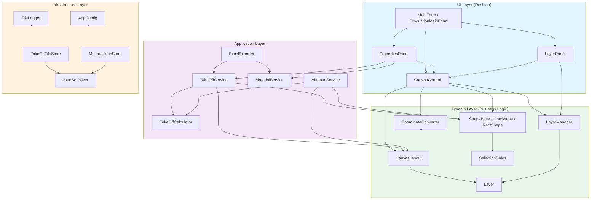
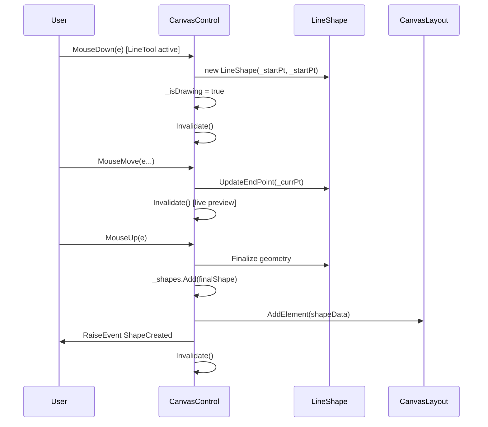
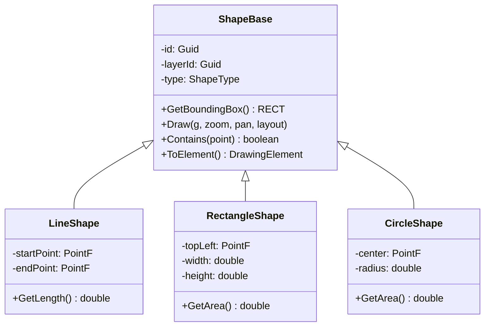

---
aliases:
  - CoNSoL-TakeOff Canvas Control Technical Architecture
doc_id: 0701
status: draft
version: 1.0.0-draft
owner: architecture + engineering
audience: AI coding agents + solo developer + architects
related_docs:
  - "05_SDLC_Library/05_Mega-File.md"
  - "05_SDLC_Library/0104_SRS.md"
  - "05_SDLC_Library/0208_UX_UI_Design.md"
  - "Project-Example -(to-be-deleted)/ZRGPictureBox/Documents/ZRGPictureBoxControl-in-Details.md"
last_updated: 2026-06
---
# 🏗️ CoNSoL-TakeOff Canvas Control — Technical Architecture & Component Documentation
↓
> This document describes the actual implementation architecture of the **CoNSoL-TakeOff** drawing and estimation system, following the style and format of `ZRGPictureBoxControl` documentation. It serves as the technical reference for all canvas, layer, calculation, AI intake, and export subsystems.

---

## Table of Contents

1. [System Overview & High-Level Architecture](#1-system-overview--high-level-architecture)
2. [CanvasControl — Core Drawing Engine](#2-canvascontrol--core-drawing-engine)
3. [Layer Management System](#3-layer-management-system)
4. [Shape Model & Geometry](#4-shape-model--geometry)
5. [Coordinate System & Conversion](#5-coordinate-system--conversion)
6. [Calculation Engine](#6-calculation-engine)
7. [AI Intake Pipeline](#7-ai-intake-pipeline)
8. [Export & Report Generation](#8-export--report-generation)
9. [Infrastructure Layer](#9-infrastructure-layer)
10. [Configuration & Persistence](#10-configuration--persistence)

---

## 1. System Overview & High-Level Architecture

### 1.1 High-Level Component Relationships



### 1.2 Architectural Principles

| **Principle** | **Implementation** |
| --- | --- |
| **Separation of Concerns** | UI (Desktop) ? Application (Services) ? Domain (Entities) ? Infrastructure (Storage) |
| **Dependency Injection** | Service interfaces (ILogger, AppConfig) injected at startup |
| **Data-Driven Design** | Layer, Shape, and Material entities as POCOs with persistence via JSON |
| **Coordinate Separation** | Logical coordinates (user units) vs Physical coordinates (pixels) explicitly managed |
| **Non-Destructive UI** | All operations validate before modifying drawing state; undo/redo foundation ready |
| **Extensible Shape Model** | ShapeBase abstract class with polymorphic implementations (Line, Rectangle, Circle, etc.) |
| **Human-in-the-Loop AI** | AI generates candidates; users accept/reject before business logic processes them |

### 1.3 Deployment Modes

| **Mode**                | **Database**        | **Multi-User** | **Offline**  | **Status**     |
| ----------------------- | ------------------- | -------------- | ------------ | -------------- |
| **Standalone (MVP)**    | SQLite (local)      | Single-user    | Yes ?        | Current target |
| **Integrated (Future)** | SQL Server (shared) | Multi-user     | No           | Post-MVP       |
| **Cloud (Future)**      | Cloud DB + REST API | Multi-user     | Sync-capable | Roadmap        |

---

## 2. CanvasControl — Core Drawing Engine

### 2.1 Purpose and Responsibilities

**`CanvasControl`** is a `UserControl` that serves as the primary interactive 2D drawing surface. It:

- Manages shape rendering with zoom/pan support
- Processes mouse input for tool activation (Line, Rectangle, Select, Pan, Zoom)
- Renders grid, rulers, and coordinate feedback
- Filters shapes by layer visibility
- Provides double-buffered rendering for smooth animation
- Maintains coordinate mapping between physical (pixels) and logical (user units) spaces

**Location:** `Desktop/Controls/CanvasControl.vb`  
**Related Use Cases:** UC-001 (Draw shapes), UC-006 (Multi-selection), UC-008 (Deployment)

### 2.2 Core Fields and Properties

#### View State

| **Field**        | **Type**     | **Purpose**                              |
| ---------------- | ------------ | ---------------------------------------- |
| `_zoom`          | Single       | Zoom factor (1.0 = 100%, range 0.1—10.0) |
| `_pan`           | PointF       | Pan offset in physical coordinates       |
| `_gridSize`      | Integer      | Grid cell size in logical units          |
| `_showGrid`      | Boolean      | Toggle grid rendering                    |
| `_snapToGrid`    | Boolean      | Enable snap-to-grid for shapes           |
| `_showRulers`    | Boolean      | Toggle ruler rendering                   |
| `_currentLayout` | CanvasLayout | Current drawing (never null)             |

#### Shape and Selection State

| **Field** | **Type** | **Purpose** |
| --- | --- | --- |
| `_shapes` | List(Of ShapeBase) | All drawable shapes |
| `_selected` | ShapeBase | Currently selected shape (null if none) |
| `_isDrawing` | Boolean | Flag indicating active shape creation |
| `_tempShape` | ShapeBase | Temporary shape during live drawing |
| `_startPt`, `_currPt` | PointF | Mouse capture points during drawing |
| `_tool` | ToolType | Current tool mode (SelectTool, LineTool, RectTool, PanTool, ZoomTool) |

#### Rendering Resources

| **Field**            | **Type** | **Purpose**                        |
| -------------------- | -------- | ---------------------------------- |
| `_backBuffer`        | Bitmap   | Persistent double-buffer bitmap    |
| `_backGraphics`      | Graphics | Drawing context for backbuffer     |
| `_backgroundImage`   | Image    | Optional background image          |
| `_backgroundOpacity` | Single   | Background image opacity (0.0—1.0) |

#### Constraints

| **Field**                | **Type** | **Purpose**                                      |
| ------------------------ | -------- | ------------------------------------------------ |
| `myMinLogicalWindowSize` | Size     | Minimum logical canvas size (default: 2000—2000) |
| `myMaxLogicalWindowSize` | Size     | Maximum logical canvas size (default: 100M—100M) |

### 2.3 Key Properties (Public API)

#### Zoom & Pan

```vb
Public Property Zoom As Single
	Get
		Return _zoom
	End Get
	Set(value As Single)
		' Clamp to valid range [0.1, 10.0]
		_zoom = Math.Max(0.1F, Math.Min(10.0F, value))
		Invalidate()
	End Set
End Property

Public Property PanX As Single
	Get
		Return _pan.X
	End Get
	Set(value As Single)
		_pan = New PointF(value, _pan.Y)
		Invalidate()
	End Set
End Property

Public Property PanY As Single
	Get
		Return _pan.Y
	End Get
	Set(value As Single)
		_pan = New PointF(_pan.X, value)
		Invalidate()
	End Set
End Property
```

**Notes:**
- Zoom changes are immediately applied and trigger `Invalidate()` to queue a redraw.
- Pan adjustments are cumulative; each `Set` updates the offset.
- Bounds checking prevents invalid zoom states that would expose view outside allowed logical sizes.

#### Tool Selection

```vb
Public Property CurrentTool As ToolType
	Get
		Return _tool
	End Get
	Set(value As ToolType)
		_tool = value
		UpdateCursor()
		RaiseEvent ToolChanged(_tool)
	End Set
End Property
```

**Supported Tools:**
- `SelectTool` — select and move shapes
- `LineTool` — draw lines
- `RectTool` — draw rectangles
- `PanTool` — pan the view
- `ZoomTool` — zoom-to-area selection
- `MeasureTool` — measure distance/angle

#### Shape and Layer Filtering

```vb
Public Property ShowOnlyActiveLayer As Boolean
	Get
		Return _showOnlyActiveLayer
	End Get
	Set(value As Boolean)
		_showOnlyActiveLayer = value
		Invalidate() ' Redraw with new visibility rules
	End Set
End Property

Public ReadOnly Property SelectedShapes As List(Of ShapeBase)
	Get
		Return If(_selected Is Nothing, New List(Of ShapeBase)(), New List(Of ShapeBase) From {_selected})
	End Get
End Property
```

### 2.4 Main Methods and Workflows

#### Initialization and Layout Management

```vb
Public Sub SetLayout(layout As CanvasLayout)
	If layout Is Nothing Then
		Throw New ArgumentNullException(NameOf(layout))
	End If
	_currentLayout = layout
	_shapes.Clear()
	' Load shapes from layout persistence
	LoadShapesFromLayout()
	Invalidate()
End Sub

Private Sub LoadShapesFromLayout()
	For Each element In _currentLayout.Elements
		Dim shape = ShapeFactory.CreateShape(element)
		_shapes.Add(shape)
	Next
End Sub
```

**Invariants:**
- `_currentLayout` is never null after `SetLayout()` is called
- All shapes are recreated from the layout whenever `SetLayout()` is invoked

#### Drawing Workflow (Tool Activation)

**Main Flow:**

```
MouseDown (capture start point)
  ↓
MouseMove (live preview with temp shape)
  ↓
MouseUp (commit or cancel based on tool)
  ↓
Shape added to _shapes and _currentLayout
```

**Example: Line Tool Flow**

```vb
' In ToolType.LineTool OnMouseDown
Private Sub OnMouseDown(e As MouseEventArgs)
	If _tool = ToolType.LineTool Then
		_isDrawing = True
		_startPt = PhysicalToLogical(e.Location)
		_tempShape = New LineShape(_startPt, _startPt)
	End If
	Invalidate()
End Sub

' In ToolType.LineTool OnMouseMove (live preview)
Private Sub OnMouseMove(e As MouseEventArgs)
	If _tool = ToolType.LineTool AndAlso _isDrawing Then
		_currPt = PhysicalToLogical(e.Location)
		_tempShape.UpdateEndPoint(_currPt)
		Invalidate()
	End If
End Sub

' In ToolType.LineTool OnMouseUp (commit)
Private Sub OnMouseUp(e As MouseEventArgs)
	If _tool = ToolType.LineTool AndAlso _isDrawing Then
		_currPt = PhysicalToLogical(e.Location)
		If _currPt <> _startPt Then ' Not degenerate
			Dim finalShape = CType(_tempShape, LineShape)
			_shapes.Add(finalShape)
			_currentLayout.AddElement(finalShape.ToElement())
			RaiseEvent ShapeCreated(finalShape)
		End If
		_isDrawing = False
		_tempShape = Nothing
		Invalidate()
	End If
End Sub
```

**Mermaid Sequence: Drawing a Line**



#### Coordinate Conversion

```vb
Private Function PhysicalToLogical(physicalPt As PointF) As PointF
	Dim logicalX = (physicalPt.X - _pan.X) / _zoom + _currentLayout.LogicalOrigin.X
	Dim logicalY = (physicalPt.Y - _pan.Y) / _zoom + _currentLayout.LogicalOrigin.Y
	Return New PointF(logicalX, logicalY)
End Function

Private Function LogicalToPhysical(logicalPt As PointF) As PointF
	Dim physicalX = (logicalPt.X - _currentLayout.LogicalOrigin.X) * _zoom + _pan.X
	Dim physicalY = (logicalPt.Y - _currentLayout.LogicalOrigin.Y) * _zoom + _pan.Y
	Return New PointF(physicalX, physicalY)
End Function
```

**Contract:**
- Physical coordinates are always in pixels (0,0 at top-left)
- Logical coordinates are in user units (configurable origin)
- Conversions must be symmetric: `LogicalToPhysical(PhysicalToLogical(p)) ? p`

#### Paint / Rendering (Double-Buffering)

```vb
Protected Overrides Sub OnPaint(e As PaintEventArgs)
	' Ensure buffers are allocated
	If _backBuffer Is Nothing OrElse _backBuffer.Width <> ClientSize.Width OrElse _backBuffer.Height <> ClientSize.Height Then
		_backBuffer = New Bitmap(ClientSize.Width, ClientSize.Height)
		_backGraphics = Graphics.FromImage(_backBuffer)
	End If

	' Compose background buffer
	_backGraphics.Clear(Color.White)

	' Draw in order: background ? grid ? shapes ? temp shape ? selection highlight
	If _backgroundImage IsNot Nothing Then
		DrawBackgroundImage(_backGraphics)
	End If

	If _showGrid Then
		DrawGrid(_backGraphics)
	End If

	' Draw committed shapes
	For Each shape In _shapes
		If IsShapeVisible(shape) Then
			shape.Draw(_backGraphics, _zoom, _pan, _currentLayout)
		End If
	Next

	' Draw live temp shape (if drawing)
	If _tempShape IsNot Nothing Then
		_tempShape.Draw(_backGraphics, _zoom, _pan, _currentLayout, highlighted:=True)
	End If

	' Draw selection highlight
	If _selected IsNot Nothing Then
		DrawSelectionHighlight(_backGraphics, _selected)
	End If

	' Composite to screen
	e.Graphics.DrawImageUnscaled(_backBuffer, 0, 0)
End Sub

Private Sub DrawGrid(g As Graphics)
	' Draw grid lines at intervals of _gridSize logical units
	' Convert to physical and draw
	' Skip if too dense (> 100px apart)
End Sub

Private Sub DrawSelectionHighlight(g As Graphics, shape As ShapeBase)
	' Draw bounding box with handles
	Dim rect = shape.GetBoundingBox()
	Dim physicalRect = LogicalRectToPhysical(rect)
	g.DrawRectangle(Pens.Blue, physicalRect)
	' Draw corner handles at 5px intervals
	For i = 0 To 7
		g.FillRectangle(Brushes.Blue, New Rectangle(physicalRect.Left + (i * 5), physicalRect.Top - 3, 6, 6))
	Next
End Sub
```

**Paint Order (Critical):**
1. Clear background
2. Draw background image (if enabled)
3. Draw grid (if enabled)
4. Draw committed shapes (filtered by visibility)
5. Draw temporary shape during live drawing
6. Draw selection highlights
7. Composite to screen

#### Selection and Multi-Selection

```vb
Public Sub SelectShape(shape As ShapeBase)
	_selected = shape
	RaiseEvent SelectionChanged(_selected)
	Invalidate()
End Sub

Public Sub ClearSelection()
	_selected = Nothing
	RaiseEvent SelectionChanged(Nothing)
	Invalidate()
End Sub

Public Sub SelectShapesInArea(selectionRect As RECT)
	' Use SelectionRules to find overlapping shapes
	Dim selected = SelectionRules.FindShapesInArea(_shapes, selectionRect, SelectionMode.Crossing)
	_selected = If(selected.Count = 1, selected(0), Nothing)
	RaiseEvent SelectionChanged(_selected)
	Invalidate()
End Sub
```

**Related Use Case: UC-006 (Multi-Selection)**
- When multiple shapes are selected, property panel shows `(mixed)` for differing values
- Editing a field applies to all selected shapes
- Implementation: extend `_selected` to `_selectedList`

### 2.5 Events and Subscriptions

| **Event** | **When Raised** | **Arguments** | **Usage** |
| --- | --- | --- | --- |
| `ShapeCreated` | User finishes drawing a shape | Shape instance | Update UI counters, refresh layers |
| `SelectionChanged` | User selects/deselects a shape | Selected shape or null | Update property panel, enable/disable tools |
| `ToolChanged` | User switches tools | New tool type | Update toolbar button state |
| `LayoutChanged` | Layout is modified | CanvasLayout | Trigger save prompt, update title bar |

**Example Subscriber (MainForm):**

```vb
Private Sub CanvasControl1_ShapeCreated(sender As Object, e As ShapeBase) Handles _canvas.ShapeCreated
	' Add to layer panel object count
	Dim layer = _layerManager.GetLayer(e.LayerId)
	layer.ObjectCount += 1
	_layerPanel.Refresh()
End Sub
```

### 2.6 Limitations and Edge Cases

| **Edge Case** | **Current Behavior** | **Recommendation** |
| --- | --- | --- |
| Drawing degenerate shape (zero size) | Shape is not added | Add validation in `OnMouseUp` with user warning |
| Very large zoom values | Rendering may stutter | Implement frustum culling (L01 task T-035) |
| Rapid mouse events | Multiple invalidations queue | Use `SuspendLayout()/ResumeLayout()` pattern |
| Background image larger than canvas | Clipped at edges | Document pixel-size requirements |
| Undo/Redo not implemented | Cannot undo draws | Add CommandHistory (L05 task T-015) |

---

## 3. Layer Management System

### 3.1 Purpose and Responsibilities

The **Layer Management System** organizes drawing objects into logical groups with independent visibility, locking, and rendering behavior. It implements:

- Layer creation, deletion, duplication
- Visibility and lock state management
- Active layer tracking
- Layer persistence

**Key Components:**
- `Layer` entity (Domain/Entities/Layer.vb)
- `LayerManager` service (Domain/Services/LayerManager.vb)
- `LayerPanel` UI control (Desktop/Controls/LayerPanel.vb)

**Related Use Cases:** UC-002 (Assign object to layer), UC-007 (Delete layer)

### 3.2 Layer Entity Model

```vb
' Domain/Entities/Layer.vb
Public Class Layer
	Public Property Id As Guid = Guid.NewGuid()
	Public Property Name As String
	Public Property IsVisible As Boolean = True
	Public Property IsLocked As Boolean = False
	Public Property IncludeInCalculation As Boolean = True
	Public Property Color As String = "#FFFFFF"

	Public Sub Validate()
		If String.IsNullOrWhiteSpace(Name) Then
			Throw New ValidationException("Layer name cannot be empty")
		End If
	End Sub
End Class
```

**Invariants:**
- Name must not be empty and should be unique
- At least one layer must exist (created on canvas init)
- Active layer cannot be deleted (UC-007 exception)
- Locked layers cannot be modified but can be visible

### 3.3 LayerManager Service

```vb
' Domain/Services/LayerManager.vb
Public Class LayerManager
	Private ReadOnly _layers As New List(Of Layer)()
	Private _activeLayer As Layer = Nothing

	Public Sub New()
		' Create default layer
		Dim defaultLayer = New Layer With {.Name = "Default"}
		_layers.Add(defaultLayer)
		_activeLayer = defaultLayer
	End Sub

	Public Function GetLayer(layerId As Guid) As Layer
		Return _layers.FirstOrDefault(Function(l) l.Id = layerId)
	End Function

	Public Sub SetActiveLayer(layerId As Guid)
		Dim layer = GetLayer(layerId)
		If layer Is Nothing Then
			Throw New ArgumentException("Layer not found")
		End If
		_activeLayer = layer
		RaiseEvent ActiveLayerChanged(layer)
	End Sub

	Public Sub DeleteLayer(layerId As Guid, reassignLayerId As Guid)
		' Reassign all objects from deleted layer to target layer
		If layerId = _activeLayer.Id Then
			Throw New InvalidOperationException("Cannot delete active layer")
		End If
		_layers.RemoveAll(Function(l) l.Id = layerId)
		RaiseEvent LayerDeleted(layerId)
	End Sub

	Public Function GetVisibleLayers() As List(Of Layer)
		Return _layers.Where(Function(l) l.IsVisible).ToList()
	End Function
End Class
```

**Key Methods:**
- `GetLayer(layerId)` � retrieve by ID (null if not found)
- `SetActiveLayer(layerId)` � change active layer (raises event)
- `DeleteLayer(layerId, reassignLayerId)` � delete with object reassignment (UC-007)
- `GetVisibleLayers()` � filter for rendering

### 3.4 LayerPanel UI Control

**Responsibilities:**
- Display layer list with visibility/lock toggles
- Show object count per layer
- Indicate active layer
- Provide add/delete/duplicate actions
- Update in real-time as shapes are drawn

**Related UI FRs:** FR-LP-001, FR-LP-003, FR-LP-004

---

## 4. Shape Model & Geometry

### 4.1 Shape Hierarchy



### 4.2 Supported Shape Types

| **Type** | **File** | **Key Properties** | **Calculation** |
| --- | --- | --- | --- |
| **Line** | Desktop/Controls/LineShape.vb | StartPoint, EndPoint | Length (D1) |
| **Rectangle** | Desktop/Controls/RectShape.vb | TopLeft, Width, Height | Area (D2) |
| **Circle** | (planned) | Center, Radius | Area (D2) |
| **Polyline** | (planned) | Points[], closed | Length, Area |
| **Text** | (planned) | Position, Content, Font | N/A (annotation) |

### 4.3 LineShape Implementation

```vb
' Desktop/Controls/LineShape.vb
Public Class LineShape
	Inherits ShapeBase

	Public Property StartPoint As PointF
	Public Property EndPoint As PointF

	Public Sub New(startPt As PointF, endPt As PointF)
		MyBase.New()
		StartPoint = startPt
		EndPoint = endPt
	End Sub

	Public Overrides Function GetBoundingBox() As RECT
		Return New RECT(
			CInt(Math.Min(StartPoint.X, EndPoint.X)),
			CInt(Math.Min(StartPoint.Y, EndPoint.Y)),
			CInt(Math.Max(StartPoint.X, EndPoint.X)),
			CInt(Math.Max(StartPoint.Y, EndPoint.Y))
		)
	End Function

	Public Overrides Sub Draw(g As Graphics, zoom As Single, pan As PointF, layout As CanvasLayout, Optional highlighted As Boolean = False)
		Dim physStart = LogicalToPhysical(StartPoint, zoom, pan, layout)
		Dim physEnd = LogicalToPhysical(EndPoint, zoom, pan, layout)
		Dim pen = If(highlighted, New Pen(Color.Red, 2), New Pen(Color.Black, 1))
		g.DrawLine(pen, physStart, physEnd)
	End Sub

	Public Overrides Function Contains(logicalPt As PointF) As Boolean
		' Point-on-segment test with tolerance
		Return SEGMENT.PointOnSegment(logicalPt, StartPoint, EndPoint, tolerance:=10)
	End Function

	Public Function GetLength() As Double
		Return Math.Sqrt(Math.Pow(EndPoint.X - StartPoint.X, 2) + Math.Pow(EndPoint.Y - StartPoint.Y, 2))
	End Function

	Public Overrides Function ToElement() As DrawingElement
		Return New DrawingElement With {
			.Id = Me.Id,
			.Type = ShapeType.Line,
			.LayerId = Me.LayerId,
			.GeometryJson = JsonConvert.SerializeObject(New With {.start = StartPoint, .end = EndPoint})
		}
	End Function
End Class
```

**Key Concepts:**
- `GetBoundingBox()` returns integer RECT for hit-testing and selection
- `Draw()` converts logical to physical for rendering
- `Contains()` implements hit-test for selection (point-on-segment with tolerance)
- `ToElement()` serializes for persistence

### 4.4 Shape Validation Rules (Data Layer)

```vb
' Domain/Utilities/SelectionRules.vb
Public Class SelectionRules
	Public Shared Function FindShapesInArea(shapes As List(Of ShapeBase), area As RECT, mode As SelectionMode) As List(Of ShapeBase)
		Return shapes.Where(Function(s)
			Select Case mode
				Case SelectionMode.Window
					' Shape must be fully contained
					Return area.Contains(s.GetBoundingBox())
				Case SelectionMode.Crossing
					' Shape may be partially within area
					Return area.IntersectsWith(s.GetBoundingBox())
				Case Else
					Return False
			End Select
		}).ToList()
	End Function

	Public Shared Sub ValidateShape(shape As ShapeBase)
		If shape.GetBoundingBox().IsZeroSized Then
			Throw New ValidationException("Cannot create zero-size shape")
		End If
	End Sub
End Class
```

**Related Use Case: UC-001 (Draw Line), UC-006 (Multi-Selection)**

---

## 5. Coordinate System & Conversion

### 5.1 Two-Coordinate Model

The system maintains two coordinate spaces:

| **Space** | **Origin** | **Units** | **Use** | **Conversion** |
| --- | --- | --- | --- | --- |
| **Logical** | User-defined | User units (mm, inches, microns) | Drawing, calculation, storage | `PhysicalToLogical()` |
| **Physical** | Top-left (0,0) | Screen pixels | Rendering, mouse events | `LogicalToPhysical()` |

**Transform Equations:**

```vb
Physical_X = (Logical_X - Layout.LogicalOrigin.X) * Zoom + Pan.X
Physical_Y = (Logical_Y - Layout.LogicalOrigin.Y) * Zoom + Pan.Y

Logical_X = (Physical_X - Pan.X) / Zoom + Layout.LogicalOrigin.X
Logical_Y = (Physical_Y - Pan.Y) / Zoom + Layout.LogicalOrigin.Y
```

### 5.2 CoordinateConverter Service

```vb
' Domain/Utilities/CoordinateConverter.vb
Public Class CoordinateConverter
	Public Shared Function ToLogical(physicalPt As PointF, zoom As Single, pan As PointF, layout As CanvasLayout) As PointF
		Dim logicalX = (physicalPt.X - pan.X) / zoom + layout.LogicalOrigin.X
		Dim logicalY = (physicalPt.Y - pan.Y) / zoom + layout.LogicalOrigin.Y
		Return New PointF(logicalX, logicalY)
	End Function

	Public Shared Function ToPhysical(logicalPt As PointF, zoom As Single, pan As PointF, layout As CanvasLayout) As PointF
		Dim physicalX = (logicalPt.X - layout.LogicalOrigin.X) * zoom + pan.X
		Dim physicalY = (logicalPt.Y - layout.LogicalOrigin.Y) * zoom + pan.Y
		Return New PointF(physicalX, physicalY)
	End Function

	Public Shared Function ToLogicalRect(physicalRect As Rectangle, zoom As Single, pan As PointF, layout As CanvasLayout) As RECT
		Dim topLeft = ToLogical(New PointF(physicalRect.Left, physicalRect.Top), zoom, pan, layout)
		Dim bottomRight = ToLogical(New PointF(physicalRect.Right, physicalRect.Bottom), zoom, pan, layout)
		Return New RECT(CInt(topLeft.X), CInt(topLeft.Y), CInt(bottomRight.X), CInt(bottomRight.Y))
	End Function
End Class
```

**Contract:**
- All mouse events are in physical coordinates
- All shape geometry is stored in logical coordinates
- Conversions must be symmetric to prevent drift

**Related Task:** T-001 (Implement coordinate converter) � CRITICAL for UC-001..UC-006

---

## 6. Calculation Engine

### 6.1 Purpose and Responsibilities

The **Calculation Engine** computes quantities, materials, and costs from drawing objects. It:

- Traverses shapes and extracts geometry/attributes
- Applies dimension modes (D0=Count, D1=Length, D2=Area, D3=Volume)
- Handles nested objects (subtract children from parent)
- Aggregates by material/layer/type
- Produces take-off summaries

**Key Components:**
- `TakeOffCalculator` — calculates quantities per shape
- `TakeOffService` — orchestrates calculation and aggregation
- `TakeOffResult` — structured result with breakdown

**Related Use Cases:** UC-004 (Run take-off summary), UC-004 (Export report)

### 6.2 TakeOffCalculator Service

```vb
' Application/TakeOffCalculator.vb
Public Class TakeOffCalculator
	Public Function Calculate(element As DrawingElement, layout As CanvasLayout) As CalculatedQuantity
		Dim result = New CalculatedQuantity()

		Select Case element.DimensionMode
			Case DimensionMode.D0 ' Count
				result.Quantity = 1
				result.Unit = "ea"

			Case DimensionMode.D1 ' Length
				Dim geometry = JsonConvert.DeserializeObject(Of LineGeometry)(element.GeometryJson)
				result.Quantity = Math.Sqrt(Math.Pow(geometry.EndX - geometry.StartX, 2) + Math.Pow(geometry.EndY - geometry.StartY, 2)) / 1000 ' Convert to mm
				result.Unit = "mm"

			Case DimensionMode.D2 ' Area
				Dim geometry = JsonConvert.DeserializeObject(Of RectGeometry)(element.GeometryJson)
				result.Quantity = (geometry.Width * geometry.Height) / 1000000 ' Convert to m�
				result.Unit = "m�"

			Case DimensionMode.D3 ' Volume
				Dim geometry = JsonConvert.DeserializeObject(Of RectGeometry)(element.GeometryJson)
				result.Quantity = (geometry.Width * geometry.Height * geometry.Depth) / 1000000000 ' Convert to m�
				result.Unit = "m�"
		End Select

		Return result
	End Function
End Class
```

### 6.3 TakeOffService Orchestrator

```vb
' Application/Services/TakeOffService.vb
Public Class TakeOffService
	Private ReadOnly _calculator As TakeOffCalculator
	Private ReadOnly _materialService As MaterialService

	Public Function GetSummary(layout As CanvasLayout, groupBy As AggregationMode, Optional filterLayerId As Guid? = Nothing) As TakeOffResult
		Dim result = New TakeOffResult()
		Dim relevantElements = If(filterLayerId.HasValue, 
			layout.Elements.Where(Function(e) e.LayerId = filterLayerId.Value).ToList(),
			layout.Elements.ToList())

		For Each element In relevantElements
			Dim qty = _calculator.Calculate(element, layout)

			Select Case groupBy
				Case AggregationMode.ByMaterial
					Dim materialKey = element.MaterialRef
					If Not result.Groups.ContainsKey(materialKey) Then
						result.Groups(materialKey) = New TakeOffGroup With {.Material = materialKey}
					End If
					result.Groups(materialKey).TotalQuantity += qty.Quantity

				Case AggregationMode.ByLayer
					Dim layerKey = element.LayerId
					If Not result.Groups.ContainsKey(layerKey) Then
						result.Groups(layerKey) = New TakeOffGroup With {.Layer = layerKey}
					End If
					result.Groups(layerKey).TotalQuantity += qty.Quantity
			End Select
		Next

		Return result
	End Function

	Public Function GetCostSummary(layout As CanvasLayout) As CostBreakdown
		Dim result = New CostBreakdown()

		For Each element In layout.Elements
			Dim qty = _calculator.Calculate(element, layout)
			Dim material = _materialService.GetMaterial(element.MaterialRef)

			If material IsNot Nothing Then
				Dim cost = qty.Quantity * material.UnitPrice
				result.TotalCost += cost
				result.LineItems.Add(New LineItem With {
					.Description = material.Name,
					.Quantity = qty.Quantity,
					.Unit = qty.Unit,
					.UnitPrice = material.UnitPrice,
					.TotalPrice = cost
				})
			End If
		Next

		Return result
	End Function
End Class
```

**Key Methods:**
- `Calculate(element, layout)` � compute quantity for a single element
- `GetSummary(layout, groupBy, filterLayerId)` � aggregate quantities
- `GetCostSummary(layout)` � compute cost breakdown
- Handles nested/child objects via parent-child references

**Related Tasks:**
- T-010 (D0 count)
- T-011 (D1 length)
- T-012 (D2 area)
- T-013 (D3 volume)

---

## 7. AI Intake Pipeline

### 7.1 Architecture Overview

The **AI Intake Pipeline** converts uploaded drawings into reviewable canvas objects. The pipeline maintains human-in-the-loop control at each stage.


### 7.2 AI Service Contracts

| **Service** | **Input** | **Output** | **Status** |
| --- | --- | --- | --- |
| `IDrawingImportService` | File path, metadata | Import session | Application/AI/DrawingLoader.vb |
| `IOcrService` | Bitmap image | Extracted text + bounding boxes | Application/AI/OcrService.vb |
| `IScaleDetectionService` | Image + OCR hints | Scale (px/mm), confidence | Application/AI/ScaleDetector.vb |
| `IGeometryDetectionService` | Scaled image | Candidate shapes (line, rect, circle) | Application/AI/GeometryDetector.vb |
| `IObjectClassificationService` | Shape + OCR context | Type (wall, door, window, slab), confidence | Application/AI/CategoryClassifier.vb |
| `IAiReviewService` | Candidates + classifications | User decisions (accept/reject/edit) | Application/AI/AiIntakeService.vb |

### 7.3 AiIntakeService Orchestrator

```vb
' Application/AI/AiIntakeService.vb
Public Class AiIntakeService
	Private ReadOnly _importService As IDrawingImportService
	Private ReadOnly _ocrService As IOcrService
	Private ReadOnly _scaleDetector As IScaleDetectionService
	Private ReadOnly _geometryDetector As IGeometryDetectionService
	Private ReadOnly _classifier As IObjectClassificationService

	Public Async Function IntakeDrawingAsync(filePath As String) As Task(Of AiIntakeResult)
		' Step 1: Load source
		Dim importResult = Await _importService.LoadAsync(filePath)
		Dim sourceImage = importResult.Image

		' Step 2: Extract text
		Dim ocrResult = Await _ocrService.ExtractAsync(sourceImage)

		' Step 3: Detect scale
		Dim scaleResult = Await _scaleDetector.DetectAsync(sourceImage, ocrResult.HintText)
		' User confirmation required: confirm or override scale

		' Step 4: Detect geometry
		Dim geometryResult = Await _geometryDetector.DetectAsync(sourceImage, scaleResult.ScaleFactor)
		' Returns candidate shapes with confidence scores

		' Step 5: Classify objects
		Dim classificationResult = Await _classifier.ClassifyAsync(geometryResult.Candidates, ocrResult)
		' Returns classification (wall/door/window/etc) per candidate

		' Step 6: Package for review
		Dim reviewPackage = New AiIntakeResult With {
			.ImportSession = importResult,
			.OcrResults = ocrResult,
			.ScaleDetection = scaleResult,
			.GeometryCandidates = geometryResult.Candidates,
			.Classifications = classificationResult
		}

		Return reviewPackage
	End Function

	Public Sub AcceptCandidate(candidate As GeometryCandidate)
		' Convert AI candidate to normal DrawingElement
		Dim shape = ShapeFactory.CreateShapeFromCandidate(candidate)
		' Add to layout and canvas
	End Sub
End Class
```

**Pipeline Flow:**

```
Upload
  ? (file validation)
  ? OCR (extract text + bounding boxes)
  ? Scale Detection (detect scale or ask user)
  ? Geometry Detection (find lines, rectangles, curves)
  ? Classification (assign construction type to each shape)
  ? User Review (show candidates with confidence)
  ? Accept/Reject/Edit (user decides)
  ? Convert to DrawingElement (add to layout)
  ? Calculate quantities
  ? Export reports
```

### 7.4 Related AI Use Cases and Tasks

| **UC ID** | **Title** | **Status** | **Depends On** |
| --- | --- | --- | --- |
| UC-AI-001 | Upload drawing for AI intake | Planned | T-067 |
| UC-AI-002 | Extract text and metadata (OCR) | Planned | T-068 |
| UC-AI-003 | Detect and confirm scale | Planned | T-069 |
| UC-AI-004 | Detect geometry and redraw | Planned | T-070 |
| UC-AI-005 | Classify construction objects | Planned | T-071 |
| UC-AI-006 | Review and correct AI results | Planned | T-070, T-071 |
| UC-AI-007 | Map materials and cost attributes | Planned | UC-AI-006 |
| UC-AI-008 | Export reviewed AI take-off | Planned | T-072 |

**Related Tasks in Backlog:**
- T-067..T-076 (AI product tasks)

---

## 8. Export & Report Generation

### 8.1 ExcelExporter Service

```vb
' Application/Export/ExcelExporter.vb
Public Class ExcelExporter
	Public Sub ExportToExcel(takeOffSummary As TakeOffResult, outputPath As String)
		Dim workbook = New Workbook()
		Dim worksheet = workbook.Worksheets(0)

		' Header row
		worksheet.Cells(0, 0).Value = "Layer"
		worksheet.Cells(0, 1).Value = "Material"
		worksheet.Cells(0, 2).Value = "Quantity"
		worksheet.Cells(0, 3).Value = "Unit"
		worksheet.Cells(0, 4).Value = "Unit Price"
		worksheet.Cells(0, 5).Value = "Total"

		' Data rows
		Dim rowIndex = 1
		For Each group In takeOffSummary.Groups
			worksheet.Cells(rowIndex, 0).Value = group.Layer
			worksheet.Cells(rowIndex, 1).Value = group.Material
			worksheet.Cells(rowIndex, 2).Value = group.TotalQuantity
			worksheet.Cells(rowIndex, 3).Value = group.Unit
			worksheet.Cells(rowIndex, 4).Value = group.UnitPrice
			worksheet.Cells(rowIndex, 5).Value = group.TotalCost
			rowIndex += 1
		Next

		workbook.Save(outputPath)
	End Sub
End Class
```

**Export Formats:**
- **CSV** � simple comma-delimited (T-023 completed)
- **Excel** � formatted with styles and totals (future)
- **PDF** � summary report with charts (future)

**Related UC:** UC-014 (Export take-off to file), UC-AI-008 (Export reviewed AI take-off)

---

## 9. Infrastructure Layer

### 9.1 File Storage & Persistence

```vb
' Infrastructure/IO/TakeOffFileStore.vb
Public Class TakeOffFileStore
	Public Function LoadProject(filePath As String) As CanvasLayout
		Dim json = System.IO.File.ReadAllText(filePath)
		Return JsonConvert.DeserializeObject(Of CanvasLayout)(json)
	End Function

	Public Sub SaveProject(layout As CanvasLayout, filePath As String)
		Dim json = JsonConvert.SerializeObject(layout, Formatting.Indented)
		System.IO.File.WriteAllText(filePath, json)
	End Sub
End Class

' Infrastructure/IO/MaterialJsonStore.vb
Public Class MaterialJsonStore
	Public Function LoadMaterials(filePath As String) As List(Of Material)
		Dim json = System.IO.File.ReadAllText(filePath)
		Return JsonConvert.DeserializeObject(Of List(Of Material))(json)
	End Function

	Public Sub SaveMaterials(materials As List(Of Material), filePath As String)
		Dim json = JsonConvert.SerializeObject(materials, Formatting.Indented)
		System.IO.File.WriteAllText(filePath, json)
	End Sub
End Class
```

**Persistence Format:**
- **File Type:** `.takeoff` (JSON-based)
- **Compression:** Optional gzip for large drawings
- **Versioning:** `"version": "1.0"` field for forward compatibility

### 9.2 Logging and Diagnostics

```vb
' Infrastructure/Logging/ILogger.vb
Public Interface ILogger
	Sub LogInfo(message As String)
	Sub LogWarning(message As String)
	Sub LogError(message As String, Optional ex As Exception = Nothing)
	Sub LogDebug(message As String)
End Interface

' Infrastructure/Logging/FileLogger.vb
Public Class FileLogger
	Implements ILogger

	Public Sub LogInfo(message As String) Implements ILogger.LogInfo
		WriteLog("INFO", message)
	End Sub

	Private Sub WriteLog(level As String, message As String)
		Dim logPath = Path.Combine(AppConfig.LogDirectory, $"takeoff-{DateTime.Now:yyyy-MM-dd}.log")
		Dim logLine = $"[{DateTime.Now:yyyy-MM-dd HH:mm:ss}] {level}: {message}"
		File.AppendAllText(logPath, logLine & Environment.NewLine)
	End Sub
End Class
```

**Logging Scope:**
- Strategic log points per 0606 (Observability guide)
- Draw operations, calculations, save/load events
- AI intake steps with confidence scores
- No sensitive drawing content in logs

### 9.3 Configuration Management

```vb
' Infrastructure/Config/AppConfig.vb
Public Class AppConfig
	Public Property ProjectsDirectory As String
	Public Property MaterialsDirectory As String
	Public Property LogDirectory As String
	Public Property DefaultUnit As String = "mm"
	Public Property DefaultScaleFactor As Single = 1.0F

	Public Shared Sub LoadFromJson(jsonPath As String)
		Dim json = File.ReadAllText(jsonPath)
		Dim config = JsonConvert.DeserializeObject(Of AppConfig)(json)
		' Apply to singleton
	End Sub
End Class
```

**Configuration Sources:**
- `Desktop/appsettings.json` (environment-specific)
- Built-in defaults (fallback)
- User settings persisted per session

---

## 10. Configuration & Persistence

### 10.1 Project File Format

**File Extension:** `.takeoff` (JSON)

**Schema:**

```json
{
  "version": "1.0",
  "metadata": {
	"createdAt": "2026-01-15T10:30:00Z",
	"lastModifiedAt": "2026-01-15T11:45:00Z",
	"author": "User Name"
  },
  "layout": {
	"name": "Project Name",
	"logicalOrigin": { "x": 0, "y": 0 },
	"logicalWidth": 10000,
	"logicalHeight": 8000,
	"unit": "mm",
	"scaleFactor": 1.0
  },
  "layers": [
	{
	  "id": "layer-001",
	  "name": "Walls",
	  "isVisible": true,
	  "isLocked": false,
	  "includeInCalculation": true,
	  "color": "#FF0000"
	}
  ],
  "elements": [
	{
	  "id": "elem-001",
	  "type": "line",
	  "layerId": "layer-001",
	  "geometryJson": "{\"startX\": 0, \"startY\": 0, \"endX\": 5000, \"endY\": 0}",
	  "dimensionMode": "D1",
	  "materialRef": "material-steel"
	}
  ],
  "materials": [
	{
	  "id": "material-steel",
	  "name": "Steel Beam",
	  "unit": "mm",
	  "unitPrice": 25.50
	}
  ]
}
```

### 10.2 Data Validation

```vb
' Domain/Entities/CanvasLayout.vb
Public Class CanvasLayout
	Public Property Name As String
	Public Property Elements As List(Of DrawingElement) = New List(Of DrawingElement)()
	Public Property Layers As List(Of Layer) = New List(Of Layer)()

	Public Sub Validate()
		' At least one layer must exist
		If Layers.Count = 0 Then
			Throw New ValidationException("Canvas must have at least one layer")
		End If

		' All elements must reference existing layers
		For Each elem In Elements
			If Not Layers.Any(Function(l) l.Id = elem.LayerId) Then
				Throw New ValidationException($"Element references non-existent layer {elem.LayerId}")
			End If
		Next
	End Sub
End Class
```

---

## 11. Implementation Checklist

### Critical Path (MVP Foundation)

- [ ] **L01 Coordinate System** (T-001, T-002)
	- [ ] Implement `CoordinateConverter.ToLogical()` and `.ToPhysical()`
	- [ ] Test symmetry: `PhysicalToLogical(LogicalToPhysical(p)) ? p`
	- [ ] Implement HitTest for Line (point-on-segment with tolerance)
	- [ ] Implement HitTest for Rectangle (point-in-rect)

- [ ] **L03 Data Persistence** (T-006, T-008)
	- [ ] Create `Layer.vb` entity
	- [ ] Implement `CanvasLayoutValidator` (scale > 0, unit in enum)
	- [ ] Implement `TakeOffFileStore.LoadProject()` and `.SaveProject()`

- [ ] **L02 Calculation** (T-010..T-013)
	- [ ] Implement `Calculator.Calculate()` for D0 (count)
	- [ ] Implement D1 (length) and D2 (area)
	- [ ] Implement D3 (volume) for Logical3D

- [ ] **L04 UI Panels** (T-024, T-026..T-031)
	- [ ] Wire `PropertiesPanel` to `CanvasControl.SelectionChanged`
	- [ ] Implement context sensitivity (None, Single, Multi-same, Multi-mixed)
	- [ ] Show Logical 3D fields (H, W, L, Qty, UnitPrice, TotalCost auto)

- [ ] **L05 Services** (T-014..T-020)
	- [ ] Define `ICommand` interface
	- [ ] Implement `CommandHistory` (undo/redo foundation)
	- [ ] Define `ILayerService`, `ITakeOffService`, `ITagService`

### Post-MVP (AI Integration)

- [ ] **AI Intake Foundation** (T-067..T-071)
	- [ ] Define AI service contracts
	- [ ] Implement OCR + scale detection
	- [ ] Implement geometry detection and classification
	- [ ] User review UI for AI candidates

- [ ] **Calculation Stability** (T-021..T-023)
	- [ ] Implement take-off summary aggregation
	- [ ] Implement cost rollup
	- [ ] CSV/Excel export

---

## 12. Known Issues & Recommendations

| **Issue** | **Current** | **Recommendation** | **Priority** |
| --- | --- | --- | --- |
| No Undo/Redo | Manual save only | Implement CommandHistory (T-015) | High |
| Single selection only | Can't multi-edit | Extend to multi-selection (UC-006) | High |
| No keyboard shortcuts | Mouse-only | Add Ctrl+Z, Ctrl+Y, Del, etc. | Medium |
| Background image scaling | Manual pixel-size | Auto-detect from image DPI | Low |
| No snapping to objects | Grid only | Add object snap (future) | Low |
| AI not integrated | Manual draws only | Implement UC-AI-001..UC-AI-008 | Future |

---

## 13. Design Patterns & Best Practices

### Pattern: Double Buffering

```vb
' Avoid flicker by composing off-screen then copying
If _backBuffer Is Nothing Then
	_backBuffer = New Bitmap(ClientSize.Width, ClientSize.Height)
	_backGraphics = Graphics.FromImage(_backBuffer)
End If
_backGraphics.Clear(Color.White)
' Draw all layers...
e.Graphics.DrawImageUnscaled(_backBuffer, 0, 0)
```

### Pattern: Coordinate Transformation

```vb
' Always convert at the boundary (mouse events ? shape logic)
Private Function MouseToLogical(e As MouseEventArgs) As PointF
	Return CoordinateConverter.ToLogical(e.Location, _zoom, _pan, _currentLayout)
End Function
```

### Pattern: Property Validation

```vb
' Validate before assignment
Public Property Zoom As Single
	Set(value As Single)
		If value < 0.1 OrElse value > 10.0 Then
			Throw New ArgumentOutOfRangeException(NameOf(Zoom), "Zoom must be between 0.1 and 10.0")
		End If
		_zoom = value
		Invalidate()
	End Set
End Property
```

### Pattern: Event-Driven State Updates

```vb
' Subscriber (MainForm) reacts to CanvasControl events
Private Sub Canvas_SelectionChanged(sender As Object, e As ShapeBase) Handles _canvas.SelectionChanged
	_propertyPanel.DisplayShape(e)
	_layerPanel.HighlightLayer(e.LayerId)
End Sub
```

---

## 14. Cross-File Invariants

| **Invariant** | **Files Involved** | **Check** |
| --- | --- | --- |
| `CanvasLayout` is never null | CanvasControl, MainForm | Enforce in `SetLayout()` |
| All shapes reference valid layers | CanvasControl, LayerManager | Validate on load |
| Coordinate conversions are symmetric | CoordinateConverter, CanvasControl | Unit tests |
| Selected shape is null or in _shapes list | CanvasControl, UI | Invariant check |
| Paint order is consistent | OnPaint, DrawBackgroundImage, DrawGrid | Code review |

---

## 15. Testing Strategy Outline

### Unit Tests

- **CoordinateConverter:** Test symmetry, edge cases (zero zoom, large pan)
- **SelectionRules:** Test window vs crossing selection
- **TakeOffCalculator:** Test D0..D3 calculations with known inputs
- **Layer:** Test validation rules (no empty name, unique ID)

### Integration Tests

- **Canvas + LayerManager:** Create layer, draw shape, verify layer object count
- **Canvas + TakeOffService:** Draw shapes, run calculation, verify totals
- **FileStore + CanvasLayout:** Save project, load, verify round-trip

### UI Tests

- **CanvasControl.Draw:** Verify shapes render at correct positions
- **PropertiesPanel:** Verify context sensitivity (none/single/multi)
- **LayerPanel:** Verify visibility/lock toggles work

### Acceptance Tests

- **UC-001:** Draw line, verify appears on canvas
- **UC-004:** Draw shapes, run take-off, export Excel
- **UC-AI-006:** Upload image, review AI candidates, accept, verify in calculation

---

## References & Related Documents

| **Document** | **Purpose** | **Link** |
| --- | --- | --- |
| SRS | Functional requirements | `05_SDLC_Library/0104_SRS.md` |
| UX/UI Design | UI behavior & interaction | `05_SDLC_Library/0208_UX_UI_Design.md` |
| Task Backlog | Executable task list | `06_VIBE_CODING_GUIDE/1_Task_Backlog.md` |
| ZRGPictureBox Docs | Reference implementation | `Project-Example/ZRGPictureBox/Documents/ZRGPictureBoxControl-in-Details.md` |
| Production Layers | Code organization | `06_VIBE_CODING_GUIDE/0_CoNSoL_Production_Layers.md` |

---

**Document Status:** Draft v1.0.0  
**Last Updated:** 2026-06  
**Owner:** Architecture + Engineering  
**Audience:** AI Coding Agents, Solo Developer, Architects

---
> END � CoNSoL-TakeOff Technical Architecture
---