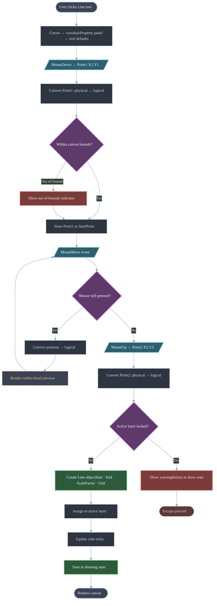
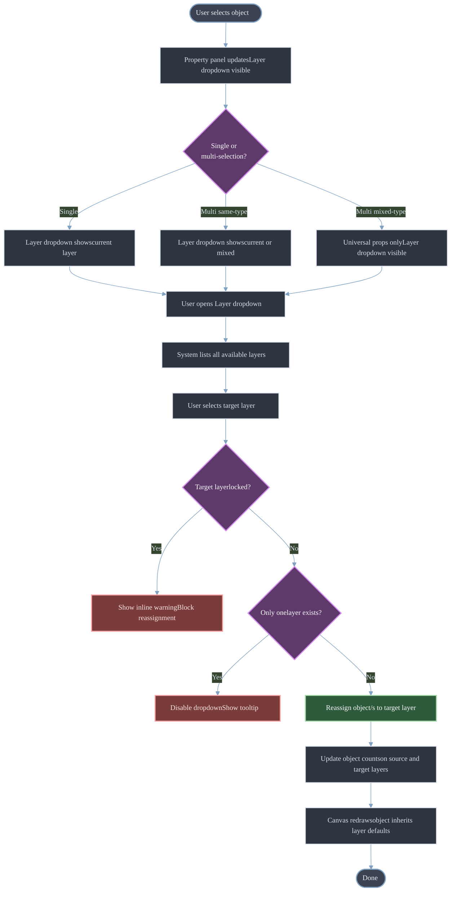
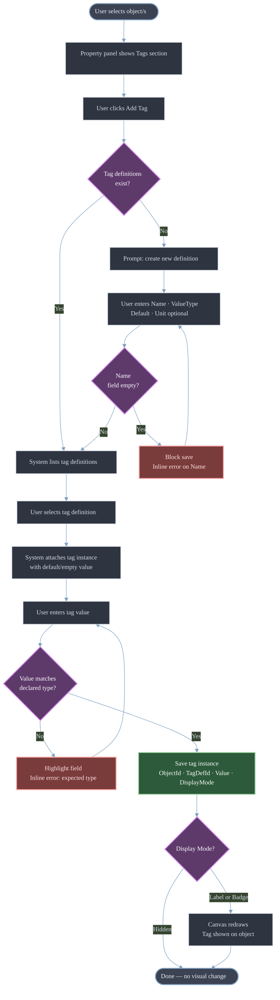
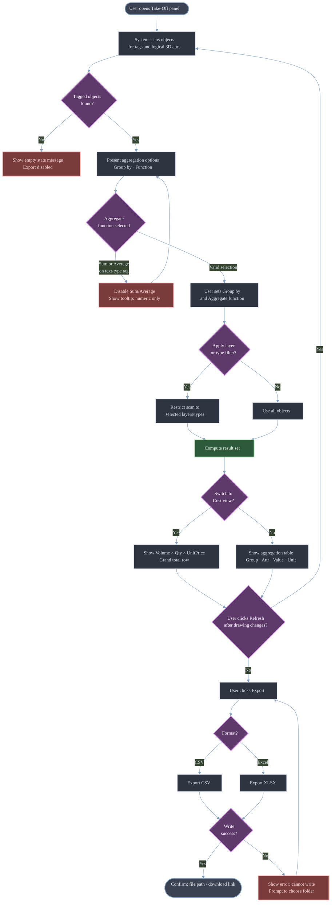
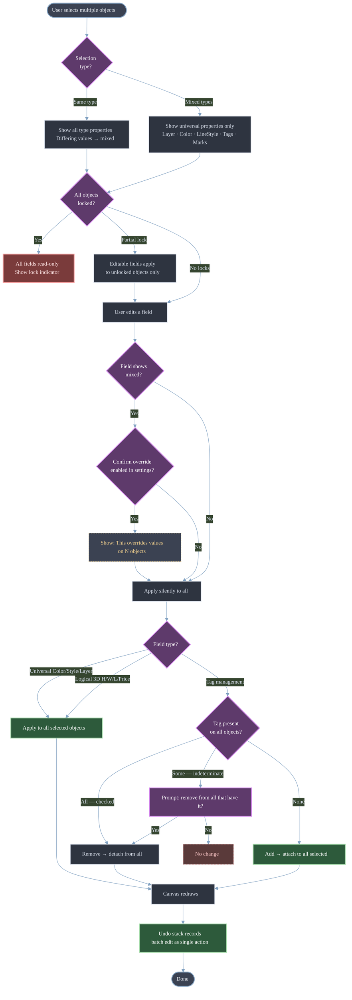
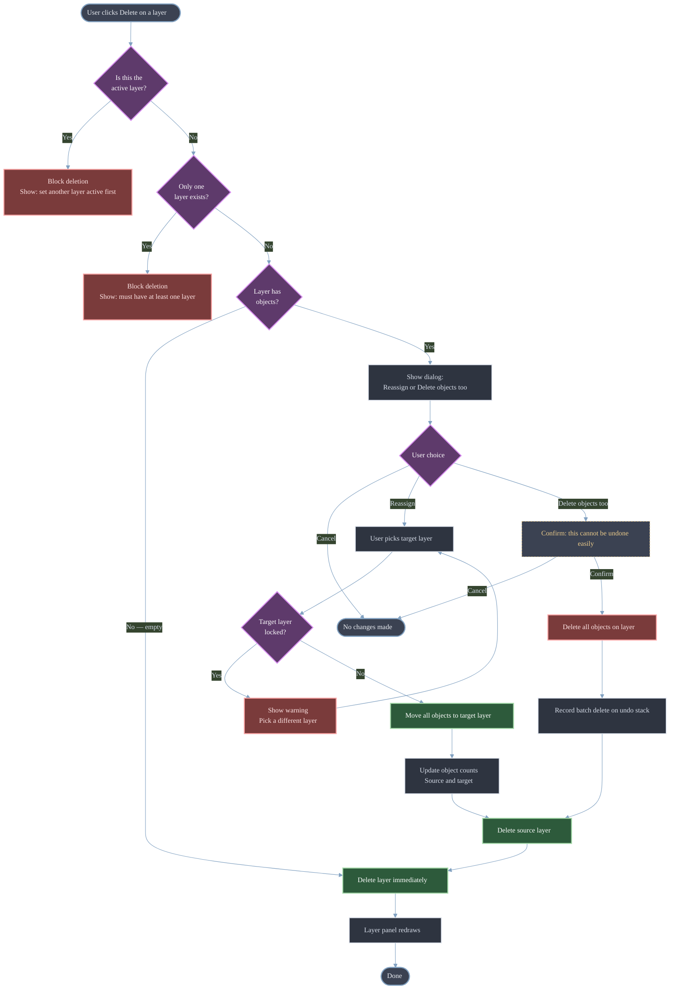
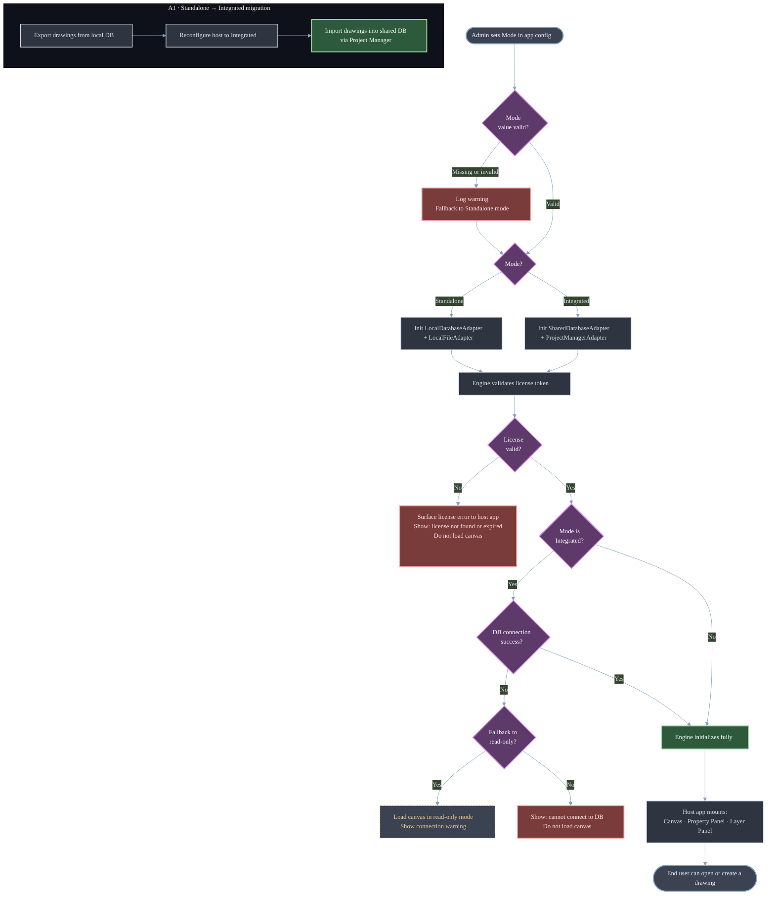

# 10. Use Cases ^010410

## UC‑001 — Draw a Line on the Canvas ^UC1

| Field        | Value                                                             |
| ------------ | ----------------------------------------------------------------- |
| Actor        | Designer                                                          |
| Related FR   | FR-DT-001, FR-DT-002, FR-CV-007, FR-CV-008, FR-UI-011, FR-UI-013  |
| Precondition | A drawing is open; at least one layer exists and is set as active |
| Trigger      | User clicks the Line tool in the toolbox                          |
#### Flowchart ^FC1

#### Main Flow ^MF1
1. User clicks the **`Line`** tool
2. System sets cursor to _`crosshair`_; property panel switches to tool defaults
3. User clicks **`Point1`** on the canvas
4. System converts Point1 from physical (`px`) to ****`logical coordinates`***
5. System validates **`Point1`** is within canvas bounds
6. System stores **`Point1`** as `StartPoint`
7. User moves the mouse — system renders a **`rubber-band preview`** line from `StartPoint` to current cursor position on every `MouseMove` event
8. User clicks **`Point2`**
9. System converts **`Point2`** to logical coordinates
10. System creates a **`Line`** object `{ StartPoint, EndPoint, ScaleFactor, Unit }`
11. System assigns the line to the **`active layer`**
12. System updates **`ruler ticks`** to reflect the new ___`geometry`___
13. System saves the line to drawing state (`JSON` / `DB`)
14. Canvas redraws showing the permanent line

#### Alternative Flows ^AF1
##### **`A1` — Multi-segment polyline mode**
- After step 6, user continues clicking additional points
- System stores each click as a new segment endpoint and extends the rubber-band from the last point
- User double-clicks or presses **Enter** to commit all segments as a single polyline object
- Flow continues from step 10

##### **`A2` — Snap to grid / object snap active**
- At step 3 or step 8, cursor snaps to the nearest grid intersection or object snap point
- Snapped coordinate is used in place of the raw cursor position
- Flow continues normally

##### **`A3` — Point outside canvas bounds (warn, don't block)**
- At step 5, system detects Point1 is outside logical canvas bounds
- System shows an out-of-bounds indicator but does not block the action
- Flow continues from step 6 with the out-of-bounds coordinate

#### Exception Flows ^EF1
##### **`E1` — User presses Escape during drawing**
- At any point after step 3 and before step 10
- System cancels the operation, discards Start-Point, clears the rubber-band preview
- System returns cursor to idle state; no object is created

##### **`E2` — Active layer is locked**
- At step 11, system detects the active layer is locked
- System shows inline warning: "Active layer is locked — object cannot be placed"
- Object is not saved; system returns to drawing state for the user to select a different layer

#### Postcondition ^PC1
A Line (or polyline) object exists in the drawing state, is visible on canvas, is assigned to the active layer, and is reflected in the layer's object count.

---

## UC-002 · Assign an object to a layer ^UC2

| Field | Value |
|---|---|
| Actor | Designer |
| Related FR | FR-LP-001, FR-PP-007, FR-UI-020 |
| Precondition | At least one object exists on the canvas; at least two layers exist |
| Trigger | User selects an object and changes its layer assignment in the property panel |
#### Flowchart ^FC2

#### Main Flow ^MF2
1. User clicks an object on the canvas to select it
2. Property panel updates to show the object's properties, including the **Layer** dropdown
3. User opens the Layer dropdown
4. System lists all available (non-deleted) layers
5. User selects a target layer
6. System reassigns the object to the selected layer
7. System updates the object count on both the source layer and the target layer
8. Canvas redraws — object inherits the target layer's default Color, Line Style, and Line Weight (unless the object has explicit overrides)

#### Alternative Flows ^AF2
##### **A1 — Multi-selection, same type**
- User selects multiple objects (same type) before step 3
- Layer dropdown shows `(mixed)` if objects are on different layers
- User selects a target layer — system reassigns all selected objects
- All affected layer object counts update

##### **A2 — Multi-selection, mixed types**
- Property panel shows only universal properties including Layer
- Behavior otherwise identical to A1

##### **A3 — Assign via Layer panel ("Select All on Layer" + move)**
- User right-clicks a layer in the Layer panel → "Select All Objects"
- All objects on that layer become selected
- User changes Layer in property panel → all objects move to the new layer

#### Exception Flows ^EF2
##### **E1 — Target layer is locked**
- At step 6, system detects the target layer is locked
- System shows inline warning: "Target layer is locked"
- Reassignment is blocked; original layer assignment is preserved

##### **E2 — Only one layer exists**
- At step 4, dropdown shows only one layer
- Reassignment is not meaningful; system may disable the dropdown or show a tooltip: "Add more layers to reassign"

#### Postcondition ^PC2
The selected object(s) belong to the chosen layer. Object counts on affected layers are accurate. Visual properties reflect the new layer's defaults (unless overridden at object level).

---

---
## UC-003 · Attach a Smart Tag to an object ^UC3

| Field | Value |
|---|---|
| Actor | Designer |
| Related FR | FR-DT-040, FR-DT-041, FR-DT-042, VAL-010 (tag value type) |
| Precondition | An object is selected; at least one Smart Tag definition exists (or user creates one inline) |
| Trigger | User opens the Tags section in the property panel and adds a tag |
#### Flowchart ^FC3

#### Main Flow ^MF3
1. User selects an object on the canvas
2. Property panel shows the **Tags** section (collapsed by default if no tags are attached)
3. User clicks **Add Tag**
4. System presents the list of existing tag definitions
5. User selects a tag definition (e.g. `Material: text`)
6. System attaches a tag instance to the object with an empty or default value
7. User enters/selects the tag value (e.g. `"Concrete"`)
8. System validates the value against the tag's declared value type
9. System saves the tag instance: `{ ObjectId, TagDefinitionId, Value, DisplayMode }`
10. If Display Mode is **Label** or **Badge**, the canvas redraws showing the tag on the object

#### Alternative Flows ^AF3
##### **A1 — Create a new tag definition inline**
- At step 4, user clicks **New Tag Definition**
- User enters: Name, Value Type (text / number / boolean / list), Default Value, Unit (optional)
- System saves the definition to the project's tag library
- Flow continues from step 5 with the new definition pre-selected

##### **A2 — Attach the same tag to multiple objects**
- User selects multiple objects before step 3
- Tags section shows the union of tags; tags present on all objects = checked; tags on some = indeterminate
- User adds a tag → system attaches it to all selected objects
- Each object gets its own tag instance (values can be set individually afterward)

##### **A3 — Change display mode**
- After step 9, user changes Display Mode from Hidden → Label or Badge
- Canvas redraws showing the tag label/badge on the object

#### Exception Flows ^EF3
##### **E1 — Value type mismatch**
- At step 8, user enters a non-numeric value for a Number-type tag
- System highlights the value field with an inline error: "Expected a numeric value"
- Tag instance is not saved until the value is corrected

##### **E2 — Tag definition has no name**
- At A1, user attempts to save a definition with an empty Name field
- System blocks save; inline error on the Name field

#### Postcondition ^PC3
The tag instance is attached to the object, stored in drawing state, and visible on canvas if Display Mode is Label or Badge.

---

## UC-004 · Run a take-off quantity summary ^UC4

| Field | Value |
|---|---|
| Actor | Estimator |
| Related FR | FR-DT-043, FR-DT-044, FR-DT-045, FR-PP-008 |
| Precondition | At least one object has logical 3D attributes (H, W, L) and/or Smart Tags with numeric values assigned |
| Trigger | User opens the Aggregation / Take-Off panel |
#### Flowchart ^FC4

#### Main Flow ^MF4
1. User opens the **Take-Off panel** (standalone view or docked panel)
2. System scans all objects in the current drawing that have tag instances or logical 3D attributes
3. System presents aggregation options:
	- **Group by**: Tag Name / Layer / Object Type
	- **Aggregate function**: Count / Sum / Average / Min / Max
4. User selects grouping and aggregate function
5. System computes the result set and displays it as a table:
	- Columns: Group, Tag/Attribute, Aggregated Value, Unit
	- Rows: one per group
6. User reviews the table
7. User clicks **Export**
8. System exports the table to CSV or Excel (user selects format)
9. System confirms export success with file path / download link

#### Alternative Flows ^AF4

##### **A1 — Filter by layer before aggregating**
- Before step 4, user selects one or more layers to include
- System restricts the scan to objects on those layers only
- Flow continues from step 4

##### **A2 — Filter by object type**
- User adds an Object Type filter (e.g. only Rectangles)
- System restricts aggregation to matching objects
- Useful for: "total area of all room rectangles"

##### **A3 — Cost rollup view**
- User switches to **Cost view**
- System shows: Volume (H×W×L) × Quantity × Unit Price = Total Cost per object
- Summary row shows grand total cost
- Exportable in same formats

##### **A4 — Re-run after drawing changes**
- User modifies objects (adds/edits dimensions or tags) then returns to the Take-Off panel
- User clicks **Refresh**
- System re-scans and updates the result table

#### Exception Flows ^EF4
##### **E1 — No tagged objects found**
- At step 2, system finds no objects with relevant attributes
- System shows empty state message: "No objects with tags or dimensions found. Assign Smart Tags or logical dimensions to objects first."
- Export is disabled

##### **E2 — Sum/Average on a text-type tag**
- At step 4, user selects Sum or Average for a text-type tag
- System disables those functions for that tag; only Count is available
- Inline tooltip: "Sum and Average are only available for numeric tags"

##### **E3 — Export path not writable (desktop mode)**
- At step 8, system cannot write to the selected path
- System shows error: "Cannot write to this location. Choose a different folder."
- Export is retried without losing the result table

#### Postcondition ^PC4
A take-off summary table is computed and optionally exported. No drawing objects are modified by this operation.

---

## UC-005 · Insert a symbol from the library ^UC5

| Field | Value |
|---|---|
| Actor | Designer |
| Related FR | FR-DT-030, FR-DT-031, FR-DT-032, FR-DT-033 |
| Precondition | A drawing is open; at least one symbol definition exists in the project or global library |
| Trigger | User opens the Symbol Library panel |
#### Flowchart ^FC5

```mermaid
%%{init: {
  'theme': 'base',
  'themeVariables': {
	'background': '#1A1B26',
	'primaryColor': '#2F3545',
	'primaryTextColor': '#D9E0EE',
	'primaryBorderColor': '#414868',
	'lineColor': '#81A1C1',
	'tertiaryColor': '#0F111A',
	'fontSize': '14px',
	'fontFamily': 'Inter, -apple-system, sans-serif'
  },
  'flowchart': {
	'curve': 'basis',
	'padding': 15
  }
}}%%
flowchart TD
classDef terminator fill:#3B4252,stroke:#81A1C1,stroke-width:2px,color:#ECEFF4
classDef process fill:#2E3440,stroke:#D8DEE9,stroke-width:1.5px,color:#D8DEE9
classDef decision fill:#5E3A6B,stroke:#D68BEE,stroke-width:2px,color:#FFFFFF
classDef io fill:#2D5F6E,stroke:#88C0D0,stroke-width:2px,color:#FFFFFF
classDef error fill:#7A3B3B,stroke:#F8A3A3,stroke-width:2px,color:#FFE6E6
classDef preview fill:#3B4252,stroke:#EBCB8B,stroke-dasharray:3,color:#EBCB8B
classDef success fill:#2D5A3B,stroke:#A3D8A8,stroke-width:2px,color:#FFFFFF
classDef cancel fill:#5A3A3A,stroke:#C17E7E,stroke-dasharray:4,color:#F5C2C2


	A([User opens Symbol Library panel]):::terminator
	B{Library<br/>empty?}:::decision
	B1[Show empty state<br/>Prompt: import or create]:::error
	C[System lists symbols by category]:::process
	D{User action}:::decision
	E[User locates symbol]:::process
	F[User selects symbol file]:::io
	G{Valid<br/>format?}:::decision
	G1[Show import error]:::error
	H[Add to project library]:::success
	I[User drags to canvas<br/>or double-clicks to insert]:::process
	J{Set scale/rotation<br/>before placing?}:::decision
	K[User sets Scale X·Y · Rotation<br/>in property panel]:::process
	L[Use defaults: Scale 1,1 · Rotation 0°]:::process
	M[System enters insert mode<br/>Ghost preview on cursor]:::preview
	N{Active layer<br/>locked?}:::decision
	N1[Show warning<br/>Block placement]:::error
	O[User clicks placement point]:::io
	P[Check circular block reference]:::process
	P1[Block · Show error:<br/>cannot contain itself]:::error
	Q[Place symbol instance<br/>at clicked position]:::success
	R[Assign to active layer<br/>Save to drawing state]:::process
	S{Place another<br/>instance?}:::decision
	T[Press Escape to exit insert mode]:::cancel
	U([Canvas redraws]):::terminator
	
	A --> B
	B -->|Yes| B1
	B1 --> C
	B -->|No| C
	C --> D
	D -->|Browse/Search| E
	D -->|Import from file| F
	F --> G
	G -->|No| G1
	G1 --> D
	G -->|Yes| H
	H --> E
	E --> I
	I --> J
	J -->|Yes| K
	J -->|No| L
	K & L --> M
	M --> N
	N -->|Yes| N1
	N -->|No| O
	O --> P
	P -->|Detected| P1
	P -->|Clear| Q
	Q --> R
	R --> S
	S -->|Yes| M
	S -->|No| T
	T --> U
```

#### Main Flow ^MF5
1. User opens the **Symbol Library** panel
2. System lists available symbols grouped by category
3. User browses or searches for a symbol
4. User drags the symbol onto the canvas (or double-clicks to activate insert mode)
5. System enters **insert mode**: cursor shows a ghost preview of the symbol
6. User positions the cursor at the desired insertion point and clicks
7. System places a symbol instance at the clicked position with default Scale (1,1) and Rotation (0°)
8. System assigns the instance to the active layer
9. System saves the symbol instance to drawing state
10. Canvas redraws showing the placed symbol

#### Alternative Flows ^AF5

##### **A1 — Set scale / rotation before placing**
- After step 4 and before step 6, user sets Scale X, Scale Y, and Rotation in the property panel (tool defaults mode)
- Placed instance uses the specified values

##### **A2 — Place multiple instances**
- After step 7, system remains in insert mode
- User continues clicking to place additional instances of the same symbol
- User presses Escape to exit insert mode

##### **A3 — Edit attribute values after placement**
- After step 10, user selects the placed instance
- Property panel shows editable **Attribute Values** (key-value pairs defined in the block definition)
- User edits values; system saves to the instance (block definition is not modified)

##### **A4 — Import a symbol from file**
- In the Symbol Library panel, user clicks **Import**
- User selects a symbol file (format TBD — JSON / DXF block)
- System validates and adds the definition to the project library
- Flow continues from step 3

#### Exception Flows ^EF5
##### **E1 — Circular block reference detected**
- User attempts to define a symbol that contains itself (directly or transitively)
- System blocks the definition save with error: "Circular reference detected — a symbol cannot contain itself"

##### **E2 — Active layer is locked**
- At step 8, system detects the active layer is locked
- System shows warning and blocks placement
- User must unlock the layer or switch to a different active layer

##### **E3 — Symbol library is empty**
- At step 2, no symbols exist
- System shows empty state with a prompt to import or create a symbol

#### Postcondition ^PC5
A symbol instance exists on the canvas, assigned to the active layer, with the correct position, scale, rotation, and attribute values.

---

## UC-006 · Edit properties of a multi-selection ^UC6

| Field | Value |
|---|---|
| Actor | Designer |
| Related FR | FR-UI-020, FR-UI-021, FR-UI-022, FR-UI-023, FR-PP-004, FR-PP-005 |
| Precondition | At least two objects exist on the canvas |
| Trigger | User selects multiple objects (window select, crossing select, or Ctrl+click) |

#### Flowchart ^FC6

#### Main Flow ^MF6
1. User selects multiple objects
2. System identifies the selection: same type or mixed types
3. **If same type:** property panel shows all properties for that type; fields with differing values show `(mixed)`
4. **If mixed types:** property panel shows only universal properties (Layer, Color, Line Style, Line Weight, Visibility, Lock, Notes, Tags, Marks)
5. User edits a shared field (e.g. Color)
6. System applies the new value to **all selected objects**
7. Canvas redraws reflecting the change across all affected objects

#### Alternative Flows ^AF6

##### **A1 — Edit a `(mixed)` field**
- User clicks a field showing `(mixed)` and enters a new value
- System replaces the differing values on all selected objects with the single new value
- A confirmation may be shown: "This will override different values on N objects" (configurable)

##### **A2 — Edit logical 3D fields in multi-selection**
- Fields H, W, L, Quantity, Unit Price follow the same `(mixed)` pattern
- Editing sets the same value on all selected objects

##### **A3 — Tag management in multi-selection**
- Tags present on **all** selected objects show as checked
- Tags present on **some** objects show as indeterminate (tri-state checkbox)
- Adding a tag → attached to all selected objects
- Removing a checked tag → removed from all selected objects
- Removing an indeterminate tag → prompts: "Remove from all objects that have it?"

##### **A4 — Type-specific fields in same-type multi-selection**
- e.g. Two lines selected: Start/End coordinates show `(mixed)`; editing sets the same value on both
- This is an edge case the user would rarely want — system applies without blocking

#### Exception Flows ^EF6

##### **E1 — All selected objects are locked**
- System shows all fields as read-only with a lock indicator
- No edits are possible until at least one object is unlocked

##### **E2 — Partial lock in selection**
- Some selected objects are locked, some are not
- System applies edits only to unlocked objects
- Inline notice: "N locked objects were skipped"

#### Postcondition ^PC6
All unlocked selected objects reflect the edited property values. The canvas redraws. Undo stack records the batch edit as a single undoable action.

---
## UC-007 · Delete a layer with objects ^UC7

| Field        | Value                                                                    |
| ------------ | ------------------------------------------------------------------------ |
| Trigger      | User clicks Delete on a layer in the Layer panel                         |
| Actor        | Designer                                                                 |
| Related FR   | FR-LP-003, FR-LP-004                                                     |
| Precondition | At least two layers exist; the target layer contains one or more objects |

#### Flowchart ^FC7

#### Main Flow ^MF7
1. User clicks **Delete** on a layer that contains objects
2. System detects the layer has objects (object count > 0)
3. System presents a dialog with two options:
	- **Reassign objects to layer:** `[layer dropdown]`
	- **Delete objects too**
4. User selects **Reassign** and picks a target layer
5. System moves all objects from the deleted layer to the target layer
6. System updates object counts on both layers
7. System deletes the source layer
8. Layer panel redraws without the deleted layer

#### Alternative Flows ^AF7
##### **A1 — User chooses "Delete objects too"**
- At step 3, user selects **Delete objects too** and confirms
- System removes all objects on the layer from the drawing state
- System deletes the layer
- Objects are removed from canvas; undo stack records the batch delete as a single undoable action

##### **A2 — Layer has no objects (object count = 0)**
- At step 2, system detects the layer is empty
- System skips the dialog and deletes the layer immediately
- Flow jumps to step 7

##### **A3 — Delete via keyboard shortcut or context menu**
- Same flow triggered from a different entry point; behavior is identical

#### Exception Flows ^EF7

##### **E1 — Target layer is the active layer**
- At step 1, user attempts to delete the currently active layer
- System blocks deletion with inline message: "Cannot delete the active layer. Set another layer as active first."
- No dialog is shown; no changes are made

##### **E2 — Only one layer remains**
- System blocks deletion with inline message: "A drawing must have at least one layer."

##### **E3 — User cancels the dialog**
- At step 3, user clicks Cancel
- No changes are made; layer and all its objects remain intact

#### Postcondition ^PC7
The target layer no longer exists in the layer list. All objects that were on it are either reassigned to another layer (with correct object counts) or deleted from drawing state. The canvas reflects the final state.

---

## UC-008 · Switch between standalone and integrated mode ^UC8

| Field        | Value                                                                                      |
| ------------ | ------------------------------------------------------------------------------------------ |
| Actor        | System Admin / IT                                                                          |
| Related FR   | NFR-008 (licensing), Component Architecture §8                                             |
| Precondition | The CoNSoL-TakeOff Engine library is installed; a valid license exists for the target mode |
| Trigger      | Admin deploys or reconfigures the host application                                         |

> [!Note]+ ***Note***
> This is a **deployment-time** use case, not an end-user runtime action. The mode is set by the host application at startup via configuration — the user does not switch modes mid-session.

#### Flowchart ^FC8

#### Main Flow ^MF8
1. Admin sets the deployment mode in the host application's configuration (e.g. `app.config`, environment variable, or installer option):
	- `Mode = Standalone` or `Mode = Integrated`
2. Host application initializes the CoNSoL-TakeOff Engine with the appropriate storage adapter:
	- **Standalone:** `LocalDatabaseAdapter` + `LocalFileAdapter`
	- **Integrated:** `SharedDatabaseAdapter` + `ProjectManagerAdapter`
3. Engine validates the license token for the selected mode
4. License is valid → Engine initializes fully; host application proceeds to load the drawing UI
5. Host application connects the drawing canvas, property panel, and layer panel components
6. End user can now open or create a drawing

#### Alternative Flows ^AF8
##### **A1 — Migrating from Standalone to Integrated**
- Admin exports existing drawings from the standalone local database (using File → Export)
- Admin reconfigures the host to Integrated mode
- Admin imports drawings into the shared database via the Project Manager
- Drawings are now accessible to other suite users

#### Exception Flows ^EF8
##### **E1 — License validation fails**
- At step 3, Engine cannot validate the license token
- Engine surfaces a license error to the host application
- Host application shows appropriate message to the end user (e.g. "License not found or expired")
- Drawing canvas does not load

##### **E2 — Storage adapter connection fails (Integrated mode)**
- At step 2, the `SharedDatabaseAdapter` cannot connect to the shared database
- Engine surfaces a connection error
- Host application shows: "Cannot connect to shared database. Check network or database configuration."
- Application may optionally fall back to read-only mode

##### **E3 — Configuration value is missing or invalid**
- At step 1, Mode is not set or has an unrecognized value
- Host application falls back to `Standalone` as the default safe mode
- Warning is logged

#### Postcondition ^PC8
The CoNSoL-TakeOff Engine is running in the correct mode with the appropriate storage adapter, license model, and integration points active. End users interact with the same drawing UI regardless of mode.

---
✅ All use cases preserved and indexed

---

## 11. Constraints & Assumptions ^010411

- Desktop‑first
- Single‑user initially
- No real‑time collaboration

---

## 12. Appendix ^010412

### Open Questions

- Logical 3D auto‑feed vs manual?
- Shared engine for tags & marks?
- Symbol library format?

---
> END — Software Requirements Specification

