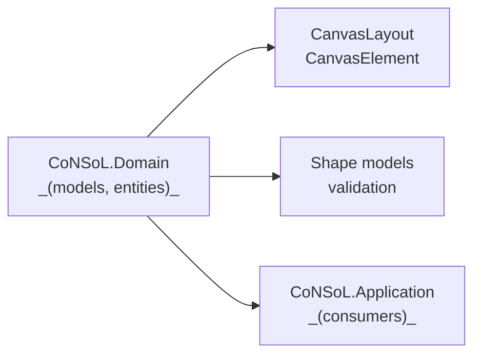

# CoNSoL.Domain

Purpose
- Core domain models, value objects, and business rules. This is the source of truth for data structures used across the app (layouts, elements, shapes, validation).

Public surface
- Domain entities and DTOs used by the application and UI. Example types referenced by the desktop UI:
  - `CanvasLayout`
  - `CanvasElement`
  - Shape models and validation helpers

Important files (inspect)
- `Entities` folder (e.g., `CanvasLayout.vb`, `CanvasElement.vb`).
- Any validation, factories, or domain service implementations that encapsulate business rules.

Build / Run notes
- Changes here may require consumers to adapt (serialization formats, validation rules).
- Version domain contracts deliberately; consider compatibility for layout files.

Enable XML documentation
- Open project, go to __Project Properties > Compile__ and enable __Generate XML documentation file__.

Notes
- Keep business logic in domain classes; avoid UI or persistence concerns here.
- When changing serialized structures (JSON) provide migration paths or version fields in saved layouts.